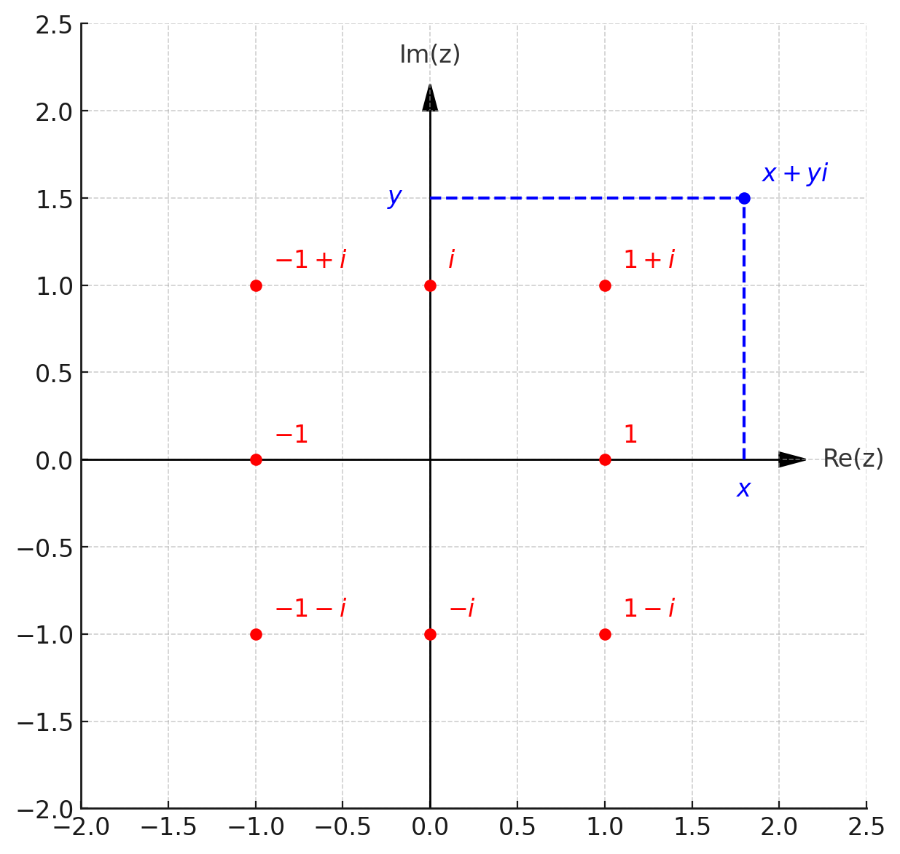
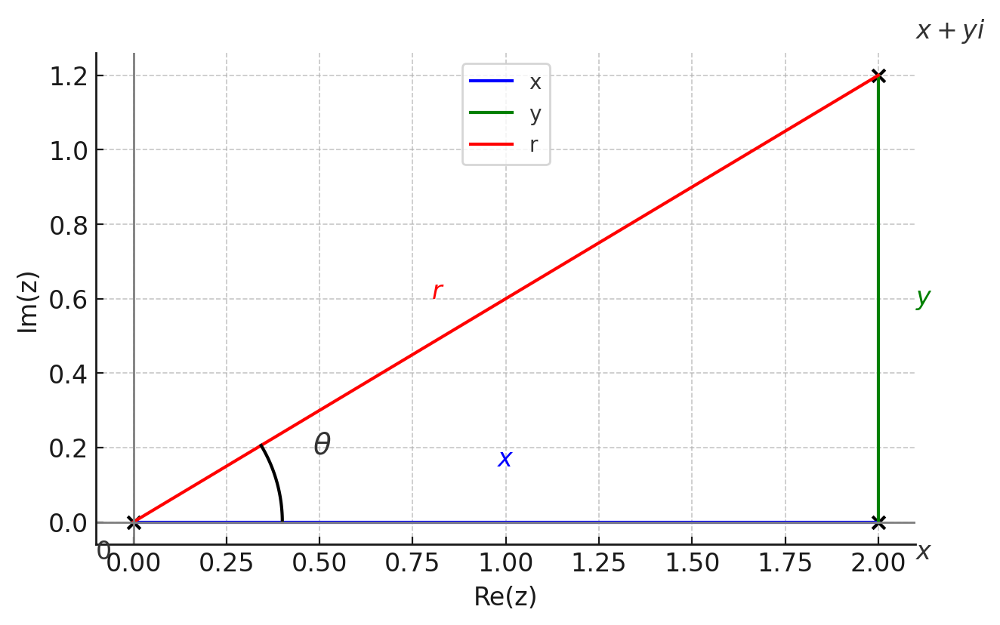
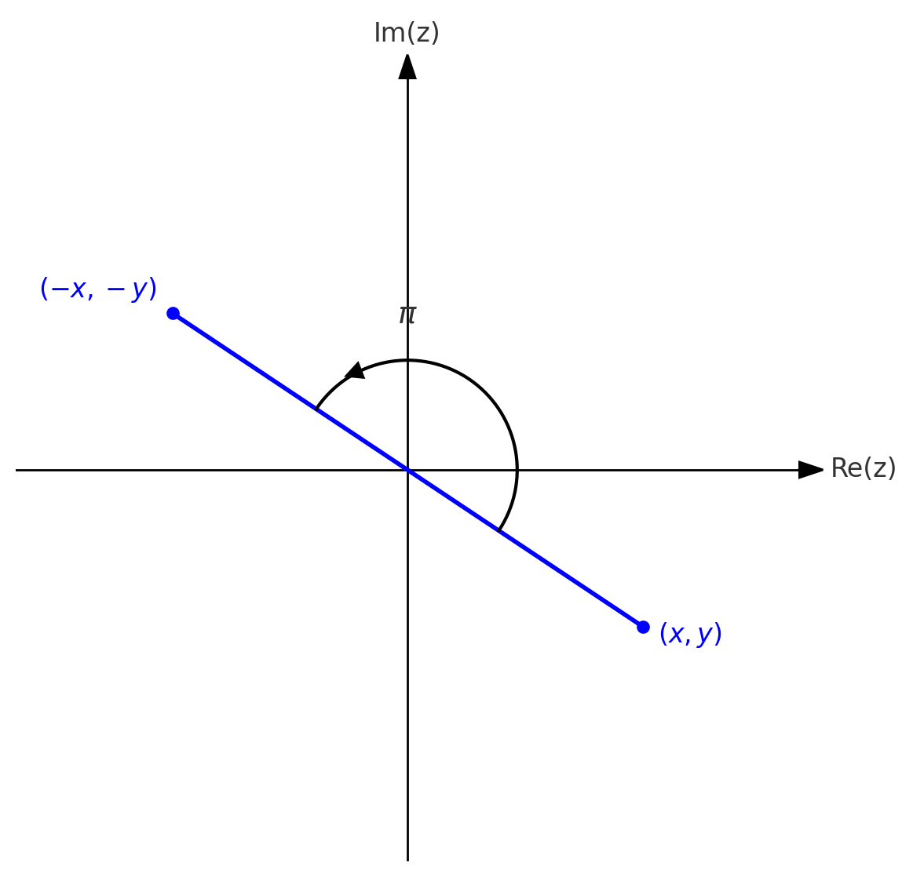
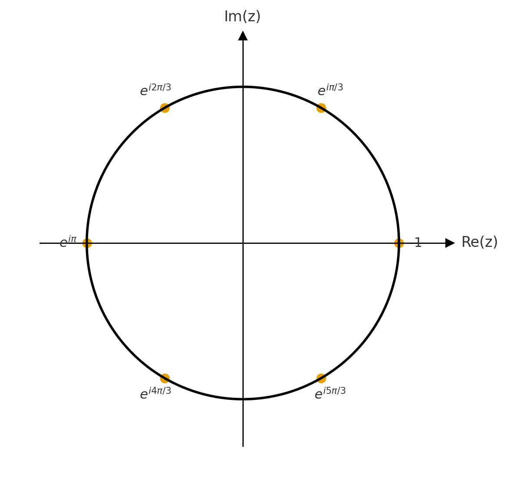

# תכונות ושימושים של המספרים המרוכבים {#sec-complex}

## פעולות חשבון

נסמן $z_{1}=a+bi,\,z_{2}=c+di$. נרחיב את הגדרות פעולות החשבון המוכרות ל-$\mathbb{C}$:

חיבור: $$z_{1}+z_{2}=a+c+(b+d)i$$

חיסור: $$z_{1}-z_{2}=a-c+(b-d)i$$

כפל: $$z_{1}z_{2}=ac-bd+(ad+bc)i$$

חילוק: עבור $z_{2}\neq0$
$$
\frac{z_{1}}{z_{2}}=\frac{(a+bi)(c-di)}{(c+di)(c-di)}=\frac{ac+bd}{c^{2}+d^{2}}+\frac{(bc-ad)}{c^{2}+d^{2}}i
$$

הכפל מתאים לפתיחת סוגריים לפי חוקי הפילוג והחילוף של מספרים ממשיים. בשביל חילוק מכפילים ומחלקים במספר הצמוד $\overline{z_{2}}=c-di$ כדי המכנה החדש יהיה מספר ממשי.

::: {.example}
ניקח $z_{1}=1+i,\,z_{2}=2+3i$. כאן נקבל:

חיבור: $z_{1}+z_{2}=3+4i$

חיסור: $z_{1}-z_{2}=-1-2i$

כפל: $z_{1}z_{2}=(1+i)(2+3i)=2-3+(3+2)i=-1+5i$

חילוק: $\frac{1+i}{2+3i}=\frac{(1+i)(2-3i)}{(2+3i)(2-3i)}=\frac{5}{13}-\frac{1}{13}i$
:::

::: {.exercise}
חשבו את ארבע הפעולות עבור $z_{1}=1+2i,\,z_{2}=3-4i$.
:::

::: {.callout-note collapse="true" title="פתרון"}
נחשב:

$z_{1}+z_{2}=4-2i$

$z_{1}-z_{2}=-2+6i$

$z_{1}z_{2}=(1+2i)(3-4i)=11+2i$

$$
\frac{z_1}{z_2}=\frac{(1+2i)(3+4i)}{(3-4i)(3+4i)}=\frac{-5+10i}{25}=\frac{-1+2i}{5}
$$
:::

::: {.remark}
נראה בהמשך שחיבור של מספרים מרוכבים שקול לחיבור בין שני וקטורים במישור, ואכן ניתן לייצג כל מספר מרוכב $z=x+yi$ כנקודה/וקטור במישור עם קוארדינטות $(x,y)$. קוארדינטות אלו נקראות קרטזיות.
:::

::: {.proposition}
לכל $z_{1},z_{2},z_{3}\in\mathbb{C}$ מתקיים:

a. חוקי החילוף לחיבור וכפל: $z_{1}+z_{2}=z_{2}+z_{1}$ וגם $z_{1}z_{2}=z_{2}z_{1}$.
b. חוקי הקיבוץ לחיבור וכפל: $(z_{1}+z_{2})+z_{3}=z_{1}+(z_{2}+z_{3})$ וגם $(z_{1}z_{2})z_{3}=z_{1}(z_{2}z_{3})$.
c. חוק הפילוג: $(z_{1}+z_{2})z_{3}=z_{1}z_{3}+z_{2}z_{3}$
d. $0$ נייטרלי ביחס לחיבור: $z+0=z$ לכל $z\in\mathbb{C}$.
e. $1$ נייטרלי ביחס לכפל: $z\cdot1=z$ לכל $z\in\mathbb{C}$.
:::

::: {.proof}
ישירות מן ההגדרות של חיבור וכפל תוך שימוש בחוקים המוכרים למספרים ממשיים. נסתפק בהוכחת חוק החילוף לכפל: ראשית נסמן $z_{1}=a+bi,\,z_{2}=c+di$. לפי הגדרת הכפל מתקיים
$$
\begin{cases}
z_{1}z_{2}=(a+bi)(c+di)=ac-bd+(ad+bc)i\\
z_{2}z_{1}=(c+di)(a+bi)=ca-db+(cb+da)i
\end{cases}
$$

נזכור כי $a,b,c,d\in\mathbb{R}$ ולכן כבר ידוע שחוק החילוף תקף לגביהם (גם לכפל וגם לחיבור). לכן $ac=ca,\,bd=db,\,ad=da,\,bc=cb$ ומכאן נובע כי $z_{1}z_{2}=z_{2}z_{1}$.
:::

נסכם את רעיון ההוכחה: השתמשנו בנוסחה של פעולת הכפל כדי להבין כיצד חוק החילוף לכפל של מספרים מרוכבים, נובע מחוק החילוף המוכר לכפל של מספרים ממשיים.

::: {.exercise}
הוכיחו את חוק החילוף לחיבור של מספרים מרוכבים.
:::

::: {.callout-note collapse="true" title="פתרון"}
$$
\begin{cases}
z_{1}+z_{2}=(a+bi)+(c+di)=a+c+(b+d)i\\
z_{2}+z_{1}=(c+di)+(a+bi)=c+a+(d+b)i
\end{cases}
$$

חוק החילוף מתקיים לחיבור בין מספרים ממשיים. בפרט, מתקיים
$$
a+c=c+a, \quad b+d=d+b
$$
ולכן $z_1+z_2=z_2+z_1$ כנדרש.
:::

הטענה הבאה קשורות להגדרה של מספר צמוד.

::: {.proposition}
לכל $z_{1},z_{2}\in\mathbb{C}$ מתקיים:

a. $\overline{z_{1}+z_{2}}=\overline{z_{1}}+\overline{z_{2}}$
b. $\overline{z_{1}z_{2}}=\overline{z_{1}}\cdot\overline{z_{2}}$
:::

::: {.proof}
נסמן $z_{1}=a+bi,\,z_{2}=c+di$. נחשב:

a. $\overline{z_{1}+z_{2}}=\overline{a+c+(b+d)i}=a+c-(b+d)i=a-bi+c-di=\overline{z_{1}}+\overline{z_{2}}$
b. 
$$
\begin{aligned}
\overline{z_{1}z_{2}}&=\overline{ac-bd+(ad+bc)i} \\
&=ac-bd-(ad+bc)i=(a-bi)(c-di)=\overline{z_{1}}\cdot\overline{z_{2}}
\end{aligned}
$$
:::

::: {.proposition}
לכל $z\in\mathbb{C}$ מתקיים:

a. $z+\overline{z}=2\text{Re}(z)$
b. $z-\overline{z}=2i\text{Im}(z)$
c. $z\overline{z}\in\mathbb{R}$ 
:::

::: {.proof}
נסמן $z=x+yi$ כאשר $\text{Re}(z)=x,\,\text{Im}(z)=y$. נחשב:

a. $z+\overline{z}=x+yi+x-yi=2x=2\text{Re}(z)$
b. $z-\overline{z}=x+yi-(x-yi)=2yi=2i\text{Im}(z)$
c. $z\overline{z}=(x+yi)(x-yi)=x^{2}-y^{2}i^{2}+(-xy+yx)i=x^{2}+y^{2}\in\mathbb{R}$
:::

זה מראה מדוע מכפילים ומחלקים ב-$\overline{z_{2}}$ כדי לחשב את $\frac{z_{1}}{z_{2}}$. קל לחלק במספר ממשי, אז צריך להפוך את המכנה לממשי בעזרת הצמוד שלו.

## קוארדינטות פולריות

הזכרנו את הקוארדינטות הקרטזיות $(x,y)$ עבור מספר מרוכב $z=x+yi$. בדרך זו ניתן לחשוב על מישור, שנקרא המישור המרוכב, שבו הנקודה $(x,y)$ מייצגת את $z$.

{#fig-complexplane width="60%" fig-align="center"}

יש דרך אחרת לתאר נקודה במישור. במקום להסתכל על ההיטלים $x,y$ על הצירים, אפשר להסתכל על המרחק $r$ מהראשית ועל הזווית $\theta$ שנוצרת בין הוקטור שיוצא אל הנקודה לבין הכיוון החיובי של הציר הממשי (ציר $x$). הקוארדינטות $(r,\theta)$ נקראות קוארדינטות פולריות (קוטביות), ונדגיש שהזווית $\theta$ נמדדת ברדיאנים. בפרט, נכתוב $\pi$ במקום $180^\circ$.

{#fig-polar width="60%" fig-align="center"}

::: {.remark}
$r$ נקרא הערך המוחלט של $z$ ומתקיים $r=\sqrt{z\overline{z}}$. עבור $z\in\mathbb{R}$ מדובר על ההגדרה הרגילה של ערך מוחלט.
:::

אם הקוארדינטות הפולריות ידועות, ניתן לחשב את הקוארדינטות הקרטזיות לפי ההגדרות של סינוס וקוסינוס:
$$
\begin{cases}
x=r\cos\theta\\
y=r\sin\theta
\end{cases}
$$

::: {.example}
בהינתן $r=2,\,\theta=\frac{\pi}{4}$ נוכל לחשב את הקוארדינטות הקרטזיות לפי המשוואות לעיל. נקבל $x=2\cos\frac{\pi}{4}=2\cdot\frac{1}{\sqrt{2}}=\sqrt{2},\,y=2\sin\frac{\pi}{4}=2\cdot\frac{1}{\sqrt{2}}=\sqrt{2}$. לכן המספר המרוכב המתאים הוא $z=\sqrt{2}+\sqrt{2}i$.
:::

בכיוון ההפוך, נניח שהקוארדינטות הקרטזיות $(x,y)$ ידועות. איך נחשב את הקוארדינטות הפולריות? ניתן להשתמש במשפט פיתגורס ולקבל
$$
x^{2}+y^{2}=r^{2}\Rightarrow r=\sqrt{x^{2}+y^{2}}.
$$

את הזווית $\theta$ ניתן לחשב לפי המשוואה $\tan\theta=\frac{y}{x}$, אבל קודם כל צריך לבחור את תחום הזוויות (ברדיאנים). התחום המקובל הוא $[-\pi,\pi)$ כאשר זה שרירותי אם לכלול את הקצה השמאלי או הימני של הקטע (בחרנו את השמאלי). הסיבה שנוח להשתמש בתחום זה היא שההפונקציה ההופכית ל-$\tan x$ היא $\arctan x$ או $\tan^{-1}x$ במחשבון, שמחזירה זוויות בתחום $(-\frac{\pi}{2},\frac{\pi}{2})$. כלומר המחשבון עצמו עובד עם זוויות חיוביות וגם שליליות. הוא יודע לחשב את $\theta$ באופן מדויק עבור $z$ ברביע הראשון או הרביעי, אבל בשביל שאר המקרים דרוש תיקון שקשור למחזוריות של $\tan x$. נשתמש בהגדרה מפוצלת של פונקציה לפי מקרים:
$$
\theta=\begin{cases}
\arctan\frac{y}{x} & x>0\\
\arctan\frac{y}{x}+\pi & x<0,\,y>0\\
\arctan\frac{y}{x}-\pi & x<0,\,y<0\\
\frac{\pi}{2} & x=0,\,y>0\\
-\frac{\pi}{2} & x=0,\,y<0
\end{cases}
$$

זה עלול להיראות מסובך, אבל בפועל צריך לחשב את $\arctan\frac{y}{x}$ ולתקן במידת הצורך כדי לקבל זווית שמתאימה לרביע הרלוונטי (מוסיפים $\pi$ כדי לעבור מהרביע הרביעי לרביע השני, מחסירים $\pi$ כדי לעבור מהרביע הראשון לרביע השלישי). מספרים מדומים, עבורם $x=0$, הם מקרה מיוחד כי מלכתחילה לא ניתן לחלק ב-$0$. אבל אין צורך במחשבון במקרה זה, ותמיד אפשר להשתמש בציור ולנסות לחשב את הזווית לבד.

{#fig-rotationpi width="60%" fig-align="center"}

::: {.remark}
הזווית לא מוגדרת עבור $z=0$. זהו מקרה יוצא דופן אך פשוט, כך שגם אין צורך בקוארדינטות פולריות בשבילו.
:::

::: {.example}
נחשב את הקוארדינטות הפולריות של $z=-2+2i$. נקבל
$$r=\sqrt{2^{2}+2^{2}}=\sqrt{8}=2\sqrt{2}$$
כאן הנקודה ברביע השני ולכן יש לתקן את חישוב המחשבון עבור הזווית, מה שנותן
$$\theta=\arctan\frac{2}{-2}+\pi=-\frac{\pi}{4}+\pi=\frac{3\pi}{4}$$
:::

## משפט דה-מואבר

::: {.definition}
נגדיר
$$e^{i\theta}=\cos\theta+i\sin\theta.$$
:::

מבחינתנו זה רק סימון נוח, אבל זו בעצם נוסחה שנקראת נוסחת אוילר. יש לה משמעות יותר עמוקה שדורשת הסבר לגבי הפונקציה $f(z)=e^{z}$ של משתנה מרוכב. זה כבר חורג מאוד מאלגברה לינארית וגולש לתחום שנקרא אנליזה מרוכבת, שבבסיסה היא הגרסה המרוכבת של חשבון דיפרנציאלי ואינטגרלי.

::: {.theorem #thm-de-moivre}
לכל $\theta\in\mathbb{R},\,n\in\mathbb{Z}$ מתקיים
$$(\cos\theta+i\sin\theta)^{n}=\cos(n\theta)+i\sin(n\theta)$$.
:::

שימו לב שהניסוח השקול הוא $(e^{i\theta})^{n}=e^{in\theta}$, שעלול להיראות מובן מאליו לפי חוקי חזקות. אבל חוקי החזקות הידועים הם למעריכים ממשיים, וגם לא הצדקנו את הסימון. אם נשים את ההוכחה בצד, המשפט מראה מדוע הסימון נוח. לא נראה את ההוכחה (שדורשת כלי שנקרא אינדוקציה), אך נציין את הקשר לטענה הבאה שמבוססת על זהויות טריגונומטריות של סכום זוויות:

::: {.proposition #prp-angle-addition}
לכל $\alpha,\beta\in\mathbb{R}$ מתקיים
$$e^{i\alpha}e^{i\beta}=e^{i(\alpha+\beta)}$$.
:::

::: {.proof}
$$
\begin{aligned}
e^{i\alpha}e^{i\beta}&=(\cos(\alpha)+i\sin(\alpha))(\cos(\beta)+i\sin(\beta)) \\
&=\cos(\alpha)\cos(\beta)-\sin(\alpha)\sin(\beta)+i(\cos(\alpha)\sin(\beta)+\sin(\alpha)\cos(\beta)) \\
&=\cos(\alpha+\beta)+i\sin(\alpha+\beta)=e^{i(\alpha+\beta)}
\end{aligned}
$$

השתמשנו בזהויות הבאות:

$$
\begin{cases}
\begin{aligned}
\cos(\alpha+\beta)&=\cos(\alpha)\cos(\beta)-\sin(\alpha)\sin(\beta) \\
\sin(\alpha+\beta)&=\sin(\alpha)\cos(\beta)+\cos(\alpha)\sin(\beta)
\end{aligned}
\end{cases}
$$
:::

::: {.exercise}
השתמשו בטענה כדי להוכיח את המשפט במקרה $n=2$.
:::

::: {.callout-note collapse="true" title="פתרון"}
לכל $\theta\in\mathbb{R}$ מתקיים
$$
(e^{i\theta})^2=e^{i\theta}\cdot e^{i\theta}=e^{i(\theta+\theta)}=e^{i2\theta}.
$$
:::

::: {.example}
נחשב את $(1+\sqrt{3}i)^{100}$ בעזרת משפט דה-מואבר (בלעדיו החישוב ארוך מאוד). ראשית נחשב קוארדינטות פולריות של $1+\sqrt{3}i$:
$$
\begin{cases}
r=\sqrt{1+3}=2\\
\theta=\arctan\frac{\sqrt{3}}{1}=\frac{\pi}{3}
\end{cases}
$$

לכן, לפי המשפט נובע כי
$$
(1+\sqrt{3}i)^{100}=(2e^{i\frac{\pi}{3}})^{100}=2^{100}e^{i\frac{100\pi}{3}}.
$$

הזווית $\frac{100\pi}{3}$ חורגת מהתחום המקובל $[-\pi,\pi)$. לפי המחזוריות של קוסינוס וסינוס ניתן להחסיר מהזווית כל כפולה שלמה של $2\pi$ בלי לשנות את התוצאה. מתקיים $\frac{100\pi}{3}=(33+\frac{1}{3})\pi$, ולכן נחסיר $34\pi$ כדי לקבל זווית בתחום: $-\frac{2\pi}{3}$. מכאן:
$$
(1+\sqrt{3}i)^{100}=2^{100}e^{-i\frac{2\pi}{3}}=2^{100}(\cos(-\frac{2\pi}{3})+i\sin(-\frac{2\pi}{3}))=2^{99}(-1-\sqrt{3}i).
$$

אין צורך להחסיר מהזווית $34\pi$ אם המטרה היא ההצגה הקרטזית בלבד. לצורך הדוגמה, רצינו גם להראות את ההצגה הפולרית של החזקה.
:::

::: {.exercise}
חשבו את $(1+\sqrt{3}i)^{10}$.
:::

::: {.callout-note collapse="true" title="פתרון"}
כבר חישבנו את הקוארדינטות הפולריות:
$$
r=\sqrt{1+3}=2, \quad \theta=\arctan(\frac{\sqrt{3}}{1})=\frac{\pi}{3}
$$

נשתמש במשפט דה-מואבר ונקבל
$$
(1+\sqrt{3}i)^{10}=(2e^{i\frac{\pi}{3}})^{10}=2^{10}e^{i\frac{10\pi}{3}}=2^{10}e^{i\frac{4\pi}{3}}
$$

החסרנו מהזווית $2\pi$ כדי לעבור לתחום הזוויות הרצוי. נחשב הצגה קרטזית ונקבל
$$
2^{10}e^{i\frac{4\pi}{3}}=2^{10}(-1-\sqrt{3}i)=-2^{10}-2^{10}\sqrt{3}i.
$$
:::

## נוסחת השורשים

::: {.proposition #prp-roots}
יהי $w\in\mathbb{C}$ מספר נתון השונה מ-$0$, ונניח כי $w=re^{i\theta}$ בהצגה פולרית. אז למשוואה $z^{n}=w$ יש בדיוק $n$ שורשים (פתרונות) מרוכבים בנעלם $z$ הנתונים ע"י
$$
z_{k}=\sqrt[n]{r}e^{i\frac{\theta+2\pi k}{n}}.
$$
עבור $k\in\Set{0,1,...,n-1}$.
:::

::: {.proof}
זו משוואה ממעלה $n$ ולכן יש לה לכל היותר $n$ שורשים שונים. נציב את הנוסחה במשוואה כדי לוודא שאכן $z_{k}$ הוא שורש לכל $k\in\Set{0,1,...,n-1}$. לפי משפט דה-מואבר מתקיים
$$
z_{k}^{n}=(\sqrt[n]{r}e^{i\frac{\theta+2\pi k}{n}})^{n}=re^{i(\theta+2\pi k)}=re^{i\theta}=w.
$$

אז עברנו על כל השורשים השונים, ויש בדיוק $n$ כאלה.
:::

::: {.remark}
שימו לב לשימוש במחזוריות של סינוס וקוסינוס. למעשה, $z_{k}$ הוא שורש לכל $k\in\mathbb{Z}$, אבל אם נצא מהקבוצה $\Set{0,1,...,n-1}$ נחזור על השורשים שכבר חישבנו. למשל:
$$
z_{n}=\sqrt[n]{r}e^{i\frac{\theta+2\pi n}{n}}=\sqrt[n]{r}e^{i(\frac{\theta}{n}+2\pi)}=\sqrt[n]{r}e^{i\frac{\theta}{n}}=z_{0}.
$$

באופן דומה, מתקיים $z_{n+1}=z_{1}$ וכן הלאה באופן מחזורי (עם מחזור $n$). לכן מספיק להציב מספרים מתוך הקבוצה $\Set{0,1,...,n-1}$, שהיא קבוצת השאריות שניתן לקבל בחלוקה ב-$n$.
:::

{#fig-unityroots width="80%" fig-align="center"}

נשים לב כי יש הפרש קבוע בין הזוויות של השורשים. הפרש זה הוא $\frac{2\pi}{n}$, ולכן אפשר לעבור משורש אחד לשורש הבא ע"י סיבוב נגד כיוון השעון בזווית זו. כאשר עושים זאת $n$ פעמים, משלימים סיבוב שלם וחוזרים לנקודת ההתחלה. באופן כללי, לכל זווית $\alpha\in\mathbb{R}$ כפל ב-$e^{i\alpha}$ מתאים לסיבוב בזווית $\alpha$ נגד כיוון השעון.

::: {.exercise}
במקרה של $n=2$, הראו כי שני השורשים מקיימים $z_{1}=-z_{0}$.  
:::

::: {.callout-note collapse="true" title="פתרון"}
זה נובע מכך ששינוי סימן מתאים לסיבוב ב-$\pi$ ($180^{\circ}$) נגד כיוון השעון, כי 
$$
e^{i\pi}=\cos(\pi)+i\sin(\pi)=-1
$$
לכן, נובע מטענה וטענה  כי
$$
z_1=\sqrt{r}e^{i\frac{\theta+2\pi}{2}}=\sqrt{r}e^{i\frac{\theta}{2}}\cdot e^{i\pi}=-\sqrt{r}e^{i\frac{\theta}{2}}=-z_0.
$$

כנדרש.
:::

::: {.remark}
עבור $w=0$ יש שורש יחיד, שהוא $z=0$. זהו מקרה מיוחד שבו השורשים מתלכדים ומתקבל שורש יחיד.
:::

::: {.example}
נפתור את המשוואה $z^{4}=1-i$. ראשית נחשב קוארדינטות פולריות של המספר באגף ימין:
$$
\begin{cases}
r=\sqrt{1+1}=\sqrt{2}\\
\theta=\arctan\frac{-1}{1}=-\frac{\pi}{4}
\end{cases}
$$

נציב בנוסחת השורשים ונקבל את ארבעת השורשים הבאים:
$$
\begin{cases}
z_{0}=(\sqrt{2})^{\frac{1}{4}}e^{-i\frac{\pi}{16}}=\sqrt[8]{2}e^{-i\frac{\pi}{16}}\\
z_{1}=\sqrt[8]{2}e^{i(-\frac{\pi}{16}+\frac{2\pi}{4}})=\sqrt[8]{2}e^{i\frac{7\pi}{16}}\\
z_{2}=\sqrt[8]{2}e^{i(-\frac{\pi}{16}+\frac{4\pi}{4}})=\sqrt[8]{2}e^{i\frac{15\pi}{16}}\\
z_{3}=\sqrt[8]{2}e^{i(-\frac{\pi}{16}+\frac{6\pi}{4}})=\sqrt[8]{2}e^{i\frac{23\pi}{16}}=\sqrt[8]{2}e^{-i\frac{9\pi}{16}}
\end{cases}
$$

במעבר האחרון החסרנו מהזווית $2\pi$ כדי לעבור לתחום המקובל. אפשר לחשב את ההצגה הקרטזית של כל שורש באופן מקורב בעזרת מחשבון (שיודע לקרב ערכי סינוס וקוסינוס, שהם לרוב אי-רציונליים), אך אין צורך. נשים לב כי $z_{2}=-z_{0}$ שכן ההפרש בין הזוויות הוא $\pi$, ובאופן דומה $z_{3}=-z_{1}$. אבל אם נסתכל על הפרש הזוויות בין שורשים סמוכים, למשל $z_{0},z_{1}$, נקבל $\frac{\pi}{2}$. זה בעצם אומר שאפשר לעבור משורש אחד לשורש הבא ע"י כפל במספר $e^{i\frac{\pi}{2}}=i$.
:::