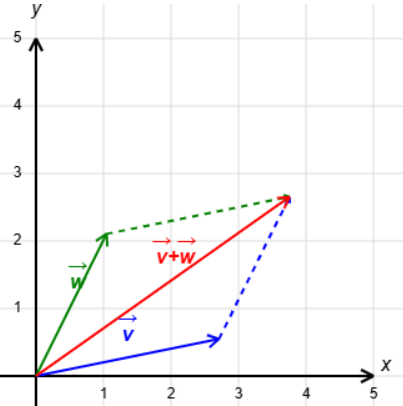
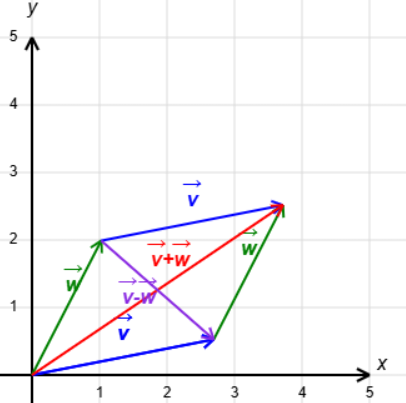
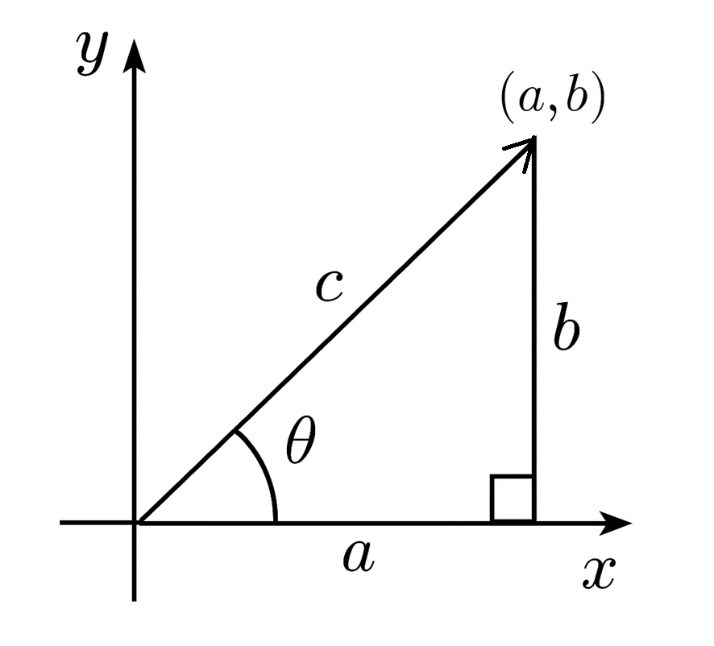
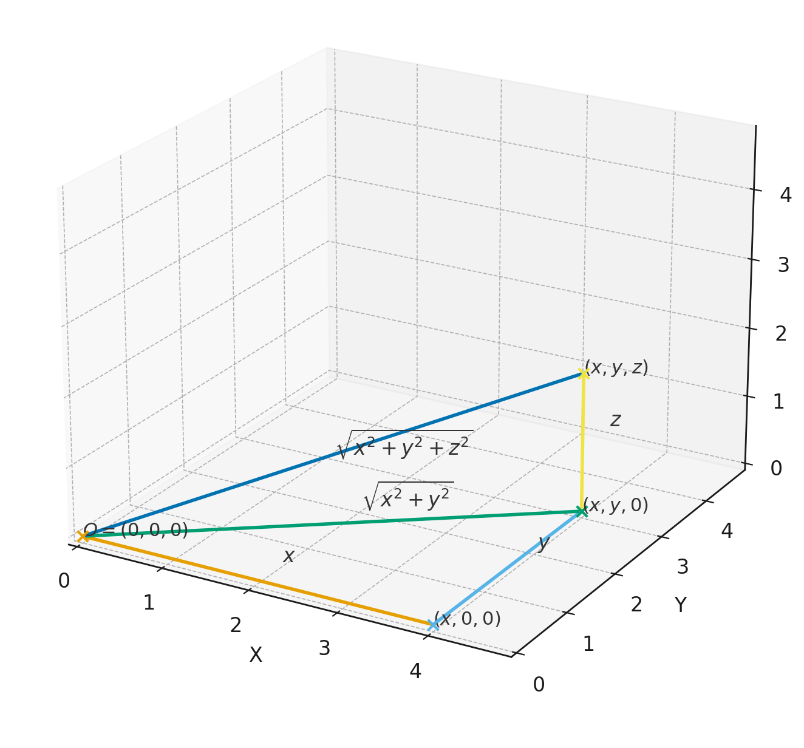
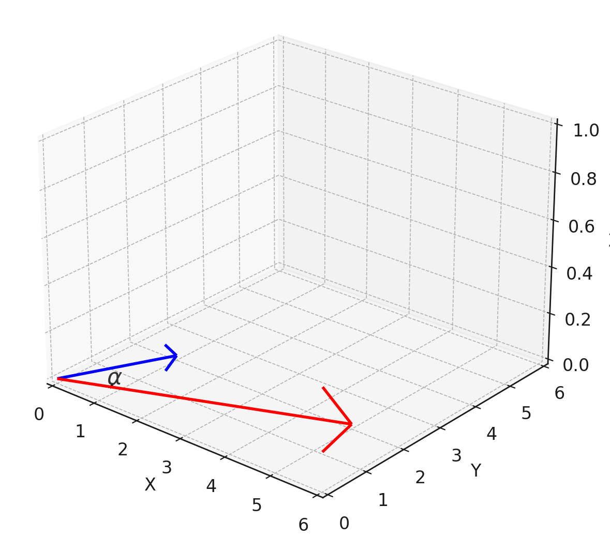

# גיאומטריה במישור ובמרחב

בפרק זה נרצה להגדיר ולהבין וקטורים מבחינה גיאומטרית ואלגברית. נתמקד תחילה במישור הדו-מימדי (עם דגש על הישרים המוכלים בו) ואחר כך נעבור למרחב התלת-מימדי (שם נדבר גם על מישורים).

## המישור $\mathbb{R}^2$

בפרק $0$ דיברנו על הישר הממשי וגם על המישור המרוכב. אפשר גם לתאר את המישור (הממשי) בלי מספרים מרוכבים, אבל הרעיון דומה מאוד.

::: definition
המישור $\mathbb{R}^2$ הוא קבוצת כל הנקודות בעלות שתי קוארדינטות ממשיות, כלומר $$.\mathbb{R}^2=\Set{(x,y)|x,y\in\mathbb{R}}$$
:::

::: example

 1. $(0,0),(1,-2),(-3,-5),(\frac{3}{5},\sqrt{2}),(\pi,-10)\in\mathbb{R}^2$  

 2. $1,(i,0),(0,1,2)\notin\mathbb{R}^2$

:::

::: definition
וקטור $\vec{v}=(x,y)$ במישור הוא זוג סדור של מספרים ממשיים, כלומר איבר של $\mathbb{R}^2$.
:::

::: remark
מבחינה אלגברית לא נבחין בין וקטור לנקודה המתאימה, ולכן גם נשתמש באותו סימון $(x,y)$. אבל מבחינה גיאומטרית, נחשוב על וקטור כחץ שיוצא מהראשית $(0,0)$ ומסתיים בנקודה $(x,y)$.
:::

::: {#fig:LineMotion .figure}
{width=720 height=720}
<figcaption>סימולציה 1.1 וקטורים במישור שיוצאים מהראשית</figcaption>
:::

אמרנו שוקטורים ניתנים לתיאור חצים שיוצאים מהראשית, אבל הם יכולים לצאת מכל נקודה. מה שקובע את הוקטור הם גודלו וכיוונו, לא נקודת ההתחלה. וקטורים זהים יופיעו כחצים מקבילים ושווי גודל במישור.

::: {#fig:LineMotion .figure}
{width=800 height=800}
<figcaption>סימולציה 1.2 - וקטורים שקולים </figcaption>
:::

::: remark
וקטורים שווים אם ורק אם יש שוויון בכל קוארדינטה, כלומר $(a,b)=(c,d)$ אם ורק אם $a=c$ וגם $b=d$. למשל, $(1,2)=(1,2)$ אך $(1,2)\neq(1,-2)$. שני הוקטורים האחרונים שווים בגודלם אך הכיוונים שונים. בנוסף, גם מתקיים $(1,2)\neq (2,1)$ ובאופן כללי יש חשיבות לסדר הקוארדינטות.
:::

### פעולות על וקטורים

שתי הפעולות הבסיסיות שניתן לבצע על וקטורים הן חיבור וכפל בסקלר. סקלר הוא מילה נרדפת למספר, וכאן נסמנו $c\in\mathbb{R}$.

חיבור: $(a_1,a_2)+(b_1,b_2)=(a_1+b_1,a_2+b_2)$

כפל בסקלר: $c\cdot(a_1,a_2)=(ca_1,ca_2)$

::: example
 

1. $(1,2)+(10,20)=(1+10,2+20)=(11,22)$

2. $2\cdot(5,3)=(10,6)$

3. $-5\cdot(2,5)=(-10,-25)$

4. $(9,2)-(11,8)=(9-11,2-8)=(-2,-6)$
:::

::: remark
הוקטור הנגדי (שווה גודל אך הפוך בכיוון) מתקבל ע\"י כפל בסקלר $-1$. חיסור בין שני וקטורים זה כמו חיבור בין הראשון לגרסה הנגדית של השני, כלומר: $$(a_1,a_2)-(b_1,b_2)=(a_1,a_2)+(-1)\cdot(b_1,b_2)=(a_1-b_1,a_2-b_2)$$
:::

::: exercise
בצעו את הפעולות הבאות:  

1. $(-3,5)+(20,36)$  

2. $-7\cdot(-2,9)$  

3. $(11,27)-(13,42)$  

4. $3(8,2)+5(3,-6)$    
:::

::: solution
**פתרון 1.1**.  

1. $(-3,5)+(20,36)=(17,41)$

2. $-7\cdot(-2,9)=(14,-63)$

3. $(11,27)-(13,42)=(-2,-15)$

4. $3(8,2)+5(3,-6)=(24+15,6-30)=(39,-24)$
:::

אפשר להבין חיבור וקטורי באופן גיאומטרי ע\"י כלל המקבילית. כלל זה קובע שאם נצייר שני וקטורים $\vec{v},\vec{w}$ שיוצאים מהראשית ונשלים אותם למקבילית ע\"י הוספת שני וקטורים מקבילים ושווי גודל כצלעות נגדיות, אז האלכסון שיוצא מהראשית יתאר את $\vec{v}+\vec{w}$.

<figure id="fig:Parallelogram1">

<figcaption>החיבור הוקטורי מתאים לאלכסון המוצג</figcaption>
</figure>

ההפרש $\vec{v}-\vec{w}$ מיוצג ע\"י האלכסון השני.

<figure id="fig:Parallelogram2">

<figcaption>ההפרש הוקטורי מופיע בסגול לצד החיבור הוקטורי באדום</figcaption>
</figure>

נוכל להתנסות בעצמינו

::: {#fig:Parallelogram .figure}
{width=800 height=800}
<figcaption>סימולציה 1.3 - כלל המקבילית </figcaption>
:::

זה גם מוביל אותנו לנוסחה שמתארת וקטור $\vec{u}$ שמתחיל בנקודה $(a_1,a_2)$ ומסתיים ב-$(b_1,b_2)$: מקבלים את ההפרש הוקטורי

$$
\vec{u} = (b_1 - a_1, b_2 - a_2)
$$ {#eq-vector-points}

::: exercise
הראו שהוקטור שמתחיל ב-$(1,3)$ ומסתיים ב-$(5,0)$, שווה לוקטור שמתחיל ב- $(5,-1)$ ומסתיים ב- $(9,-4)$.
:::

::: solution
**פתרון 1.2**. הוקטור הראשון שווה ל- $$,(5,0)-(1,3)=(4,-3)$$ ואילו הוקטור השני שווה ל- $$.(9,-4)-(5,-1)=(4,-3)$$ לכן יש שוויון ביניהם.
:::

כפל בסקלר זו פעולה שאפשר לפרש גיאומטרית כמתיחה של הוקטור אם $c>1$, או כיווצו אם $0<c<1$, בלי לשנות כיוון. כאשר הסקלר שלילי, יש היפוך כיוון ובנוסף מתיחה/כיווץ בהתאם לערך של $|c|$.

::: {#fig:Parallelogram .figure}
{width=800 height=800}
<figcaption>סימולציה 1.4 - כפל וקטור בסקלר </figcaption>
:::

### גדלים וזוויות ב-$\mathbb{R}^2$

כאמור, לכל וקטור יש גודל וכיוון. אם נניח שהוא מתחיל בראשית, אז גודלו/אורכו הוא המרחק מנקודת הסיום לראשית. הכיוון נקבע לפי הזווית $\theta$ עם הכיוון החיובי של ציר $x$ בדיוק כמו בקוארדינטות פולריות. עבור וקטור $(a,b)$ נקבל את הנוסחאות הבאות:

גודל: $\|(a,b)\|=\sqrt{a^2+b^2}$

זווית: $\tan\theta=\frac{b}{a}$

{width=40%}

החישוב של גודל הוקטור נובע ממשפט פיתגורס. בציור $c$ הוא הסימון של $\|(a,b)\|$ ולפי משפט פיתגורס מתקיים $$a^2+b^2=c^2\implies \|(a,b)\|=c=\sqrt{a^2+b^2}$$ כבר דיברנו על החישוב המדויק של $\theta$ בסוף פרק $0$. לא ממש נצטרך לחשב זוויות בקורס, אבל זה טוב לידע כללי.

::: remark
כל וקטור נקבע ביחידות ע\"י הגודל והכיוון שלו. קוארדינטות פולריות מתארות גודל וכיוון, אבל בשביל פעולות בין וקטורים יותר נוח להשתמש בקוארדינטות קרטזיות. כך נעשה בקורס.
:::

::: example
 

1. $\|(2,1)\|=\sqrt{2^2+1^2}=\sqrt{5}$

2. $\|(3,-4)\|=\sqrt{3^2+(-4)^2}=5$

3. $\|(-3,-7)\|=\sqrt{(-3)^2+(-7)^2}=\sqrt{58}$
:::

אם כפל בסקלר מתאים למתיחה/כיווץ, זה אמור להתבטא בגודל. מכאן הטענה הבאה:

::: {.proposition #prop-norm-scalar}
$\|c\cdot(a,b)\| = |c|\cdot\|(a,b)\|$ לכל וקטור $(a,b)\in\mathbb{R}^2$ ולכל סקלר $c\in\mathbb{R}$.
:::

::: proof
*Proof.* נשתמש בהגדרות ונחשב: $$\begin{aligned}
\|c\cdot(a,b)\|&=\|(ca,cb)\|=\sqrt{(ca)^2+(cb)^2}=\sqrt{c^2(a^2+b^2)}=\sqrt{c^2}\sqrt{a^2+b^2}\\
&=|c|\sqrt{a^2+b^2}=|c|\cdot\|(a,b)\|
\end{aligned}$$ נציין שמתקיים $\sqrt{c^2}=|c|$ כי מדובר בשורש חיובי. ◻
:::

::: remark
בפרט, כפל ב-$-1$ לא משנה את גודל הוקטור. רק הכיוון מתהפך.
:::

### ישרים ב-$\mathbb{R}^2$

נרצה להבין את הקשר בין ישרים לוקטורים. יותר קל להבין את זה במקרה של ישרים שעוברים דרך הראשית. ניקח ישר כזה ונבחר נקודה כלשהי שאינה הראשית, מה שייתן לנו וקטור. הישר הוא אוסף כל הנקודות שמתקבלות ע\"י כפל בסקלר של וקטור זה.

::: example
הישר שמשוואתו $y=2x$ עובר דרך הראשית והנקודה $(1,2)$. דרך נוספת לתאר את הישר היא כקבוצת כל הכפולות (בסקלר ממשי) של הוקטור $(1,2)$. כל הוקטורים האלה מתאימים לנקודות על הישר, וכותבים את הנקודות כמו הוקטורים (כי הם יוצאים מהראשית). כך נקבל את ההצגה הבאה לישר כקבוצת נקודות: $$\Set{t(1,2)|t\in\mathbb{R}}=\Set{(t,2t)|t\in\mathbb{R}}$$
:::

::: {#fig:LineMotion .figure}
{width=800 height=800}
<figcaption>סימולציה 1.5 - הצגה פרמטרית של ישר </figcaption>
:::

אכן, זה מיידי שכל נקודה מהצורה $(t,2t)$ מקיימת את המשוואה $y=2x$.

באופן כללי, הישר שעובר דרך הראשית בכיוון הוקטור $\vec{v}$ נתון ע\"י ההצגה $\Set{t\vec{v}|t\in\mathbb{R}}$. נשים לב שעבור $t<0$ מקבלים וקטורים עם כיוון מנוגד (הצד השני של הישר).

נכליל: ישר שעובר דרך $(x_0,y_0)$ בכיוון הוקטור $\vec{v}$ נתון ע\"י ההצגה $$.\Set{(x_0,y_0)+t\vec{v}|t\in\mathbb{R}}$$ אם נתון שהישר גם עובר דרך $(x_1,y_1)$, אז נקבל $$.\Set{(x_0,y_0)+t(x_1-x_0,y_1-y_0)|t\in\mathbb{R}}$$

::: exercise
איזו נקודה מתקבלת עבור $t=0$? $t=1$? $t=2$?
:::

::: solution
**פתרון 1.3**. עבור $t=0$ מתקבלת נקודת ההתחלה $(x_0,y_0)$.

עבור $t=1$ מתקבלת נקודת הסיום $(x_1,y_1)$.

לבסוף, עבור $t=2$ מתקבלת הנקודה $$.(x_0+2x_1-2x_0,y_0+2y_1-2y_0)=(2x_1-x_0,2y_1-y_0)$$
:::

::: remark
ההצגה לעיל נקראת הצגה פרמטרית של ישר. לעומת זאת, הצגה מהצורה $$L=\Set{(x,y)\in\mathbb{R}^2|ax+by=c}$$ נקראת הצגה אלגברית של ישר. הצגה אלגברית אינה יחידה, כי למשל המשוואה $y=2x$ שקולה למשוואה $2y=4x$. באופן דומה, גם הצגה פרמטרית אינה יחידה משתי סיבות: אפשר לבחור את נקודת ההתחלה $(x_0,y_0)$ באופן שרירותי כל עוד היא על הישר, וגם אפשר לבחור את $(x_1,y_1)$ כרצוננו ובהתאם את וקטור הכיוון $\vec{v}$ (אפשר לקחת כל כפולה שלו בסקלר שאינו $0$). כך מקבלים אינסוף הצגות פרמטריות שונות לאותו הישר. האות של הפרמטר היא סימון שרירותי ולכן ניתן להשתמש באותה האות להצגות שונות, אך לפעמים נרצה להשתמש באותיות שונות כדי למנוע בלבול. למשל: $$\Set{t(1,2)|t\in\mathbb{R}}=\Set{(1,2)+s(2,4)|s\in\mathbb{R}}=\Set{(2,4)+r(-3,-6)|r\in\mathbb{R}}$$
:::

::: exercise
עבור הישר שמשוואתו $y=3x+1$, מצאו שלוש הצגות פרמטריות שונות. נסו לשנות גם את נקודת ההתחלה וגם את וקטור הכיוון.
:::

::: solution
**פתרון 1.4**. נבחר שתי נקודות על הישר. תחילה נציב $x=0$ ונקבל את הנקודה $(0,1)$. בשביל הנקודה השנייה נציב $x=1$ ונקבל את הנקודה $(1,4)$. וקטור הכיוון המתאים לשתי הנקודות האלו הוא $(1,4)-(0,1)=(1,3)$.

אז ההצגה הפרמטרית הראשונה שמתאימה לשתי הנקודות האלו היא $$.L=\Set{(0,1)+t(1,3)|t\in\mathbb{R}}$$

בשביל ההצגה השנייה נחליף את נקודת ההתחלה בנקודת הסיום (אפשר להפוך את סימן וקטור הכיוון, אך אין צורך):

$$.L=\Set{(1,4)+s(1,3)|s\in\mathbb{R}}$$

בשביל ההצגה השלישית נכפיל את וקטור הכיוון ב- $2$ בלי לשנות את נקודת ההתחלה המקורית:

$$.L=\Set{(0,1)+r(2,6)|r\in\mathbb{R}}$$
:::

### מכפלה סקלרית

מכפלה סקלרית היא פעולה נוספת בין וקטורים, אבל התוצאה שלה היא סקלר ומכאן שמה.

::: {.definition #def-scalar-product-plane}
עבור וקטורים $(a_1,a_2),(b_1,b_2)\in\mathbb{R}^2$ נגדיר  
$(a_1,a_2)\cdot(b_1,b_2)=a_1b_1+a_2b_2$.
:::

::: example
 

1. $(1,3)\cdot(2,5)=1\cdot2+3\cdot5=17$

2. $(3,-2)\cdot(6,5)=3\cdot6+(-2)\cdot5=8$

3. $(1,5)\cdot(-5,1)=1\cdot(-5)+5\cdot1=0$
:::

למכפלה סקלרית יש קשר לגודל. יש מספר תכונות שכדאי לזכור:

::: {.proposition #prop-dot-product-properties}
יהיו $\vec{v_1}=(x_1,y_1),\,\vec{v_2}=(x_2,y_2),\,\vec{v_3}=(x_3,y_3)\in\mathbb{R}^2$ וקטורים. אז מתקיים:

1. $\vec{v_1}\cdot\vec{v_2}=\vec{v_2}\cdot\vec{v_1}$  
2. $(\vec{v_1}+\vec{v_3})\cdot\vec{v_2}=\vec{v_1}\cdot\vec{v_2}+\vec{v_3}\cdot\vec{v_2}$  
3. $\vec{v_1}\cdot\vec{v_1}=\|\vec{v_1}\|^2$  
4. $\vec{v_1}\cdot(c\vec{v_2})=c(\vec{v_1}\cdot\vec{v_2})$ לכל סקלר $c\in\mathbb{R}$  
5. $\|\vec{v_1}\|=0\iff\vec{v_1}=(0,0)$  
6. $\|\frac{\vec{v_1}}{\|\vec{v_1}\|}\|=1$ אם $\vec{v_1}\neq(0,0)$
:::

::: proof
*Proof.* נסתפק בסעיפים ג' ו-ה'. סעיפים אחרים יופיעו כתרגילים. לפי ההגדרה של מכפלה סקלרית, מתקיים $$.\vec{v_1}\cdot\vec{v_1}=x_1^2+y_1^2=\left(\sqrt{x_1^2+y_1^2}\right)^2=\|\vec{v_1}\|^2$$

סכום ריבועים (של מספרים ממשיים) הוא אי-שלילי, והוא מתאפס אם ורק אם כל מחובר מתאפס. במקרה זה $x_1^2=y_1^2=0$ גורר $x_1=y_1=0$, או באופן שקול $\vec{v_1}=(0,0)$. ◻
:::

מכפלה סקלרית גם קשורה לזווית בין שני וקטורים. ליתר דיוק, הכוונה היא לזווית הקטנה ביניהם (בין $0$ ל-$\pi$ ברדיאנים).

::: {#fig:Angle .figure}
{width=800 height=800}
<figcaption>סימולציה 1.6 - שני וקטורים והזוית שביניהם </figcaption>
:::

::: {.proposition #prop-cosine-scalar}
יהיו $\vec{v},\vec{w}$ שני וקטורים ב-$\mathbb{R}^2$ השונים מ-$(0,0)$, ותהי $\alpha$ הזווית הקטנה ביניהם. אז מתקיים:

$$
\cos\alpha = \frac{\vec{v}\cdot\vec{w}}{\|\vec{v}\|\cdot\|\vec{w}\|}
$$ {#eq-cosine-scalar}
:::

ההוכחה תדגים היטב את השימוש בתכונות של מכפלה סקלרית.

::: proof
*Proof.* נסתמך על משפט הקוסינוסים מטריגונומטריה. נסתכל על המשולש שנוצר ע\"י שני הוקטורים:

<figure id="fig:Cosine Law">

<figcaption>המשולש המתאים לשני הוקטורים יחד עם וקטור ההפרש</figcaption>
</figure>

$$\|\vec{v}\|^2+\|\vec{w}\|^2=\|\vec{v}-\vec{w}\|^2+2\|\vec{v}\|\cdot\|\vec{w}\|\cos\alpha$$

נשתמש בתכונות של מכפלה סקלרית כדי למצוא את הקשר בין $\|v-w\|^2$ ל-$v\cdot w$: $$\|\vec{v}-\vec{w}\|^2=(\vec{v}-\vec{w})\cdot(\vec{v}-\vec{w})=\vec{v}\cdot\vec{v}-\vec{v}\cdot\vec{w}-\vec{w}\cdot\vec{v}+\vec{w}\cdot\vec{w}=\|\vec{v}\|^2-2\vec{v}\cdot\vec{w}+\|\vec{w}\|^2$$

נציב את המשוואה השנייה בראשונה ונקבל $$.\|\vec{v}\|^2+\|\vec{w}\|^2=\|\vec{v}\|^2-2\vec{v}\cdot\vec{w}+\|\vec{w}\|^2+2\|\vec{v}\|\cdot\|\vec{w}\|\cos\alpha$$

נקזז $\|\vec{v}\|^2+\|\vec{w}\|^2$ מכל אגף ונקבל $$.0=-2\vec{v}\cdot\vec{w}+2\|\vec{v}\|\cdot\|\vec{w}\|\cos\alpha\implies\cos\alpha=\frac{\vec{v}\cdot\vec{w}}{\|\vec{v}\|\cdot\|\vec{w}\|}$$

כנדרש. ◻
:::

::: corollary
**מסקנה 1.22**. *וקטורים $\vec{v},\vec{w}$ השונים מ-$(0,0)$ הם מאונכים/ניצבים אם ורק אם $\vec{v}\cdot\vec{w}=0$. במקרה זה נסמן $\vec{v}\perp\vec{w}$.*
:::

::: proof
*Proof.* תהי $\alpha$ הזווית הקטנה ביניהם. אז מתקיים $$.\vec{v}\cdot\vec{w}=0\iff\cos\alpha=\frac{\vec{v}\cdot\vec{w}}{\|\vec{v}\|\cdot\|\vec{w}|}=0\iff\alpha=\frac{\pi}{2}$$ ◻
:::

::: example
 

1. $(1,2)\perp(-2,1)$ כי $(1,2)\cdot(-2,1)=0$.

2. באופן כללי, לכל $(a,b)\in\mathbb{R}^2$ מתקיים $(a,b)\perp(-b,a)$ כי $(a,b)\cdot(-b,a)=0$.
:::

::: remark
הוקטור $(0,0)$ הוא מקרה חריג כי הוא חסר כיוון. אבל מאחר שמתקיים $\vec{v}\cdot(0,0)=0$ לכל וקטור $\vec{v}\in\mathbb{R}^2$, עדיין נגדיר $\vec{v}\perp(0,0)$. זהו הוקטור היחיד שמאונך לכל וקטור במישור, כי כל וקטור אחר לא מאונך לעצמו.
:::

### מעבר מהצגה פרמטרית של ישר להצגה אלגברית

ההצגה האלגברית של ישר קשורה באופן הדוק למכפלה סקלרית. נבין את הקשר דרך דוגמה.

::: example
נסתכל על הישר $L=\Set{t(2,-1)|t\in\mathbb{R}}$. רואים לפי הצגה הפרמטרית שוקטור הכיוון הוא $(2,-1)$. לפי המכפלה הסקלרית אפשר לקבוע שהוקטור $(1,2)$ מאונך לו. הוא לא רק מאונך ל- $(2,-1)$ אלא לכל וקטור שמתאים לנקודה על הישר, כי לכל $t\in\mathbb{R}$ מתקיים $$.(1,2)\cdot(2t,-t)=2t-2t=0$$
:::

להיפך, אפשר לתאר את הישר כאוסף כל הוקטורים שמאונכים לוקטור $(1,2)$. כלומר כל וקטור $(x,y)\in L$ נתון ע\"י המשוואה $$.(x,y)\cdot(1,2)=0\iff x+2y=0$$

או בכתיב קבוצות: $L=\Set{(x,y)\in\mathbb{R}^2|x+2y=0}$.

::: definition
וקטור המאונך לכל וקטור שמתאים לשתי נקודות על ישר (התחלה וסיום) נקרא נורמל לישר.
:::

באופן כללי, לישר עם הצגה פרמטרית $\Set{(x_0,y_0)+t(a,b)|t\in\mathbb{R}}$ יש וקטור נורמל $(-b,a)$ המאונך לוקטור הכיוון $(a,b)$. אבל וקטור הנורמל אינו יחיד, כי אם נכפיל אותו בסקלר $c\neq0$ הוא יישאר מאונך לוקטור הכיוון של הישר. כל שני וקטורים מאונכים יישארו מאונכים גם אם נכפיל את אחד מהם (או שניהם) בסקלר.

{#fig:Rotating-line width=800 height=800}

כדי לעבור להצגה אלגברית נשתמש בוקטור שמתחיל ב-$(x_0,y_0)$ ומסתיים ב-$(x,y)$, כלומר הוקטור $(x-x_0,y-y_0)$. וקטור זה בהכרח מאונך לוקטור הנורמל $(-b,a)$, ולכן צריך להתקיים: $$\begin{aligned}
    (x-x_0,y-y_0)\cdot(-b,a)=0&\iff-b(x-x_0)+a(y-y_0)=0\\
    &\iff-bx+ay=-bx_0+ay_0
\end{aligned}$$ כלומר קיבלנו הצגה אלגברית $L=\Set{(x,y)\in\mathbb{R}^2|-bx+ay=-bx_0+ay_0}$. נדגיש שהבחירה של נקודת ההתחלה $(x_0,y_0)$ היא שרירותית. המשוואה מראה שהביטוי $-bx+ay$ קבוע לאורך הישר, וקבוע זה מופיע באגף ימין של המשוואה.

::: example
נסתכל על הישר $L=\Set{(2,3)+t(1,-1)|t\in\mathbb{R}}$. יש לו וקטור נורמל $(1,1)$ ולכל $(x,y)\in L$ הוקטור $(x-2,y-3)$ מאונך ל- $(1,1)$, ולכן מתקיים $$.(x-2,y-3)\cdot(1,1)=0\iff x-2+y-3=0\iff x+y=5$$

קיבלנו הצגה אלגברית $L=\Set{(x,y)\in\mathbb{R}^2|x+y=5}$.
:::

::: exercise
מצאו הצגה אלגברית של $L=\Set{(1,-2)+t(3,1)|t\in\mathbb{R}}$.
:::

::: solution
**פתרון 1.5**. כאן יש וקטור נורמל $(-1,3)$. לכל $(x,y)\in L$ הוקטור $$(x-1,y-(-2))=(x-1,y+2)$$ מאונך ל- $(-1,3)$, ולכן מתקיים $$.(x-1,y+2)\cdot(-1,3)=0\iff -x+1+3y+6=0\iff x-3y=7$$

ההצגה האלגברית המתאימה היא $L=\Set{(x,y)\in\mathbb{R}^2|x-3y=7}$.
:::

### מעבר מהצגה אלגברית של ישר להצגה פרמטרית

כדי למצוא הצגה פרמטרית של ישר, צריך למצוא שתי נקודות עליו. האחת בשביל נקודת ההתחלה, והשנייה בשביל נקודת הסיום של וקטור הכיוון. הבחירה של נקודות אלו היא שרירותית לחלוטין, אבל יחסית נוח להשתמש בנקודות חיתוך עם הצירים.

::: example
נסתכל על הישר $L=\Set{(x,y)\in\mathbb{R}^2|2x+3y=1}$. אם נציב $y=0$ נקבל $x=\frac{1}{2}$, ולכן נבחר את $(\frac{1}{2},0)$ כנקודת התחלה. אם נציב $x=0$ נקבל $y=\frac{1}{3}$, ולכן נבחר את $(0,\frac{1}{3})$ כנקודת סיום של וקטור הכיוון. כך נקבל וקטור כיוון $(0,\frac{1}{3})-(\frac{1}{2},0)=(-\frac{1}{2},\frac{1}{3})$.

מכאן $L=\Set{(\frac{1}{2},0)+t(-\frac{1}{2},\frac{1}{3})|t\in\mathbb{R}}$ היא הצגה פרמטרית אחת מתוך רבות. מי שלא אוהב שברים יכול להכפיל ב-$6$ את וקטור הכיוון, וגם אפשר להחליף את נקודת ההתחלה ב-$(2,-1)$, למשל. אז גם מתקיים $L=\Set{(2,-1)+t(-3,2)|t\in\mathbb{R}}$ ושתי התשובות נכונות באותה המידה. נשים לב שלפי הנוסחה $(-b,a)$, וקטור הנורמל שמתאים להצגה הפרמטרית הראשונה הוא $(-\frac{1}{3},-\frac{1}{2})$. באופן דומה, וקטור הנורמל שמתאים להצגה הפרמטרית השנייה הוא $(-2,-3)$. שני הוקטורים האלה הם כפולות של הוקטור $(2,3)$ שמופיע בתוך ההצגה האלגברית המקורית בתור המקדמים של $x,y$ בהתאמה.
:::

באופן כללי, עבור הצגה אלגברית $L=\Set{(x,y)\in\mathbb{R}^2|ax+by=c}$ נבחר נקודת התחלה $(x_0,y_0)$ כלשהי. זו נקודה שמקיימת את משוואת הישר ולכן בהכרח $ax_0+by_0=c$, ולאחר הצבה במשוואה נקבל: $$\begin{aligned}
    (x,y)\in L&\iff ax+by=ax_0+by_0\iff a(x-x_0)+b(y-y_0)=0 \\
    &\iff(x-x_0,y-y_0)\perp(a,b)
\end{aligned}$$

אז $(a,b)$ הוא וקטור נורמל של $L$. כל וקטור כיוון שנמצא ע\"י בחירה נקודה נוספת של נקודה על $L$ בהכרח מאונך לוקטור זה. זו בדיוק המשמעות של התנאי $(x-x_0,y-y_0)\perp(a,b)$.

::: exercise
מצאו הצגה פרמטרית של $L=\Set{(x,y)\in\mathbb{R}^2|3x+y=5}$. האם וקטור הכיוון מאונך ל- $(3,1)$?
:::

::: solution
**פתרון 1.6**. נוח להציב $x=0$ ולקבל $y=5$. אז נבחר את $(0,5)$ להיות נקודת ההתחלה. כעת נציב (בחירה שרירותית אך נוחה) $x=1$ ונקבל $y=2$. אז נקודת הסיום של וקטור הכיוון היא $(1,2)$, ולכן הוקטור עצמו נתון ע\"י $\vec{v}=(1,2)-(0,5)=(1,-3)$.

אז ההצגה הפרמטרית המתאימה היא $$.L=\Set{(0,5)+t(1,-3)|t\in\mathbb{R}}$$

אכן מתקיים $,(1,-3)\cdot(3,1)=3-3=0$ אז וקטור הכיוון מאונך לוקטור הנורמל כצפוי.
:::

### מצבים הדדיים בין ישרים במישור

קיימים שלושה מצבים הדדיים אפשריים בין שני ישרים במישור: נחתכים, מקבילים ומתלכדים.

{#fig:two-lines width=800 height=800}

נתחיל בדוגמאות לפני שנעבור לאפיון.

::: example
 

1. $L_1=\Set{(1,1)+t(1,2)|t\in\mathbb{R}}$ ו-$L_2=\Set{(0,-1)+t(2,4)|t\in\mathbb{R}}$ הם ישרים מתלכדים, כלומר $L_1=L_2$. ניתן לראות זאת כי $(2,4)=2\cdot(1,2)$ ולכן שני וקטורי הכיוון מקבילים. זה אומר שהישרים או מקבילים או מתלכדים (בהכרח לא נחתכים). בנוסף, $(0,-1)\in L_1$ כי $(0,-1)=(1,1)-1\cdot(1,2)$. אז יש לפחות נקודת חיתוך אחת, ולכן שני הישרים אינם מקבילים אלא מתלכדים.

2. $L_1=\Set{(1,1)+t(1,2)|t\in\mathbb{R}}$ ו-$L_3=\Set{(0,1)+t(-1,-2)|t\in\mathbb{R}}$ הם ישרים מקבילים. שני וקטורי הכיוון הם מנוגדים, אבל כל ישר מכיל נקודות שמתאימות גם לוקטור הכיוון $(1,2)$ וגם לכיוון הנגדי. אז הישרים או מקבילים או מתלכדים, וניתן להראות שאין נקודת חיתוך. לצורך כך נכתוב $L_3=\Set{(0,1)+s(-1,-2)|s\in\mathbb{R}}$ עם פרמטר $s$ כדי להדגיש שזה פרמטר שונה. נחפש נקודת חיתוך $(x,y)\in L_1\cap L_3$. אפשר להציג את הקוארדינטות שלה בשתי דרכים שונות לפי ההצגות הפרמטריות של הישרים. כך נקבל: $$\begin{cases}
        \begin{aligned}
            x&=1+t=0-s\\
            y&=1+2t=1-2s
            \end{aligned}
        \end{cases}$$

    כעת אפשר להתעלם מ-$x,y$ ולפתור מערכת של שתי משוואות בשני נעלמים. מהמשוואה הראשונה נובע כי $s=-1-t$ וכאשר מציבים את זה במשוואה השנייה נקבל $$.1+2t=1-2(-1-t)\implies 1=3$$

    זה לא ייתכן (פסוק שקר) ולכן קיבלנו סתירה. מה המשמעות של סתירה? עצם ההנחה שיש נקודת חיתוך התבררה כשגויה, ולכן שני הישרים מקבילים.

3. $L_1=\Set{(1,1)+t(1,2)|t\in\mathbb{R}}$ ו-$L_4=\Set{(3,2)+t(1,-1)|t\in\mathbb{R}}$ הם ישרים נחתכים. שוב נשנה את הפרמטר ונכתוב $L_4=\Set{(3,2)+s(1,-1)|s\in\mathbb{R}}$. נחפש נקודת חיתוך $(x,y)\in L_1\cap L_4$ ונקבל $$.\begin{cases}
        \begin{aligned}
            1+t&=3+s\\
            1+2t&=2-s
            \end{aligned}
        \end{cases}$$

    נחבר את שתי המשוואות ונקבל $$.2+3t=5\implies3t=3\implies t=1$$

    נציב $t=1$ במשוואה הראשונה (אפשר גם בשנייה) ונקבל $$.2=3+s\implies s=-1$$

    זה מראה כי $(2,3)\in L_1\cap L_4$ לפי הצבת $t=1$ בהצגה הפרמטרית של $L_1$, או לפי הצבת $s=-1$ בהצגה הפרמטרית של $L_4$. יותר מכך, זו נקודת החיתוך היחידה לפי החישוב ולכן שני הישרים אכן נחתכים (לא מקבילים).
:::

::: definition
שני וקטורים $\vec{v},\vec{w}\in\mathbb{R}^2$ נקראים קו-לינאריים אם קיים $c\in\mathbb{R}$ כך ש-$\vec{v}=c\vec{w}$ או $\vec{w}=c\vec{v}$.
:::

::: remark
אם שני הוקטורים שונים מ-$(0,0)$, אז המשמעות הגיאומטרית של קו-לינאריות היא ששני הוקטורים מקבילים. במקרה זה $c\neq0$ והתנאי $\vec{v}=c\vec{w}$ שקול לתנאי $\vec{w}=\frac{1}{c}\vec{v}$.

אבל אם למשל $\vec{v}=(0,0)$, אז לכל $\vec{w}\in\mathbb{R}^2$ מתקיים $\vec{v}=0\cdot\vec{w}$ ולכן שני הוקטורים נחשבים קו-לינאריים אך לא מקבילים (כי וקטור האפס חסר כיוון).
:::

::: example
 

1. $(2,-4),(-3,6)$ הם קו-לינאריים כי $(-3,6)=-\frac{3}{2}(2,-4)$.

2. $(1,5),(0,0)$ הם קו-לינאריים כי $(0,0)=0\cdot(1,5)$.

3. $(1,2),(3,1)$ אינם קו-לינאריים. כדי לראות זאת, נניח בשלילה שהם קו-לינאריים וננסה לקבל סתירה. אז לפי ההגדרה קיים $c\in\mathbb{R}$ כך ש-$(1,2)=c(3,1)$, או להיפך אבל שני התנאים שקולים כי אף וקטור אינו $(0,0)$. אז מצד אחד קיבלנו $$.1=3c\implies c=\frac{1}{3}$$

    ומצד שני $c=2$ לפי המשוואה השנייה. זו סתירה ולכן שני הוקטורים אינם קו-לינאריים.
:::

::: remark
הוכחה בדרך השלילה היא שיטת הוכחה כללית במתמטיקה. כשמה כן היא: מניחים ההיפך ממה שרוצים להוכיח, ואם מקבלים סתירה זה אומר שהנחה זו שגויה ולכן ההיפך הוא הנכון. נוח להשתמש בשיטה זו כדי להראות שהגדרה כלשהי לא מתקיימת, כמו בדוגמה האחרונה.
:::

::: remark
שני ישרים בעלי וקטורי נורמל מקבילים (קו-לינאריים), הם בעצמם או מקבילים או מתלכדים. אכן, נסמן את וקטורי הכיוון של שני הישרים ב-$\vec{v_1},\vec{v_2}$. אם וקטור הכיוון של הישר הראשון וקטור הנורמל של הישר הראשון הוא $\vec{n_1}$, אז לפי ההנחה וקטור הנורמל של הישר השני הוא $\vec{n_2}=c\vec{n_1}$ עבור $c\neq0$ כלשהו. $$\begin{aligned}
\vec{v_2}\cdot\vec{n_2}=0&\iff\vec{v_2}\cdot(c\vec{n_1})=0\iff c(\vec{v_2}\cdot\vec{n_1})=0\\
&\iff\vec{v_2}\cdot\vec{n_1}=0\iff\vec{v_2}\perp\vec{n_1}   
\end{aligned}$$ הוקטורים היחידים שמאונכים ל-$\vec{n_1}$ הם $\vec{v_1}$ וכל הכפולות שלו בסקלר. לכן $\vec{v_1},\vec{v_2}$ קו-לינאריים וזה אומר ששני הישרים או מקבילים או מתלכדים.
:::

נסכם בטבלה את שלושת המצבים ההדדיים של שני ישרים $$.L_1=\Set{(x_1,y_1)+t\vec{v_1}|t\in\mathbb{R}},\:L_2=\Set{(x_2,y_2)+t\vec{v_2}|t\in\mathbb{R}}$$

\centering

+--------------------------------------------------------------------+------------------------------------------------------------------------------------------------------------------------------+--------------------------------------------------------------------------------------------------------------------+-----------------------------------------------------------------------------------+
| `\raggedleft`{=latex}`\arraybackslash`{=latex}[**מצב**]{lang="he"} | `\raggedleft`{=latex}`\arraybackslash`{=latex} [**פירוש בהצגה הפרמטרית**]{lang="he"}                                         | `\raggedleft`{=latex}`\arraybackslash`{=latex} [**פירוש בהצגה האלגברית**]{lang="he"}                               | `\raggedleft`{=latex}`\arraybackslash`{=latex} [**מספר נקודות חיתוך**]{lang="he"} |
+:===================================================================+:=============================================================================================================================+:===================================================================================================================+:==================================================================================+
| `\raggedleft`{=latex}`\arraybackslash`{=latex}[נחתכים]{lang="he"}  | `\raggedleft`{=latex}`\arraybackslash`{=latex} [$\vec{v_2}$,$\vec{v_1}$ אינם קו-לינאריים]{lang="he"}                         | `\raggedleft`{=latex}`\arraybackslash`{=latex} [למערכת יש פתרון יחיד כי וקטורי הנורמל אינם קו-לינאריים]{lang="he"} | `\raggedleft`{=latex}`\arraybackslash`{=latex} [1]{lang="he"}                     |
+--------------------------------------------------------------------+------------------------------------------------------------------------------------------------------------------------------+--------------------------------------------------------------------------------------------------------------------+-----------------------------------------------------------------------------------+
| \raggedleft                                                        | `\raggedleft`{=latex}`\arraybackslash`{=latex} [$\vec{v_2}$,$\vec{v_1}$ הם קו-לינאריים, אך $(x_1,y_1)\notin L_2$]{lang="he"} | `\raggedleft`{=latex}`\arraybackslash`{=latex} [וקטורי הנורמל הם קו-לינאריים, אך המשוואות סותרות]{lang="he"}       | `\raggedleft`{=latex}`\arraybackslash`{=latex} [0]{lang="he"}                     |
| \arraybackslash                                                    |                                                                                                                              |                                                                                                                    |                                                                                   |
|                                                                    |                                                                                                                              |                                                                                                                    |                                                                                   |
| [מקבילים]{lang="he"}                                               |                                                                                                                              |                                                                                                                    |                                                                                   |
+--------------------------------------------------------------------+------------------------------------------------------------------------------------------------------------------------------+--------------------------------------------------------------------------------------------------------------------+-----------------------------------------------------------------------------------+
| \raggedleft                                                        | `\raggedleft`{=latex}`\arraybackslash`{=latex} [$\vec{v_2}$,$\vec{v_1}$ הם קו-לינאריים וגם $(x_1,y_1)\in L_2$]{lang="he"}    | `\raggedleft`{=latex}`\arraybackslash`{=latex} [וקטורי הנורמל הם קו-לינאריים והמשוואות שקולות]{lang="he"}          | `\raggedleft`{=latex}`\arraybackslash`{=latex} [אינסוף (ישר)]{lang="he"}          |
| \arraybackslash                                                    |                                                                                                                              |                                                                                                                    |                                                                                   |
|                                                                    |                                                                                                                              |                                                                                                                    |                                                                                   |
| [מתלכדים]{lang="he"}                                               |                                                                                                                              |                                                                                                                    |                                                                                   |
+--------------------------------------------------------------------+------------------------------------------------------------------------------------------------------------------------------+--------------------------------------------------------------------------------------------------------------------+-----------------------------------------------------------------------------------+

: [מצבים הדדיים בין ישרים במישור]{lang="he"}

::: example
 

1. $L_1=\Set{(x,y)\in\mathbb{R}^2|2x+5y=7}$ ו-$L_2=\Set{(x,y)\in\mathbb{R}^2|5x-4y=1}$ הם ישרים נחתכים. רואים זאת כי וקטורי הנורמל, שהם $(2,5)$ ו-$(5,-4)$, אינם קו-לינאריים. אם הם היו קו-לינאריים, אז היה קיים $c\neq0$ כך ש-$(5,-4)=c\cdot(2,5)$. זו סתירה כי מצד אחד נובע כי $c=\frac{5}{2}$ ומצד שני נובע כי $c=-\frac{4}{5}$. אז שני הישרים אכן נחתכים, ואפשר לחשב את נקודת החיתוך ע\"י פתרון מערכת של שתי משוואות בשני נעלמים: $$\begin{cases}
        \begin{aligned}
            2x+5y&=7\\
            5x-4y&=1
            \end{aligned}
        \end{cases}$$

    אפשר להשתמש בשיטת ההצבה, או לחילופין להכפיל את המשוואה השנייה ב-$\frac{2}{5}$ ולהחסיר אותה מהמשוואה הראשונה (כדי להיפטר מ-$x$): $$0\cdot x+(5+\frac{8}{5})y=7-\frac{2}{5}\implies\frac{33}{5}y=\frac{33}{5}\implies y=1$$

    נציב $y=1$ במשוואה השנייה ונקבל $$.2x+5=7\implies2x=2\implies x=1$$

    אז נקודת החיתוך היחידה היא $(1,1)$, כלומר $L_1\cap L_2=\Set{(1,1)}$.

2. $L_1=\Set{(x,y)\in\mathbb{R}^2|2x+5y=7}$ ו-$L_3=\Set{(x,y)\in\mathbb{R}^2|4x+10y=14}$ הם ישרים מתלכדים. וקטורי הנורמל הם קו-לינאריים כי $(4,10)=2\cdot(2,5)$, ולכן הישרים בהכרח לא נחתכים. נסתכל על מערכת המשוואות: $$\begin{cases}
        \begin{aligned}
            2x+5y&=7\\
            4x+10y&=14
            \end{aligned}
        \end{cases}$$

    שתי המשוואות שקולות כי אפשר לקבל את המשוואה השנייה מהראשונה ע\"י כפל ב-$2$.

3. $L_1=\Set{(x,y)\in\mathbb{R}^2|2x+5y=7}$ ו-$L_3=\Set{(x,y)\in\mathbb{R}^2|6x+15y=20}$ הם ישרים מקבילים. וקטורי הנורמל הם קו-לינאריים כי $(6,15)=3\cdot(2,5)$, ולכן שוב הישרים לא נחתכים. אבל הפעם שתי המשוואות לא שקולות: $$\begin{cases}
        \begin{aligned}
            2x+5y&=7\\
            6x+15y&=20
            \end{aligned}
        \end{cases}$$

    אם נכפיל את המשוואה הראשונה ב-$3$ ונחסיר ממנה את המשוואה השנייה, נקבל את המשוואה השגויה $0=21-20$ וזו סתירה.
:::

::: exercise
מהו המצב ההדדי בין הישר $L_1=\Set{(x,y)\in\mathbb{R}^2|3x-2y=1}$ והישר $L_2=\Set{(x,y)\in\mathbb{R}^2|15x-10y=5}$?
:::

::: solution
**פתרון 1.7**. הישרים מתלכדים כי משוואותיהם שקולות. אם נכפיל ב- $5$ את המשוואה $$3x-2y=1$$ נקבל את המשוואה $$.15x-10y=5$$

מבחינה גיאומטרית, שני וקטורי הנורמל $(3,-2),(15,-10)$ הם קו-לינאריים ולשני הישרים יש לפחות נקודה אחת משותפת, למשל הנקודה $(\frac{1}{3},0)$. אז זו דרך נוספת לראות שהם מתלכדים.
:::

## המרחב $\mathbb{R}^3$

עד עכשיו דיברנו על המישור $\mathbb{R}^2$. נרצה להרחיב את הדיון למרחב התלת-מימדי, שמוגדר באמצעות שלוש קוארדינטות.

::: definition
המרחב $\mathbb{R}^3$ הוא קבוצת כל הנקודות בעלות שלוש קוארדינטות ממשיות, כלומר $$.\mathbb{R}^3=\Set{(x,y,z)|x,y,z\in\mathbb{R}}$$
:::

<figure id="fig:3DVector">

<figcaption>וקטור במרחב שיוצא מהראשית אל נקודה (<em>x</em>, <em>y</em>, <em>z</em>)</figcaption>
</figure>

::: example
 

1. $(0,0,0),(1,-2,5),(-3,-5,\pi),(\frac{3}{5},\sqrt{2},\sqrt{3}),(\pi^2,-10,\sqrt{5})\in\mathbb{R}^3$

2. $1,(1,1),(i,0,0),(0,1,2,3)\notin\mathbb{R}^3$.
:::

הרעיון של וקטור לא משתנה במרחב. אפשר לשנות את כל ההגדרות הרלוונטיות כך שתהיה התייחסות גם לקוארדינטה השלישית.

::: definition
וקטור $\vec{v}=(x,y,z)$ במרחב הוא שלשה סדורה של מספרים ממשיים, כלומר איבר ב- $.\mathbb{R}^3$
:::

::: remark
גם כאן נוסיף להגדרה האלגברית את הפירוש הגיאומטרי של וקטור כחץ שיוצא מהראשית $(0,0,0)$ ומסתיים בנקודה $.(x,y,z)$ לכל וקטור יש גודל וכיוון והוא נקבע על ידם ללא קשר לנקודת ההתחלה.
:::

::: remark
שוב וקטורים שווים אם ורק אם יש שוויון בכל קוארדינטה, ללא קשר לנקודת ההתחלה. כלומר $(a_1,a_2,a_3)=(b_1,b_2,b_3)$ אם ורק אם $a_{i}=b_{i}$ לכל $.1\leq i\leq3$ בפרט, יש חשיבות לסדר ולכן $(1,2,3)\neq(1,3,2)\neq (3,2,1)$ וכן הלאה.
:::

### פעולות על וקטורים

גם במרחב שתי הפעולות הבסיסיות שניתן לבצע על וקטורים הן חיבור וכפל בסקלר.

חיבור: $(a_1,a_2,a_3)+(b_1,b_2,b_3)=(a_1+b_1,a_2+b_2,a_3+b_3)$

כפל בסקלר: $c\cdot(a_1,a_2,a_3)=(ca_1,ca_2,ca_3)$

::: {.remark #rem-points-vector-3d}
חיסור בין שני וקטורים זה שוב כמו חיבור בין הראשון לגרסה הנגדית של השני, כלומר

$$
(b_1,b_2,b_3)-(a_1,a_2,a_3)=(b_1-a_1,\;b_2-a_2,\;b_3-a_3)
$$ {#eq-points-vector-3d}

זה הווקטור שמתחיל בנקודה $(a_1,a_2,a_3)$ ומסתיים ב-$(b_1,b_2,b_3)$.
:::

::: example
 

1. $(2,4,6)+(1,3,5)=(2+1,4+3,6+5)=(3,7,11)$

2. $2\cdot(5,3,1)=(10,6,2)$

3. $-3\cdot(2,5,7)=(-6,-15,-21)$

4. $(9,2,3)-(5,8,2)=(9-5,2-8,3-2)=(4,-6,1)$
:::

::: exercise
חשבו את הוקטור שיוצא מ- $(3,1,5)$ אל $(2,-6,11)$.
:::

::: solution
**פתרון 1.8**. נציב את הנקודות ב- `\ref{equation:points-vector-3d}`{=latex} ונקבל $$.(2,-6,11)-(3,1,5)=(2-3,-6-1,11-5)=(-1,-7,6)$$
:::

### גדלים ב-$\mathbb{R}^3$

לכל וקטור יש גודל וכיוון. אם נניח שהוא מתחיל בראשית, אז גודלו הוא המרחק מנקודת הסיום לראשית שניתן לחשב לפי משפט פיתגורס:

גודל: $\|(x,y,z)\|=\sqrt{x^2+y^2+z^2}$

<figure id="fig:3DPythagoras">

<figcaption>שני משולשים ישרי-זווית במרחב</figcaption>
</figure>

למעשה, החישוב מבוסס על שימוש במשפט פיתגורס פעמיים. היתר הירוק שמוטל על מישור $xy$ הוא באורך $\sqrt{x^2+y^2}$ כי אורכי הניצבים הם $x,y$ (בציור, או בערך מוחלט באופן כללי). לכן, אורך היתר הכחול של המשולש השני שאורכי ניצביו הם $\sqrt{x^2+y^2},|z|$, הוא אכן $\sqrt{x^2+y^2+z^2}$.

::: remark
אפשר גם לדבר על כיוון במרחב במונחים של שתי זוויות, אך לא נעשה זאת בקורס שלנו. נסתפק בוקטור כיוון.
:::

::: example
 

1. $\|(2,1,2)\|=\sqrt{2^2+1^2+2^2}=\sqrt{9}=3$

2. $\|(3,-4,2)\|=\sqrt{3^2+(-4)^2+2^2}=\sqrt{29}$

3. $\|(-3,-6,2)\|=\sqrt{(-3)^2+(-6)^2+2^2}=\sqrt{49}=7$
:::

הטענה הבאה היא הכללה למרחב של טענה `\ref{proposition:norm-scalar}`{=latex}.

::: proposition
**טענה 1.49**. *$\|c\cdot(x,y,z)\|=|c|\cdot\|(x,y,z)\|$ לכל וקטור $(x,y,z)\in\mathbb{R}^3$ ולכל סקלר $c\in\mathbb{R}$.*
:::

::: exercise
בדקו שההוכחה של הטענה המקורית ניתנת להכללה למרחב.
:::

::: solution
**פתרון 1.9**. נשתמש בהגדרות ונחשב: $$\begin{aligned}
\|c\cdot(x,y)\|&=\|(cx,cy,cz)\|=\sqrt{(cx)^2+(cy)^2+(cz)^2}=\sqrt{c^2(x^2+y^2+z^2)} \\\
&=\sqrt{c^2}\sqrt{x^2+y^2+z^2}=|c|\sqrt{x^2+y^2+z^2}=|c|\cdot\|(x,y,z)\|
\end{aligned}$$
:::

### מכפלה סקלרית

גם במרחב אפשר להגדיר מכפלה סקלרית, ושוב יש קשר לזווית בין שני וקטורים.

::: definition
עבור וקטורים $(a_1,a_2,a_3),(b_1,b_2.b_3)\in\mathbb{R}^3$ נגדיר $$.(a_1,a_2,a_3)\cdot(b_1,b_2,b_3)=a_1b_1+a_2b_2+a_3b_3$$
:::

::: example
 

1. $(1,3,2)\cdot(2,5,-1)=1\cdot2+3\cdot5+2\cdot(-1)=15$

2. $(3,-2,1)\cdot(6,5,-3)=3\cdot6+(-2)\cdot5+1\cdot(-3)=5$

3. $(1,4,1)\cdot(-5,1,1)=1\cdot(-5)+4\cdot1+1\cdot1=0$
:::

התכונות של המכפלה הסקלרית שראינו בטענה `\ref{prop:dot-product-properties}`{=latex} נשמרות במרחב, בלי שינוי מהותי להוכחות (רק הוספת קוארדינטה שלישית).

::: proposition
**טענה 1.53**. *יהיו $\vec{v_1}=(x_1,y_1\text{,}z_{!}),\,\vec{v_2}=(x_2,y_2,z_2),\,\vec{v_3}=(x_3,y_3,z_3)\in\mathbb{R}^3$ וקטורים. אז מתקיים:*

1. *$\vec{v_1}\cdot\vec{v_2}=\vec{v_2}\cdot\vec{v_1}$.*

2. *$(\vec{v_1}+\vec{v_3})\cdot\vec{v_2}=\vec{v_2}\cdot\vec{v_1}$.*

3. *$\vec{v_1}\cdot\vec{v_1}=\|\vec{v_1}\|^2$.*

4. *$\vec{v_1}\cdot(c\vec{v_2})=c(\vec{v_1}\cdot\vec{v_2})$.*

5. *${\|\vec{v_1}\|}=0\iff\vec{v_1}=(0,0)$.*

6. *$\|\frac{\vec{v_1}}{\|\vec{v_1}\|}\|=1$ אם $\vec{v_1}\neq(0,0)$.*
:::

::: proposition
**טענה 1.54**. *יהיו $\vec{v},\vec{w}$ שני וקטורים ב-$\mathbb{R}^3$ השונים מ-$(0,0,0)$, ותהי $\alpha$ הזווית הקטנה ביניהם. אז מתקיים $$.\cos\alpha=\frac{\vec{v}\cdot\vec{w}}{\|\vec{v}\|\cdot\|\vec{w}\|}$$*
:::

::: remark
כאן ההוכחה היא לא הכללה מיידית. נדלג עליה, אבל נציין שכל שני וקטורים שאינם מקבילים קובעים מישור (יחיד) וניתן לחשב את הזווית ביניהם כוקטורים באותו המישור. קל להבין זאת במקרה הפרטי שבו שני הוקטורים שייכים למישור $xy$ שנתון ע\"י המשוואה $z=0$.

{#fig-XYAngle width="40%" fig-align="center"}

מבחינה גיאומטרית (לא אלגברית), את מישור זה ניתן להבין כאילו הוא $\mathbb{R}^2$. אכן, אם $\vec{v}=(x_1,y_1,0)$ ו-$\vec{w}=(x_2,y_2,0)$, אז מתקיים

$$
\begin{cases}
\begin{aligned}
\vec{v}\cdot\vec{w}&=x_1x_2+y_1y_2+0^2=x_1x_2+y_1y_2\\
\|\vec{v}\|&=\sqrt{x_1^2+y_1^2+0^2}=\sqrt{x_1^2+y_1^2}\\
\|\vec{w}\|&=\sqrt{x_2^2+y_2^2+0^2}=\sqrt{x_2^2+y_2^2}
\end{aligned}
\end{cases}
$$

כלומר, במקרה זה אין הבדל בין הנוסחאות של המרחב לנוסחאות של המישור (במובן מסוים, אין חשיבות לקוארדינטה השלישית). בפרט, מתקיים $\cos\alpha=\frac{\vec{v}\cdot\vec{w}}{\|\vec{v}\||\cdot\|\vec{w}\|}$.

המקרה הכללי יותר מסובך (יש חשיבות לקוארדינטה השלישית), אבל אין הבדל מהותי והנוסחה עדיין מתקיימת.
:::

::: corollary
**מסקנה 1.56**. *נניח כי $\vec{v},\vec{w}$ שני וקטורים ב-$\mathbb{R}^3$ השונים מ-$(0,0,0)$. אז הם מאונכים זה לזה אם ורק אם $\vec{v}\cdot\vec{w}=0$.*
:::

::: exercise
בדקו שההוכחה למקרה של המישור לא משתנה פה.
:::

::: solution
**פתרון 1.10**. תהי $\alpha$ הזווית הקטנה ביניהם. הנוסחה לא השתנתה ולכן שוב נקבל $$.\vec{v}\cdot\vec{w}=0\iff\cos\alpha=\frac{\vec{v}\cdot\vec{w}}{\|\vec{v}\|\cdot\|\vec{w}|}=0\iff\alpha=\frac{\pi}{2}$$
:::

### ישרים ב-$\mathbb{R}^3$

בדומה לישרים במישור, ישר במרחב ניתן לתיאור פרמטרי $$L=\Set{(x_0,y_0,z_0)+t\cdot\vec{v}|t\in\mathbb{R}}$$ כאשר $\vec{v}\in\mathbb{R}^3$ נקרא וקטור כיוון ומקיים $\vec{v}\neq(0,0,0)$. $(x_0,y_0,z_0)\in\mathbb{R}^3$ היא נקודת התחלה שרירותית, ושוב אפשר לשנות את ההצגה הפרמטרית ע\"י שינוי הנקודה (כל עוד היא על הישר) וכפל בסקלר של וקטור הכיוון (כל עוד הסקלר אינו $0$).

::: example
$L=\Set{(1,1,1)+t\cdot(1,2,3)|t\in\mathbb{R}}$ ניתן להצגה חלופית כמו $$L=\Set{(2,3,4)+t\cdot(2,4,6)|t\in\mathbb{R}}$$ כי $(2,3,4)=(1,1,1)+1\cdot(1,2,3)\in L$ וגם $(2,4,6)=2\cdot(1,2,3)$.
:::

ההבדל העיקרי לעומת ישרים במישור זה שבמרחב ההצגה האלגברית של הישר היא יותר מסורבלת (מערכת של שתי משוואות במקום אחת), ולכן ההצגה הפרמטרית היא יותר שימושית. במרחב, משוואה אחת מתארת מישור ולא ישר. למשל, ראינו כבר כי המשוואה $z=0$ מתארת את מישור $xy$ ולא ישר.

אינטואיטיבית: בדרך כלל משוואה מורידה מימד. לכן מתוך המרחב שמימדו $3$, קבוצת הפתרונות של משוואה היא מישור ממימד $2$. אם נוסיף עוד משוואה (חדשה, לא שקולה למשוואה הקודמת), המימד יירד ל-$1$ ונקבל ישר.

גיאומטרית: כאשר פותרים מערכת של שתי משוואות (לינאריות), מחשבים את החיתוך של שני מישורים. לרוב, שני מישורים נחתכים לאורך ישר ולכן ניתן לתאר ישר כחיתוך של שני מישורים שמכילים אותו. יש אינסוף מישורים כאלה.

<figure id="fig:Infinite Planes">

<figcaption>שני מישורים נחתכים לאורך ישר (שמוצג באופן חלקי)</figcaption>
</figure>

נעדיף לעבור מהצגה אלגברית של ישר (שהיא רחוקה מאוד מלהיות יחידה) להצגה פרמטרית, ולא להיפך. אבל ראשית צריך להבין מישורים במרחב יותר לעומק.

### מישורים ב-$\mathbb{R}^3$

מישור כללי ב-$\mathbb{R}^3$ נתון בהצגה אלגברית כקבוצת פתרונות של משוואה אחת, כלומר

$$H=\Set{(x,y,z)\in\mathbb{R}^3|ax+by+cz=d}$$

כאשר $(a,b,c)\neq(0,0,0)$. נבין בקרוב שגם כאן (בדומה לישר במישור שמתואר ע\"י משוואה אחת) המשמעות הגיאומטרית של $(a,b,c)$ היא וקטור נורמל שמאונך לכל וקטור שמוכל במישור.

<figure id="fig:Axis of Rotation">

<figcaption>מישור עם וקטור נורמל</figcaption>
</figure>

::: example
נרצה למצוא נקודה על $H=\Set{(x,y,z)\in\mathbb{R}^3|2x+3y-z=5}$. זו בחירה שרירותית, אבל אפשר למשל להציב $x=y=0$ ולקבל $-z=5\implies z=-5$. אז $(0,0,-5)\in H$ ולכל $(x,y,z)\in H$ מתקיים $$\begin{aligned}
    &(2,3,-1)\cdot(x-0,y-0,z-(-5))=2x+3y-z-5=0\\
    &\implies(2,3-1)\perp(x-0,y-0,z-(-5))   
\end{aligned}$$

זה מראה כי הוקטור $(2,3,-1)$ מאונך לכל וקטור שמתחיל בנקודה $(0,0,-5)$ ומסתיים בנקודה על המישור. אבל $(0,0,-5)$ היא שרירותית לחלוטין, והיינו מקבלים מסקנה דומה לכל וקטור שמוכל במישור.
:::

באופן כללי, עבור מישור $H=\Set{(x,y,z)\in\mathbb{R}^3|ax+by+cz=d}$ ונקודה כלשהי $(x_0,y_0,z_0)\in H$ נקבל:

$$
\begin{aligned}
    H & = \Set{(x,y,z)\in\mathbb{R}^3|ax+by+cz=ax_0+by_0+cz_0}\\
      & = \Set{(x,y,z)\in\mathbb{R}^3|a(x-x_0)+b(y-y_0)+c(z-z_0)=0}\\
      & = \Set{(x,y,z)\in\mathbb{R}^3|(a,b,c)\cdot(x-x_0,y-y_0,z-z_0)=0}\\
      & = \Set{(x,y,z)\in\mathbb{R}^3|(a,b,c)\perp(x-x_0,y-y_0,z-z_0)}
\end{aligned}
$$ {#eq-algebraic-normal}

אז $(a,b,c)$ הוא וקטור נורמל של $H$. הוא לא יחיד כי ההצגה האלגברית אינה יחידה, שכן ניתן להכפיל את המשוואה בכל סקלר $\alpha\neq0$ ובהתאם לקבל $\alpha\cdot(a,b,c)$ כוקטור נורמל.

### מעבר מהצגה אלגברית של מישור להצגה פרמטרית

למישור יש גם הצגה פרמטרית, אלא שבניגוד לישר דרושים שני פרמטרים כדי לתאר מישור. מישור נקבע ביחידות ע\"י שלוש נקודות (באופן שקול: שלושה וקטורים) $\vec{v_0},\vec{w_1},\vec{w_2}\in\mathbb{R}^3$ שאינן שייכות לישר אחד. מבחינה וקטורית, המשמעות היא שהוקטורים $\vec{w_1}-\vec{v_0},\vec{w_2}-\vec{v_0}$ אינם קו-לינאריים (מקבילים), כלומר אף אחד אינו כפל בסקלר של השני. אז המישור $H$ שעובר דרך שלוש הנקודות, מתקבל מאוסף כל הוקטורים שיוצאים מ- $\vec{v_0}$ ונפרשים ע\"י הוקטורים $\vec{w_1}-\vec{v_0},\vec{w_2}-\vec{v_0}$. באופן מתמטי: $$H=\Set{\vec{v_0}+t(\vec{w_1}-\vec{v_0})+s(\vec{w_2}-\vec{v_0})|t,s\in\mathbb{R}}$$

::: exercise
איזו נקודה מתאימה להצבה $(t,s)=(0,0)$? להצבה $(t,s)=(1,0)$? להצבה $(t,s)=(0,1)$?
:::

<figure id="fig:Plane Spanned by Vectors">

<figcaption>מישור נוצר ע"י שני וקטורים שיוצאים מאותה הנקודה</figcaption>
</figure>

::: solution
**פתרון 1.11**. הנקודה המתאימה ל- $(t,s)=(0,0)$ היא $\vec{v_0}$. הנקודה המתאימה ל- $(t,s)=(1,0)$ היא $$.\vec{v_0}+1\cdot(\vec{w_1}-\vec{v_0})=\vec{w_1}$$ באופן דומה, הנקודה המתאימה ל- $(t,s)=(0,1)$ היא $\vec{w_2}$.
:::

::: example
נמצא הצגה פרמטרית של המישור שעובר דרך הנקודות $(1,2,3),(1,-1,0),(2,3,1)$. נבחר נקודת התחלה $\vec{v_0}=(1,2,3)$ ונקבל: $$\begin{aligned}
        H & =\Set{(1,2,3)+t(1-1,-1-2,0-3)+s(2-1,3-2,1-3)|t,s\in\mathbb{R}}\\
        & =\Set{(1,2,3)+t(0,-3,-3)+s(1,1,-2)|t,s\in\mathbb{R}}
    
\end{aligned}$$
:::

::: remark
כבר הדגשנו שהצגה פרמטרית של ישר אינה יחידה, ולכן זה לא מפתיע שגם הצגה פרמטרית של מישור אינה יחידה. כאן זה עוד יותר בולט: עבור מישור נתון (נניח בהצגה אלגברית), יש לנו הרבה חופש לבחור שלוש נקודות על המישור כל עוד הן לא על ישר אחד. אם אין הצגה אלגברית ורק נתונות שלוש נקודות (כי קיבלנו מידע חלקי), עדיין יש לנו חופש לבחור איזו מהן תהיה נקודת ההתחלה. בנוסף, ניתן להחליף את כל אחד משני וקטורי הכיוון בכפולה בסקלר השונה מ-$0$ כמו במקרה של ישר. אז למשל, גם מתקיים $$.H=\Set{(1,2,3)+t(0,1,1)+s(2,2,-4)|t,s\in\mathbb{R}}$$
:::

::: example
נמצא הצגה פרמטרית למישור $$H=\Set{(x,y,z)\in\mathbb{R}^3|x+2y+z=4}$$ לפי שלוש נקודות החיתוך עם הצירים (אפשר לבחור נקודות אחרות ובלבד שלא יהיו על ישר אחד). כדי למצוא את נקודת החיתוך עם ציר $x$ נציב $y=z=0$ ונקבל $x=4$, כלומר את הנקודה $(4,0,0)$ שנבחר כנקודת ההתחלה. באופן דומה, שתי נקודות החיתוך הנוספות הן $(0,2,0),(0,0,4)$. לכן נקבל את ההצגה הפרמטרית הבאה: $$\begin{aligned}
H&=\Set{(4,0,0)+t(0-4,2-0,0-0)+s(0-4,0-0,4-0)|t,s\in\mathbb{R}}\\&=\Set{(4,0,0)+t(-4,2,0)+s(-4,0,4)|t,s\in\mathbb{R}}
\end{aligned}$$ אפשר, אך זה לא הכרחי, לכווץ את שני וקטורי הכיוון ולקבל: $$.H=\Set{(4,0,0)+t(-2,1,0)+s(-1,0,1)|t,s\in\mathbb{R}}$$
:::

### מעבר מהצגה פרמטרית של מישור להצגה אלגברית

אם נתונה הצגה פרמטרית, אז נתונים שני וקטורי כיוון. כל וקטור נורמל $\vec{n}=(a,b,c)$ מאונך לשניהם, וכדי לחשב אותו ניתן לפתור מערכת של שתי משוואות שמבטאת את העובדה שהמכפלות הסקלריות שלו עם שני וקטורי הכיוון מתאפסות. בדרך זו לא נקבל וקטור נורמל יחיד (כצפוי), אבל התשובה תהיה יחידה עד כדי כפל בסקלר וניתן לבחור את הסקלר כרצוננו. נלמד בפרק הבא איך לפתור מערכות משוואות לינאריות, אבל כאן מספיק לעשות פעולה אחת בין שתי המשוואות כדי לקבל משוואה עם שני משתנים בלבד. אם נבחר את הערך של אחד המשתנים באופן שרירותי, זה יקבע את הערכים של שני המשתנים אחרים.

::: example
נתון מישור בהצגה פרמטרית: $$H=\Set{(1,-1,0)+t(2,3,1)+s(1,4,-2)|t,s\in\mathbb{R}}$$ נדרוש כי $\vec{n}=(a,b,c)$ יהיה מאונך לוקטורי הכיוון, ונקבל $$\begin{cases}
\begin{aligned}
2a+3b+c&=0\\
a+4b-2c&=0
\end{aligned}
\end{cases}$$ נרצה לקבל משוואה עם שני משתנים במקום שלושה. אפשר לבודד את $a$ במשוואה השנייה ולהציב אותו במשוואה הראשונה, או לחילופין להכפיל את המשוואה השנייה ב-$2$ ואז להחסיר ממנה את המשוואה הראשונה. כך נקבל $5b-5c=0$ או באופן שקול $b=c$. נציב את מה שקיבלנו באחת מהמשוואות המקוריות, למשל המשוואה השנייה, ונקבל $a+2c=0$ או באופן שקול $a=-2c$. אז כל וקטור נורמל הוא מהצורה $c(-2,1,1)$ ונוח לבחור $c=1$. כדי למצוא הצגה אלגברית צריך להציב את נקודת ההתחלה ואת $a,b,c$ שחישבנו ב- `\eqref{eq:algebraic-normal}`{=latex}: $$\begin{aligned}
  H&=\Set{(x,y,z)\in\mathbb{R}^3|-2x+y+z=-2\cdot 1+(-1)+0}\\
  &=\Set{(x,y,z)\in\mathbb{R}^3|-2x+y+z=-3}  
\end{aligned}$$
:::

::: exercise
פתרו את מערכת המשוואות לעיל בדרך אחרת, כך שתקבלו משוואה אחת שלא כוללת את $c$. בדקו שעדיין מקבלים אותו וקטור נורמל עד כדי כפל בסקלר.
:::

::: solution
**פתרון 1.12**. נחזור אל המשוואות עבור וקטור הנורמל: $$\begin{cases}
\begin{aligned}
2a+3b+c&=0\\
a+4b-2c&=0
\end{aligned}
\end{cases}$$

כדי להיפטר מהמשתנה $c$, נכפיל את המשוואה הראשונה ב- $2$ ונחבר אליה את המשוואה השנייה. כך נקבל את המשוואה $$.5a+10b=0\iff a=-2b$$ כעת נציב $a=-2b$ באחת המשוואות המקוריות, למשל הראשונה, ונקבל: $$.-4b+3b+c=0\iff c=b$$ אז קיבלנו משוואות שקולות למשוואות שקיבלנו בדוגמה, אבל הפעם $a,c$ תלויים ב- $b$. נבחר $b=1$ וזה שוב יוביל לערכים $a=-2, c=1$ ולכן וקטור הנורמל וההצגה האלגברית זהים לאלה מהדוגמה. אם נבחר $c=2$ או כל ערך השונה מ- $0$, נקבל הצגה אלגברית שקולה (כפל בסקלר של וקטור הנורמל ולכן גם של המשוואה).
:::

::: remark
יש דרך אחרת לחשב וקטור נורמל, שנקראת מכפלה וקטורית. זו מכפלה שלוקחת שני וקטורים ב- $\mathbb{R}^3$ ומחזירה וקטור שלישי שמאונך לשניהם. נושא זה לא נלמד בקורס, אבל נתייחס אליו בקצרה (לידע כללי) בפרק 4 כי הוא קשור לדטרמיננטה. במסגרת הקורס יש לחשב וקטורי נורמל ע\"י פתרון מערכת משוואות לינאריות כמו בדוגמה.
:::

### מצבים הדדיים בין מישורים במרחב

קיימים שלושה מצבים הדדיים אפשריים בין שני מישורים $H_1,H_2\subseteq\mathbb{R}^3$. לצורך הדיון נניח כי $(x_1,y_1,z_1)\in H_1$. נתאר את שלושת המצבים בטבלה:

\centering

+--------------------------------------------------------------------+-------------------------------------------------------------------------------------------------------------------------------------------+-------------------------------------------------------------------------------------------+-----------------------------------------------------------------------------------+
| `\raggedleft`{=latex}`\arraybackslash`{=latex}[**מצב**]{lang="he"} | `\raggedleft`{=latex}`\arraybackslash`{=latex} [**משמעות גיאומטרית**]{lang="he"}                                                          | `\raggedleft`{=latex}`\arraybackslash`{=latex} [**משמעות אלגברית**]{lang="he"}            | `\raggedleft`{=latex}`\arraybackslash`{=latex} [**מספר נקודות חיתוך**]{lang="he"} |
+:===================================================================+:==========================================================================================================================================+:==========================================================================================+:==================================================================================+
| `\raggedleft`{=latex}`\arraybackslash`{=latex}[נחתכים]{lang="he"}  | `\raggedleft`{=latex}`\arraybackslash`{=latex} [וקטורי הנורמל אינם קו-לינאריים]{lang="he"}                                                | `\raggedleft`{=latex}`\arraybackslash`{=latex} [פתרון המערכת כולל משתנה חופשי]{lang="he"} | `\raggedleft`{=latex}`\arraybackslash`{=latex} [אינסוף (ישר)]{lang="he"}          |
+--------------------------------------------------------------------+-------------------------------------------------------------------------------------------------------------------------------------------+-------------------------------------------------------------------------------------------+-----------------------------------------------------------------------------------+
| \raggedleft                                                        | `\raggedleft`{=latex}`\arraybackslash`{=latex} [וקטורי הנורמל קו-לינאריים, אך `\newline `{=latex}$(x_1, y_1, z_1) \notin H_2$]{lang="he"} | `\raggedleft`{=latex}`\arraybackslash`{=latex} [שתי המשוואות סותרות]{lang="he"}           | `\raggedleft`{=latex}`\arraybackslash`{=latex} [0]{lang="he"}                     |
| \arraybackslash                                                    |                                                                                                                                           |                                                                                           |                                                                                   |
|                                                                    |                                                                                                                                           |                                                                                           |                                                                                   |
| [מקבילים]{lang="he"}                                               |                                                                                                                                           |                                                                                           |                                                                                   |
+--------------------------------------------------------------------+-------------------------------------------------------------------------------------------------------------------------------------------+-------------------------------------------------------------------------------------------+-----------------------------------------------------------------------------------+
| \raggedleft                                                        | `\raggedleft`{=latex}`\arraybackslash`{=latex} [וקטורי הנורמל קו-לינאריים וגם $(x_1, y_1, z_1) \in H_2$]{lang="he"}                       | `\raggedleft`{=latex}`\arraybackslash`{=latex} [שתי המשוואות שקולות]{lang="he"}           | `\raggedleft`{=latex}`\arraybackslash`{=latex} [אינסוף (מישור)]{lang="he"}        |
| \arraybackslash                                                    |                                                                                                                                           |                                                                                           |                                                                                   |
|                                                                    |                                                                                                                                           |                                                                                           |                                                                                   |
| [מתלכדים]{lang="he"}                                               |                                                                                                                                           |                                                                                           |                                                                                   |
+--------------------------------------------------------------------+-------------------------------------------------------------------------------------------------------------------------------------------+-------------------------------------------------------------------------------------------+-----------------------------------------------------------------------------------+

: [מצבים הדדיים בין מישורים במרחב]{lang="he"}

::: example
 

1. המישורים $$\begin{aligned}
    H_1&=\Set{(x,y,z)\in\mathbb{R}^3|x+y+z=1} \\
    H_2&=\Set{(x,y,z)\in\mathbb{R}^3|3x+2y+z=3}
    \end{aligned}$$ נחתכים. הסיבה הגיאומטרית היא שוקטורי הנורמל $(1,1,1),(3,2,1)$ אינם קו-לינאריים. נוודא זאת: נניח בשלילה שקיים $\alpha\in\mathbb{R}$ כך ש- $(3,2,1)=\alpha\cdot(1,1,1)$. אז קיבלנו $\alpha=3$ לפי הקוארדינטה הראשונה, ומצד שני $\alpha=2$ לפי הקוארדינטה השנייה. זו סתירה.

    אם ננסה לפתור את מערכת המשוואות (נדון בכך בהרחבה בפרק הבא), נראה שהפתרון כולל משתנה חופשי. נחסיר את המשוואה $x+y+z=1$ מהמשוואה $3x+2y+z=3$, ונקבל $$.2x+y=2\iff y=2-2x$$

    $x$ הוא משתנה חופשי שניתן להציב בו ערך שרירותי, שהוא הפרמטר שיופיע בהצגה הפרמטרית של הישר. נציב $x=t$ ובהתאם $y=2-2t$ במשוואה $x+y+z=1$, ונקבל $$.t+2-2t+z=1\iff z=t-1$$

    לכן מתקיים $$.H_1\cap H_2=\Set{(t,2-2t,t-1)|t\in\mathbb{R}}$$

2. נסתכל על המישורים $$\begin{aligned}
    H_1&=\Set{(x,y,z)\in\mathbb{R}^3|x-2y+5z=4} \\
    H_2&=\Set{(x,y,z)\in\mathbb{R}^3|3x-6y+15z=13}
    \end{aligned}$$

    וקטורי הנורמל הם קו-לינאריים כי $(3,-3,15)=3\cdot (1,-1,5)$. לכן המישורים או מקבילים או מתלכדים. ניתן לראות ששתי המשוואות סותרות. נכפיל את המשוואה הראשונה ב- $3$ ונחסיר אותה מהמשוואה השנייה. אז נקבל $0=13-12$ וזו אכן סתירה.

    לעומת זאת, המישור $$H_3=\Set{(x,y,z)\in\mathbb{R}^3|3x-6y+15z=12}$$

    מתלכד עם $H_1$ כי המשוואות שקולות. כפל ב- $3$ מראה כי $$.x-2y+5z=4 \iff 3x-6y+15z=12$$

    מכאן גם נובע כי $H_3$ מקביל ל- $H_2$, וזה בעצם מיידי מהמשוואות עצמן. הן בפירוש סותרות.
:::

### מצבים הדדיים בין ישר למישור במרחב

קיימים שלושה מצבים הדדיים אפשריים בין ישר $L$ ומישור $H$ במרחב. נניח כי $\vec{v}$ הוא וקטור כיוון של $L$, ו- $\vec{n}$ הוא וקטור נורמל של $H$. בנוסף, נניח כי $(x_0,y_0,z_0)\in L$.

\centering

+--------------------------------------------------------------------+---------------------------------------------------------------------------------------------------------------------+--------------------------------------------------------------------------------------------------------------------------+-----------------------------------------------------------------------------------+
| `\raggedleft`{=latex}`\arraybackslash`{=latex}[**מצב**]{lang="he"} | `\raggedleft`{=latex}`\arraybackslash`{=latex} [**משמעות גיאומטרית**]{lang="he"}                                    | `\raggedleft`{=latex}`\arraybackslash`{=latex} [**משמעות אלגברית**]{lang="he"}                                           | `\raggedleft`{=latex}`\arraybackslash`{=latex} [**מספר נקודות חיתוך**]{lang="he"} |
+:===================================================================+:====================================================================================================================+:=========================================================================================================================+:==================================================================================+
| `\raggedleft`{=latex}`\arraybackslash`{=latex}[נחתכים]{lang="he"}  | `\raggedleft`{=latex}`\arraybackslash`{=latex} [$\vec{v}$ לא מאונך ל-$\vec{n}$]{lang="he"}                          | `\raggedleft`{=latex}`\arraybackslash`{=latex} [הצבת ההצגה הפרמטרית של $L$ במשוואה של $H$ מובילה לפתרון יחיד]{lang="he"} | `\raggedleft`{=latex}`\arraybackslash`{=latex} [1]{lang="he"}                     |
+--------------------------------------------------------------------+---------------------------------------------------------------------------------------------------------------------+--------------------------------------------------------------------------------------------------------------------------+-----------------------------------------------------------------------------------+
| \raggedleft                                                        | `\raggedleft`{=latex}`\arraybackslash`{=latex} [$\vec{v}$ מאונך ל-$\vec{n}$, אך $(x_0,y_0,z_0)\notin H$]{lang="he"} | `\raggedleft`{=latex}`\arraybackslash`{=latex} [ההצבה מובילה לסתירה (פסוק שקר)]{lang="he"}                               | `\raggedleft`{=latex}`\arraybackslash`{=latex} [0]{lang="he"}                     |
| \arraybackslash                                                    |                                                                                                                     |                                                                                                                          |                                                                                   |
|                                                                    |                                                                                                                     |                                                                                                                          |                                                                                   |
| [מקבילים]{lang="he"}                                               |                                                                                                                     |                                                                                                                          |                                                                                   |
+--------------------------------------------------------------------+---------------------------------------------------------------------------------------------------------------------+--------------------------------------------------------------------------------------------------------------------------+-----------------------------------------------------------------------------------+
| \raggedleft                                                        | `\raggedleft`{=latex}`\arraybackslash`{=latex} [$\vec{v}$ מאונך ל-$\vec{n}$ וגם $(x_0,y_0,z_0)\in H$]{lang="he"}    | `\raggedleft`{=latex}`\arraybackslash`{=latex} [ההצבה מובילה לזהות (פסוק אמת)]{lang="he"}                                | `\raggedleft`{=latex}`\arraybackslash`{=latex} [אינסוף (ישר)]{lang="he"}          |
| \arraybackslash                                                    |                                                                                                                     |                                                                                                                          |                                                                                   |
|                                                                    |                                                                                                                     |                                                                                                                          |                                                                                   |
| [המישור מכיל את הישר]{lang="he"}                                   |                                                                                                                     |                                                                                                                          |                                                                                   |
+--------------------------------------------------------------------+---------------------------------------------------------------------------------------------------------------------+--------------------------------------------------------------------------------------------------------------------------+-----------------------------------------------------------------------------------+

: [מצבים הדדיים בין ישר למישור במרחב]{lang="he"}

<figure id="fig:Plane and Line">

<figcaption>מישור וישר החותך אותו, ישר המקביל לו וישר המוכל בו</figcaption>
</figure>

::: example
 

1. נסתכל על הישר $L=\Set{(1,0,3)+t(2,-4,5)|t\in\mathbb{R}}$ והמישור $$.H=\Set{(x,y,z)\in\mathbb{R}^3|3x+7y+2z=4}$$

    נחשב את המכפלה הסקלרית של וקטור הכיוון של הישר עם וקטור הנורמל של המישור: $$(2,-4,5)\cdot(3,7,2)=6-28+10=-12\neq 0$$

    לכן הישר והמישור בהכרח נחתכים. נחשב את נקודת החיתוך ע\"י הצבת ההצגה הפרמטרית של הישר במשוואת המישור:

    $$.3(1+2t)+7(-4t)+2(3+5t)=4 \iff -12t+9=4 \iff t=\frac{5}{12}$$

    נציב $t=\frac{5}{12}$ בהצגה הפרמטרית ונקבל את נקודת החיתוך:

    $$(1+2\cdot\frac{5}{12},-4\cdot\frac{5}{12},3+5\cdot\frac{5}{12})=(\frac{11}{6},-\frac{5}{3},\frac{61}{12})$$

2. נסתכל על הישר $L=\Set{(1,0,3)+t(2,-4,5)|t\in\mathbb{R}}$ והמישור $$.H_1=\Set{(x,y,z)\in\mathbb{R}^3|5x-2z=1}$$

    וקטור הכיוון $(2,-4,5)$ מאונך לוקטור הנורמל $(5,0,-2)$ כי $$.(2,-4,5)\cdot(5,0,-2)=10+0-10=0$$

    כדי לקבוע אם $L$ מקביל או מוכל ב- $H_1$, אפשר לבדוק אם $(1,0,3)\in H_1$. מתקיים $5\cdot1-2\cdot3=-1\neq1$, ולכן הישר מקביל למישור. זה מספיק לקביעת המצב ההדדי, אבל אפשר גם להציב את ההצגה הפרמטרית של הישר במשוואת המישור ולקבל $$.5(1+2t)-2(3+5t)=1 \iff -1=1$$ הסתירה מראה באופן מפורש שאין נקודת חיתוך.

    לעומת זאת, עבור המישור $$H_2=\Set{(x,y,z)\in\mathbb{R}^3|5x-2z=-1}$$ החישוב לעיל (עם תיקון אגף ימין) מראה כי $L$ מוכל בו. ההצבה מובילה לזהות $-1=-1$ ולכן כל נקודה על $L$ גם נמצאת על $H_2$.
:::

