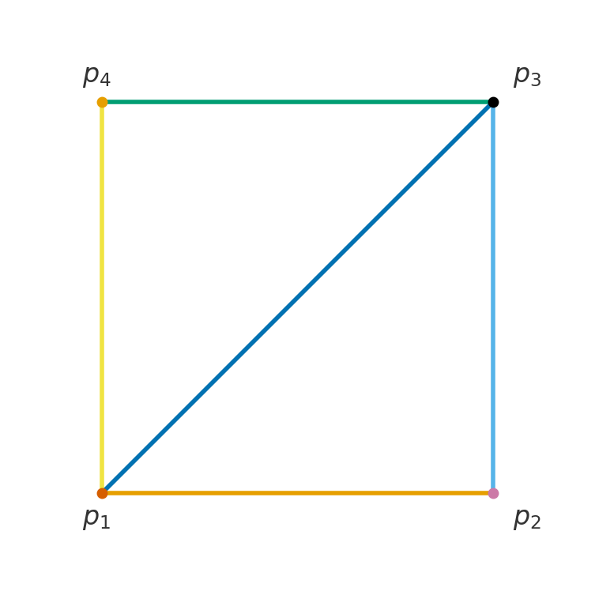

\maketitle

# מטריצות {#ch:matrices}

בפרק הקודם ראינו מטריצות מקדמים בהקשר של ממ\"ל (מצומצמות או מורחבות). אבל הרעיון של מטריצה הוא כללי יותר, ולא תמיד חייב להיות קשר לממ\"ל. מטריצה אינה אלא טבלה של מספרים, וטבלה כזו יכולה לייצג כל מיני דברים.

::: example
`\label{ex:bus}`{=latex} נניח שאנחנו רוצים לחשב את מספר האוטובוסים (של חברה מסוימת) שעוברים בין אילת, באר שבע ות\"א ביום ראשון. לצורך הדוגמה, לכל אוטובוס אין תחנות ביניים - רק תחנת יציאה ותחנת הגעה. אז אפשר להכין מטריצה מסדר $3\times 3$ שבה כל שורה תציין תחנת יציאה, וכל עמודה תציין תחנת הגעה. נשתמש בסימונים $E, B, T$ לת\"א, באר שבע ואילת בהתאמה כדי שיהיה ברור איזו עמודה/שורה מתאימה לאיזו עיר (סימונים אלה אינם איברים במטריצה). אז לפי הנתונים מקבלים מטריצה כזו:

$$\left(
\begin{array}{c|ccc}
 & E & B & T \\ \hline
E & 0 & 10 & 5 \\
B & 8 & 0 & 12 \\
T & 4 & 6 & 0
\end{array}
\right)$$

משמעות המטריצה היא שאין אוטובוס מאף תחנה לעצמה. יש עשרה אוטובוסים שיוצאים מאילת לבאר שבע, ויש שמונה אוטובוסים שעושים את המסלול ההפוך. וכן הלאה. נוותר על הסימונים של הערים ונכתוב את המטריצה בצורה הרגילה, ונסמנה ע\"י $S$:

$$S=\left(
\begin{array}{ccc}
0 & 10 & 5 \\
8 & 0 & 12 \\
4 & 6 & 0
\end{array}
\right)$$

זו המטריצה עבור הנתונים של יום ראשון. עכשיו נניח שיש נתונים שונים ליום שני, ונכין מטריצה חדשה עבורם:

$$M=\left(
\begin{array}{ccc}
0 & 12 & 7 \\
11 & 0 & 10 \\
3 & 8 & 0
\end{array}
\right)$$

כעת אפשר לשאול כמה אוטובוסים יש לכל מסלול בשני הימים יחד. אז צריך לעשות חיבור בכל רכיב של המטריצה (שמתאים למסלול עם נקודת יציאה ונקודת הגעה) לחוד. אפשר לכתוב מטריצה חדשה שאיבריה יהיו סכומי האיברים של המטריצות $S,M$ לפי כל רכיב לחוד. זה מתבקש לקרוא למטריצה החדשה $S+M$ בדומה לחיבור וקטורי. כך נקבל:

$$S+M=\left(
\begin{array}{ccc}
0+0 & 10+12 & 5+7 \\
8+11 & 0+0 & 12+10 \\
4+3 & 6+8 & 0+0
\end{array}
\right)
=\left(
\begin{array}{ccc}
0+0 & 22 & 12 \\
19 & 0 & 22 \\
7 & 14 & 0
\end{array}
\right)$$

בפרט, משמעות המטריצה לעיל היא שאין אוטובוס מאף תחנה לעצמה באף יום. יש $22$ אוטובסים שיוצאים מאילת לבאר שבע ביומיים של ראשון ושני, ו- $19$ שעושים את המסלול ההפוך ביומיים האלה. וכן הלאה.
:::

::: definition
נגדיר את קבוצת כל המטריצות מסדר $m\times n$ מעל $\mathbb{F}$ (כאשר $\mathbb{F}=\mathbb{R}$ או $\mathbb{F}=\mathbb{C}$ ) ע\"י

$$.\mathbb{M}_{m\times n}(\mathbb{F})=\Set{\begin{pmatrix}a_{11} & a_{12} & \cdots & a_{1n}\\
a_{21} & a_{22} & \cdots & a_{2n}\\
\vdots & \vdots & \ddots & \vdots\\
a_{m1} & a_{m2} & \cdots & a_{mn}
\end{pmatrix}|\forall 1\leq i\leq m \quad \forall 1\leq j\leq n \quad a_{ij}\in \mathbb{F}}$$
:::

::: remark
הסימן $\forall$ פירושו \"לכל\". אז התנאי המתמטי בהגדרת $\mathbb{M}_{m\times n}(\mathbb{F})$ אומר שכל איבר $a_{ij}$ במטריצה שייך לקבוצה $\mathbb{F}$, כי עוברים על כל האיברים בכל השורות ובכל העמודות.
:::

::: example
 

1.  מתקיים $$.A=\begin{pmatrix} 10 & 9 & 1 & -7\\
    1 & 2 & 3 & 4\\
    0 & 4 & -3 & -5
    \end{pmatrix}\in\mathbb{M}_{3\times 4}(\mathbb{R})$$

2.  מתקיים $$.B=\begin{pmatrix} i & 1 \\
    1 & 1+i\\
    0 & 2i 
    \end{pmatrix}\in\mathbb{M}_{3\times 2}(\mathbb{C})$$

    ::: remark
    לכל $m,n\in\mathbb{N}$ מתקיים $\mathbb{M}_{m\times n}(\mathbb{R})\subseteq \mathbb{M}_{m\times n}(\mathbb{C})$ כי $\mathbb{R}\subseteq\mathbb{C}$. אז למעשה כל המטריצות בקורס הן מעל $\mathbb{C}$, אבל אם לדייק רובן (לא כולן) יהיו מעל $\mathbb{R}$. השימוש בסימון $\mathbb{F}$ נועד לרוב הטענות, שנכונות גם מעל $\mathbb{R}$ וגם מעל $\mathbb{C}$. בתחום של אלגברה לינארית אפשר גם לעסוק בקבוצות מספרים נוספות שנקראות שדות ,(fields) ומכאן הסיבה לאות $\mathbb{F}$. אבל בקורס שלנו נסתפק ב- $\mathbb{R},\mathbb{C}$ (השדות החשובים ביותר).
    :::
:::

## פעולות על מטריצות

### חיבור וכפל בסקלר

ראינו בדוגמה `\ref{ex:bus}`{=latex} שיש טעם בהגדרת פעולת חיבור בין מטריצות, בדיוק כמו חיבור וקטורי (עושים חיבור בכל קוארדינטה/רכיב לחוד). קודם כל נכליל חיבור וקטורי וכפל בסקלר (שהגדרנו בפרק `\ref{ch:geometry}`{=latex} במישור ובמרחב) ל- $\mathbb{F}^n$.

::: definition
עבור וקטורים $ה=(a_1,...,a_n)\in\mathbb{F}^n,w=(b_1,...,b_n)\in\mathbb{F}^n$ וסקלר $c\in\mathbb{F}$ נגדיר את הפעולות הבאות:

1.  פעולת החיבור: $$v+w=(a_1+b_1,...,a_n+b_n)$$

2.  פעולת כפל בסקלר: $$c \cdot v=(c\cdot a_1,\dots,c\cdot a_n)$$
:::

::: definition
עבור $A,B\in\mathbb{M}_{m\times n}(\mathbb{F})$ וסקלר $c\in\mathbb{F}$ נגדיר את הפעולות הבאות:

1.  פעולת החיבור: $$\begin{aligned}
    A+B&=\begin{pmatrix}a_{11} & \cdots & a_{1n}\\
    a_{21} & \cdots & a_{2n}\\
    \vdots  & \ddots & \vdots\\
    a_{m1}  & \cdots & a_{mn}
    \end{pmatrix}+\begin{pmatrix}b_{11} & \cdots & b_{1n}\\
    b_{21} & \cdots & b_{2n}\\
    \vdots & \ddots & \vdots\\
    b_{m1} & \cdots & b_{mn}
    \end{pmatrix}\\
    &=\begin{pmatrix}a_{11}+b_{11} & \cdots & a_{1n}+b_{1n} \\ a_{21}+b_{21} & \cdots & a_{2n}+b_{2n}\\
    \vdots & \ddots & \vdots\\
    a_{m1}+b_{m1} & \cdots & a_{mn}+b_{mn}
    \end{pmatrix}
    \end{aligned}$$

2.  פעולת כפל בסקלר: $$c A=\begin{pmatrix}ca_{11} & ca_{12} & \cdots & ca_{1n}\\
    ca_{21} & ca_{22} & \cdots & ca_{2n}\\
    \vdots & \vdots & \ddots & \vdots\\
    ca_{m1} & ca_{m2} & \cdots & ca_{mn}
    \end{pmatrix}$$

    בפרט, נגדיר $-A=(-1)\cdot A$ ובהתאמה $B-A=B+(-1)\cdot A$.
:::

::: example

1.  חיבור של מטריצות מסדר $2\times 2$ מעל $\mathbb{R}$: $$\begin{aligned}
    &\begin{pmatrix} 3 & 7 \\
    5 & -2 
    \end{pmatrix}+\begin{pmatrix} -10 & 5 \\
    -4 & -3 
    \end{pmatrix}\\
    &=\begin{pmatrix} 3-10 & 7+5 \\
    5-4 & -2-3 
    \end{pmatrix}=\begin{pmatrix} -7 & 12 \\
    1 & -5 
    \end{pmatrix}
    \end{aligned}$$

2.  חיבור של מטריצות מסדר $3\times 4$ מעל $\mathbb{R}$: $$\begin{aligned}
    &\begin{pmatrix} 10 & 9 & 1 & -7\\
    1 & 2 & 3 & 4\\
    0 & 4 & -3 & -5
    \end{pmatrix}+\begin{pmatrix} 3 & -2 & 0 & 6\\
    5 & -2 & 4 & -4\\
    10 & -6 & 3 & 1
    \end{pmatrix}\\
    &=\begin{pmatrix} 10+3 & 9-2 & 1+0 & -7+6\\
    1+5 & 2-2 & 3+4 & 4-4\\
    0+10 & 4-6 & -3+3 & -5+1
    \end{pmatrix}\\
    &=\begin{pmatrix} 13 & 7 & 1 & -1\\
    6 & 0 & 7 & 0\\
    10 & -2 & 0 & -4
    \end{pmatrix}
    \end{aligned}$$

3.  חיבור של מטריצות מסדר $2\times 2$ מעל $\mathbb{C}$: אם

    $$A = \begin{pmatrix} 1 & i \\
    2-3i & 3-2i 
    \end{pmatrix},\quad  B = \begin{pmatrix} 7-5i & 2+7i \\
    -6 & 3+10i 
    \end{pmatrix}$$

    אז $$\begin{aligned}
    A+B&=\begin{pmatrix} 1+7-5i & i+2+7i \\
    2-3i-6 & 3-2i+3+10i 
    \end{pmatrix}=\begin{pmatrix} 8-5i & 2+8i \\
    -4-3i & 6+8i 
    \end{pmatrix}
    \end{aligned}$$
:::

::: definition
`\label{remark:entry-formula}`{=latex} יש דרך מקוצרת לכתיבת חיבור. במקום לכתוב את החיבור בכל רכיב, נסתכל על האיבר הכללי של כל מטריצה. נסמן את האיבר בשורה ה- $i$ ובעמודה ה- $j$ ע\"י $(P)_{ij}$ לכל $P\in\mathbb{M}_{m\times n}(\mathbb{F})$. אז למעשה הגדרנו לכל $1\leq i \leq m$ ולכל $1\leq j\leq n$: $$(A+B)_{ij}=(A)_{ij}+(B)_{ij}$$

$$(c A)_{ij}=c(A)_{ij}$$
:::

למשל, בדוגמה האחרונה היה לנו $(A)_{12} = i, (B)_{21} = -6, (A+B)_{22}=6+8i$.

::: remark
שימו לב שהחיבור מוגדר רק למטריצות מאותו הסדר (כנ\"ל לוקטורים - רק אם הם שווי אורך). גם הסדר של מטריצת הסכום שווה לסדר המשותף של המטריצות.
:::

::: example
החיבור הבא אינו מוגדר: $$\begin{pmatrix} 3 & 7 \\
5 & -2 
\end{pmatrix}+\begin{pmatrix} -10 & 5 &0\\
-4 & -3 &0
\end{pmatrix}$$

המטריצה השמאלית היא מסדר $2\times 2$ והימנית היא מסדר $2\times 3$.
:::

::: example
**דוגמה 1.12** (דוגמאות נוספות).  

1.  כפל בסקלר של מטריצה מסדר $3\times 3$ מעל $\mathbb{C}$: $$\begin{aligned}
    &i\begin{pmatrix} 1 & i & 1+i \\ 
    1-i & 2i & 3 \\
    2+3i & 3-2i & 5
    \end{pmatrix}=\begin{pmatrix} i\cdot1 & i\cdot i & i(1+i) \\ 
    i(1-i) & i\cdot 2i & i\cdot3 \\
    i(2+3i) & i(3-2i) & i\cdot5
    \end{pmatrix}\\
    &=\begin{pmatrix}i & -1 & -1+i \\ 
    1+i & -2 & 3i \\
    -3+2i & 2+3i & 5i
    \end{pmatrix}
    \end{aligned}$$

2.  שילוב של כפל בסקלר וחיבור מטריצות מסדר $2\times 2$ מעל $\mathbb{R}$: $$\begin{aligned}
    &2 \begin{pmatrix} 11 & 2 \\
    -2 & 4 
    \end{pmatrix}+3\begin{pmatrix} -4 & 5 \\
    6 & -3 
    \end{pmatrix}=\begin{pmatrix} 22 & 4 \\
    -4 & 8 
    \end{pmatrix}+\begin{pmatrix} -12 & 15 \\
    18 & -9 
    \end{pmatrix}\\
    &=\begin{pmatrix} 22-12 & 4+15 \\
    -4+18 & 8-9 
    \end{pmatrix}
    \end{aligned}$$
:::

::: definition
לכל $m,n\in\mathbb{N}$ נגדיר את מטריצת האפס מסדר $m\times n$ כמטריצה שכל איבריה הם $0$: $$.\mathbf{0}_{m\times n}=\begin{pmatrix}0 &0 &\cdots &0 \\
0 &0 &\cdots &0 \\
\vdots & \vdots &\ddots &\vdots\\
0 &0 &\cdots &0
\end{pmatrix}$$
:::

::: proposition
 *יהיו $A,B,C\in\mathbb{M}_{m\times n}(\mathbb{F})$ ו- $\alpha,\beta\in\mathbb{F}$. אז מתקיימים הכללים הבאים:*

1.  *חוק החילוף (קומוטטיביות): $$A+B=B+A$$*

2.  *חוק הקיבוץ (אסוציאטיביות): $$(A+B)+C=A+(B+C)$$*

3.  *חוק הקיבוץ לכפל בסקלר: $$(\alpha\beta)A=\alpha(\beta A)$$*

4.  *חוק הפילוג (דיסטריביוטיביות): $$\alpha(A+B)=\alpha A+\alpha B$$*

5.  *ניטרליות היחידה: $$1\cdot A=A$$*

6.  *$$0\cdot A=\mathbf{0}_{m\times n}$$*

7.  *ניטרליות מטריצת האפס: $$A+\mathbf{0}_{m\times n}=A$$*

8.  *$$A-A=0$$*
:::

::: proof
** כל התכונות עוברות בירושה מחיבור וכפל ב- $\mathbb{F}$ (מדובר בתכונות מוכרות של $\mathbb{R}$ וראינו בפרק `\ref{ch:complex}`{=latex} שהן עוברות בירושה ל- $\mathbb{C}$). נוכיח למשל את חוק הפילוג: נתמקד באיבר הכללי של כל מטריצה בשוויון שצריך להוכיח. לכל $1\leq i\leq m, 1\leq j\leq n$ מתקיים

$$.(\alpha(A+B))_{ij}=\alpha(A+B)_{ij}=\alpha((A)_{ij}+(B)_{ij})=\alpha (A)_{ij}+\alpha (B)_{ij}$$ שימו לב שהמעבר האחרון נכון לפי חוק הפילוג ב-$\mathbb{F}$. לכן נובע כי $$.\alpha(A+B)=\alpha A+\beta A$$

נוכיח גם את ניטרליות מטריצת האפס: $$(A+\mathbf{0}_{m\times n})_{ij}=(A)_{ij}+(\mathbf{0}_{m\times n})_{ij}=(A)_{ij}+0=(A)_{ij}$$ לכל $1\leq i\leq m, 1\leq j\leq n$, ולכן $$,A+\mathbf{0}_{m\times n}=A$$

ההוכחות של שאר הסעיפים דומות, כאשר הרעיון הכללי הוא שימוש ב- `\ref{remark:entry-formula}`{=latex} והתכונות המתאימות של חיבור/כפל ב- $\mathbb{F}$. ◻
:::

::: exercise
הוכיחו את חוק הקיבוץ לכפל בסקלר.
:::

::: {.callout-note collapse="true" title="פתרון"}
. עבור חוק הקיבוץ: לכל $1\leq i\leq m, 1\leq j\leq n$ מתקיים

$$.((A+B)+C)_{ij}=(A+B)_{ij}+(C)_{ij}=((A)_{ij}+(B)_{ij})+(C)_{ij}$$

באופן דומה, מתקיים $$.(A+(B+C))_{ij}=A_{ij}+(B+C)_{ij}=(A)_{ij}+((B)_{ij}+(C)_{ij})$$

שני הביטויים באגף ימין של שתי המשוואות שווים לפי חוק הקיבוץ ב- $\mathbb{F}$. לכן $$.(A+B)+C=A+(B+C)$$
:::

### כפל מטריצה בוקטור עמודה

בפרק הקודם דיברנו על ממ\"ל מהצורה $Ax=b$ כאשר

$$
A = \begin{pmatrix}
a_{11} & \cdots & a_{1n} \\
a_{21} & \cdots & a_{2n} \\
\vdots & \ddots & \vdots \\
a_{m1} & \cdots & a_{mn}
\end{pmatrix}
$$

היא מטריצת המקדמים המצומצמת,
$x=\begin{pmatrix}
x_1\\
x_2\\
\vdots\\
x_n
\end{pmatrix}$ הוא וקטור המשתנים ו-
$b=\begin{pmatrix}
b_1\\
b_2\\
\vdots\\
b_m
\end{pmatrix}$ הוא וקטור הקבועים. נרצה להגדיר באופן מדויק את פעולת הכפל $Ax$ של מטריצה $A\in\mathbb{M}_{m\times n}(\mathbb{F})$ בוקטור עמודה $x\in\mathbb{F}^n$ שמספר שורותיו שווה למספר העמודות של המטריצה.

לפני כן, נגדיר את סימון $\Sigma$ לסכימה (שאולי כבר מוכר).

::: definition
בהינתן $a_1,a_2,...,a_n\in\mathbb{F}$ נסמן את סכומם בעזרת כתיבה עם $\Sigma$ ואינדקס $l$.

$$.\sum_{l=1}^n a_l=a_1+a_2+a_3+\cdots+a_n$$

האינדקס $l$ רץ על פני הקבוצה $\Set{1,2,3,\cdots,n}$ וכל הצבה תורמת איבר לסכום.
:::

::: example
במקרה $a_l=l$ נקבל $$\sum_{l=1}^{5} l=1+2+3+4+5=15$$
:::

::: definition
בהינתן $A\in\mathbb{M}_{m\times n}(\mathbb{F})$ ו- $$,x=\begin{pmatrix}
x_1\\
x_2\\
\vdots \\
x_n
\end{pmatrix}\in\mathbb{F}^n$$ נגדיר את המכפלה $$Ax=\begin{pmatrix}
y_1\\
y_2\\
\vdots \\
y_m
\end{pmatrix}\in\mathbb{F}^m$$ עם קוארדינטות הנתונות ע\"י $$y_i=\sum_{j=1}^n (A)_{ij}x_j$$ לכל $1\leq i\leq m$. נסמן $y_i=(Ax)_i$ עבור הקוארדינטות.
:::

::: remark
לפי הגדרה זו, לכל $1\leq i\leq m$ מתקיים $$.(Ax)_i=b_i \iff \sum_{j=1}^n (A)_{ij}x_j=b_i$$

לכן, השוויון הוקטורי $Ax=b$ אכן שקול לממ\"ל.
:::

::: remark
למעשה יש זיהוי בין $\mathbb{M}_{1\times n}(\mathbb{F})$ לבין $\mathbb{F}^n$, לפי הגדרה `\ref{def:F^n}`{=latex} שהתייחסה לוקטורי שורה. אבל נרשה לעצמנו להשתמש בסימון $\mathbb{F}^n$ גם עבור וקטורי עמודה באורך $n$, כלומר עבור הקבוצה $\mathbb{M}_{n\times 1}(\mathbb{F})$. לפעמים ההבדל בין וקטור שורה לוקטור עמודה הוא אסתטי בלבד, אבל כאשר מכפילים מטריצה בוקטור בהחלט יש חשיבות לסוג הוקטור (הוא צריך להיות וקטור עמודה). אז ככלל נזכור לשים לב להבדל כאשר מופיעה מכפלה של מטריצה בוקטור, ובשאר המקרים אפשר לכתוב את הוקטור כשורה או עמודה לפי טעם אישי.
:::

::: example
 

1.  ניקח $$A = \begin{pmatrix}
    2 & -1 \\
    3 & 4
    \end{pmatrix}, \quad 
    x = \begin{pmatrix}
    1 \\
    5
    \end{pmatrix}$$ ונקבל $$.\begin{pmatrix}
    2 & -1 \\
    3 & 4
    \end{pmatrix}
    \begin{pmatrix}
    1 \\
    5
    \end{pmatrix}
    =
    \begin{pmatrix}
    2\cdot1 + (-1)5 \\
    3\cdot1 + 4\cdot5
    \end{pmatrix}
    =
    \begin{pmatrix}
    -3 \\
    23
    \end{pmatrix}$$

2.  $$\begin{pmatrix}a_1 &b_1 &c_1\end{pmatrix}\begin{pmatrix}a_2 \\ b_2 \\ c_2\end{pmatrix}=a_1a_2+b_1b_2+c_1c_2$$

    לכל $a_1,b_1,c_1,a_2,b_2,c_2\in\mathbb{F}$. במקרה של $\mathbb{F}=\mathbb{R}$ מדובר על המכפלה הסקלרית של $$.\begin{pmatrix}a_1 \\ b_1 \\ c_1\end{pmatrix},\begin{pmatrix}a_2 \\ b_2 \\ c_2\end{pmatrix}\in\mathbb{R}^3$$

3.  $$\begin{pmatrix}
    1 & 0 & 2 \\
    -2 & 3 & 1 \\
    4 & -1 & 0
    \end{pmatrix}
    \begin{pmatrix}
    3 \\
    2 \\
    -1
    \end{pmatrix}
    =
    \begin{pmatrix}
    1\cdot3 + 0\cdot2 + 2(-1) \\
    -2\cdot3 + 3\cdot 2 + 1(-1) \\
    4\cdot3 + (-1)2 + 0(-1)
    \end{pmatrix}
    =
    \begin{pmatrix}
    1 \\
    -1 \\
    10
    \end{pmatrix}$$

4.  $$\begin{pmatrix}
    1+i & 2 \\
    3i & 4-i
    \end{pmatrix}\begin{pmatrix}
    2 \\
    1-i
    \end{pmatrix}=\begin{pmatrix}
    (1+i)2 + 2(1-i) \\
    (3i)2 + (4-i)(1-i)
    \end{pmatrix}
    =
    \begin{pmatrix}
    4 \\
    3 + i
    \end{pmatrix}$$
:::

::: exercise
חשבו את $Av$ עבור $$.A = \begin{pmatrix}
1 & i & 2 \\
-1 & 3i & 0 \\
2+i & 1 & -i
\end{pmatrix}, \quad 
v = \begin{pmatrix}
1+i \\
2 \\
-1
\end{pmatrix}$$
:::

::: {.callout-note collapse="true" title="פתרון"}
$$Ax=\begin{pmatrix}
1(1+i) + i\cdot 2 + 2(-1) \\
(-1)(1+i) + 3i\cdot2 + 0(-1) \\
(2+i)(1+i) + 1\cdot2 + (-i)(-1)
\end{pmatrix}
=
\begin{pmatrix}
1+i + 2i - 2 \\
-1 - i + 6i \\
1+3i+2+i
\end{pmatrix}
=
\begin{pmatrix}
-1 + 3i \\
-1 + 5i \\
3+4i
\end{pmatrix}$$
:::

::: proposition
 *`\label{prop:matrix-vector}`{=latex} יהיו $A,B\in\mathbb{M}_{m\times n}(\mathbb{F})$, $v,w\in\mathbb{F}^n$ ו- $\alpha\in\mathbb{F}$.*

1.  *$$A(v+w)=Av+Aw$$*

2.  *$$(A+B)v=Av+Bv$$*

3.  *$$A(\alpha v)=\alpha(Av)$$*
:::

::: proof
** בכל סעיף נראה שוויון בין הקוארדינטות ה- $i$ של שני האגפים, לכל $1\leq i\leq m$. ראשית נסמן $$.v=\begin{pmatrix}
 v_1 \\
 v_2 \\
 \vdots \\
 v_n
 \end{pmatrix}, \quad 
 w=\begin{pmatrix}
 w_1 \\
 w_2 \\
 \vdots \\
 w_n 
 \end{pmatrix}$$

1.  $$(A(v+w))_i=\sum_{j=1}^n (A)_{ij}(v+w)_j=\sum_{j=1}^n (A)_{ij}v_j+\sum_{j=1}^n (A)_{ij}w_j=(Av)_i+(Aw)_i$$ בשביל השוויון השני השתמשנו בחוק הפילוג ב- $\mathbb{F}$, וגם פיצלנו את הסכום לפי חוק החילוף (אין חשיבות לסדר הסכימה).

2.  $$\begin{aligned}
    ((A+B)v)_i&=\sum_{j=1}^n ((A)_{ij}+(B)_{ij})v_j=\sum_{j=1}^n (A)_{ij}v_j+\sum_{j=1}^n (B)_{ij}v_j\\
    &=(Av)_i+(Bv)_i=(Av+Bv)_i
    \end{aligned}$$

3.  $$(A(\alpha v))_i=\sum_{j=1}^n (A)_{ij}(\alpha v_j)=\alpha\sum_{j=1}^n (A)_{ij}v_j=\alpha(Av)_i=(\alpha Av)_i$$ בשוויון השני השתמשנו בחוק הפילוג ב- $\mathbb{F}$, לפיו אפשר להוציא גורם משותף מחוץ לסכימה.

 ◻
:::

בהינתן מטריצה $A$, אפשר לחשוב על הכפל $Av$ כפעולה על $v$. זהו רעיון שנחזור אליו בהמשך הקורס, אבל כבר ניתן להתרשם מהפעולה הזו באופן גיאומטרי, למשל עבור $$.A=\begin{pmatrix}
1 & 1 \\
0 & -2
\end{pmatrix}$$

אפשר לצייר רשת במרחב המקור (עבור $v$) בהתאם לוקטורים $$\begin{pmatrix}1 \\
0 
\end{pmatrix}, \begin{pmatrix}0 \\
1
\end{pmatrix}$$ ולראות איזו רשת נוצרת במרחב התמונה (עבור $Av$):

::: {#fig:MatrixGrid .figure}
{width=720 height=720}
<figcaption>הכפל במטריצה משפיע על שני הוקטורים באופן שונה, אבל כל ריבוע במרחב המקור הופך למקבילית במרחב התמונה</figcaption>
:::

במקום רשת של ריבועים, אפשר להסתכל על מעגלים סביב הראשית ולראות איזה מסלול מתאים לכל מעגל במרחב התמונה:

::: {#fig:MatrixCircle .figure}
{width=720 height=720}
<figcaption>כל מעגל במרחב המקור נשלח לאליפסה במרחב התמונה, ומתיחה של המעגל מתאימה למתיחה של האליפסה</figcaption>
:::

::: proposition
 *תהי $Ax=0$ ממ\"ל הומוגנית.*

1.  *קבוצת הפתרונות סגורה לחיבור, כלומר לכל שני פתרונות $v,w\in\mathbb{F}^n$ גם $v+w$ הוא פתרון.*

2.  *קבוצת הפתרונות סגורה לכפל בסקלר, כלומר לכל פתרון $v\in\mathbb{F}^n$ ולכל $\alpha\in\mathbb{F}$ גם $\alpha v$ הוא פתרון.*
:::

::: proof
** יהיו $v,w\in\mathbb{F}^n$ פתרונות של הממ\"ל.

1.  לפי טענה `\ref{prop:matrix-vector}`{=latex} מתקיים $$.A(v+w)=Av+Aw=0+0=0$$ כלומר $v+w$ הוא פתרון של הממ\"ל.

2.  שוב, לפי טענה `\ref{prop:matrix-vector}`{=latex} לכל $\alpha\in\mathbb{F}$ מתקיים

    $$.A(\alpha v)=\alpha Av=\alpha\cdot 0=0$$ כלומר $\alpha v$ הוא פתרון של הממ\"ל.

:::

::: proposition
 *תהי $Ax=b$ ממ\"ל לא הומוגנית. נניח שקיים לה פתרון (לא בהכרח יחיד) $v_0\in\mathbb{F}^n$. אז מתקיים הקשר הבא בין קבוצת הפתרונות של הממ\"ל הלא הומוגנית לקבוצת הפתרונות של הממ\"ל ההומוגנית $Ax=0$:*

*$$.\Set{x\in\mathbb{F}^n|Ax=b}=\Set{v_0+y|y\in\mathbb{F}^n,Ay=0}$$*
:::

::: remark
הרעיון הזה כבר מוכר לנו מההצגה הפרמטרית של ישר/מישור. למשל, ראינו שלישר במישור יש הצגה פרמטרית מהצורה $$\Set{\begin{pmatrix}
x_0 \\
y_0 
\end{pmatrix}+t\begin{pmatrix}
\alpha \\
\beta
\end{pmatrix}|t\in\mathbb{R}}$$ כאשר $\begin{pmatrix}
\alpha \\
\beta
\end{pmatrix}\in\mathbb{R}^2$ הוא וקטור כיוון (בפרק `\ref{ch:geometry}`{=latex} השתמשנו בוקטורי שורה, אבל בהקשר של כפל צריך לקחת וקטורי עמודה). אם הישר מתאר קבוצת פתרונות של ממ\"ל $\begin{pmatrix}a_1 &a_2\end{pmatrix}\begin{pmatrix}
x \\
y 
\end{pmatrix}=b$, אז וקטור הכיוון הוא פתרון של הממ\"ל ההומוגנית. כלומר מתקיים $\begin{pmatrix}a_1 &a_2\end{pmatrix}\begin{pmatrix}
\alpha \\
\beta
\end{pmatrix}=0$, או באופן שקול $a_1\alpha+a_2\beta=0$. יותר מכך, קבוצת הפתרונות של הממ\"ל ההומוגנית היא קבוצת הכפולות בסקלר של וקטור הכיוון.
:::

נוכיח את הטענה:

::: proof
נוכיח שוויון בין שתי הקבוצות ע\"י הכלה דו-כיוונית.

הכיוון $\supseteq$: יהי $y\in\mathbb{F}^n$ כך ש- $Ay=0$. אז מתקיים $$,A(v_0+y)=Av_0+Ay=b+0=b$$ ולכן $v_0+y\in\Set{x\in\mathbb{F}^n|Ax=b}$.

הכיוון $\subseteq$: יהי $x\in\mathbb{F}^n$ כך ש- $Ax=b$. אז מתקיים $x=v_0+y$ עבור $y=x-v_0$. נבדוק ש-$y$ הוא פתרון של הממ\"ל ההומוגנית:

$$.Ay=A(x-v_0)=Ax-Av_0=b-b=0$$

לכן

$$.x=v_0+y\in\Set{x_0+y|y\in\mathbb{F}^n,Ay=0}$$ ◻
:::

### כפל מטריצות

::: definition
בהינתן $A\in\mathbb{M}_{m\times k}(\mathbb{F}),B\in\mathbb{M}_{k\times n}(\mathbb{F})$ נגדיר את מטריצת הכפל $AB$ ע\"י $$(AB)_{ij}=\sum_{l=1}^k (A)_{il}(B)_{lj}=(A)_{i1}(B)_{1j}+(A)_{i2}(B)_{2j}+...+(A)_{ik}(B)_{kj}$$ לכל $1\leq i\leq m, 1\leq j\leq n$.
:::

::: remark
שימו לב שכפל בין מטריצות מוגדר רק כאשר מספר העמודות של המטריצה השמאלית שווה למספר השורות של המטריצה הימנית, וסימנו את מספר זה ע\"י $k$. זה אומר שבהרבה מקרים פעולת הכפל אינה מוגדרת, למשל כאשר $A,B$ שתיהן מסדר $2\times 3$.
:::

::: example
 

1.  עבור $A=\begin{pmatrix}
    2 & 3 \\
    1 & 4
    \end{pmatrix},B=
    \begin{pmatrix}
    5 & 6 \\
    7 & 8
    \end{pmatrix}$ נקבל $$AB=\begin{pmatrix}
    2\cdot5 + 3\cdot7 & 2\cdot6 + 3\cdot8 \\
    1\cdot5 + 4\cdot7 & 1\cdot6 + 4\cdot8
    \end{pmatrix}
    =
    \begin{pmatrix}
    31 & 36 \\
    33 & 38
    \end{pmatrix}$$

    לעומת זאת, אם נחשב את המכפלה בסדר הפוך נקבל

    $$BA=\begin{pmatrix}
    5 & 6 \\
    7 & 8
    \end{pmatrix}\begin{pmatrix}
    2 & 3 \\
    1 & 4
    \end{pmatrix}
    =
    \begin{pmatrix}
    5\cdot2+6\cdot1 & 5\cdot3+6\cdot4 \\
    7\cdot2+8\cdot1 & 7\cdot3+8\cdot4
    \end{pmatrix}
    =
    \begin{pmatrix}
    16 & 39 \\
    22 & 53
    \end{pmatrix}$$ אז במקרה זה $AB\neq BA$.

2.  עבור $C=\begin{pmatrix}
    1 & 2 & 3 \\
    4 & 5 & 6
    \end{pmatrix},\quad D=
    \begin{pmatrix}
    1 & 0 & 2 \\
    -1 & 3 & 1 \\
    0 & 4 & 5
    \end{pmatrix}$ נקבל $$\begin{aligned}
    CD&=
    \begin{pmatrix}
    1\cdot1 + 2(-1) + 3\cdot0 & 1\cdot0 + 2\cdot3 + 3\cdot4 & 1\cdot2 + 2\cdot 1 + 3\cdot5 \\
    4\cdot1 + 5(-1) + 6\cdot0 & 4\cdot0 + 5\cdot3 + 6\cdot4 & 4\cdot2 + 5\cdot1 + 6\cdot5
    \end{pmatrix}\\
    &=
    \begin{pmatrix}
    -1 & 18 & 19 \\
    -1 & 39 & 43
    \end{pmatrix}
    \end{aligned}$$

3.  עבור $E=\begin{pmatrix}
    1+i & 2 \\
    3 & 4-i
    \end{pmatrix}, \quad
    F=\begin{pmatrix}
    2 & i \\
    1-i & 3
    \end{pmatrix}$ נקבל $$\begin{aligned}
    EF&=\begin{pmatrix}
    (1+i)2 + 2(1-i) & (1+i)i + 2\cdot3 \\
    3\cdot2 + (4-i)(1-i) & 3\cdot i + (4-i)3
    \end{pmatrix}\\
    &=
    \begin{pmatrix}
    2+2i + 2 - 2i & i - 1 + 6 \\
    6 + 4 - 4i - i - 1 & 3i + 12 - 3i
    \end{pmatrix}=
    \begin{pmatrix}
    4 & 5 + i \\
    9 - 5i & 12
    \end{pmatrix}
    \end{aligned}$$

4.  המכפלה $$\begin{pmatrix}
    2 &3 &1 \\
    0 &-1 &-2
    \end{pmatrix}
    \begin{pmatrix}
    10 &-5 \\
    3 &-1 
    \end{pmatrix}$$

    אינה מוגדרת, כי מספר העמודות של המטריצה השמאלית $(3)$ שונה ממספר השורות של המטריצה הימנית $(2)$.

5.  נסתכל על דוגמה שיש לה קשר לתורת הגרפים (שחורגת מהקורס). גרף הוא קבוצת קודקודים שחלקם מחוברים ביניהם ע\"י צלעות. לדוגמה:

    <figure id="fig:Adjacency">
    
    <figcaption>ריבוע עם אחד מאלכסוניו</figcaption>
    </figure>

    ניתן לקודד את כל המידע הרלוונטי לגרף זה במטריצה $M$ (שנקראת מטריצת השכנויות). אם קיימת צלע בין $p_i$ ל- $p_j$, נכתוב $(M)_{ij}=1$. אם לא קיימת צלע ביניהם, נכתוב $(M)_{ij}=0$. כך נקבל $$.M =
    \begin{pmatrix}
    0 & 1 & 1 & 1 \\
    1 & 0 & 1 & 0 \\
    1 & 1 & 0 & 1 \\
    1 & 0 & 1 & 0
    \end{pmatrix}$$

    מה המשמעות של כפל? נחשב את $M^2=M\cdot M$ ונקבל $$.M^2 =
    \begin{pmatrix}
    3 & 1 & 2 & 1 \\
    1 & 2 & 1 & 2 \\
    2 & 1 & 3 & 1 \\
    1 & 2 & 1 & 2
    \end{pmatrix}$$

    אם המטריצה $M$ מתארת מספרי מסלולים באורך $1$, אז המטריצה $M^2$ מתארת מספרי מסלולים באורך $2$. למשל, בין $p_1$ לעצמו יש $3$ מסלולים באורך $2$, שהם: $$p_1\to p_2\to p_1, \quad p_1\to p_3\to p_1,\quad p_1\to p_4\to p_1$$

    זה מתאים לחישוב הבא:

    $$.(M^2)_{11}=\sum_{k=1}^4 (M)_{1k}(M)_{k1}=0\cdot0+1\cdot1+1\cdot1+1\cdot1=3$$

    כל מחובר $(M)_{1k}(M)_{k1}$ שתורם $1$ לסכום, מתאר מסלול $p_1\to p_k\to p_1$ עם תחנת ביניים $p_k$. לכן, הסכום מתאר את מספר המסלולים מ- $p_1$ לעצמו באורך $2$.

    ובהכללה: לכל $k\in\mathbb{N}$ אפשר לחשב את החזקה $M^k=\underbrace{M \cdot M \cdot \ldots \cdot M}_{\text{פעמים} \ k}$ ואז $(M^k)_{ij}$ שווה למספר המסלולים באורך $k$ מ- $p_i$ ל- $p_j$, כאשר אין הגבלה על תחנות הביניים (יכולה להיות חזרה על קודקוד אחד או יותר). רעיון זה תקף לכל גרף, והוא דוגמה טובה לשימוש של כפל מטריצות.
:::

::: remark
ראינו כי אין חוק חילוף למטריצות. בהרבה מקרים מתקיים $AB\neq BA$ גם אם שתי פעולות הכפל מוגדרות. לפעמים כן מתקיים $AB=BA$, ואז נאמר שהמטריצות $A,B$ מתחלפות. ניתקל במקרים כאלה בהמשך, אבל בינתיים חשוב להבין שרוב המטריצות אינן מתחלפות.
:::

::: exercise
חשבו את $AB$ עבור $$.A=\begin{pmatrix}
1 & -2 & 3 \\
-4 & 5 & -6
\end{pmatrix}, \quad
\begin{pmatrix}
3 & 2 & 1 \\
2 & 3 & 0 \\
3 & -1 & 7
\end{pmatrix}$$
:::

::: {.callout-note collapse="true" title="פתרון"}
 נחשב לפי ההגדרה:

$$AB=
\begin{pmatrix}
1 & -2 & 3 \\
-4 & 5 & -6
\end{pmatrix}
\begin{pmatrix}
3 & 2 & 1 \\
2 & 3 & 0 \\
3 & -1 & 7
\end{pmatrix}
=
\begin{pmatrix}
8 & -7 & 22 \\
-20 & 13 & -46
\end{pmatrix}$$
:::

::: proposition
 *`\label{prop:product-column}`{=latex} יהיו $A\in\mathbb{M}_{m\times k}(\mathbb{F}), B\in\mathbb{M}_{k\times n}(\mathbb{F})$. נניח שהעמודות של $B$ הם הוקטורים $v_1,v_2,...,v_n\in\mathbb{F}^k$. אז מתקיים*

*$$AB=A\begin{pmatrix}
| & | & & | \\
v_1 & v_2 & \cdots & v_n \\
| & | & & |
\end{pmatrix}=\begin{pmatrix}
| & | & & | \\
Av_1 & Av_2 & \cdots & Av_n \\
| & | & & |
\end{pmatrix}$$*

*כלומר התוצאה של כפל ב- $A$ משמאל הוא שכל וקטור עמודה מוכפל ב- $A$ לחוד.*
:::

::: proof
** ישירות לפי ההגדרות של כפל מטריצוות וכפל מטריצה בוקטור עמודה (שהוא מטריצה עם עמודה אחת). לכל $1\leq j\leq n$ נכתוב $(B)_{ij}=b_{ij}$, כלומר $$.v_j=\begin{pmatrix}b_{1j} \\ b_{2j} \\ \vdots \\ b_{kj}\end{pmatrix}$$

אז לפי הגדרות הכפל נובע כי

$$.(AB)_{ij}=\sum_{l=1}^k (A)_{il}(B)_{lj}=\sum_{l=1}^k A_{il}b_{lj}=(Av_j)_i$$

לכן וקטור העמודה ה- $j$ של $AB$ הוא אכן $Av_j$. ◻
:::

::: proposition
 *`\label{prop:matrix-multiplication}`{=latex} יהיו $A_1,A_2\in\mathbb{M}_{m\times n}(\mathbb{F})$, $B_1,B_2\in\mathbb{M}_{n\times p}(\mathbb{F})$, $C\in\mathbb{M}_{p\times q}(\mathbb{F})$ ו- $\alpha\in\mathbb{F}$. אז מתקיים*

1.  *$$(A_1+A_2)B_1=A_1B_1+A_2B_1$$*

2.  *$$A_1(B_1+B_2)=A_1B_1+A_1B_2$$*

3.  *$$A_1(B_1C)=(A_1B_1)C$$*

4.  *$$(\alpha A_1)B_1=\alpha(A_1B_1)=A_1(\alpha B_1)$$*

5.  *$$\mathbf{0}_{m\times n} B_1=\mathbf{0}_{m\times p}=A_1\mathbf{0}_{n\times p}$$*
:::

::: proof
** רוב הסעיפים נובעים משילוב בין טענה `\ref{prop:matrix-vector}`{=latex} לטענה `\ref{prop:product-column}`{=latex}. לכן נסתפק בהוכחת סעיף ג' (חוק הקיבוץ לכפל מטריצות), שהוא היוצא מן הכלל. נניח כי $$.(A_1)_{ik} = a_{ik}, \quad
(B_1)_{kl} = b_{kl}, \quad
(C)_{lj} = c_{lj}$$

אם כן:

$$(B_1C)_{kj} = \sum_{l=1}^{p} b_{kl} c_{lj},$$ ולכן $$\label{eq:associativity1}
.(A_1(B_1C))_{ij} = \sum_{k=1}^{n}a_{ik}(B_1C)_{kj}
             = \sum_{k=1}^{n} a_{ik} \left( \sum_{l=1}^{p} b_{kl} c_{lj} \right)
             = \sum_{k=1}^{n} \sum_{l=1}^{p}a_{ik}b_{kl}c_{lj}.$$

כעת נחשב את $((A_1B_1)C)_{ij}$: $$(A_1B_1)_{il} = \sum_{k=1}^{n}a_{ik}b_{kl},$$ ולכן $$\label{eq:associativity2}
.((A_1B_1)C)_{ij} = \sum_{l=1}^{p}(A_1B_1)_{il}c_{l j}
              = \sum_{l=1}^{p} \left( \sum_{k=1}^{n}a_{ik}b_{kl}\right) c_{l j}
              = \sum_{l=1}^{p}\sum_{k=1}^{n} a_{ik}b_{kl}c_{lj}.$$

נשים לב כי יש שוויון בין שני הביטויים בצד ימין של `\ref{eq:associativity1}`{=latex} ו- `\ref{eq:associativity2}`{=latex}, כי לפי חוק החילוף אין חשיבות לסדר הסכימה (אפשר לסכום קודם לפי $l$ או קודם לפי $k$ בלי לשנות את הסכום). לכן, לכל $i,j$ מתקיים $(A_1(B_1C))_{ij}=((A_1B_1)C)_{ij}$, ומכאן $$.A_1(B_1C)=(A_1B_1)C$$ ◻
:::

::: definition
מטריצת היחידה מסדר $n\times n$ (אפשר גם לומר מסדר $n$) מוגדרת להיות $$.I_n=I_{n\times n}=
\begin{pmatrix}
1 &0 &\cdots &0\\
0 &1 &\cdots &0\\
\vdots &\vdots &\ddots &\vdots\\
0 &0 &\cdots &1
\end{pmatrix}$$

זוהי המטריצה שבה כל איבר על האלכסון הראשי הוא $1$, וכל שאר האיברים הם $0$. או באופן מתמטי:

$$\begin{aligned}
\forall 1\leq i\leq n \quad (I_n)_{ii}=1 \\
\forall 1\leq i,j\leq n  \quad i\neq j \implies &(I_n)_{ij}=0
\end{aligned}$$
:::

::: example
 

1.  $$I_1=\begin{pmatrix}1\end{pmatrix}$$

    זהו בעצם הסקלר $1$, עם הבדל פורמלי של סוגריים.

2.  $$I_2=
    \begin{pmatrix}
    1 &0 \\
    0 &1
    \end{pmatrix}$$

3.  $$I_3=
    \begin{pmatrix}
    1 &0 &0 \\
    0 &1 &0 \\
    0 &0 &1
    \end{pmatrix}$$
:::

מטריצת היחידה (מכל סדר) משחקת את התפקיד של הסקלר $1$ במובן של ניטרליות ביחס לכפל. ליתר דיוק:

::: proposition
 *לכל $A\in\mathbb{M}_{m\times n}(\mathbb{F})$ מתקיים $AI_n=A=I_m A$.*
:::

::: proof
** לכל $1\leq i,j \leq n$ מתקיים

$$.(AI_n)_{ij}=\sum_{l=1}^n (A)_{il}(I_n)_{lj}$$

נשים לב כי לפי הגדרת מטריצת היחידה, מתקיים $(I)_{lj}=0$ לכל $l\neq j$. אז רק איבר אחד בסכום באגף ימין לא מתאפס, והוא מתאים להצבה $l=j$. לכן

$$.(AI_n)_{ij}=0+...+0+(A)_{ij}(I_n)_{jj}+0+...+0=(A)_{ij}$$

אז $AI_n=A$ כי יש שוויון בין כל האיברים המתאימים. באופן דומה:

$$.(I_m A)_{ij}=\sum_{l=1}^m (I_m)_{il}A_{lj}=0+...+0+(I)_{ii}(A)_{ij}+0+...+0=(A)_{ij}$$

ולכן $I_m A=A$. ◻
:::

::: remark
אם $m=n$, אז לפי הטענה מתקיים $AI_n=A=I_nA$. במילים: $I_n$ מתחלפת עם כל מטריצה מסדר $n\times n$.
:::

### שחלוף מטריצות

ניתן לעשות המרה בין שורות לעמודות. פעולה זו נקראת שחלוף.

::: definition
תהי $A\in\mathbb{M}_{m\times n}(\mathbb{F})$. נגדיר את המטריצה המשוחלפת $A^t\in\mathbb{M}_{n\times m}(\mathbb{F})$ ע\"י $$(A^t)_{ij}=A_{ji}$$ לכל $1\leq i\leq n,1\leq j\leq m$.
:::

::: remark
$A^t$ זה סימון מיוחד, לא סימון חזקה. כאן $t$ זה מלשון transpose (שחלוף באנגלית).
:::

::: example
 

1.  עבור וקטור שורה $v=(\alpha_1,\alpha_2,...,\alpha_n)$ נקבל $$.v^t=\begin{pmatrix}
    \alpha_1\\
    \alpha_2\\
    \vdots \\
    \alpha_n
    \end{pmatrix}$$

2.  עבור $$A=\begin{pmatrix}
    a &b\\
    c & d
    \end{pmatrix}$$ נקבל $$.A^t=\begin{pmatrix}
    a &c\\
    b & d
    \end{pmatrix}$$

3.  עבור $$B=\begin{pmatrix}
    1 &2\\
    3 & 4\\
    5 & 6
    \end{pmatrix}$$ נקבל $$.B^t=\begin{pmatrix}
    1 &3 &5\\
    2 & 4 &6
    \end{pmatrix}$$
:::

::: proposition
 *`\label{prop:transpose}`{=latex} לכל $A,B\in\mathbb{M}_{m\times n}(\mathbb{F}), C\in\mathbb{M}_{n\times k}(\mathbb{F})$ ולכל $\alpha\in\mathbb{F}$ מתקיים:*

1.  *$$(A^t)^t=A$$*

2.  *$$(A+B)^t=A^t+B^t$$*

3.  *$$(\alpha A)^t=\alpha A^t$$*

4.  *$$(AC)^t=C^tA^t$$*
:::

::: proof
** נראה שוויון בין האיברים הכלליים של המטריצות בשני האגפים של כל סעיף.

1.  שתי המטריצות מסדר $m\times n$ ולכל $1\leq i\leq m, 1\leq j\leq n$ מתקיים $$.((A^t)^t)_{ij}=(A^t)_{ji}=(A)_{ij}$$

2.  שתי המטריצות מסדר $n\times m$ ולכל $1\leq i\leq n, 1\leq j\leq m$ מתקיים $$.(A+B)^t_{ij}=(A+B)_{ji}=(A)_{ji}+(B)_{ji}=(A^t)_{ij}+(B^t)_{ij}=(A^t+B^t)_{ij}$$

3.  שתי המטריצות מסדר $n\times m$ ולכל $1\leq i\leq n, 1\leq j\leq m$ מתקיים $$.((\alpha A)^t)_{ij}=(\alpha A)_{ji}=\alpha (A)_{ji}=\alpha (A^t)_{ij}=(\alpha A^t)_{ij}$$

4.  כאן $AC$ מסדר $m\times k$ ולכן $(AC)^t$ מסדר $k\times m$. באופן דומה, $C^t$ מסדר $k\times n$ ו- $A^t$ מסדר $n\times m$. אז גם $C^tA^t$ מסדר $k\times m$, ולכל $1\leq i\leq k, 1\leq j\leq m$ מתקיים: $$\begin{aligned}
    &((AC)^t)_{ij}=(AC)_{ji}=\sum_{l=1}^n (A)_{jl}(C)_{li}=\sum_{l=1}^n (A^t)_{lj}(C^t)_{il}=\sum_{l=1}^n (C^t)_{il}(A^t)_{lj} \\
    &=(C^tA^t)_{ij}
    \end{aligned}$$ לקראת הסוף השתמשנו בחוק החילוף כדי להתאים את סדר הכפל בתוך הסכום לתבנית של $C^tA^t$.

 ◻
:::

::: remark
בתנאי הטענה, המטריצה $A^tC^t$ מוגדרת אם ורק אם מספר העמודות של $A^t$ שווה למספר השורות של $C^t$, כלומר אם ורק אם $m=k$. במקרה זה הסדר של $A^tC^t$ הוא $n\times n$. לעומת זאת, הסדר של $(AC)^t$ הוא $k\times m$, או $m\times m$ תחת ההנחה ש- $A^tC^t$ אכן מוגדרת. גם במקרה $m=k=n$ אין הכרח שיתקיים $A^tC^t=C^tA^t$. ולסיכום: אין הכרח שיתקיים $(AC)^t=A^tC^t$.
:::

::: example
ניקח $$A = \begin{pmatrix}
1 & 2 & 3 \\
4 & 5 & 6
\end{pmatrix}, \quad
C = \begin{pmatrix}
1 & 0 \\
-1 & 2 \\
0 & 3
\end{pmatrix}.$$

נחשב גם את $(AC)^t$ וגם את $C^tA^t$ ונראה שאכן יש שוויון (כצפוי). ראשית, נחשב את $AC$:

$$AC=
\begin{pmatrix}
1 & 2 & 3 \\
4 & 5 & 6
\end{pmatrix}
\begin{pmatrix}
1 & 0 \\
-1 & 2 \\
0 & 3
\end{pmatrix}
=
\begin{pmatrix}
-1 & 13 \\
-1 & 28
\end{pmatrix}$$

לכן

$$.(AC)^t=\begin{pmatrix}
-1 & -1 \\
13 & 28
\end{pmatrix}$$

נעבור לחישוב $C^tA^t$:

$$C^t A^t=
\begin{pmatrix}
1 & -1 & 0 \\
0 & 2 & 3
\end{pmatrix}
\begin{pmatrix}
1 & 4 \\
2 & 5 \\
3 & 6
\end{pmatrix}
=
\begin{pmatrix}
-1 & -1 \\
13 & 28
\end{pmatrix}$$

אז אכן קיבלנו $(CA)^t=C^tA^t$.
:::

::: exercise
עבור $$A = \begin{pmatrix}
1+i & 2 \\
3 & 4-i
\end{pmatrix}, \quad
B = \begin{pmatrix}
2 & i \\
1-i & 3
\end{pmatrix}$$

הראו ע\"י חישוב ישיר כי $(AB)^t=B^tA^t\neq A^tB^t$.
:::

::: {.callout-note collapse="true" title="פתרון"}
 נחשב את $AB$ ונקבל

$$.AB=
\begin{pmatrix}
4 & 5 + i \\
9 - 5i & 12
\end{pmatrix}$$

לכן $$.(AB)^t=\begin{pmatrix}
4 & 9-5i \\
5+i & 12
\end{pmatrix}$$

נעבור לחישוב השני:

$$\begin{aligned}
B^t A^t &=
\begin{pmatrix}
2 & 1-i \\
i & 3
\end{pmatrix}
\begin{pmatrix}
1+i & 3 \\
2 & 4-i
\end{pmatrix}
=
\begin{pmatrix}
4 & 9 - 5i \\
5 + i & 12
\end{pmatrix}
\end{aligned}$$

אז אכן יש שוויון. לעומת זאת:

$$A^tB^t =
\begin{pmatrix}
1+i & 3 \\
2 & 4-i
\end{pmatrix}
\begin{pmatrix}
2 & 1-i \\
i & 3
\end{pmatrix}
=
\begin{pmatrix}
2+5i & 11 \\
5 + 4i & 14-5i
\end{pmatrix}\neq B^tA^t$$
:::

## מטריצות מיוחדות

נרצה להגדיר קבוצות של מטריצות מיוחדות, שיופיעו בהמשך הקורס.

### מטריצות ריבועיות

מטריצות ריבועיות הן סוג נפוץ של מטריצות שניתקל בהן לאורך הקורס. כשמן כן הן - מטריצות שנראות כמו ריבוע עם מספרים בתוכו. הרבה מטריצות בקורס יהיו ריבועיות.

::: definition
מטריצה $A$ נקראת ריבועית אם מספר השורות שלה שווה למספר העמודות, כלומר אם קיים $n\in\mathbb{N}$ עבורו $A\in\mathbb{M}_{n\times n}(\mathbb{F})$.
:::

::: example
המטריצות הבאות הן ריבועיות:

$$\begin{pmatrix}
1 &2 \\
3 &4
\end{pmatrix}, \quad
\begin{pmatrix}
i &2 &3 \\
4 &0 &6 \\
7 &8 &i
\end{pmatrix}$$

המטריצות הבאות אינן ריבועיות:

$$\begin{pmatrix}
1 &2 &3\\
4 &5 &6
\end{pmatrix}, \quad
\begin{pmatrix}
1 &2  \\
-2 &-1  \\
0 &5 \\
1 & 10
\end{pmatrix}, \quad
\begin{pmatrix}
i \\
1  \\
0 
\end{pmatrix}$$
:::

::: remark
אם $A,B\in\mathbb{M}_{n\times n}(\mathbb{F})$ אז גם $A\pm B,AB,BA\in\mathbb{M}_{n\times n}(\mathbb{F})$. במילים: הקבוצה $\mathbb{M}_{n\times n}(F)$ סגורה לחיבור, חיסור וכפל.
:::

::: definition
תהי $A\in\mathbb{M}_{n\times n}(\mathbb{F})$. אז נגדיר

$$A^0=I_n, \quad A^1=A, \quad A^2=A\cdot A, \quad A^3=A\cdot A\cdot A$$

ולכל $k\in\mathbb{N}$

$$.A^k = \underbrace{A \cdot A \cdot \ldots \cdot A}_{\text{פעמים} \ k}$$

עבור פולינום $$p(x)=a_mx^m+a_{m-1}x^{m-1}+...+a_1x+a_0$$ נגדיר את ההצבה של $A$ בו ע\"י $$.p(A)=a_mA^m+a_{m-1}A^{m-1}+...+a_1A+a_0I_n$$
:::

::: example
נחשב את $p(A)$ עבור $$A=\begin{pmatrix}
1 &2 \\
0 &-1
\end{pmatrix}$$ והפולינום $$.p(x)=x^3+2x^2+x+1$$

לצורך כך צריך לחשב את החזקות $A^3, A^2$:

$$\begin{aligned}
A^2&=\begin{pmatrix}
1 &2 \\
0 &-1
\end{pmatrix}\begin{pmatrix}
1 &2 \\
0 &-1
\end{pmatrix}=\begin{pmatrix}
1 &0 \\
0 &1
\end{pmatrix}=I_2\\
\implies A^3&=A^2\cdot A=I_2 A=A \\
\implies p(A)&=A^3+2A^2+A+I_2=2A+3I_2=2\begin{pmatrix}
1 &2 \\
0 &-1
\end{pmatrix}+3\begin{pmatrix}
1 &0 \\
0 &1
\end{pmatrix} \\
&=\begin{pmatrix}
5 &4 \\
0 &1
\end{pmatrix}
\end{aligned}$$
:::

::: remark
הדוגמה האחרונה גם מראה שייתכן $A^2=I_n$ גם אם $A\neq\pm I_n$. אמנם לסקלר יש שני שורשים (או אחד במקרה של $0$), אבל למטריצת יחידה מסדר לפחות $2$ יש אינסוף שורשים. בקורס שלנו אסור להוציא שורש של מטריצה כי זו לא פעולה שנגדיר (לפעמים יש אינסוף שורשים, לפעמים יש מספר סופי כלשהו של שורשים, ולפעמים אין שורש).

באופן דומה, מתקיים $B^2=0$ עבור $$.B=\begin{pmatrix}
0 &1 \\
0 &0
\end{pmatrix}$$ אז לא רק שקיימת למטריצת האפס $\mathbf{0}_{2\times 2}$ שורש שאינו עצמה, זה גם מראה שכלל הצמצום למטריצות לא מתקיים באופן כללי.

$$B\cdot B=B\cdot 0 \nRightarrow B=0$$

לא ניתן \"לחלק\" במטריצה, אלא אם כן היא מסוג מסוים שעוד לא הגדרנו (מטריצה הפיכה). זה לא המקרה פה.
:::

### מטריצות סימטריות ואנטי-סימטריות

כאן הכוונה לסימטריה בין שורות לעמודות. לכן יש קשר לפעולת השחלוף.

::: definition

1.  $A$ נקראת סימטרית אם מתקיים $A^t=A$, או באופן שקול: $$\forall 1\leq i,j\leq n \quad (A)_{ji}=(A)_{ij}$$

2.  נקראת אנטי-סימטרית אם מתקיים $A^t=-A$, או באופן שקול: $$\forall 1\leq i,j\leq n \quad (A)_{ji}=-(A)_{ij}$$
:::

::: example
 

1.  המטריצות הבאות הן סימטריות: $$\begin{pmatrix}
    1 &2\\
    2 &3
    \end{pmatrix}, \begin{pmatrix}
    1 &i &0\\
    i &3 &-1  \\
    0 &-1 &5
    \end{pmatrix}$$

2.  המטריצות הבאות הן אנטי-סימטריות: $$\begin{pmatrix}
    0 &1\\
    -1 &0
    \end{pmatrix}, \begin{pmatrix}
    0 &i &-2\\
    -i &0 &-1  \\
    2 &1 &0
    \end{pmatrix}$$
:::

::: proposition
 *תהי $P\in\mathbb{M}_{n\times n}(\mathbb{F})$ מטריצה ריבועית.*

1.  *אם $P$ אנטי-סימטרית, אז כל איבריה על האלכסון הראשי שווים ל- $0$.*

2.  *אם $P$ סימטרית וגם אנטי-סימטרית, אז $P=0$.*

3.  *לכל $B\in\mathbb{M}_{n\times n}(\mathbb{F})$ קיימות $S\in\mathbb{M}_{n\times n}(\mathbb{F})$ סימטרית ו- $A\in\mathbb{M}_{n\times n}(\mathbb{F})$ אנטי-סימטרית כך שמתקיים $B=S+A$.*
:::

::: proof
**  

1.  $$\forall 1\leq i\leq n\quad(P)_{ii}=-(P)_{ii} \implies (P)_{ii}=0$$ כלומר יש רק אפסים על האלכסון הראשי של $P$.

2.  מצד אחד $P^t=P$ ומצד שני $.P^t=-P$ לכן

    $$P=-P \implies P+P=-P+P \implies 2P=0 \implies P=0$$

    למעשה, השתמשנו באלגברה רגילה כדי לקבל $P=0$ כמו עבור משוואה במשתנה סקלרי. מותר לחלק בסקלר $2$, שזה כמו להכפיל בסקלר $\frac{1}{2}$.

3.  ניקח $$.S=\frac{1}{2}(B+B^t), \quad A=\frac{1}{2}(B-B^t)$$ אז לפי טענה `\ref{prop:transpose}`{=latex} מתקיים $$\begin{aligned}
    S^t&=\frac{1}{2}(B+B^t)^t=\frac{1}{2}(B^t+B)=S \\
    A^t&=\frac{1}{2}(B-B^t)^t=\frac{1}{2}(B^t-B)=-A \\
    B&=\frac{1}{2}(B+B^t)+\frac{1}{2}(B-B^t)=S+A
    \end{aligned}$$

    לכן $S$ סימטרית ו- $A$ אנטי-סימטרית כנדרש.

 ◻
:::

::: example
נראה כי מכפלה של מטריצות סימטריות $A,B$ אינה בהכרח סימטרית. אם היינו מנסים להוכיח שהמכפלה היא סימטרית, היינו נתקעים:

$$(AB)^t=B^tA^t=BA$$

הבעיה היא שלא בהכרח מתקיים $BA=AB$. אז בתור דוגמה נגדית נמצא שתי מטריצות סימטריות מסדר $2\times 2$ שאינן מתחלפות. למשל:

$$A=\begin{pmatrix}
1 &2 \\
2 &0
\end{pmatrix}, \quad
B=\begin{pmatrix}
1 &1 \\
1 &0
\end{pmatrix}$$

נקבל

$$AB=\begin{pmatrix}
1 &2 \\
2 &0
\end{pmatrix}\begin{pmatrix}
1 &1 \\
1 &0
\end{pmatrix}=\begin{pmatrix}
3 &1 \\
2 &2
\end{pmatrix}$$

וזו לא מטריצה סימטרית.
:::

::: exercise
הסבירו מדוע כל מטריצה אנטי-סימטרית $A\in\mathbb{M}_{2\times 2}(\mathbb{F})$ היא מהצורה $$\begin{pmatrix}
0 &a\\
-a &0
\end{pmatrix}$$ עבור $a\in\mathbb{F}$. הסיקו שלכל שתי מטריצות אנטי-סימטריות $A,B\in\mathbb{M}_{2\times 2}(\mathbb{F})$ שאינן $\mathbf{0}_{2\times 2}$ מתקיים $AB=BA$ ומכפלה זו אינה אנטי-סימטרית.
:::

::: {.callout-note collapse="true" title="פתרון"}
 האיברים על האלכסון הראשי של כל מטריצה אנטי-סימטרית הם $0$. נסמן $(A)_{12}=a$ ונקבל $(A)_{21}=-a$. לכן $$,A=\begin{pmatrix}
0 &a\\
-a &0
\end{pmatrix}$$ ובאופן דומה קיים $b\in\mathbb{F}$ כך שמתקיים $$.B=\begin{pmatrix}
0 &b\\
-b &0
\end{pmatrix}$$

נחשב מכפלות: $$.AB=\begin{pmatrix}
0 &a\\
-a &0
\end{pmatrix}\begin{pmatrix}
0 &b\\
-b &0
\end{pmatrix}=\begin{pmatrix}
-ab &0 \\
0 &-ab
\end{pmatrix}=\begin{pmatrix}
0 &b\\
-b &0
\end{pmatrix}\begin{pmatrix}
0 &a\\
-a &0
\end{pmatrix}=BA$$

זו לא מטריצה אנטי-סימטרית כי $ab\neq 0$ לפי ההנחה $A,B\neq\mathbf{0}$.
:::

::: exercise
 

1.  לכל $A,B\in\mathbb{M}_{n\times n}(\mathbb{F})$ סימטריות ולכל $\alpha\in\mathbb{F}$ מתקיים שהמטריצות $A+B,\alpha A$ הן סימטריות.

2.  לכל $A,B\in\mathbb{M}_{n\times n}(\mathbb{F})$ אנטי-סימטריות ולכל $\alpha\in\mathbb{F}$ מתקיים שהמטריצות $A+B,\alpha A$ הן אנטי-סימטריות.
:::

::: {.callout-note collapse="true" title="פתרון"}
1.  לכל $A,B\in\mathbb{M}_{n\times n}(\mathbb{F})$ סימטריות ולכל $\alpha\in\mathbb{F}$ נקבל לפי טענה `\ref{prop:transpose}`{=latex} $$\begin{aligned}
    (A+B)^t&=A^t+B^t=A+B \\
    (\alpha A)^t&=\alpha A^t=\alpha A
    \end{aligned}$$ ולכן אלו מטריצות סימטריות.

2.  הפעם נקבל

    $$\begin{aligned}
    (A+B)^t&=A^t+B^t=-A-B=-(A+B) \\
    (\alpha A)^t&=\alpha A^t=\alpha(-A)=-(\alpha A)
    \end{aligned}$$ ולכן אלו מטריצות אנטי-סימטריות.
:::

### מטריצות אלכסוניות ומטריצות משולשיות

::: definition
מטריצה $A\in\mathbb{M}_{n\times n}(\mathbb{F})$ נקראת:

1.  אלכסונית אם לכל $i\neq j$ מתקיים $(A)_{ij}=0$, כלומר כל האיברים מחוץ לאלכסון הראשי שווים ל- $0$.

2.  משולשית עליונה אם לכל $i>j$ מתקיים $(A)_{ij}=0$, כלומר כל האיברים מתחת לאלכסון הראשי שווים ל- $0$.

3.  משולשית תחתונה אם לכל $i<j$ מתקיים $(A)_{ij}=0$, כלומר כל האיברים מעל לאלכסון הראשי שווים ל- $0$.
:::

::: example
 

1.  המטריצות הבאות הן אלכסוניות: $$\begin{pmatrix}
    1 &0 \\
    0 &2
    \end{pmatrix}, \begin{pmatrix}
    -1 &0 &0 \\
    0 &2 &0 \\
    0 &0 &i
    \end{pmatrix}, \begin{pmatrix}
    4 &0 &0 &0 \\
    0 &6 &0 &0 \\
    0 &0 &8 &0 \\
    0 &0 &0 &0
    \end{pmatrix}$$

2.  המטריצות הבאות הן משולשיות עליונות: $$\begin{pmatrix}
    1 &3 \\
    0 &2
    \end{pmatrix}, \begin{pmatrix}
    -1 &-i &3 \\
    0 &2 &7 \\
    0 &0 &i
    \end{pmatrix}, \begin{pmatrix}
    4 &5 &20 &0 \\
    0 &6 &7 &13 \\
    0 &0 &8 &5 \\
    0 &0 &0 &0
    \end{pmatrix}$$

3.  המטריצות הבאות הן משולשיות תחתונות: $$\begin{pmatrix}
    1 &0 \\
    -4 &2
    \end{pmatrix}, \begin{pmatrix}
    -1 &0 &0 \\
    1 &2 &0 \\
    3 &2i &i
    \end{pmatrix}, \begin{pmatrix}
    4 &0 &0 &0 \\
    -2 &6 &0 &0 \\
    3 &7 &8 &0 \\
    4 &-5 &6 &0
    \end{pmatrix}$$
:::

::: remark
נשים לב שלפי ההגדרות, לכל $A$ ריבועית מתקיים:

1.  $A$ משולשית עליונה וגם משולשית תחתונה $\iff$ $A$ אלכסונית.

2.  $A$ משולשית עליונה $\iff$ $A^t$ משולשית תחתונה.

3.  $A$ משולשית תחתונה $\iff$ $A^t$ משולשית עליונה.
:::

::: proposition
 *יהיו $A,B\in\mathbb{M}_{n\times n}(\mathbb{F})$.*

1.  *אם $A,B$ משולשיות עליונות, אז $AB$ גם משולשית עליונה.*

2.  *אם $A,B$ משולשיות תחתונות, אז $AB$ גם משולשית תחתונה.*

3.  *אם $A,B$ אלכסוניות, אז $AB$ גם אלכסונית.*
:::

::: proof
**  

1.  לכל $j<i$ נסתכל על האיבר הכללי של המכפלה:

    $$(AB)_{ij}=\sum_{l=1}^n (A)_{il}(B)_{lj}$$

    עבור $l< i$ מתקיים $(A)_{il}=0$ כי $A$ משולשית עליונה. אז $i-1$ המכפלות הראשונות בסכום מתאפסות. עבור $l\geq i>j$ מתקיים $(B)_{lj}=0$ כי $B$ משולשית עליונה. אז גם המכפלות הנותרות בסכום מתאפסות, ולכן $(AB)_{ij}=0$ כנדרש.

2.  אפשר לחקות את ההוכחה של הסעיף הקודם, אבל יש קיצור דרך: אם $A,B$ משולשיות תחתונות, אז $A^t,B^t$ משולשיות עליונות. לפי הסעיף הקודם, נובע כי $B^tA^t=(AB)^t$ משולשית עליונה ולכן $AB$ משולשית תחתונה.

3.  שוב אפשר להשתמש בסעיפים הקודמים. אם $A,B$ אלכסוניות, אז הן גם משולשיות עליונות וגם משולשיות תחתונות. לכן, לפי הסעיפים הקודמים $AB$ גם משולשית עליונה וגם משולשית תחתונה, כלומר היא אלכסונית.

 ◻
:::

::: remark
לאחר שהבנו שהמכפלה של שתי מטריצות אלכסוניות (מאותו הסדר) היא בהכרח אלכסונית, קל להשתכנע שהנוסחה הבאה נכונה:

נסמן $$.A=\begin{pmatrix}
a_1 &0 &0 &\cdots &0 \\
0 &a_2 &0 &\cdots &0 \\
0 &0 &a_3 &\cdots &0 \\
\vdots &\vdots &\vdots &\ddots &\vdots \\
0 &0 &0 &\cdots &a_n
\end{pmatrix}, \quad
B=\begin{pmatrix}
b_1 &0 &0 &\cdots &0 \\
0 &b_2 &0 &\cdots &0 \\
0 &0 &b_3 &\cdots &0 \\
\vdots &\vdots &\vdots &\ddots &\vdots \\
0 &0 &0 &\cdots &b_n
\end{pmatrix}$$ אז לפי חישוב איברי האלכסון הראשי של המכפלה, נקבל $$.AB=\begin{pmatrix}
a_1b_1 &0 &0 &\cdots &0 \\
0 &a_2b_2 &0 &\cdots &0 \\
0 &0 &a_3b_3 &\cdots &0 \\
\vdots &\vdots &\vdots &\ddots &\vdots \\
0 &0 &0 &\cdots &a_nb_n
\end{pmatrix}$$

בפרט, אם $B=A$ נקבל $$.A^2=\begin{pmatrix}
a_1^2 &0 &0 &\cdots &0 \\
0 &a_2^2 &0 &\cdots &0 \\
0 &0 &a_3^2 &\cdots &0 \\
\vdots &\vdots &\vdots &\ddots &\vdots \\
0 &0 &0 &\cdots &a_n^2
\end{pmatrix}$$ נכפיל שוב ב- $A$ ונקבל: $$.A^3=\begin{pmatrix}
a_1^3 &0 &0 &\cdots &0 \\
0 &a_2^3 &0 &\cdots &0 \\
0 &0 &a_3^3 &\cdots &0 \\
\vdots &\vdots &\vdots &\ddots &\vdots \\
0 &0 &0 &\cdots &a_n^3
\end{pmatrix}$$ ובהכללה (או באינדוקציה למי שמכיר) לכל $k\in\mathbb{N}$ נובע כי $$.A^k=\begin{pmatrix}
a_1^k &0 &0 &\cdots &0 \\
0 &a_2^k &0 &\cdots &0 \\
0 &0 &a_3^k &\cdots &0 \\
\vdots &\vdots &\vdots &\ddots &\vdots \\
0 &0 &0 &\cdots &a_n^k
\end{pmatrix}$$

אז קל יחסית לחשב חזקות של מטריצה אלכסונית, בניגוד למטריצה כללית עבורה יש הרבה יותר חישובים (בוודאי אם $n$ והמעריך $k$ הם מספרים גדולים).
:::

::: definition
מטריצה $A\in\mathbb{M}_{n\times n}(\mathbb{F})$ נקראת סקלרית אם קיים $\alpha\in\mathbb{F}$ כך ש- $A=\alpha I_n$.
:::

::: exercise
הראו כי לכל מטריצה סקלרית $A=\alpha I_n$ ולכל מטריצה $B\in\mathbb{M}_{n\times n}(\mathbb{F})$ מתקיים $AB=BA=\alpha B$.
:::

::: {.callout-note collapse="true" title="פתרון"}
יהיו $A,B$ כנ\"ל. אז מתקיים

$$,AB=(\alpha I_n)B=\alpha(I_nB)=\alpha B$$

ובנוסף

$$.BA=B(\alpha I_n)=\alpha(BI_n)=\alpha B$$

לכן יש שוויון.
:::

### מטריצות אלמנטריות

כאן יש קשר הדוק לפעולות שורה אלמנטריות. נשתמש בראשי התיבות פש\"א עבור \"פעולת שורה אלמנטרית\".

::: definition
מטריצה $A\in\mathbb{M}_{n\times n}(\mathbb{F})$ נקראת אלמנטרית אם היא מתקבלת ממטריצת היחידה $I_n$ ע\"י פש\"א אחת.

עבור פש\"א $S$, נסמן ב- $S(I_n)$ את המטריצה האלמנטרית המתאימה שמתקבלת מ- $I_n$ ע\"י $S$. באופן כללי, לכל מטריצה $A$ נסמן ב- $S(A)$ את המטריצה שמתקבלת מ- $A$ ע\"י $S$.
:::

::: example
 

1.  המטריצות הבאות הן אלמנטריות כי הן מתאימות להחלפה בין שורות של מטריצת יחידה:

    $$\begin{aligned}
    S=(R_1\leftrightarrow R_2) \implies S(I_2)&=\begin{pmatrix}
    0 &1 \\
    1 & 0
    \end{pmatrix} \\
    S=(R_1\leftrightarrow R_3)\implies S(I_3)&=\begin{pmatrix}
    0 &0 &1 \\
    0 & 1 &0 \\
    1 &0 &0
    \end{pmatrix} \\
    S=(R_2\leftrightarrow R_4) \implies S(I_4)&=\begin{pmatrix}
    1 &0 &0 &0 \\
    0 & 0 &0 &1 \\
    0 &0 &1 &0 \\
    0 &1 &0 &0
    \end{pmatrix}
    \end{aligned}$$

2.  המטריצות הבאות הן אלמנטריות כי הן מתאימות לכפל בסקלר של שורה אחת של מטריצת יחידה:

    $$\begin{aligned}
    S=(2R_1\to R_1)\implies S(I_2)&=\begin{pmatrix}
    2 & 0\\
    0 & 1
    \end{pmatrix} \\
    S=(3R_2\to R_2)\implies S(I_3)&=\begin{pmatrix}
    1 &0 &0 \\
    0 & 3 &0 \\
    0 &0 &1
    \end{pmatrix} \\
    S=(4R_3\to R_3)\implies S(I_4)&=\begin{pmatrix}
    1 &0 &0 &0 \\
    0 & 1 &0 &0 \\
    0 &0 &4 &0 \\
    0 &0 &0 &1
    \end{pmatrix}
    \end{aligned}$$

3.  המטריצות הבאות הן אלמנטריות כי הן מתאימות להוספת כפולה בסקלר של שורה אחת לשורה אחרת במטריצת יחידה:

    $$\begin{aligned}
    S=(R_2+2R_1\to R_2)\implies S(I_2)&=\begin{pmatrix}
    1 & 0\\
    2 & 1
    \end{pmatrix} \\
    S=(R_2+3R_1\to R_2)\implies S(I_3)&=\begin{pmatrix}
    1 &0 &0 \\
    3 & 1 &0 \\
    0 &0 &1
    \end{pmatrix} \\
    S=(R_3+4R_2\to R_3)\implies S(I_4)&=\begin{pmatrix}
    1 &0 &0 &0 \\
    0 & 1 &0 &0 \\
    0 &4 &1 &0 \\
    0 &0 &0 &1
    \end{pmatrix}
    \end{aligned}$$

4.  המטריצות הבאות [אינן]{.underline} אלמנטריות כי הן מתקבלות ממטריצת יחידה ע\"י יותר מפש\"א אחת:

    $$\begin{pmatrix}
    2 & 0\\
    0 & 3
    \end{pmatrix}, \begin{pmatrix}
    1 &0 &0 \\
    1 & 1 &0 \\
    1 &0 &1
    \end{pmatrix}, \begin{pmatrix}
    0 &0 &0 &1 \\
    0 & 0 &1 &0 \\
    0 &1 &0 &0 \\
    1 &0 &0 &0
    \end{pmatrix}$$ למעשה, במטריצה אלמנטרית רק שורה אחת שונה מהשורה המתאימה ב- $I_n$, אלא אם כן זו מטריצה שמתאימה להחלפת שורות. אבל גם אז יש הבדל רק בשתי שורות וקל לזהות את ההחלפה, בניגוד למטריצה השמאלית לעיל שהיא בפירוש לא קשורה להחלפה.
:::

::: proposition
 *`\label{prop:elementary}`{=latex} יהיו $A\in\mathbb{M}_{m\times n}(\mathbb{F})$ ו- $S$ פש\"א. אז מתקיים $S(I_m)A=S(A)$.*
:::

לפני החישובים הכלליים הדרושים להוכחה, נסתכל על דוגמאות:

::: example
 

1.  $$\begin{pmatrix}
    0 &0 &1 \\
    0 & 1 &0 \\
    1 &0 &0
    \end{pmatrix}\begin{pmatrix}
    a &b &c \\
    d & e &f \\
    g &h &r
    \end{pmatrix}=\begin{pmatrix}
    g &h &r \\
    d & e &f \\
    a &b &c 
    \end{pmatrix}$$

2.  $$\begin{pmatrix}
    1 &0 &0 \\
    0 & 3 &0 \\
    0 &0 &1
    \end{pmatrix}\begin{pmatrix}
    a &b &c \\
    d & e &f \\
    g &h &r
    \end{pmatrix}=\begin{pmatrix}
    a &b &c \\
    3d & 3e &3f \\
    g &h &r
    \end{pmatrix}$$

3.  $$\begin{pmatrix}
    1 &0 &0 \\
    3 & 1 &0 \\
    0 &0 &1
    \end{pmatrix}\begin{pmatrix}
    a &b &c \\
    d & e &f \\
    g &h &r
    \end{pmatrix}=\begin{pmatrix}
    a &b &c \\
    3a+d & 3b+e &3c+f \\
    g &h &r
    \end{pmatrix}$$
:::

::: proof
** נסמן $E=S(I_m)$ עם איברים $e_{ij}=(E)_{ij}$. נראה ש- $EA$ מתקבלת מ- $A$ בדיוק ע\"י הפעלת $S$ על שורות $A$. נחלק לשלושה מקרים:

1.  $S=(R_i\leftrightarrow R_j)$

    $E$ מזכירה את מטריצת היחידה, אבל יש ארבעה הבדלים: $$e_{ii}=e_{jj}=0, \quad e_{ij}=e_{ji}=1$$

    נחשב: $$(EA)_{rk} = \sum_{l=1}^m e_{rl} a_{lk}.$$ אם $r \notin \{i,j\}$, אז $e_{rk}$ הוא בדיוק כמו במטריצת היחידה: $1$ עבור $r=k$, אחרת $0$. לכן השורה ה- $r$ נשארת כפי שהיא. לעומת זאת, אם $r=i$ נקבל $(EA)_{ik} = a_{jk}$. אם $r=j$ נקבל $(EA)_{jk} = a_{ik}$. כלומר החלפנו בין השורות ה- $i,j$ של $A$, ולכן קיבלנו את $S(A)$.

2.  $S=(\alpha R_i\to R_i)$ עבור $\alpha\neq 0$.

    כאן $E$ היא כמעט כמו מטריצת היחידה, עם הבדל אחד: $.e_{ii} = \alpha$

    נשתמש בנוסחה מפוצלת כי יש פה שני מקרים:

    $$(EA)_{rk} = \sum_{l=1}^m e_{rl} a_{lk} =
    \begin{cases}
    a_{rk}, & r \neq i\\
    \alpha a_{ik}, & r = i
    \end{cases}$$ כלומר השורה ה- $i$ של $A$ הוכפלה ב־ $\alpha$ ושאר השורות לא השתנו. קיבלנו את $S(A)$.

3.  $S=(R_i+\alpha R_j\to R_i)$ עבור $i\neq j$. כאן $$,E = I_m + \alpha P(i,j)$$ כאשר $P(i,j)$ היא המטריצה שכל ערכיה הם $0$ פרט ל- $(P(i,j))_{ij}=1$. נחשב: $$.EA = (I_m + \alpha P(i,j))A = A + \alpha (P(i,j)A)$$ אבל $$(P(i,j)A)_{rk} = \sum_{l=1}^m (P(i,j))_{rl} a_{lk} = \begin{cases}
    0, & r \neq i\\
    a_{jk}, & r = i
    \end{cases}$$ ולכן $$(EA)_{rk} =
    \begin{cases}
    a_{rk}, & r \neq i\\
    a_{ik} + \alpha a_{jk}, & r = i
    \end{cases}$$ כלומר השורה $R_i$ הוחלפה ב־ $R_i + \alpha R_j$. שוב קיבלנו את $S(A)$.

 ◻
:::

::: corollary
**מסקנה 1.68**. *`\label{cor:left}`{=latex} יהיו $A,A'\in\mathbb{M}_{m\times n}(\mathbb{F})$ שקולות שורה. אז קיימת $B\in\mathbb{M}_{m\times m}(\mathbb{F})$ כך ש- $A'=BA$.*
:::

::: proof
** לפי הנתון קיימות פש\"אות $S_1,S_2,...,S_k$ כך שמתקיים $,A'=S_k(...(S_1(A))...)$ כלומר $A'$ מתקבלת מ- $A$ בעקבות הפעלת $S_1$, אחריה $S_2$ וכן הלאה עד $S_k$.

לפי טענה `\ref{prop:elementary}`{=latex}, ניתן לפתוח את הסוגריים בהדרגה כאשר בכל שלב הפעולה הרלוונטית הופכת לכפל במטריצה האלמנטרית המתאימה לה:

$$\begin{aligned}
A'&=S_k(I_m)S_{k-1}(...(S_1(A))...)=S_k(I_m)S_{k-1}(I_m)S_{k-2}(...(S_1(A))...)=...\\
&=S_k(I_m)S_{k-1}(I_m)S_{k-2}(I_m)\cdots S_1(I_m)A
\end{aligned}$$ נסמן $B=S_k(I_m)S_{k-1}(I_m)S_{k-2}(I_m)\cdots S_1(I_m)$. זו אכן מטריצה מסדר $m\times m$ וקיבלנו $A'=BA$. ◻
:::

::: example
נסתכל על המטריצה

$$.A =
\begin{pmatrix}
1 & 2 & 3 & 1 \\
2 & 4 & 5 & -2 \\
1 & 3 & 4 & 0
\end{pmatrix}$$

נבצע דירוג קנוני, אבל הפעם נציין בכל שלב את המטריצה האלמנטרית המתאימה $E_i$ ונעקוב אחר המכפלה המצטברת.

שלב 1: $R_2 - 2R_1 \to R_2$ $$\begin{aligned}
{2}
E_1 &=
\begin{pmatrix}
1 & 0 & 0 \\
-2 & 1 & 0 \\
0 & 0 & 1
\end{pmatrix},
\qquad
E_1 A &=
\begin{pmatrix}
1 & 2 & 3 & 1 \\
0 & 0 & -1 & -4 \\
1 & 3 & 4 & 0
\end{pmatrix}
\end{aligned}$$

שלב 2: $R_3 - R_1 \to R_3$ $$\begin{aligned}
{2}
E_2 &=
\begin{pmatrix}
1 & 0 & 0 \\
0 & 1 & 0 \\
-1 & 0 & 1
\end{pmatrix},
\qquad
E_2 E_1 A &=
\begin{pmatrix}
1 & 2 & 3 & 1 \\
0 & 0 & -1 & -4 \\
0 & 1 & 1 & -1
\end{pmatrix}
\end{aligned}$$

שלב 3: $R_3 \leftrightarrow R_2$ $$\begin{aligned}
{2}
E_3 &=
\begin{pmatrix}
1 & 0 & 0 \\
0 & 0 & 1 \\
0 & 1 & 0
\end{pmatrix},
\qquad
E_3 E_2 E_1 A &=
\begin{pmatrix}
1 & 2 & 3 & 1 \\
0 & 1 & 1 & -1 \\
0 & 0 & -1 & -4
\end{pmatrix}
\end{aligned}$$

שלב 4: $-R_3 \to R_3$ $$\begin{aligned}
{2}
E_4 &=
\begin{pmatrix}
1 & 0 & 0 \\
0 & 1 & 0 \\
0 & 0 & -1
\end{pmatrix},
\qquad
E_4 E_3 E_2 E_1 A &=
\begin{pmatrix}
1 & 2 & 3 & 1 \\
0 & 1 & 1 & -1 \\
0 & 0 & 1 & 4
\end{pmatrix}
\end{aligned}$$

שלב 5: $R_2 - R_3 \to R_2$ $$\begin{aligned}
{2}
E_5 &=
\begin{pmatrix}
1 & 0 & 0 \\
0 & 1 & -1 \\
0 & 0 & 1
\end{pmatrix},
\qquad
E_5 E_4 E_3 E_2 E_1 A &=
\begin{pmatrix}
1 & 2 & 3 & 1 \\
0 & 1 & 0 & -5 \\
0 & 0 & 1 & 4
\end{pmatrix}
\end{aligned}$$

שלב 6: $R_1 - 3R_3 \to R_1$ $$\begin{aligned}
{2}
E_6 &=
\begin{pmatrix}
1 & 0 & -3 \\
0 & 1 & 0 \\
0 & 0 & 1
\end{pmatrix},
\qquad
E_6 E_5 E_4 E_3 E_2 E_1 A &=
\begin{pmatrix}
1 & 2 & 0 & -11 \\
0 & 1 & 0 & -5 \\
0 & 0 & 1 & 4
\end{pmatrix}
\end{aligned}$$

שלב 7: $R_1 - 2R_2 \to R_1$ $$\begin{aligned}
{2}
E_7 &=
\begin{pmatrix}
1 & -2 & 0 \\
0 &  1 & 0 \\
0 &  0 & 1
\end{pmatrix},
\qquad
E_7 E_6 E_5 E_4 E_3 E_2 E_1 A &=
\begin{pmatrix}
1 & 0 & 0 & -1 \\
0 & 1 & 0 & -5 \\
0 & 0 & 1 & 4
\end{pmatrix}
\end{aligned}$$

המטריצה האחרונה שקיבלנו בצד ימין היא מדורגת קנונית:

$$A'=
\begin{pmatrix}
1 & 0 & 0 & -1 \\
0 & 1 & 0 & -5 \\
0 & 0 & 1 & 4
\end{pmatrix}$$

המכפלה הכוללת של המטריצות האלמנטריות היא $E = E_7 E_6 E_5 E_4 E_3 E_2 E_1$, ובמפורש:

$$E =
\begin{pmatrix}
1 & 1 & -2 \\
-3 & 1 & 1 \\
2 & -1 & 0
\end{pmatrix}$$

בדיקה:

$$.EA =
\begin{pmatrix}
1 & 1 & -2 \\
-3 & 1 & 1 \\
2 & -1 & 0
\end{pmatrix}\begin{pmatrix}
1 & 2 & 3 & 1 \\
2 & 4 & 5 & -2 \\
1 & 3 & 4 & 0
\end{pmatrix}=\begin{pmatrix}
1 & 0 & 0 & -1 \\
0 & 1 & 0 & -5 \\
0 & 0 & 1 & 4
\end{pmatrix}
=A'$$
:::

## מטריצות הפיכות והקשר לממ\"ל

לפני שנמשיך, יש סימון נוח לוקטורים שיהיו שימושיים בקורס:

::: definition
נגדיר את וקטורי היחידה $e_1,e_2,\cdots,e_n\in\mathbb{F}^n$ ע\"י $$e_i=\begin{pmatrix}
0 \\
0 \\
\vdots \\
0 \\
1 \\
0\\
\vdots \\
0
\end{pmatrix}$$ כאשר כל הקוארדינטות הן $0$ חוץ מהקוארדינטה ה- $i$ השווה ל- $1$. נציין שאלה וקטורי העמודה של $I_n$, וגם וקטורי השורה עד כדי שחלוף (ההבדל בין שורה לעמודה).
:::

::: exercise
לכל $$x=\begin{pmatrix}
    a_1 \\
    a_2 \\
    \vdots \\
    a_n
    \end{pmatrix}$$ מתקיים $$.x=\sum_{j=1}^n a_je_j$$
:::

::: {.callout-note collapse="true" title="פתרון"}
בסכום $\sum_{j=1}^n a_je_j$ רק המחובר ה- $i$ תורם לקוארדינטה ה- $i$, כי כל השאר תורמים $0$. התרומה עבור $j=i$ היא $a_i\cdot 1=a_i$ כנדרש.
:::

לפני שנגדיר מטריצות הפיכות, נוכיח טענה שמראה את חשיבותה של מטריצת היחידה בהקשר של קיום ויחידות הפתרון לממ\"ל כאשר מספר המשתנים שווה למספר המשוואות.

::: proposition
 *`\label{prop:RREF}`{=latex} אם $A'\in\mathbb{M}_{n\times n}(\mathbb{F})$ מדורגת קנונית, אז התנאים הבאים שקולים:*

1.  *$A'=I_n$*

2.  *$\mathop{\mathrm{rank}}(A')=n$*

3.  *לממ\"ל $A'x=0$ יש פתרון יחיד.*

4.  *לכל $b'\in\mathbb{F}^n$ יש פתרון יחיד לממ\"ל $A'x=b'$.*

5.  *לכל $b'\in\mathbb{F}^n$ יש פתרון לממ\"ל $A'x=b'$.*
:::

::: proof
** נוכיח כי $(\text{א})$ שקול לכל אחד מהתנאים האחרים. תחילה נראה שהוא גורר את האחרים:

$(\text{ב}) \impliedby (\text{א})$: למטריצה $I_n$ יש דרגה $n$ כמספר האיברים המובילים שלה.

`\noindent `{=latex}$(\text{ג}) \impliedby (\text{א})$: ברור שיש פתרון יחיד, שהוא הפתרון הטריוויאלי.

`\noindent `{=latex}$(\text{ד}) \impliedby (\text{א})$: ברור שיש פתרון יחיד, שהוא $x=b'$.

`\noindent `{=latex}$(\text{ה}) \impliedby (\text{א})$: כנ\"ל.

כעת נוכיח את הכיוון ההפוך של כל גרירה.

`\noindent `{=latex}$(\text{ב}) \implies (\text{א})$: אם הדרגה היא $n$, אז יש $1$ מוביל בכל עמודה. כל שאר האיברים הם $0$ ,(כי הדירוג קנוני) ולכן $A'=I_n$.

`\noindent `{=latex}$(\text{ג}) \implies (\text{א})$: מיחידות הפתרון נובע $(\text{ב})$ ומכאן גם $(\text{א})$.

`\noindent `{=latex}$(\text{ד}) \implies (\text{א})$: כנ\"ל.

`\noindent `{=latex}$(\text{ה}) \implies (\text{א})$: אם תמיד קיים פתרון לממ\"ל $A'x=b$, אז אין שורת אפסים ב- $A'$ כי אחרת מתקבלת שורה סתירה ב- $(A'|b')$ עבור $$.b'=\begin{pmatrix}
0\\
0\\
\vdots \\
0 \\
1
\end{pmatrix}$$

לכן נובע $(\text{ב})$ ומכאן $(\text{א})$. ◻
:::

כמסקנה מהטענה הקודמת למטריצות ריבועיות שהן מדורגות קנונית, יש לנו משפט למטריצות ריבועיות כלליות:

::: proposition
 *`\label{prop:invertible}`{=latex} לכל $A\in\mathbb{M}_{n\times n}(\mathbb{F})$ התנאים הבאים שקולים:*

1.  *$A$ שקולת שורה ל- $I_n$.*

2.  *$\mathop{\mathrm{rank}}(A)=n$*

3.  *לממ\"ל $Ax=0$ יש פתרון יחיד.*

4.  *לכל $b\in\mathbb{F}^n$ יש פתרון יחיד לממ\"ל $Ax=b$.*

5.  *לכל $b\in\mathbb{F}^n$ יש פתרון לממ\"ל $Ax=b$.*
:::

::: proof
** תהי $A\in\mathbb{M}_{n\times n}(\mathbb{F})$. היא שקולת שורה למטריצה מתאימה $A'$ שהיא מדורגת קנונית, ונשים לב כי כל אחד מהתנאים $\text{(ה)},\text{(ד)},\text{(ג)},\text{(ב)}$ שקול לתנאי המקביל לו בטענה `\ref{prop:RREF}`{=latex} עם $A'$ במקום $A$. הסיבה לכך היא שמתקיים $\mathop{\mathrm{rank}}(A)=\mathop{\mathrm{rank}}(A')$ לפי הגדרת דרגה, וגם קבוצת הפתרונות של הממ\"ל $Ax=b$ שווה לקבוצת הפתרונות של הממ\"ל $A'x=b'$. לכן, כל אחד מהתנאים $\text{(ה)},\text{(ד)},\text{(ג)},\text{(ב)}$ שקול לתנאי $A'=I_n$, שזה בדיוק $\text{(א)}$. ◻
:::

משפט זה מראה שיש משהו מיוחד לגבי מטריצות ריבועיות שהן שקולות שורה למטריצת יחידה. נראה שיש דרך חלופית להגדיר אותן, שקשורה לכפל מטריצות. בהתחלה ההגדרה תיראה שונה, ובסוף נוכיח שזו הגדרה שקולה.

::: definition
מטריצה $A\in\mathbb{M}_{n\times n}(\mathbb{F})$ נקראת הפיכה משמאל אם קיימת $B\in\mathbb{M}_{n\times n}(\mathbb{F})$ כך ש- $BA=I_n$. $A$ נקראת הפיכה מימין אם קיימת $C\in\mathbb{M}_{n\times n}(\mathbb{F})$ כך ש- $AC=I_n$. אם שני התנאים מתקיימים, $A$ נקראת הפיכה.
:::

נראה שהפיכות מימין והפיכות משמאל, הן למעשה שני תנאים שקולים (עבור מטריצה ריבועית). יותר מכך:

::: theorem
*`\label{thm:invertible}`{=latex} לכל $A\in\mathbb{M}_{n\times n}(\mathbb{F})$ התנאים הבאים שקולים:*

1.  *$A$ שקולת שורה ל- $I_n$.*

2.  *$\mathop{\mathrm{rank}}(A)=n$*

3.  *לממ\"ל $Ax=0$ יש פתרון יחיד.*

4.  *לכל $b\in\mathbb{F}^n$ יש פתרון יחיד לממ\"ל $Ax=b$.*

5.  *לכל $b\in\mathbb{F}^n$ יש פתרון לממ\"ל $Ax=b$.*

6.  *$A$ הפיכה משמאל.*

7.  *$A$ הפיכה מימין.*

8.  *$A$ הפיכה.*
:::

::: proof
** כבר הוכחנו שחמשת התנאים הראשונים שקולים. נראה כי $$(\text{ג}) \impliedby (\text{ו}) \impliedby (\text{א})$$ וגם $$(\text{ז}) \iff (\text{ה})$$ ומכאן נסיק שכל אחד מהתנאים $(\text{ח}) ,(\text{ז}) ,(\text{ו})$ שקול לכל שאר התנאים.

`\noindent `{=latex}$:(\text{ו}) \impliedby (\text{א})$ זה נובע ישירות ממסקנה `\ref{cor:left}`{=latex} עם $A'=I_n$.

`\noindent `{=latex}$:(\text{ג}) \impliedby (\text{ו})$ נניח כי קיימת $B\in\mathbb{M}_{n\times n}(\mathbb{F})$ כך ש- $BA=I_n$. אז כדי לפתור את הממ\"ל $Ax=0$ נכפיל את שני האגפים ב- $B$ משמאל: $$B(Ax)=B\cdot0 \implies I_n x=0 \implies x=0$$ לכן יש פתרון יחיד.

`\noindent `{=latex}$:(\text{ז}) \impliedby (\text{ה})$ המטרה היא למצוא $C\in\mathbb{M}_{n\times n}(\mathbb{F})$ כך ש- $AC=I_n$. נסמן את העמודות של $C$ ע\"י $v_1,v_2,...,v_n\in\mathbb{F}^n$, ואז לפי `\ref{prop:product-column}`{=latex} מתקיים $$.AC=\begin{pmatrix}
| & | & & | \\
Av_1 & Av_2 & \cdots & Av_n \\
| & | & & |
\end{pmatrix}$$

לכן $$.AC=I_n \iff \forall 1\leq j\leq n \quad Av_j=e_j$$

אז קיבלנו $n$ ממ\"ליות, ולכל אחת מהן יש פתרון $v_j$ לפי $(\text{ה})$. אז המטריצה המתאימה $$C=\begin{pmatrix}
| & | & & | \\
v_1 & v_2 & \cdots & v_n \\
| & | & & |
\end{pmatrix}$$ מקיימת $AC=I_n$ כנדרש.

`\noindent `{=latex}$:(\text{ה}) \impliedby (\text{ז})$ נניח כי קיימת $C\in\mathbb{M}_{n\times n}(\mathbb{F})$ כך ש- $AC=I_n$. יהי $$b=\begin{pmatrix}
\beta_1 \\
\beta_2 \\
\vdots \\
\beta_n 
\end{pmatrix}$$

ונראה שקיים פתרון לממ\"ל $Ax=b$. בסימונים הקודמים לעמודות $C$, שוב מתקיים לכל $1\leq j\leq n$ $$.Av_j=e_j$$

אז ניקח $$x=\begin{pmatrix}
x_1 \\
x_2 \\
\vdots \\
x_n
\end{pmatrix}$$ עם $.x=\sum_{j=1}^n \beta_j v_j$ לכן נקבל $$.Ax=A(\sum_{j=1}^n \beta_j v_j)=\sum_{j=1}^n \beta_j Av_j=\sum_{j=1}^n \beta_j e_j=b$$

ניתן להכניס את $A$ לתוך הסכימה לפי טענה `\ref{prop:matrix-vector}`{=latex}. ◻
:::

לכאורה, הפיכות מימין והפיכות משמאל מתייחסות לשתי מטריצות $B,C$ שיכולות להיות שונות, אבל ראינו כי הפיכות משמאל שקולה להפיכות מימין. אז אמור להיות קשר בין המטריצות, ואכן:

::: proposition
 *`\label{prop:inverses}`{=latex} יהיו $A,B,C\in\mathbb{M}_{n\times n}(\mathbb{F})$ כך ש- $BA=I_n=AC$. אז $B=C$.*
:::

::: proof
** לפי התכונות של $I_n$ וחוק הקיבוץ לכפל מטריצות, נובע כי $$.B=BI_n=B(AC)=(BA)C=I_nC=C$$ ◻
:::

::: corollary
**מסקנה 1.77**. *יהיו $A,B\in\mathbb{M}_{n\times n}(\mathbb{F})$. אז מתקיים $$.AB=I_n \iff BA=I_n$$*
:::

::: proof
** אם $BA=I_n$, אז $A$ הפיכה משמאל. לפי משפט `\ref{thm:invertible}`{=latex} היא גם הפיכה מימין, ולכן קיימת $C\in\mathbb{M}_{n\times n}(\mathbb{F})$ כך ש- $AC=I_n$. אבל אז נובע מטענה `\ref{prop:inverses}`{=latex} כי $B=C$, ולכן $AB=I_n$.

הכיוון השני דומה, למשל משיקולי סימטריה (משחק תפקידים בין $A$ ל- $B$). ◻
:::

האם בהינתן מטריצה הפיכה $A$, המטריצה $B$ שמקיימת $AB=I_n=BA$ נקבעת ביחידות ע\"י $A$? התשובה חיובית. לפני שנתאר את החישוב, נוכיח את היחידות:

::: corollary
**מסקנה 1.78**. *יהיו $A,B_1,B_2\in\mathbb{M}_{n\times n}(\mathbb{F})$ כך ש- $B_1A=B_2A=I_n$. אז $B_1=B_2$.*
:::

::: proof
** $A$ הפיכה משמאל ולכן גם מימין לפי משפט `\ref{thm:invertible}`{=latex}. כלומר קיימת $C\in\mathbb{M}_{n\times n}(\mathbb{F})$ כך ש- $AC=I_n$. לכן, נובע $B_1=C=B_2$ מטענה `\ref{prop:inverses}`{=latex}. ◻
:::

::: definition
תהי $A\in\mathbb{M}_{n\times n}(\mathbb{F})$ הפיכה. נסמן ב- $A^{-1}$ את המטריצה שמקיימת $$.AA^{-1}=A^{-1}A=I_n$$ נקרא לה המטריצה ההופכית ל- $A$.
:::

::: remark
נשים לב כי $A,A^{-1}$ מתחלפות. בהינתן $B$, כדי לבדוק שמתקיים $B=A^{-1}$ מספיק להראות $AB=I_n$ או לחילופין $BA=I_n$, כי התנאים שקולים.
:::

::: exercise
`\label{exer:inverse-product}`{=latex} יהיו $A,B\in\mathbb{M}_{n\times n}(\mathbb{F})$ הפיכות ו- $0\neq \alpha\in\mathbb{F}$. אז מתקיים:

1.  $A^{-1}$ הפיכה ומתקיים $$.(A^{-1})^{-1}=A$$

2.  $\alpha A$ הפיכה ומתקיים $$.(\alpha A)^{-1}=\frac{1}{\alpha}A^{-1}$$

3.  $AB$ הפיכה ומתקיים $$.(AB)^{-1}=B^{-1}A^{-1}$$

4.  $A^t$ הפיכה ומתקיים $$.(A^t)^{-1}=(A^{-1})^t$$
:::

::: {.callout-note collapse="true" title="פתרון"}
 בכל סעיף נחשב את אחת משתי המכפלות ונראה שהיא שווה ל- $I_n$.

1.  בהינתן $AA^{-1}=A^{-1}A=I_n$ נובע כי גם $A^{-1}$ הפיכה וההופכית שלה היא $A$.

2.  מתקיים $$.(\frac{1}{\alpha}A^{-1})(\alpha A)=(\frac{1}{\alpha}\alpha)A^{-1}A=1\cdot I_n=I_n$$ לכן $\alpha A$ הפיכה ומתקיים $.(\alpha A)^{-1}=\frac{1}{\alpha}A^{-1}$

3.  מתקיים $$.(AB)(B^{-1}A^{-1})=A(BB^{-1})A^{-1}=A(I_nA^{-1})=AA^{-1}=I_n$$ לכן $AB$ הפיכה ומתקיים $(AB)^{-1}=B^{-1}A^{-1}$.

4.  מתקיים $$.A^t(A^{-1})^t=(A^{-1}A)^t=I_n^t=I_n$$

    לכן $A^t$ הפיכה ומתקיים $.(A^t)^{-1}=(A^{-1})^t$
:::

::: remark
לא בהכרח מתקיים $(AB)^{-1}=A^{-1}B^{-1}$ כי אין הכרח ש- $A^{-1},B^{-1}$ יתחלפו.
:::

::: remark
אם $A$ הפיכה, אז הפתרון היחיד לממ\"ל $Ax=b$ נתון ע\"י $$x=A^{-1}b$$ לכל $b\in\mathbb{F}^n$. אכן, ניתן להכפיל את שני אגפי המשוואה ב- $A^{-1}$ בהינתן שהיא קיימת. לעומת זאת, אי אפשר \"לחלק\" במטריצה שאינה הפיכה.
:::

### חישוב מטריצה הופכית

הבנו שכל מטריצה $A\in\mathbb{M}_{n\times n}(\mathbb{F})$ הפיכה שקולת שורה ל- $I_n$. יותר מכך, לפי ההוכחה של מסקנה `\ref{cor:left}`{=latex} יש התאמה בין $A^{-1}$ לבין הפש\"אות שמובילות ל- $I_n$ בדירוג של $A$. נחדד את נקודה זו כמסקנה נוספת:

::: corollary
**מסקנה 1.84**. * *

1.  *תהי $A\in\mathbb{M}_{n\times n}(\mathbb{F})$ הפיכה. אז מתקיים $$.A^{-1}=E_kE_{k-1}\cdots E_1$$ כאשר $E_1,E_2,...,E_k$ הן המטריצות האלמנטריות המתאימות לפש\"אות $S_1,S_2,...,S_k$ בדירוג הקנוני של $A$.*

2.  *$A$ היא מכפלה של מטריצות אלמנטריות: $$.A=E_1^{-1}E_2^{-1}\cdots E_k^{-1}$$*
:::

::: proof
**  

1.  זהו מקרה פרטי של מסקנה `\ref{cor:left}`{=latex} עבור $A'=I_n$. כאן $B=A^{-1}$.

2.  לפי תרגיל `\ref{exer:inverse-product}`{=latex} הפעולה של הפיכת מטריצה הופכת את סדר המטריצות במכפלה. אפשר להבין זאת מחישוב הדרגתי:

    $$\begin{aligned}
    A^{-1}&=E_kE_{k-1}\cdots E_1 \\
    \implies A&=((E_kE_{k-1}\cdots E_2) E_1)^{-1}=E_1^{-1}((E_kE_{k-1}\cdots E_3)E_2)^{-1}\\
    &=E_1^{-1}E_2^{-1}((E_kE_{k-1}\cdots E_4)E_3)^{-1}=...=E_1^{-1}E_2^{-1}\cdots E_k^{-1}
    \end{aligned}$$

    לחילופין, אפשר לוודא שמתקיים $$.(E_1^{-1}E_2^{-1}\cdots E_k^{-1})(E_kE_{k-1}\cdots E_1)=I_n$$

    נדגיש שלכל מטריצה אלמנטרית, גם ההופכית שלה היא מטריצה אלמנטרית המתאימה לפש\"א ההפוכה.

 ◻
:::

יש דרך נוחה ומסודרת לחשב את המטריצות האלמנטריות ואת מכפלתן שמובילה למטריצה ההופכית. הרעיון הוא לדרג את $I_n$ לצד $A$, כמו במטריצת מקדמים מורחבת - אבל עם מספר עמודות מימין לקו המפריד. קובעים את הפש\"אות לפי $A$, אבל מבצעים אותן גם על $I_n$ (כלומר מכפילים גם אותה במטריצות האלמנטריות המתאימות):

$$(A\mid I_n)\rightarrow (E_1A\mid E_1)\rightarrow (E_2E_1A\mid E_2E_1)\rightarrow \cdots \rightarrow(E_k\cdots E_1A \mid E_k\cdots E_1)$$

המטריצה האחרונה בצד ימין היא למעשה $(I_n \mid A^{-1})$, כלומר המטריצה ההופכית מופיעה מימין ל- $I_n$ בסוף הדירוג הקנוני של מטריצה הפיכה.

::: example

1.  ניקח את $$A=\begin{pmatrix}
    1 & 2 & 1 \\
    0 & 1 & 1 \\
    2 & 3 & 4 
    \end{pmatrix}$$ ונחשב את ההופכית ע\"י דירוג קנוני של $(A \mid I_3)$:

    $$\begin{aligned}
    (A\mid I_3)
    &=\left(
    \begin{array}{ccc|ccc}
    1 & 2 & 1 & 1 & 0 & 0\\
    0 & 1 & 1 & 0 & 1 & 0\\
    2 & 3 & 4 & 0 & 0 & 1
    \end{array}
    \right)
    \\[4pt]
    &\xrightarrow{R_3-2R_1\to R_3}
    \left(
    \begin{array}{ccc|ccc}
    1 & 2 & 1 & 1 & 0 & 0\\
    0 & 1 & 1 & 0 & 1 & 0\\
    0 & -1 & 2 & -2 & 0 & 1
    \end{array}
    \right)
    \\[4pt]\[2]
    &\xrightarrow{R_2\leftrightarrow R_3}
    \left(
    \begin{array}{ccc|ccc}
    1 & 2 & 1 & 1 & 0 & 0\\
    0 & -1 & 2 & -2 & 0 & 1\\
    0 & 1 & 1 & 0 & 1 & 0
    \end{array}
    \right)
    \\[4pt]
    &\xrightarrow{-R_2\to R_2}
    \left(
    \begin{array}{ccc|ccc}
    1 & 2 & 1 & 1 & 0 & 0\\
    0 & 1 & -2 & 2 & 0 & -1\\
    0 & 1 & 1 & 0 & 1 & 0
    \end{array}
    \right)
    \\[4pt]
    &\xrightarrow{R_1-2R_2\to R_1}
    \left(
    \begin{array}{ccc|ccc}
    1 & 0 & 5 & -3 & 0 & 2\\
    0 & 1 & -2 & 2 & 0 & -1\\
    0 & 1 & 1 & 0 & 1 & 0
    \end{array}
    \right)
    \\[4pt]
    &\xrightarrow{R_3-R_2\to R_3}
    \left(
    \begin{array}{ccc|ccc}
    1 & 0 & 5 & -3 & 0 & 2\\
    0 & 1 & -2 & 2 & 0 & -1\\
    0 & 0 & 3 & -2 & 1 & 1
    \end{array}
    \right)
    \\[4pt]
    &\xrightarrow{\tfrac13 R_3\to R_3}
    \left(
    \begin{array}{ccc|ccc}
    1 & 0 & 5 & -3 & 0 & 2\\
    0 & 1 & -2 & 2 & 0 & -1\\
    0 & 0 & 1 & -\tfrac23 & \tfrac13 & \tfrac13
    \end{array}
    \right)
    \\[4pt]
    &\xrightarrow{R_1-5R_3\to R_1}
    \left(
    \begin{array}{ccc|ccc}
    1 & 0 & 0 & \tfrac13 & -\tfrac53 & \tfrac13\\
    0 & 1 & -2 & 2 & 0 & -1\\
    0 & 0 & 1 & -\tfrac23 & \tfrac13 & \tfrac13
    \end{array}
    \right)
    \\[4pt]
    &\xrightarrow{R_2+2R_3\to R_2}
    \left(
    \begin{array}{ccc|ccc}
    1 & 0 & 0 & \tfrac13 & -\tfrac53 & \tfrac13\\
    0 & 1 & 0 & \tfrac23 & \tfrac23 & -\tfrac13\\
    0 & 0 & 1 & -\tfrac23 & \tfrac13 & \tfrac13
    \end{array}
    \right)
    \end{aligned}$$

    אז קיבלנו $$.A^{-1}=
    \begin{pmatrix}
    \frac{1}{3} & -\frac{5}{3} & \frac{1}{3}\\
    \frac{2}{3} & \frac{2}{3} & -\frac{1}{3}\\
    -\frac{2}{3} & \frac{1}{3} & \frac{1}{3}
    \end{pmatrix}$$

2.  ניקח את $$B=\begin{pmatrix}
    1+i & 2 \\
    3 & 4-i
    \end{pmatrix}$$ ונחשב את ההופכית ע\"י דירוג קנוני של $(B \mid I_2)$:

    $$\begin{aligned}
    (B\mid I_2)
    &=\left(
    \begin{array}{cc|cc}
    1+i & 2 & 1 & 0 \\
    3 & 4-i & 0 & 1
    \end{array}
    \right)
    \\[4pt]
    &\xrightarrow{R_2-\tfrac{3}{1+i}R_1\to R_2}
    \left(
    \begin{array}{cc|cc}
    1+i & 2 & 1 & 0\\
    0 & 4-i - \tfrac{6}{1+i} & -\tfrac{3}{1+i} & 1
    \end{array}
    \right)
    \\[4pt]
    &\xrightarrow{\tfrac{1}{1+i}R_1\to R_1}
    \left(
    \begin{array}{cc|cc}
    1 & \tfrac{2}{1+i} & \tfrac{1}{1+i} & 0\\
    0 & \tfrac{-1+3i}{1+i} & -\tfrac{3}{1+i} & 1
    \end{array}
    \right)
    \\[4pt]
    &\xrightarrow{\tfrac{1+i}{-1+3i}R_2\to R_2}
    \left(
    \begin{array}{cc|cc}
    1 & 1-i & \tfrac{1-i}{2} & 0\\
    0 & 1 & \tfrac{3}{1-3i} & \tfrac{1+i}{-1+3i}
    \end{array}
    \right)
    \\[4pt]
    &\xrightarrow{R_1-(1-i)R_2\to R_1}
    \left(
    \begin{array}{cc|cc}
    1 & 0 & \tfrac{1-i}{2}-\tfrac{(3+9i)(1-i)}{10} & -\tfrac{(1-i)(1-2i)}{5} \\
    0 & 1 & \tfrac{3+9i}{10} & \tfrac{1-2i}{5}
    \end{array}
    \right)
    \end{aligned}$$

    נפשט את המטריצה האחרונה שקיבלנו בצד ימין:

    $$B^{-1}=\begin{pmatrix}
    -\tfrac{7+11i}{10} & \tfrac{1+3i}{5} \\
    \tfrac{3+9i}{10} & \tfrac{1-2i}{5}
    \end{pmatrix}$$
:::

::: exercise
 

1.  חשבו את $A^{-1}$ עבור $$.A=\begin{pmatrix}
    1 & 2 \\
    3 & 4
    \end{pmatrix}$$

2.  עבור $A$ הקודמת, מצאו $B\in\mathbb{M}_{2\times 2}(\mathbb{R})$ עבורה מתקיים $AB=C$ כאשר $$.C=\begin{pmatrix}
    3 & -5 \\
    -9 & 1
    \end{pmatrix}$$
:::

::: {.callout-note collapse="true" title="פתרון"}

1.  נדרג את $(A|I_2)$:

    $$\begin{aligned}
    \left(A \mid I_2\right)
    &=
    \left(
    \begin{array}{cc|cc}
    1 & 2 & 1 & 0\\
    3 & 4 & 0 & 1
    \end{array}
    \right)
    \\[4pt]
    &\xrightarrow{R_2-3R_1\to R_2}
    \left(
    \begin{array}{cc|cc}
    1 & 2 & 1 & 0\\
    0 & -2 & -3 & 1
    \end{array}
    \right)
    \\[4pt]
    &\xrightarrow{-\tfrac12 R_2\to R_2}
    \left(
    \begin{array}{cc|cc}
    1 & 2 & 1 & 0\\
    0 & 1 & \tfrac32 & -\tfrac12
    \end{array}
    \right)
    \\[4pt]
    &\xrightarrow{R_1-2R_2\to R_1}
    \left(
    \begin{array}{cc|cc}
    1 & 0 & -2 & 1\\
    0 & 1 & \tfrac32 & -\tfrac12
    \end{array}
    \right)
    \end{aligned}$$

    אז קיבלנו

    $$.A^{-1}=\begin{pmatrix}
    -2 & 1\\
    \tfrac32 & -\tfrac12
    \end{pmatrix}$$

2.  נכפיל משמאל ב- $A^{-1}$ את שני אגפי המשוואה $AB=C$ ונקבל:

    $$.B=A^{-1}C=\begin{pmatrix}
    -2 & 1\\
    \tfrac32 & -\tfrac12
    \end{pmatrix}\begin{pmatrix}
    3 & -5 \\
    -9 & 1
    \end{pmatrix}=\begin{pmatrix}
    -15 & 11 \\
    9 & -8 
    \end{pmatrix}$$
:::
