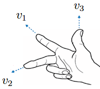
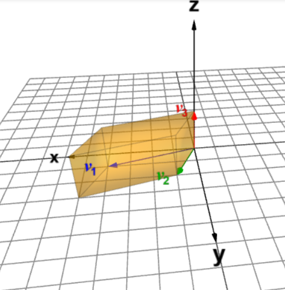

# דטרמיננטה {#ch:determinant}

בפרק הקודם הגדרנו מטריצות הפיכות, וראינו שיש תנאים שונים השקולים להגדרה זו. נרצה לפתח תנאי נוסף שאפשר לבטא באמצעות פונקציה שלוקחת מטריצה ריבועית ומחזירה סקלר (ע\"י חישוב שתלוי בערכי המטריצה). סקלר זה ייקרא הדטרמיננטה של המטריצה, וזה גם השם של הפונקציה עצמה.

לדטרמיננטה יש חשיבות בגיאומטריה וחדו\"א לצורך חישובים נפחים ושטחים (תחילה של צורות מוכרות, ואחר כך של צורות יותר מסובכות בעזרת אינטגרל). המושג של מכפלה וקטורית, שלא ניכנס אליו בקורס, גם מבוסס על דטרמיננטה וזו עוד דרך לחשב וקטור נורמל למישור במרחב. אבל אנחנו נתמקד בהיבט העיקרי של דטרמיננטה כמדד להפיכות של המטריצה. מה המשמעות שלה במובן הזה? ככל שהדטרמיננטה של $A$ גדולה יותר, כך הממ\"ל $Ax=b$ יציבה יותר במובן הבא: הפתרון לממ\"ל (הפלט $A^{-1}b$) פחות רגיש לשגיאה בקלט $b$. דטרמיננטה קטנה פירושה שיש רגישות גדולה לשגיאה, והמידע שמבוטא בממ\"ל פחות אמין. אם הדטרמיננטה מתאפסת, אז $A$ אינה הפיכה ומלכתחילה לא קיים פתרון יחיד לממ\"ל (יש אובדן של מידע). ניגע בהיבטים המעשיים של הדטרמיננטה ביישומים בסוף הספר, אבל בקורס עצמו נתמקד בתכונות הדטרמיננטה וחישובים.

הנוסחה לדטרמיננטה היא די ארוכה למטריצות ריבועיות מסדר $n\times n$ עבור $n\ge 3$, ולא מומלץ לשנן אותה למעט המקרה $n=2$. אז נפעל בכיוון הפוך: נקבע את התכונות הרצויות עבור הדטרמיננטה, שלמעשה מגדירות אותה. בהמשך נראה שיטות שונות לחישוב.

נציין שהסימון לדטרמיננטה של מטריצה $A$ הוא $\det(A)$ ללא קשר לסדר המטריצה. הנוסחה עצמה תלויה בסדר.

## הגדרת הדטרמיננטה והקשר לדירוג

::: definition
`\label{def:det}`{=latex} עבור $A\in\mathbb{M}_{n\times n}(\mathbb{F})$ נגדיר את $\det(A)$ ע\"י התכונות הבאות:

1.  $.\det(I_n)=1$

2.  אם $A\xrightarrow{\alpha R_i\to R_i}A'$ עבור $1\leq i \leq n$, אז $\det(A')=\alpha \det(A)$.

3.  אם $A\xrightarrow{R_i+\alpha R_j\to R_i}A'$ עבור $i\neq j$, אז $\det(A')=\det(A)$.

4.  אם $A\xrightarrow{R_i\leftrightarrow R_j}A'$ עבור $i\neq j$, אז $\det(A')=-\det(A)$.
:::

::: remark
דרך שקולה להסתכל על התכונה השנייה היא שאם כבר מופיע במטריצה הנתונה כפל בסקלר של שורה כלשהי, אפשר להוציא את הסקלר מחוץ לדטרמיננטה. זה דומה להוצאת גורם משותף מחוץ לחישוב רגיל. בפרט, לכל $A=(a)\in\mathbb{M}_{1\times 1}(\mathbb{F})$ מתקיים $$.\det(A)=\det(a)=a\det(1)=a\det(I_1)=a\cdot1=a$$
:::

::: remark
כבר אפשר לראות דרך אחת לחישוב דטרמיננטה של מטריצה הפיכה: מבצעים דירוג קנוני (שיסתיים ב-$I_n$) ועוקבים אחרי השינוי בערך הדטרמיננטה בעקבות ביצוע פש\"אות, שהן כפל שורה בסקלר או החלפה בין שתי שורות. נניח כי $\alpha_1,\alpha_2,...,\alpha_k\in\mathbb{F}$ הם הסקלרים בהם מכפילים את שורות המטריצה לאורך הדירוג. בנוסף, נניח כי יש $p$ החלפות שורות. אז מתכונות הדטרמיננטה נובע כי $$1=\det(I_n)=(-1)^p\alpha_1\alpha_2\cdots\alpha_k\det(A) \implies \det(A)=\frac{(-1)^p}{\alpha_1\alpha_2\cdots\alpha_k}$$

החסרונות של נוסחה זו היא שהדירוג עלול להיות ארוך, ולא ברור מראש מהם הסקלרים שמופיעים במכנה. לא תמיד זו הדרך הנוחה ביותר לחישוב דטרמיננטה, אבל זו דרך שתמיד יכולה לעבוד. נרצה שיהיו לנו כלים נוספים כדי שנוכל להסתפק בדירוג חלקי אם בכלל.
:::

::: example
נחשב את הדטרמיננטה של $$.A=\begin{pmatrix}
1 & -3 \\
4 & 7
\end{pmatrix}$$

נקבל $$\begin{aligned}
\det(A)&=\det\!\begin{pmatrix}
1 & -3 \\
4 & 7
\end{pmatrix}\overset{R_2 - 4R_1 \to R_2}{=}\det\!\begin{pmatrix}
1 & -3 \\
0 & 19
\end{pmatrix}\overset{\frac{1}{19}R_2 \to R_2}{=}19\cdot\det\!\begin{pmatrix}
1 & -3 \\
0 & 1
\end{pmatrix} \\
&\overset{R_1+3R_2\to R_1}{=}19\cdot\det(I_2)=19\cdot1=19
\end{aligned}$$
:::

::: proposition
 *`\label{prop:det-scalar}`{=latex} יהיו $A\in\mathbb{M}_{n\times n}(\mathbb{F})$ ו- $\alpha\in\mathbb{F}$. אז מתקיים $$.\det(\alpha A)=\alpha^n\det(A)$$*
:::

::: proof
המשמעות של הכפל $\alpha A$ היא שכל שורה מוכפלת באותו סקלר $\alpha$. לכן, עבור כל שורה ניתן להוציא את $\alpha$ מחוץ לדטרמיננטה. לאחר שנעשה זאת לכל השורות נקבל גורם $\alpha^n$ מחוץ לדטרמיננטה, ואת המטריצה המקורית $A$ בתוכה. לכן $$.\det(\alpha A)=\alpha^n\det(A)$$ ◻
:::

::: proposition
 *`\label{prop:zero-row}`{=latex} אם למטריצה $A\in\mathbb{M}_{n\times n}(\mathbb{F})$ יש שורת אפסים, אז $\det(A)=0$.*
:::

::: proof
נניח שיש רק אפסים בשורה $R_i$ של $A$. אז גם לאחר הכפלת שורה זו בכל סקלר $c\neq 0$, המטריצה תישאר ללא שינוי. ניקח $c=\frac{1}{2}$ ונקבל

$$.\det(A)=2\det(A) \implies \det(A)=0$$ ◻
:::

::: proposition
 *`\label{prop:diagonal-det}`{=latex} יהיו $D,U\in\mathbb{M}_{n\times n}(\mathbb{F})$.*

1.  *אם $D$ אלכסונית מהצורה*

    *$$,D=\begin{pmatrix}
    d_1 &0 & \cdots & 0 \\
    0 & d_2 & \cdots & 0 \\
    \vdots & \vdots & \ddots & 0 \\
    0 & 0 & \cdots & d_n
    \end{pmatrix}$$*

    *אז מתקיים*

    *$$.\det(D)=d_1d_2\cdots d_n$$*

2.  *אם $U$ משולשית עליונה מהצורה*

    *$$U=\begin{pmatrix}
    d_1 &* & \cdots & * \\
    0 & d_2 & \cdots & * \\
    \vdots & \vdots & \ddots & * \\
    0 & 0 & \cdots & d_n
    \end{pmatrix}$$*

    *כאשר הכוכביות מציינות איברים כלשהם ובנוסף $d_i\neq 0$ לכל $1\leq i\leq n$, אז מתקיים*

    *$$.\det(U)=d_1d_2\cdots d_n$$*
:::

::: proof

1.  אם לפחות אחד מאיברי האלכסון הראשי הוא $0$, אז יש שורת אפסים ולפי טענה `\ref{prop:zero-row}`{=latex} נובע כי $$.\det(A)=0=a_1a_2\cdots a_n$$

    אז נניח כי כל איברים האלכסון הראשי שונים מ- $0$. בשביל הדירוג הקנוני צריך לבצע פש\"אות מהצורה $\frac{1}{d_i}R_i\to R_i$ לכל $1\leq i\leq n$. כך נקבל

    $$.1=\det(I_n)=\frac{1}{d_1}\cdot\frac{1}{d_2}\cdots\frac{1}{d_n}\det(A) \implies \det(A)=d_1d_2\cdots d_n$$

2.  נראה שניתן להגיע מ- $U$ למטריצה האלכסונית $D$ מהסעיף הקודם ע\"י פש\"אות שלא משנות את הדטרמיננטה. נתון שלכל $2\leq i\leq n$ מתקיים $d_i\neq 0$, ולכן זהו איבר מוביל וניתן להשתמש בו כדי לאפס את האיברים מעליו ע\"י פש\"אות מהסוג של החסרת כפל בסקלר של $R_i$ משורה מעליה. כל פש\"א כזו לא משנה את ערך הדטרמיננטה, ולכן לאחר ביצוע כל הפש\"אות האלו נקבל

    $$.\det(U)=\det(D)=d_1d_2\cdots d_n$$

 ◻
:::

::: remark
בהמשך נראה שהנוסחה מתקיימת גם למטריצה משולשית עליונה עם $0$ אחד או יותר על האלכסון הראשי (ואז הדטרמיננטה שווה ל- $0$). באופן דומה, גם נראה שלכל מטריצה משולשית תחתונה הדטרמיננטה נתונה כמכפלת איברי האלכסון הראשי.
:::

::: example
ניקח $$.A = \begin{pmatrix}
1 & 2 & 3\\
4 & 5 & 6\\
7 & 8 & 10
\end{pmatrix}$$

תחילה נשתמש בפעולות שלא משנות את הדטרמיננטה:

$$\det(A)\overset{R_2 - 4R_1 \to R_2}{\overset{R_3 - 7R_1 \to R_3}{=}}
\det\!\begin{pmatrix}
1 & 2 & 3\\
0 & -3 & -6\\
0 & -6 & -11
\end{pmatrix}\overset{R_3 - 2R_2 \to R_3}{=}\det\!\begin{pmatrix}
1 & 2 & 3\\
0 & -3 & -6\\
0 & 0 & 1
\end{pmatrix}$$

קיבלנו מטריצה משולשית עליונה. אז מטענה `\ref{prop:diagonal-det}`{=latex} נובע כי $$.\det(A)=1(-3)1=-3$$
:::

## תכונות נוספות של הדטרמיננטה

### מטריצות מסדר 2 על 2.

כעת נתמקד במקרה הפרטי של $n=2$, שהוא יותר קל לניתוח וחישוב. כאן כדאי לזכור את נוסחת הדטרמיננטה שנקבל.

::: proposition
 *`\label{prop:det-order-2}`{=latex} עבור $n=2$ הפונקציה $\det:\mathbb{M}_{2\times 2}(\mathbb{F})\to\mathbb{F}$ מהגדרה `\ref{def:det}`{=latex} מקיימת:*

1.  *לכל $$A=\begin{pmatrix}
    a & b \\
    c & d
    \end{pmatrix}$$ מתקיים $$.\det(A)=ad-bc$$*

2.  *$A$ הפיכה אם ורק אם $\det(A)\neq 0$. במקרה זה מתקיים $$.A^{-1}=\frac{1}{ad-bc}\begin{pmatrix}
    d & -b \\
    -c & a
    \end{pmatrix}$$*
:::

::: proof

1.  נפריד בין שלושה מקרים. נניח תחילה כי $a\neq 0$. אז מתקיים $$.\det(A)=\det\!\begin{pmatrix}
    a & b \\
    c & d
    \end{pmatrix}\overset{R_2-\frac{c}{a}R_1 \to R_1}{=} \det\!\begin{pmatrix}
    a & b \\
    0 & d-\frac{bc}{a}
    \end{pmatrix}$$ קיבלנו מטריצה משולשית עליונה, ולכן לפי טענה `\ref{prop:diagonal-det}`{=latex} נובע כי $$.\det(A)=a(d-\frac{bc}{a})=ad-bc$$

    אם $a=0$ אך $c\neq 0$, אז נוכל לבצע החלפה בין השורות ולהשתמש בנוסחה שהוכחנו למקרה הקודם:

    $$\det(A)=-\det\!\begin{pmatrix}
    c & d \\
    a & b
    \end{pmatrix}
    =-(bc-ad)=ad-bc$$

    אם $a=c=0$, אז יש שני מקרים: או שיש שורת אפסים, או שבלי הגבלת הכלליות $d\neq 0$ ואפשר לאפס את האיבר מעליו ע\"י הפעולה $R_1-\frac{b}{d}R_2\to R_1$. אז בכל מקרה מתקבלת שורת אפסים ולפי טענה `\ref{prop:zero-row}`{=latex}, נובע כי

    $$.\det(A)=\det\!\begin{pmatrix}
        0 & b \\
        0 & d
        \end{pmatrix}=\det\!\begin{pmatrix}
        0 & 0 \\
        0 & d
        \end{pmatrix}=0=0\cdot d-b\cdot 0=ad-bc$$

2.  כיוון ראשון: אם $\det(A)\neq 0$, נראה כי הנוסחה עבור $A^{-1}$ אכן מקיימת $A^{-1}A=I_2$.

    נכפיל ונקבל $$.A^{-1}A=\frac{1}{ad-bc}\begin{pmatrix}
    d & -b \\
    -c & a
    \end{pmatrix}\begin{pmatrix}
    a & b \\
    c & d
    \end{pmatrix}=\frac{1}{ad-bc}\begin{pmatrix}
    ad-bc & 0 \\
    0 & ad-bc 
    \end{pmatrix}=I_2$$

    אז $A$ אכן הפיכה והנוסחה מתקיימת.

    כיוון שני: נניח כי $\det(A)=0$. ראינו בסעיף הקודם שהנחה זו מובילה לשורת אפסים לאחר דירוג, וזה אומר ש- $\mathop{\mathrm{rank}}(A)<2$ ולכן $A$ אינה הפיכה.

 ◻
:::

::: example
 

1.  המטריצה $$A=\begin{pmatrix}
    1 & 4 \\
    3 & 15
    \end{pmatrix}$$ הפיכה כי $$.\det(A)=1\cdot15-4\cdot3=3\neq 0$$ בנוסף, מתקיים $$.A^{-1}=\frac{1}{3}\begin{pmatrix}
    15 & -4 \\
    -3 & 1
    \end{pmatrix}=\begin{pmatrix}
    5 & -\frac{4}{3} \\
    -1 & \frac{1}{3}
    \end{pmatrix}$$

2.  המטריצה $$A=\begin{pmatrix}
    1 & 5 \\
    3 & 15
    \end{pmatrix}$$ אינה הפיכה כי $$.\det(A)=1\cdot15-5\cdot 3=0$$ אכן, גם רואים שדרגתה היא $1$ כי השורה השנייה מתקבלת מהראשונה ע\"י כפל ב- $3$.
:::

התרגיל הבא מראה שלדטרמיננטה של מטריצה מסדר $2\times2$ יש משמעות גיאומטרית של שטח מקבילית, עד כדי ערך מוחלט.

::: exercise
יהיו $v_1=(a,b),v_2=(c,d)$ וקטורים ב- $\mathbb{R}^2$. נסמן ב- $A$ את המטריצה ששורותיה הן $v_1,v_2$. הראו כי $|\det(A)|$ שווה לשטח המקבילית עם וקטורי צלעות $v_1,v_2$.

רמז: השטח נתון ע\"י $S=\|v_1\|\|v_2\|\sin(\theta)$, כאשר $\theta$ היא הזווית הקטנה בין וקטורי הצלעות ונתונה ע\"י $$.\cos(\theta)=\frac{v_1\cdot v_2}{\|v_1\|\|v_2\|}$$
:::

::: {.callout-note collapse="true" title="פתרון"}
 נשתמש בזהות הטריגונומטרית $$.\sin^2(\theta)+\cos^2(\theta)=1\implies \sin(\theta)=\sqrt{1-\cos^2(\theta)}$$

נציב את הביטוי לעיל בנוסחת השטח וגם נשתמש בנוסחה למכפלה סקלרית, ונקבל

$$\begin{aligned}
S&=\sqrt{\|v_1\|^2\|v_2\|^2-(v_1\cdot v_2)^2}=\sqrt{(a^2+b^2)(c^2+d^2)-(ac+bd)^2}\\
&=\sqrt{(ad)^2+(bc)^2-2ad\cdot bc}=\sqrt{(ad-bc)^2}=|ad-bc|=|\det(A)|
\end{aligned}$$
:::

::: example
`\label{ex:area-volume}`{=latex} 

1.  יהיו $a,c,d\in\mathbb{R}$. עבור $v_1=(a,0),v_2=(c,d)$, אורך בסיס המקבילית הוא $|a|$ ואורך הגובה הוא $|d|$. לכן שטח המקבילית הוא $|ad|$, ואכן מתקיים $$.\Bigl|\det\!\begin{pmatrix}
    a & 0 \\
    c & d
    \end{pmatrix}\Bigr|=|ad|$$

    מהי משמעות הסימן של הדטרמיננטה? אם $a,d>0$, אז $ad>0$ והוקטורים $v_1,v_2$ מקיימים את התכונה הבאה: כדי לסובב את $v_1$ לכיוון $v_2$, הסיבוב הוא נגד כיוון השעון. תכונה זו מתקיימת גם אם $a,d<0$ (עדיין $ad>0$).

    לעומת זאת, אם יש הבדל סימן בין $a$ ל-$d$, כלומר $ad<0$, אז התכונה ההפוכה מתקיימת: כדי לסובב את $v_1$ לכיוון $v_2$, הסיבוב הוא עם כיוון השעון.

    המשמעות הגיאומטרית של סימן הדטרמיננטה נכונה באופן כללי למטריצה $$,A=\begin{pmatrix}
    a & b\\
    c & d
    \end{pmatrix}$$ גם אם $b\neq 0$. סימן חיובי פירושו סיבוב נגד כיוון הראשון כדי לסובב את וקטור השורה הראשון לוקטור השורה השני, וסימן שלילי פירושו סיבוב עם כיוון השעון. הדטרמיננטה מתאפסת אם ורק אם שני הוקטורים קו-לינאריים, ואז ה\"מקבילית\" מנוונת (שטח $0$).

    ::: {#fig:Area .figure}
    {width=720 height=720}
    <figcaption>בצד ימין הדטרמיננטה שלילית, ובצד שמאל היא חיובית</figcaption>
    :::

    ::: {#fig:DetOperations .figure}
    {width=720 height=720}
    :::

    2.  יהיו $b_1,b_2,b_3\in\mathbb{R}$. נסמן $v_1=(b_1,0,0,),v_2=(0,b_2,0),v_3=(0,0,b_3)$, נסתכל על המטריצה שאלה הם וקטורי השורה שלה: $$B=\begin{pmatrix}
    b_1 & 0 & 0 \\
    0 & b_2 & 0 \\
    0 & 0 & b_3
    \end{pmatrix}$$

    נפח התיבה שצלעותיה מתאימות לשלושת הוקטורים $v_1,v_2,v_3$ הוא $|b_1b_2b_3|$, וזה בדיוק $|\det(B)|$ לפי טענה `\ref{prop:diagonal-det}`{=latex}.

    כאשר $b_1,b_2,b_3>0$ הדטרמיננטה חיובית, והמשמעות הגיאומטרית היא כלל יד ימין: הוקטורים $v_1,v_2$ יוצרים \"יד ימין\" - כלומר אם מציבים את האצבע המורה לאורך $v_1$ ואת האמה לאורך $v_2$, אז האגודל יפנה פחות או יותר לכיוון $v_3$ (הזווית ביניהם תהיה חדה).

    <figure id="fig:Thumb">
    
    <figcaption>כלל יד ימין</figcaption>
    </figure>

    להבדיל, אם $b_1,b_2>0$ אך $b_3<0$, אז במקרה זה הדטרמיננטה שלילית ואכן כלל יד ימין לא מתקיים בגלל ההיפוך של אחד הוקטורים. זה חל גם על שאר המקרים שבהם יש היפוך בוקטור אחד בדיוק, או אפילו בכל השלושה (מספר אי-זוגי של היפוכים שבעקבותיו הדטרמיננטה שלילית).

    ::: {#fig:Volume .figure}
    {width=720 height=720}
    <figcaption>הדטרמיננטה חיובית רק בצד ימין</figcaption>
    :::

    בהמשך ניתן דוגמה חישובית יותר כללית למשמעות של דטרמיננטה במרחב כנפח של מקבילון (לא בהכרח תיבה), עד כדי סימן בהתאם לכלל יד ימין.
:::

### מטריצות ריבועיות כלליות

::: proposition
 *`\label{prop:elementary-det}`{=latex} יהיו $E,A\in\mathbb{M}_{n\times n}(\mathbb{F})$ כך ש- $E$ מטריצה אלמנטרית המתאימה לפש\"א $S$, כלומר $E=S(I_n)$. אז מתקיים $$.\det(EA)=\det(E)\det(A)$$*
:::

::: proof
לפי טענה `\ref{prop:elementary}`{=latex} מתקיים $EA=S(A)$. לכן $$.\det(EA)=\det(S(A))=\begin{cases}
\alpha\det(A), & S=(\alpha R_i\to R_i) \\
\det(A), & S=(R_i+\alpha R_j\to R_i) \\
-\det(A), & S=(R_i\leftrightarrow R_j)
\end{cases}$$

באופן דומה:

$$.\det(E)=\det(S(I_n))=\begin{cases}
\alpha, & S=(\alpha R_i\to R_i) \\
1, & S=(R_i+\alpha R_j\to R_i) \\
-1, & S=(R_i\leftrightarrow R_j)
\end{cases}$$

לכן, בכל מקרה מתקיים

$$.\det(EA)=\det(E)\det(A)$$ ◻
:::

יש לנו כבר מספיק כלים כדי להוכיח את אחד השימושים העיקריים של הדטרמיננטה, שהוא תנאי שקול להפיכות עבור מטריצות ריבועיות מסדר כללי.

::: theorem
*`\label{thm:det-invertible}`{=latex} תהי $A\in\mathbb{M}_{n\times n}(F)$. אז $A$ הפיכה אם ורק אם $\det(A)\neq 0$.*
:::

::: proof
בכיוון הראשון, נניח כי $A$ הפיכה. אז לפי מסקנה `\ref{cor:elementary-product}`{=latex} היא מכפלה של מטריצות אלמנטריות. לכן מתקיים $$A=\tilde{E}_1\tilde{E}_2\cdots \tilde{E}_k$$ כאשר $\tilde{E}_1,\tilde{E}_2,...,\tilde{E}_k$ הן מטריצות אלמנטריות (למעשה, הן מתאימות לפש\"אות ההפוכות בדירוג הקנוני). אז לפי שימוש חוזר ב- `\ref{prop:elementary-det}`{=latex} נובע כי $$.\det(A)=\det(\tilde{E}_1)\det(\tilde{E}_2)\cdots\det(\tilde{E}_k)\neq 0$$ נדגיש שהדטרמיננטה של כל מטריצה אלמנטרית שונה מ- $0$ כי היא שווה ל- $\pm 1$ או $\alpha\neq 0$.

בכיוון השני, נניח כי $A$ אינה הפיכה. אז לפי משפט `\ref{thm:invertible}`{=latex}, היא אינה שקולת שורה ל- $I_n$ אלא למטריצה מדורגת קנונית $A'$ עם שורת אפסים (לפחות אחת). אז הפעם מתקיים $$A=E_1^{-1}E_2^{-1}\cdots E_k^{-1}A'$$ כאשר $E_1,E_2,...,E_k$ הן המטריצות האלמנטריות שמתאימות לפש\"אות בדירוג הקנוני. לכן $$.\det(A)=\det(E_1^{-1})\det(E_2^{-1})\cdots\det(E_k^{-1})\det(A')=0$$

הסיבה לשוויון ל- $0$ היא העובדה שמתקיים $\det(A')=0$ לפי טענה `\ref{prop:zero-row}`{=latex}. ◻
:::

::: exercise
לאילו ערכי $t\in\mathbb{C}$ המטריצה $$A=\begin{pmatrix}
t & 1 \\
-1 & t
\end{pmatrix}$$ הפיכה? חשבו את $A^{-1}$ עבור ערכים אלו.
:::

::: {.callout-note collapse="true" title="פתרון"}
 נחשב את הדטרמיננטה לפי הנוסחה בטענה `\ref{prop:det-order-2}`{=latex} ונקבל $.\det(A)=t^2+1$ אז לפי משפט `\ref{thm:det-invertible}`{=latex} נובע כי $A$ הפיכה אם ורק אם $$.t^2+1\neq 0 \iff t^2\neq-1 \iff t\neq\pm i$$ בנוסף, לכל $t\neq\pm i$ מתקיים $$.A^{-1}=\frac{1}{t^2+1}\begin{pmatrix}
t & -1 \\
1 & t
\end{pmatrix}$$
:::

כעת נוכיח תכונה חשובה שנקראת כפליות הדטרמיננטה:

::: proposition
 *`\label{prop:det-product}`{=latex} יהיו $A,B\in\mathbb{M}_{n\times n}(\mathbb{F})$. אז מתקיים $$.\det(AB)=\det(A)\det(B)$$*
:::

::: proof
נחלק למקרים:

1.  $AB$ אינה הפיכה: לפי תרגיל `\ref{exer:inverse-product}`{=latex} לפחות אחת מ- $A$ ו- $B$ אינה הפיכה. אז לפי משפט `\ref{thm:det-invertible}`{=latex} נובע כי $$,\det(AB)=0=\det(A)\det(B)$$ וזאת משום שלפחות אחת מהדטרמיננטות באגף ימין שווה ל- $0$.

2.  $AB$ הפיכה: תחילה נראה שגם $A$ וגם $B$ הפיכות. נסמן $C=(AB)^{-1}$. אז מתקיים $$,A(BC)=(AB)C=I_n$$ ולכן $A$ הפיכה מימין ובכלל. באופן דומה: $$,(CA)B=C(AB)=I_n$$ ולכן $B$ הפיכה משמאל ובכלל.

    אז לפי טענה `\ref{cor:elementary-product}`{=latex} גם $A$ וגם $B$ הן מכפלות של מטריצות אלמנטריות, כלומר קיימות מטריצות אלמנטריות $E_1,E_2,...,E_k,E_{k+1},...,E_l$ כך ש- $$.A=E_l\cdots E_{k+1}\quad,\quad B=E_k\cdots E_1$$ לכן $$,AB=E_l\cdots E_{k+1}E_k\cdots E_1$$ ולפי שימוש חוזר בטענה `\ref{prop:elementary-det}`{=latex} נובע כי $$\begin{aligned}
    \det(AB)&=\det(E_l)\cdots \det(E_{k+1})\det(E_k)\cdots \det(E_1)\\
    &=\det(E_l\cdots E_{k+1})\det(E_k\cdots E_1)=\det(A)\det(B)
    \end{aligned}$$

 ◻
:::

::: corollary
 *`\label{cor:det-inverse}`{=latex} תהי $A\in\mathbb{M}_{n\times n}(\mathbb{F})$ הפיכה. אז מתקיים $$.\det(A^{-1})=\frac{1}{\det(A)}$$*
:::

::: proof
לפי `\ref{prop:det-product}`{=latex} מתקיים $$.\det(A)\det(A^{-1})=\det(AA^{-1})=\det(I_n)=1$$ נחלק ב- $\det(A)$ ונקבל $$.\det(A^{-1})=\frac{1}{\det(A)}$$ ◻
:::

::: exercise
יהיו $A,P\in\mathbb{M}_{n\times n}(\mathbb{F})$ כך ש- $P$ הפיכה. הראו כי $$.\det(PAP^{-1})=\det(A)$$
:::

::: {.callout-note collapse="true" title="פתרון"}
 לפי טענה `\ref{prop:det-product}`{=latex} ומסקנה `\ref{cor:det-inverse}`{=latex} מתקיים $$.\det(PAP^{-1})=\det(P)\det(A)\det(P^{-1})=\det(P)\det(A)\cdot\frac{1}{\det(P)}=\det(A)$$ השתמשנו בחוק החילוף לסקלרים שמתקיים ב- $\mathbb{F}$ גם אם $A,P$ אינן מתחלפות.
:::

::: remark
המטריצה $PAP^{-1}$ נקראת דומה ל- $A$. נבין את החשיבות של דמיון מטריצות בהמשך הקורס, אבל כבר ראינו שלמטריצות דומות יש דטרמיננטות שוות.
:::

::: proposition
 *`\label{prop:det-transpose}`{=latex} תהי $A\in\mathbb{M}_{n\times n}(\mathbb{F})$. אז מתקיים $$.\det(A^t)=\det(A)$$*
:::

::: proof
שוב נפצל למקרים לפי הפיכות $A$.

1.  נניח כי $A$ אינה הפיכה. לא ייתכן כי $A^t$ הפיכה, כי אז לפי `\ref{exer:inverse-product}`{=latex} גם $A=(A^t)^t$ הפיכה וזו סתירה. לכן, לפי `\ref{thm:det-invertible}`{=latex} נובע כי $$.\det(A^t)=0=\det(A)$$

2.  נניח כי $A$ הפיכה. אז לפי `\ref{cor:elementary-product}`{=latex} היא מכפלה של מטריצות אלמנטריות $E_1,\cdots,E_k$. לכן $$A=E_k\cdots E_1 \implies A^t=(E_k\cdots E_1)^t=E_1^t\cdots E_k^t$$ ואז לפי טענה `\ref{prop:det-product}`{=latex} נובע כי $$.\det(A)=\det(E_k)\cdots\det(E_1)\quad,\quad \det(A^t)=\det(E_1^t)\cdots\det(E_k^t)$$

    לאור חוק החילוף ב- $\mathbb{F}$, מה שנשאר לסיום ההוכחה זה להראות כי $\det(E^t)=\det(E)$ לכל $E\in\mathbb{M}_{n\times n}(\mathbb{F})$ אלמנטרית.

    -   אם $E$ מתאימה לפש\"א $S=(R_i\leftrightarrow R_j)$, אז $E^t=E$ והדטרמיננטות גם שוות (לערך $-1$).

    -   אם $E$ מתאימה לפש\"א $S=(\alpha R_i\to R_i)$, אז $E$ היא מטריצה אלכסונית (עם $1$ לאורך האלכסון הראשי חוץ מ- $\alpha$ בשורה ה- $i$) ושוב $E^t=E$.

    -   אם $E$ מתאימה לפש\"א $S=(R_i+\alpha R_j\to R_i)$, אז הפעם $E^t$ מתאימה לפש\"א $S=(R_j+\alpha R_i\to R_j)$. במקרה זה $E^t\neq E$, אבל מתקיים $$.\det(E^t)=1=\det(E)$$

 ◻
:::

נחזור לחלק השני של טענה `\ref{prop:diagonal-det}`{=latex} והפעם לא נניח שאיברי האלכסון הראשי שונים מ- $0$.

::: corollary
 *תהי $U,L\in\mathbb{M}_{n\times n}(\mathbb{F})$.*

1.  *אם $U$ משולשית עליונה מהצורה*

    *$$U=\begin{pmatrix}
    d_1 &* & \cdots & * \\
    0 & d_2 & \cdots & * \\
    \vdots & \vdots & \ddots & * \\
    0 & 0 & \cdots & d_n
    \end{pmatrix}$$*

    *כאשר הכוכביות מציינות איברים כלשהם, אז מתקיים*

    *$$.\det(U)=d_1d_2\cdots d_n$$*

2.  *אם $L$ משולשית תחתונה מהצורה*

    *$$L=\begin{pmatrix}
    d_1 &0 & \cdots & 0 \\
    * & d_2 & \cdots & 0 \\
    \vdots & \vdots & \ddots & 0 \\
    * & * & \cdots & d_n
    \end{pmatrix}$$*

    *כאשר הכוכביות מציינות איברים כלשהם, אז מתקיים*

    *$$.\det(L)=d_1d_2\cdots d_n$$*
:::

::: proof

1.  ראינו כבר שהטענה נכונה כאשר כל איברי האלכסון הראשי שונים מ- $0$. לכן, נניח שקיים $1\leq i\leq n$ כך ש- $d_i=0$, אז $U$ מדורגת ודרגתה (מספר האיברים המובילים) קטנה מ- $n$. אז לפי משפט `\ref{thm:invertible}`{=latex} היא אינה הפיכה, ולפי משפט `\ref{thm:det-invertible}`{=latex} בהכרח מתקיים $$.\det(U)=0=d_1d_2\cdots d_n$$

2.  נסתכל על $L^t$, שהיא מטריצה משולשית עליונה עם בדיוק אותם האיברים על האלכסון הראשי כמו של $L$. אז לפי הסעיף הקודם וטענה `\ref{prop:det-transpose}`{=latex} מתקיים

    $$.\det(L)=\det(L^t)=d_1d_2\cdots d_n$$

 ◻
:::

::: exercise
תהי $A\in\mathbb{M}_{n\times n}(\mathbb{F})$ כאשר $n$ אי-זוגי. השתמשו בדטרמיננטה כדי להוכיח את הטענות הבאות:

1.  אם $\mathbb{F}=\mathbb{R}$, לא ייתכן כי $A^2=-I_n$.

2.  אם $A$ אנטי-סימטרית, אז היא אינה הפיכה.
:::

::: {.callout-note collapse="true" title="פתרון"}
  

1.  נניח בשלילה כי $A^2=-I_n$ ונפעיל דטרמיננטה. אז לפי טענה `\ref{prop:det-scalar}`{=latex} מתקיים $$\det(A^2)=\det(-I_n)=(-1)^n\det(I_n)=-1$$ כי $n$ אי-זוגי. נשתמש בכפליות הדטרמיננטה (טענה `\ref{prop:det-product}`{=latex}) ונקבל $$,(\det(A))^2=\det(A^2)=-1$$ אך זו סתירה כי $\det(A)\in\mathbb{R}$, שכן כל ערכי $A$ ממשיים.

2.  נתון כי $A^t=-A$ ולכן הפעם נקבל $$.\det(A^t)=\det(-A)=(-1)^n\det(A)=-\det(A)$$ מצד שני, לפי טענה `\ref{prop:det-transpose}`{=latex} מתקיים $$.\det(A)=\det(A^t) \implies \det(A)=-\det(A) \implies \det(A)=0$$ לכן, $A$ אינה הפיכה לפי משפט `\ref{thm:det-invertible}`{=latex}.
:::

## פיתוח דטרמיננטה לפי שורה או עמודה

ראינו שיש נוסחה פשוטה לדטרמיננטה עבור מטריצות מסדר $2\times 2$, ותמיד אפשר להשתמש בדירוג (לא בהכרח קנוני) כדי לקבל מטריצה משולשית עליונה שגם עבורה הנוסחה ידועה. נשאלת השאלה אם יש קיצור דרך, והתשובה חיובית בהרבה מקרים.

::: definition
תהי $A\in\mathbb{M}_{n\times n}(\mathbb{F})$. נגדיר את המינור $M_{i,j}(A)$ להיות המטריצה שמתקבלת מ- $A$ ע\"י מחיקת השורה ה- $i$ והעמודה ה- $j$.
:::

::: remark
כאן $M_{i,j}(A)\in\mathbb{M}_{(n-1)\times(n-1)}(\mathbb{F})$. הסדר של המינור יותר קטן מזה של המטריצה המקורית, וזה מקל על חישוב הדטרמיננטה.
:::

::: example
ניקח $$.A=\begin{pmatrix}
1 & 0 & 2 & 0 \\
3 & 5 & 7 & 9\\
-1 & 2 & 5 & 8 \\
0 & 3 & 0 & -3 
\end{pmatrix}$$

נמחק את השורה הרביעית והעמודה השנייה, ונקבל $$.M_{4,2}(A)=\begin{pmatrix}
1 & 2 & 0 \\
3 & 7 & 9\\
-1 & 5 & 8
\end{pmatrix}$$

נמחק את השורה השנייה והעמודה הרביעית, ונקבל $$.M_{2,4}(A)=\begin{pmatrix}
1 & 0 & 2 \\
-1 & 2 & 5 \\
0 & 3 & 0 
\end{pmatrix}$$
:::

::: proposition
 *`\label{prop:laplace}`{=latex} תהי $$.A=\begin{pmatrix}a_{11} & \cdots & a_{1n}\\
\vdots & \ddots & \vdots\\
a_{n1} & \cdots & a_{nn}
\end{pmatrix}$$ אז מתקיים:*

1.  *לכל $1\leq i \leq n$, ניתן לפתח את הדטרמיננטה לפי השורה ה- $i$: $$\det(A)=\sum_{j=1}^n (-1)^{i+j}a_{ij}\det(M_{i,j}(A))$$*

2.  *לכל $1\leq j \leq n$, ניתן לפתח את הדטרמיננטה לפי העמודה ה- $j$: $$\det(A)=\sum_{i=1}^n (-1)^{i+j}a_{ij}\det(M_{i,j}(A))$$*
:::

::: remark
שתי הנוסחאות עלולות להיראות זהות במבט ראשון, אבל בפיתוח לפי שורה הסכימה היא על פני האינדקס $j$ ואילו בפיתוח לפי עמודה הסכימה היא על פני האינדקס $i$.
:::

נדחה את עיקר ההוכחה לפרק על העתקות לינאריות, אבל בינתיים נראה איך פיתוח לפי עמודה נובע מפיתוח לפי שורה (בעזרת שחלוף):

::: proof

1.  נוכיח את נוסחה זו בהמשך הקורס. לעת עתה נציין שהביטוי $(-1)^{i+j}$ קשור לשינוי הסימן של הדטרמיננטה בעקבות החלפה בין שורות.

2.  נניח שהנוסחה לפיתוח לפי שורה נכונה, לכל שורה.

    יהי $1\leq j\leq n$. לפי טענה `\ref{prop:det-transpose}`{=latex} מתקיים $\det(A)=\det(A^t)$. נפתח את אגף ימין לפי השורה ה- $j$ (בהתאם לעמודה ה- $j$ של המטריצה המקורית) ונשתמש באינדקס סכימה $i$: $$\begin{aligned}
    .\det(A)&=\det(A^t)=\sum_{i=1}^n(-1)^{j+i}(A^t)_{ji}\det(M_{j,i}(A^t))\\
    &=\sum_{i=1}^n(-1)^{i+j}a_{ij}\det((M_{i,j}(A))^t) =\sum_{i=1}^n(-1)^{i+j}a_{ij}\det(M_{i,j}(A))
    \end{aligned}$$

    השתמשנו בעובדה שהמינור $M_{j,i}(A^t)$ מתקבל ממחיקת השורה ה- $j$ והעמודה ה- $i$ של $A^t$, כאשר אין הבדל בין זה לבין השחלוף של המינור $M_{i,j}(A)$ (אפשר לבצע את המחיקה לפני או אחרי השחלוף).

 ◻
:::

::: example
 

1.  נראה שעבור מטריצה $$A=\begin{pmatrix}
    a & b \\
    c & d
    \end{pmatrix}$$ פיתוח לפי כל שורה/עמודה משחזר את הנוסחה הידועה מטענה `\ref{prop:det-order-2}`{=latex}.

    לפי השורה הראשונה נקבל:

    $$\begin{aligned}
    \det(A)&=(-1)^{1+1}a\cdot \det(M_{1,1}(A))+(-1)^{1+2}b\cdot \det(M_{1,2}(A))\\
    &=a\det(d)-b\det(c)=ad-bc
    \end{aligned}$$

    לפי השורה השנייה נקבל:

    $$\begin{aligned}
    \det(A)&=(-1)^{2+1}c\cdot \det(M_{2,1}(A))+(-1)^{2+2}d\cdot \det(M_{2,2}(A))\\
    &=-c\det(b)+d\det(a)=ad-bc
    \end{aligned}$$

    לפי העמודה הראשונה נקבל:

    $$\begin{aligned}
    \det(A)&=(-1)^{1+1}a\cdot \det(M_{1,1}(A))+(-1)^{2+1}c\cdot \det(M_{2,1}(A))\\
    &=a\det(d)-c\det(b)=ad-bc
    \end{aligned}$$

    לפי העמודה השנייה נקבל:

    $$\begin{aligned}
    \det(A)&=(-1)^{1+2}b\cdot \det(M_{1,2}(A))+(-1)^{2+2}d\cdot \det(M_{2,2}(A))\\
    &=-b\det(c)+d\det(a)=ad-bc
    \end{aligned}$$

2.  עבור $$B=\begin{pmatrix}
    1 & i & 1+i \\
    2 & 3 & -i \\
    0 & 2+i & 4
    \end{pmatrix}$$ נבחר לפתח לפי השורה השלישית, כי אחד מאיבריה הוא $0$ (ולכן מספיק לחשב דטרמיננטות של שני מינורים). נקבל $$\begin{aligned}
    \det(B)&=0+(-1)^{3+2}(2+i)\det(M_{3,2}(B))+(-1)^{3+3}4\det(M_{3,3}(B)) \\
    &=-(2+i)\det\!\begin{pmatrix}
    1 & 1+i \\
    2 & -i
    \end{pmatrix}+4\det\!\begin{pmatrix}
    1 & i \\
    2 & 3
    \end{pmatrix}\\
    &=-(2+i)\bigl(-i-2(1+i)\bigr)+4(3-2i)=(2+i)(2+3i)+12-8i\\
    &=1+8i+12-8i=13
    \end{aligned}$$

    לחילופין, נוח גם לפתח לפי העמודה הראשונה. כך נקבל

    $$\begin{aligned}
    \det(B)&=(-1)^{1+1}1\cdot
    \det\!\begin{pmatrix}
    3 & -i \\
    2+i & 4
    \end{pmatrix}
    +(-1)^{1+2}
    2\cdot
    \det\!\begin{pmatrix}
    i & 1+i \\
    2+i & 4
    \end{pmatrix}+0 \\
    &=1\bigl((3\cdot 4 - (-i)(2+i)\bigr)
    -
    2\bigl(4i - (1+i)(2+i)\bigr)
    \\
    &=
    1(11+2i)
    -
    2(i-1)
    =
    11+2i -2i+2
    =
    13
    \end{aligned}$$
:::

חוץ מפיתוח לפי שורה/עמודה תמיד כדאי לזכור שדירוג יכול להיות שימושי כחלק מהחישוב, גם אם הוא חלקי. בדוגמה הבאה נשתמש קודם בדירוג חלקי כדי לאפס את איברי העמודה הראשונה חוץ מהראשון, כך שנוכל לפתח את הדטרמיננטה לפי העמודה הראשונה יחסית בקלות.

::: example
$$\begin{aligned}
&\det\!\begin{pmatrix}
1 & 2 & 3 & 4\\
0 & 1 & 5 & 6\\
2 & 0 & 1 & 3\\
1 & 1 & 0 & 1
\end{pmatrix}
\overset{R_3 - 2R_1 \to R_3}{\overset{R_4 - R_1 \to R_1}{=}}
\det\!\begin{pmatrix}
1 & 2 & 3 & 4\\
0 & 1 & 5 & 6\\
0 & -4 & -5 & -5\\
0 & -1 & -3 & -3
\end{pmatrix}\\
&=
1\cdot
\det\!\begin{pmatrix}
1 & 5 & 6\\
-4 & -5 & -5\\
-1 & -3 & -3
\end{pmatrix}
\end{aligned}$$

עשינו פיתוח לפי העמודה הראשונה. מכאן אפשר לעשות פיתוח לפי כל שורה או עמודה, אבל לא יזיק שוב לאפס את איברי העמודה הראשונה חוץ מהראשון:

$$\begin{aligned}
&\det\!\begin{pmatrix}
1 & 5 & 6\\
-4 & -5 & -5\\
-1 & -3 & -3
\end{pmatrix}
\overset{R_2 +4R_1 \to R_2}{\overset{R_3 + R_1 \to R_3}{=}}\det\!\begin{pmatrix}
1 & 5 & 6\\
0 & 15 & 19\\
0 & 2 & 3
\end{pmatrix}=1\cdot\det \begin{pmatrix}
15 & 19 \\
2 & 3
\end{pmatrix}\\
&=45-38=7
\end{aligned}$$
:::

החישוב הבא מתאים לנפח של מקבילון שבסיסו מונח על מישור $xy$. זהו מקרה יותר כללי מהתיבה שראינו בדוגמה `\ref{ex:area-volume}`{=latex}.

::: example
נסתכל על הוקטורים הבאים ב- $\mathbb{R}^3$: $$.v_1=(a,b,0),v_2=(c,d,0),v_3=(0,0,h)$$

<figure id="fig:Piped">

<figcaption>המקבילון המתואר</figcaption>
</figure>

הוקטור $v_3$ מאונך לוקטורים $v_1,v_2$ ולכן נפח המקבילון מתקבל משטח המקבילית (שנפרשת ע\"י $v_1,v_2$) ע\"י כפל בגובה $|h|$, כלומר הנפח הוא $|(ad-bc)h|$. נוודא שזהו אכן הערך המוחלט של הדטרמיננטה של המטריצה ששורותיה הן $v_1,v_2,v_3$, ולצורך כך נעשה פיתוח לפי השורה השלישית (גם העמודה השלישית נוחה):

$$.\det\!\begin{pmatrix}
a & b & 0 \\
c & d & 0 \\
0 & 0 & h
\end{pmatrix}=0+0+(-1)^{3+3}h\cdot\det\!\begin{pmatrix}
a & b \\
c & d
\end{pmatrix}=(ad-bc)h$$

אז הנפח אכן שווה לערך המוחלט של הדטרמיננטה (והסימן שלה מקיים את כלל יד ימין, כאמור).
:::

::: remark
עוד לא ראינו הסבר כללי לכך שהערך המוחלט של הדטרמיננטה של מטריצה מסדר $3\times 3$ שווה לנפח המקבילון המתאים, גם אם אין וקטור שורה שמאונך לשניים האחרים. נוכל להוכיח זאת כשנחזור לגיאומטריה בסוף הקורס.
:::

::: exercise
לאילו ערכי $a\in\mathbb{R}$ קיים פתרון יחיד לממ\"ל $Ax=0$ כאשר $$?A=\begin{pmatrix}
a & 2a & 3 \\
2a & a & 2a \\
3 & 2a & a
\end{pmatrix}$$
:::

::: {.callout-note collapse="true" title="פתרון"}
 לפי משפט `\ref{thm:det-invertible}`{=latex} קיים לממ\"ל פתרון יחיד (הטריוויאלי) אם ורק אם $\det(A)\neq 0$. נעשה חישוב, כאשר תחילה נוציא את הסקלר $a$ מהשורה השנייה אל מחוץ לדטרמיננטה:

$$\begin{aligned}
\det(A)&=\det\!\begin{pmatrix}
a & 2a & 3 \\
2a & a & 2a \\
3 & 2a & a
\end{pmatrix}=a\cdot\det\!\begin{pmatrix}
a & 2a & 3 \\
2 & 1 & 2 \\
3 & 2a & a
\end{pmatrix}\\
&\overset{R_3 - R_1 \to R_3}{=}a\cdot\det\!\begin{pmatrix}
a & 2a & 3 \\
2 & 1 & 2 \\
3-a & 0 & a-3
\end{pmatrix}
=a(a-3)\det\!\begin{pmatrix}
a & 2a & 3 \\
2 & 1 & 2 \\
-1 & 0 & 1
\end{pmatrix}
\end{aligned}$$

עכשיו נוח, אך לא חובה, לשחלף את המטריצה בהתאם לטענה `\ref{prop:det-transpose}`{=latex} ואז לבצע עוד פש\"א:

$$\det(A)=a(a-3)\det\!\begin{pmatrix}
a & 2 & -1 \\
2a & 1 & 0 \\
3 & 2 & 1
\end{pmatrix}\overset{R_1+R_3\to R_1}{=}a(a-3)\det\!\begin{pmatrix}
a+3 & 4 & 0 \\
2a & 1 & 0 \\
3 & 2 & 1
\end{pmatrix}$$

נפתח לפי העמודה השלישית ונקבל

$$.\det(A)=a(a-3)\cdot 1\cdot\det\!\begin{pmatrix}
a+3 & 4 \\
2a & 1
\end{pmatrix}=a(a-3)(a+3-8a)=a(a-3)(3-7a)$$

לכן, לממ\"ל $Ax=0$ קיים פתרון יחיד אם ורק אם

$$.a(a-3)(3-7a)\neq 0 \iff a\notin\Set{0,\frac{3}{7},3}$$
:::
