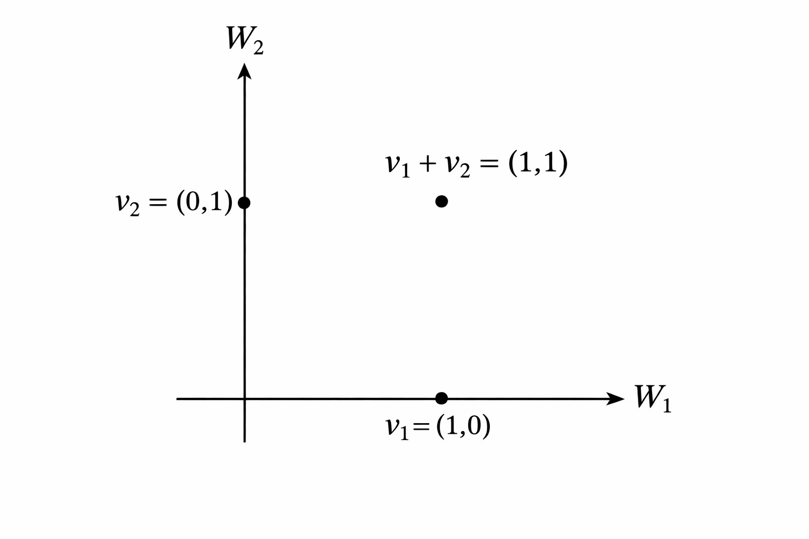

\maketitle

# תת-מרחבים {#ch:subspaces}

## פעולות החיתוך והסכום

בהינתן מ\"ו וקטורי $V$, ראינו את ההגדרה של תת-מרחב $W\subseteq V$ וגם את הקשר בין המימדים במסקנה `\ref{cor:subspace-dim}`{=latex}. בפרק זה נרצה להבין מהן הפעולות שאפשר לבצע על שני תת-מרחבים (או יותר), כאשר המטרה היא לקבל תת-מרחבים נוספים.

קודם כל ניזכר בהגדרה של פעולת החיתוך מפרק `\ref{ch:sets}`{=latex}, אבל הפעם נתאים אותה לתת-מרחבים במקום קבוצות כלליות.

::: definition
יהי $V$ מ\"ו מעל $\mathbb{F}$, ויהיו $W_1,W_2\subseteq V$ תת-מרחבים. אז החיתוך $W_1\cap W_2$ הוא קבוצת כל הוקטורים השייכים גם ל- $W_1$ וגם ל- $W_2$, כלומר $$.W_1\cap W_2=\Set{v\in V|v\in W_1,v\in W_2}$$
:::

::: example
 למעשה, כבר דיברנו על חיתוך של תת-מרחבים בהקשר של פרק `\ref{ch:geometry}`{=latex} ופרק `\ref{ch:systems}`{=latex}.

1.  נסתכל על ישרים ב- $\mathbb{R}^2$ שעוברים דרך הראשית ונתונים ע\"י $$.L_1=\Set{(x,y)\in\mathbb{R}^2|a_1x+b_1y=0},L_2=\Set{(x,y)\in\mathbb{R}^2|a_2x+b_2y=0}$$ אם הם אינם מתלכדים, מתקיים $L_1\cap L_2=\Set{(0,0)}$. אם הם מתלכדים (כלומר וקטורי הנורמל הם קו-לינאריים), אז $L_1\cap L_2=L_1=L_2$.

2.  נסתכל על מישורים ב- $\mathbb{R}^3$ שעוברים דרך הראשית ונתונים ע\"י: $$\begin{aligned}
    H_1&=\Set{(x,y,z)\in\mathbb{R}^3|a_1x+b_1y+c_1z=0} \\
    H_2&=\Set{(x,y,z)\in\mathbb{R}^3|a_2x+b_2y+c_2z=0}
    \end{aligned}$$ מתקיים $$.H_1\cap H_2=\Set{(x,y)\in\mathbb{R}^2|a_1x+b_1y+c_1z=0,a_2x+b_2y+c_2z=0}$$ אם הישרים אינם מתלכדים, אז הנורמלים $(a_1,b_1,c_1),(a_2,b_2,c_2)$ מהווים קבוצה בת\"ל והדרגה של מטריצת המקדמים של הממ\"ל היא $2$. לפי משפט הדרגה, המימד של קבוצת הפתרונות הוא $3-2=1$. לכן, החיתוך של שני מישורים כנ\"ל הוא אכן ישר. אבל אם המישורים מתלכדים, החיתוך ביניהם הוא המישור $H_1=H_2$.

3.  נכליל את הדוגמאות הקודמות: עבור $A\in\mathbb{M}_{m\times n}(\mathbb{F})$, נסתכל על $\mathop{\mathrm{N}}(A)$ - מרחב הפתרונות של הממ\"ל $Ax=0$. נסתכל גם על $\mathop{\mathrm{N}}(B)$ עבור $B\in\mathbb{M}_{k\times n}(\mathbb{F})$. אז $\mathop{\mathrm{N}}(A)\cap \mathop{\mathrm{N}}(B)=\mathop{\mathrm{N}}\begin{pmatrix}
    A \\
    B
    \end{pmatrix}$, כאשר $\begin{pmatrix}
    A \\
    B
    \end{pmatrix}\in\mathbb{M}_{(m+k)\times n}(\mathbb{F})$ היא המטריצה שמתקבלת ע\"י כתיבת שורות $A$ למעלה ושורות $B$ למטה. הסיבה לשוויון היא החישוב הבא:

    $$\begin{aligned}
    v\in \mathop{\mathrm{N}}\begin{pmatrix}
    A \\
    B
    \end{pmatrix} &\iff \begin{pmatrix}
    A \\
    B
    \end{pmatrix}v=\begin{pmatrix}
    0\\
    \vdots\\
    0
    \end{pmatrix} \iff \begin{pmatrix}
    Av \\
    Bv
    \end{pmatrix}=\begin{pmatrix}
    0\\
    \vdots\\
    0
    \end{pmatrix} \\
    &\iff v\in\mathop{\mathrm{N}}(A)\cap\mathop{\mathrm{N}}(B)
    \end{aligned}$$

4.  ב- $\mathbb{M}_{n\times n}(\mathbb{F})$ נסתכל על תת-המרחב $W_1$ של כל המטריצות המשולשיות עליונות, ותת-המרחב $W_2$ של כל המטריצות המשולשיות תחתונות. אז $W_1\cap W_2$ הוא תת-המרחב של כל המטריצות האלכסוניות.

    עבור $n=2$ ניתן למצוא את הבסיסים הבאים:

    $B_1=\Set{\begin{pmatrix}
    1 & 0 \\
    0 & 0
    \end{pmatrix},\begin{pmatrix}
    0 & 1 \\
    0 & 0
    \end{pmatrix},\begin{pmatrix}
    0 & 0 \\
    0 & 1
    \end{pmatrix}}$ היא בסיס ל- $W_1$, ולכן $\dim(W_1)=3$.

    $B_2=\Set{\begin{pmatrix}
    1 & 0 \\
    0 & 0
    \end{pmatrix},\begin{pmatrix}
    0 & 0 \\
    1 & 0
    \end{pmatrix},\begin{pmatrix}
    0 & 0 \\
    0 & 1
    \end{pmatrix}}$ היא בסיס ל- $W_2$, ולכן $\dim(W_2)=3$.

    ו- $B=\Set{\begin{pmatrix}
    1 & 0 \\
    0 & 0
    \end{pmatrix},\begin{pmatrix}
    0 & 0 \\
    0 & 1
    \end{pmatrix}}$ היא בסיס ל- $W_1\cap W_2$, ולכן $\dim(W_1\cap W_2)=2$.

    עבור $n\in\mathbb{N}$ כללי, במטריצה מסדר $n\times n$ יש $n$ איברים על האלכסון הראשי. לכן, מתקיים $\dim(W_1\cap W_2)=n$ כמספר המטריצות בבסיס הבא: $$\Set{\begin{pmatrix}
    1 & \cdots & 0 \\
    \vdots & \ddots & \vdots \\
    0 & \cdots & 0
    \end{pmatrix},...,\begin{pmatrix}
    0 & \cdots & 0 \\
    \vdots & \ddots & \vdots \\
    0 & \cdots & 1
    \end{pmatrix}}$$
:::

::: exercise
בסעיף ד' של הדוגמה האחרונה, מהם $\dim(W_1),\dim(W_2)$ עבור $n\in\mathbb{N}$ כללי?
:::

::: {.callout-note collapse="true" title="פתרון"}
ראינו שמימד החיתוך הוא $n$, כמספר המשבצות על האלכסון הראשי. בשביל $\dim(W_1)$ צריך להוסיף את מספר המשבצות מעל האלכסון הראשי. דרך אחת לחשב אותו היא ע\"י הנוסחה לסכום סדרה חשבונית, אבל נשתמש בדרך אחרת. משיקולי סימטריה, מספר זה שווה למספר המשבצות מתחת לאלכסון הראשי. אם נסמן מספר זה ב- $k$, הרי שניתן לספור את כלל המשבצות בשתי דרכים שונות ולקבל $$.2k+n=n^2 \implies k=\frac{n^2-n}{2}$$ מכאן נובע כי $$.\dim(W_1)=\dim(W_2)=k+n=\frac{n^2-n}{2}+n=\frac{n(n+1)}{2}$$
:::

בכל הדוגמאות לעיל, חיתוך של תת-מרחבים הוא תת-מרחב. נוכיח זאת באופן כללי.

::: proposition
 *יהי $V$ מ\"ו מעל $\mathbb{F}$, ויהיו $W_1,W_2\subseteq V$ תת-מרחבים. אז $W_1\cap W_2$ הוא תת-מרחב של $V$.*
:::

::: proof
 לפי טענה `\ref{prop:subspace}`{=latex}, צריך להראות כי $0_V\in W_1\cap W_2$ ובנוסף שיש סגירות לחיבור וכפל בסקלר.

-   מתקיים $0_V\in W_1$ וגם $0_V\in W_2$. לכן, לפי הגדרת החיתוך נובע כי $0_V\in W_1\cap W_2$.

-   סגירות לחיבור: יהיו $v_1,v_2\in W_1\cap W_2$. בפרט, $v_1,v_2\in W_1$ ולכן $v_1+v_2\in W_1$ כי $W_1$ סגור לחיבור. באופן דומה, מתקיים $v_1+v_2\in W_2$ ולכן $v_1+v_2\in W_1\cap W_2$.

-   סגירות לכפל סקלר: יהיו $v\in W_1\cap W_2$ ו- $\alpha\in\mathbb{F}$. בפרט, $v\in W_1$ ולכן $\alpha v\in W_1$ מסגירות $W_1$ לכפל בסקלר. באופן דומה, גם מתקיים $\alpha v\in W_2$, ולכן $\alpha v\in W_1\cap W_2$.

 ◻
:::

::: exercise
נסמן את תת-המרחבים הבאים ב- $\mathbb{R}^4$: $$.W_1=\mathop{\mathrm{Span}}\left(\begin{pmatrix}1\\1\\0\\1\end{pmatrix},\begin{pmatrix}2\\1\\1\\0\end{pmatrix}\right),\quad W_2=\mathop{\mathrm{Span}}\left(\begin{pmatrix}0\\1\\-1\\0\end{pmatrix},\begin{pmatrix}1\\0\\1\\1\end{pmatrix}\right)$$ מצאו את $W_1\cap W_2$.
:::

::: {.callout-note collapse="true" title="פתרון"}
 דרך פתרון אחת היא למצוא מטריצות $A,B\in\mathbb{M}_{2\times 4}(\mathbb{R})$ כך ש- $$,\mathop{\mathrm{N}}(A)=W_1,\mathop{\mathrm{N}}(B)=W_2$$ ואז לחשב את $$.W_1\cap W_2=\mathop{\mathrm{N}}\begin{pmatrix}
A \\
B
\end{pmatrix}$$

דרך זו ארוכה כי מדובר בפתרון של שלוש ממ\"ליות. בדרך הבאה נצטרך לפתור ממ\"ל אחת בלבד: מאחר שהמטרה היא למצוא איבר כללי בחיתוך, נרצה לדעת אילו וקטורים הם גם ב- $W_1$ וגם ב- $W_2$. כלומר, אילו צירופים לינאריים של $\begin{pmatrix}1\\1\\0\\1\end{pmatrix},\begin{pmatrix}2\\1\\1\\0\end{pmatrix}$ הם גם צירופים לינאריים של $\begin{pmatrix}0\\1\\-1\\0\end{pmatrix},\begin{pmatrix}1\\0\\1\\1\end{pmatrix}$? לשם כך, נחפש $a,b,c,d\in\mathbb{R}$ כך ש- 
$$\begin{pmatrix}1\\1\\0\\1\end{pmatrix}+b\begin{pmatrix}2\\1\\1\\0\end{pmatrix}=c\begin{pmatrix}0\\1\\-1\\0\end{pmatrix}+d\begin{pmatrix}1\\0\\1\\1\end{pmatrix}$$

העברת אגפים מובילה לממ\"ל הומוגנית המיוצגת ע\"י המטריצה הבאה:

$$\begin{pmatrix}
1 & 2 & 0 & -1 \\
1 & 1 & -1 & 0 \\
0 & 1 & 1 & -1 \\
1 & 0 & 0 & -1
\end{pmatrix}$$

לאחר דירוג מקבלים את הצורה המדורגת קנונית הבאה:

$$\begin{pmatrix}
1 & 0 & 0 & -2 \\
0 & 1 & 0 & 0 \\
0 & 0 & 1 & -1 \\
0 & 0 & 0 & 0
\end{pmatrix}$$ ולכן, הקשר בין הסקלרים הוא בהכרח: $$.a=2d,b=0,c=d$$ נציב זאת באגף שמאל של משוואה `\ref{eqn:intersection}`{=latex}. (אפשר גם באגף ימין) ונקבל $$.W_1\cap W_2=\Set{2d\begin{pmatrix}1\\1\\0\\1\end{pmatrix}|d\in\mathbb{R}}=\mathop{\mathrm{Span}}\left(
\begin{pmatrix}1\\1\\0\\1\end{pmatrix}
\right)$$
:::

ראינו בפרק שבתורת הקבוצות הפעולה הטבעית הנלווית לחיתוך היא איחוד. עבור שני תת-מרחבים $W_1,W_2\subseteq V$ האיחוד $W_1\cup W_2$ הוא קבוצת כל הוקטורים השייכים לפחות לאחד מ- $W_1$ ו- $W_2$. נדגיש שפעולה זו אינה שימושית עבור תת-מרחבים, כי איחוד של שני תת-מרחבים אינו בהכרח תת-מרחב. אמנם אין בעיה עם וקטור האפס וגם לא עם סגירות לכפל בסקלר, אבל לא בהכרח מתקיימת סגירות לחיבור. אינטואיטיבית, האיחוד \"לא יודע\" על פעולת החיבור.

::: example
ב- $\mathbb{R}^2$ נסתכל על $W_1=\mathop{\mathrm{Span}}((1,0)), W_2=\mathop{\mathrm{Span}}((0,1))$. אז מתקיים $$,W_1\cup W_2=\Set{(t,0)|t\in\mathbb{R}}\cup\Set{(0,s)|s\in\mathbb{R}}$$ שזה איחוד של שני ישרים (ציר $x$ וציר $y$). מתקיים $(1,0),(0,1)\in W_1\cup W_2$, אך עבור החיבור נקבל $(1,0)+(0,1)=(1,1)\notin W_1\cup W_2$ כפי שרואים באיור למטה. לכן, אין סגירות לחיבור ו- $W_1\cup W_2$ אינו תת-מרחב.

<figure id="fig:UnionNotClosed">

<figcaption>שני הוקטורים שייכים לאיחוד של תת-המרחבים (שני הצירים), אך סכומם נמצא מחוץ לאיחוד</figcaption>
</figure>
:::

::: exercise
יהי $V$ מ\"ו מעל $\mathbb{F}$ ויהיו $W_1,W_2\subseteq V$ תת-מרחבים. אז $W_1\cup W_2$ הוא תת-מרחב אם ורק אם $W_1\subseteq W_2$ או $W_2\subseteq W_1$.

רמז: בשביל הכיוון הקשה יותר כדאי להניח בשלילה שקיימים $w_1\in W_1,w_2\in W_2$ כך כ- $w_1\notin W_2,w_2\notin W_1$.
:::

::: {.callout-note collapse="true" title="פתרון"}
 בכיוון אחד, נניח כי $W_1\subseteq W_2$ (המקרה של $W_2\subseteq W_1$ דומה משיקולי סימטריה). אז מתקיים $W_1\cup W_2=W_2$, ובפרט זהו תת-מרחב.

בכיוון השני, נניח כי $W_1\cup W_2$ הוא תת-מרחב. נניח בשלילה שקיימים $w_1,w_2$ כמו ברמז. אז לא ייתכן כי $w_1+w_2\in W_1$, כי אחרת $w_2=(w_1+w_2)+(-w_1)\in W_1$ מסגירות לחיבור של $W_1$. זו סתירה.

אז $w_1+w_2\notin W_1$, ובאופן דומה $w_1+w_2\notin W_2$. לכן, מתקיים $w_1+w_2\notin W_1\cup W_2$ וזו סתירה לסגירות לחיבור של $W_1\cup W_2$.
:::

איזו פעולה על תת-מרחבים $W_1,W_2$ אפשר להגדיר כך שהתוצאה תהיה תת-המרחב הקטן ביותר שמכיל את שניהם? הבנו שיש צורך לקחת בחשבון את פעולת החיבור. למעשה, לכל $w_1\in W_1$ ולכל $w_2\in W_2$ צריך לדרוש שהחיבור $w_1+w_2$ יהיה בתת-המרחב החדש. זה מוביל להגדרה הבאה:

::: definition
 יהי $V$ מ\"ו מעל $\mathbb{F}$, ויהיו $W_1,W_2\subseteq V$ תת-מרחבים. אז הסכום $W_1+W_2$ מוגדר ע\"י $$.W_1+W_2=\Set{w_1+w_2|w_1\in W_1,w_2\in W_2}$$
:::

במילים אחרות, בקבוצה החדשה $W_1+W_2$ נמצאים כל הוקטורים שהם סכום של וקטור מ- $W_1$ עם וקטור מ- $W_2$. הרעיון דומה לפרישה ויש קשר, אך כאן הפעולה יותר כללית.

::: {#fig:IntersectionSum .figure}
{width=720 height=720}
 <figcaption>תת-מרחב אחד הוא ישר (בירוק) ותת-המרחב השני הוא מישור (בצהוב), כאשר החיתוך (נקודה) מופיע באדום והסכום (כל המרחב) מופיע בכחול</figcaption>
:::

::: proposition
 *יהי $V$ מ\"ו מעל $\mathbb{F}$, ויהיו $W_1,W_2\subseteq V$ תת-מרחבים. אז $W_1+W_2$ הוא תת-מרחב של $V$, המקיים $W_1\subseteq W_1+W_2$ וגם $W_2\subseteq W_1+W_2$.*
:::

::: proof
לפי טענה `\ref{prop:subspace}`{=latex}, כדי להוכיח כי $W_1+W_2$ הוא תת-מרחב, יש להראות כי $0_V\in W_1+W_2$ ובנוסף שיש סגירות לחיבור וכפל בסקלר.

-   מתקיים $0_V\in W_1$ וגם $0_V\in W_2$. לכן, נובע כי $$.0_V=0_V+0_V\in W_1+W_2$$

-   סגירות לחיבור: יהיו $u_1,u_2\in W_1+W_2$. לכן, קיימים $v_1,v_2\in W_1,w_1,w_2\in W_2$ עבורם $$.u_1=v_1+w_1,u_2=v_2+w_2$$ $W_1$ ו- $W_2$ סגורים לחיבור, ולכן מתקיים $v_1+v_2\in W_1, w_1+w_2\in W_2$. מכאן נובע כי $$.u_1+u_2=(v_1+w_1)+(v_2+w_2)=(v_1+v_2)+(w_1+w_2)\in W_1+W_2$$

-   סגירות לכפל בסקלר: יהי $u\in W_1+W_2$ ויהי $\alpha\in\mathbb{F}$. קיימים $v\in W_1, w\in W_2$ עבורם $u=v+w$. מסגירות לכפל בסקלר של $W_1$ ו- $W_2$ מתקיים $\alpha u_1\in W_1$ וגם $\alpha u_2\in W_2$. לכן, נובע כי $$.\alpha (u_1+u_2)=\alpha u_1+\alpha u_2\in W_1+W_2$$

הוכחנו ש- $W_1+W_2$ הוא אכן תת-מרחב. לבסוף, לכל $v\in W_1,w\in W_2$ מתקיים: $$\begin{aligned}
v&=v+0_V\in W_1+W_2 \\
w&=0_V+w\in W_1+W_2
\end{aligned}$$ כלומר, מתקיים $W_1\subseteq W_1+W_2$ וגם $W_2\subseteq W_1+W_2$, כנדרש. ◻
:::

::: example
 

1.  נסמן ב- $\mathbb{R}^2$ את $W_1=\mathop{\mathrm{Span}}((1,2))$ ו- $W_2=\mathop{\mathrm{Span}}((2,1))$. אז מתקיים $$.W_1+W_2=\Set{s(1,2)+t(2,1)|s,t\in\mathbb{R}}=\mathop{\mathrm{Span}}((1,2),(2,1))=\mathbb{R}^2$$ השוויון האחרון נובע מכך שהוקטורים הם בת\"ל (לא קו-לינאריים). השוויון לפניו נכון מהגדרת הפרישה.

2.  נסמן ב-$\mathbb{R}^3$ את תת-המרחבים הבאים:
    $$
    \begin{aligned}
    W_1 &= \operatorname{Span}((1,0,0),(1,1,1)) \\
    W_2 &= \operatorname{Span}((0,1,0),(1,1,1))
    \end{aligned}
    $$
    לא קשה לבדוק כי $W_1\neq W_2$, ולכן באופן אינטואיטיבי $W_1+W_2$ אמור להיות ממימד גבוה יותר מ-$W_1$ וגם מ-$W_2$ (במקרה זה הם שווי-מימד).
    
    אז אמור להתקיים:
    $$
    \dim(W_1+W_2)=3
    $$
    כי אין אפשרות למימד גבוה מזה ב-$\mathbb{R}^3$.
    בהמשך נראה טיעון פורמלי מסוג זה, המסתמך על שיקולי מימד, אבל בינתיים נראה כי
    $$
    W_1+W_2=\mathbb{R}^3
    $$
    לפי הגדרת הסכום. נשים לב כי $(1,1,1)\in W_1\cap W_2$ ונשתמש בעובדה זו כדי להציג את הסכום בצורה פשוטה יותר, במקום לחזור על $(1,1,1)$.

3.  נסמן ב- $\mathbb{M}_{2\times 2}(\mathbb{R})$ את $$.W_1=\mathop{\mathrm{Span}}(I_2), W_2=\Set{\begin{pmatrix}
    0 & a \\
    b & 0
    \end{pmatrix}|a,b\in\mathbb{R}
    }$$

    ניקח את הסכום ונקבל: $$\begin{aligned}
    W_1+W_2&=\Set{\begin{pmatrix}
    t & 0 \\
    0 & t
    \end{pmatrix}+\begin{pmatrix}
    0 & a \\
    b & 0
    \end{pmatrix}|t,a,b\in\mathbb{R}
    }=\Set{\begin{pmatrix}
    t & a \\
    b & t
    \end{pmatrix}|t,a,b\in\mathbb{R}} \\
    &=\mathop{\mathrm{Span}}\left(I_2,\begin{pmatrix}
    0 & 1 \\
    0 & 0
    \end{pmatrix},\begin{pmatrix}
    0 & 0 \\
    1 & 0
    \end{pmatrix}\right)
    \end{aligned}$$
:::

התרגיל הבא חשוב כי הוא מראה איך למצוא סכום של שני תת-מרחבים שנתונים ע\"י $\mathop{\mathrm{Span}}$, כמו ברוב המקרים שנעסוק בהם.

::: exercise
יהי $V$ מ\"ו מעל $\mathbb{F}$, ויהיו $w_1,...,w_k,v_1,...,v_m\in V$. נסמן $$.W_1=\mathop{\mathrm{Span}}(w_1,...,w_k),\quad W_2=\mathop{\mathrm{Span}}(v_1,...,v_m)$$ הראו כי $$.W_1+W_2=\mathop{\mathrm{Span}}(w_1,...,w_k,v_1,...,v_m)$$
:::

::: {.callout-note collapse="true" title="פתרון"}
מתקיים $$\begin{aligned}
&w\in W_1+W_2 \iff \exists w_1\in W_1, w_2\in W_2 \quad w=w_1+w_2 \\
&\iff \exists \alpha_1,...,\alpha_k,\beta_1,...,\beta_m\in\mathbb{F}\quad w=\alpha_1w_1+...\alpha_kw_k+\beta_1v_1+...+\beta_mv_m \\
&\iff w\in\mathop{\mathrm{Span}}(w_1,...,w_k,v_1,...,v_m)
\end{aligned}$$ לכן יש שוויון בין הקבוצות.
:::

::: remark
סכום בין תת-מרחבים לא מקיים את כל התכונות הרגילות של חיבור וקטורי (בין וקטורים בודדים). אמנם מתקיים חוק החילוף: $$W_1+W_2=W_2+W_1$$ ואפילו יש איבר ניטרלי $\Set{0_V}$: $$W+\Set{0_V}=W$$ אבל לתת-מרחב $W\neq\Set{0_V}$ אין איבר נגדי. נראה זאת: נניח בשלילה שקיים איבר נגדי, שהוא תת-מרחב $U\subseteq V$. אבל מתקיים $W\subseteq W+U$, ובפרט $W+U\neq \Set{0_V}$ וזו סתירה.
:::

::: exercise
הוכיחו או הפריכו את הטענה הבאה: יהיו $V$ מ\"ו מעל $\mathbb{F}$ ויהיו $W_1,W_2,W_3\subseteq V$ תת-מרחבים. אם $W_1+W_3=W_2+W_3$, אז $W_1=W_2$.
:::

::: {.callout-note collapse="true" title="פתרון"}
הטענה אינה נכונה. נפריך אותה ע\"י הדוגמה הנגדית הבאה:

נבחר $V=\mathbb{R}^2$ ונסמן $$.W_1=\mathop{\mathrm{Span}}(e_1),\quad W_2=\mathop{\mathrm{Span}}(e_1+e_2),\quad W_3=\mathop{\mathrm{Span}}(e_2)$$

אז מתקיים $W_1\neq W_2$, כי $e_1,e_1+e_2$ אינם קו-לינאריים. ובכל זאת: $$.W_1+W_3=\mathop{\mathrm{Span}}(e_1,e_2)=\mathbb{R}^2=\mathop{\mathrm{Span}}(e_1+e_2,e_2)=W_2+W_3$$
:::

## נוסחת המימדים

נרצה להבין את הקשר בין המימדים של שני תת-מרחבים, חיתוכם וסכומם. קשר אחד כבר קל להסיק:

::: corollary
 *יהיו $V$ מ\"ו מעל $\mathbb{F}$ ו- $W_1,W_2\subseteq V$. אז מתקיים: $$\begin{aligned}
\dim(W_1\cap W_2)\leq \dim(W_1)\leq\dim(W_1+W_2)\leq\dim(V)
\end{aligned}$$ ובאופן דומה: $$\dim(W_1\cap W_2)\leq \dim(W_2)\leq\dim(W_1+W_2)\leq\dim(V)$$*
:::

::: proof
זו מסקנה ישירה משילוב של מסקנה `\ref{cor:subspace-dim}`{=latex} וההכלות הבאות:

$$\begin{aligned}
&W_1\cap W_2\subseteq W_1\subseteq W_1+W_2\subseteq V \\
&W_1\cap W_2\subseteq W_2\subseteq W_1+W_2\subseteq V 
\end{aligned}$$ ◻
:::

::: exercise
כהמשך למסקנה לעיל, הוכיחו שאם מתקיים $\dim(W_1+W_2)=\dim(W_2)$, אז $W_1\subseteq W_2$.
:::

::: {.callout-note collapse="true" title="פתרון"}
נניח כי $\dim(W_1+W_2)=\dim(W_2)$. מאחר שמתקיים $W_2\subseteq W_1+W_2$, שוויון מימדים גורר $W_2=W_1+W_2$ לפי מסקנה `\ref{cor:subspace-dim}`{=latex}. אבל גם מתקיים $W_1\subseteq W_1+W_2$, ולכן $W_1\subseteq W_2$.
:::

הנוסחה במשפט הבא נקראת נוסחת המימדים, והיא מבטאת קשר יותר מדויק בין המימדים של שני תת-מרחבים, חיתוכם וסכומם.

::: theorem
*`\label{thm:dim-formula}`{=latex} יהי $V$ מ\"ו נוצר סופית מעל $\mathbb{F}$, ויהיו $W_1,W_2\subseteq V$ תת-מרחבים. אז מתקיים $$.\dim(W_1+W_2)=\dim(W_1)+\dim(W_2)-\dim(W_1\cap W_2)$$*
:::

::: remark
זו הנוסחה האנלוגית לנוסחה שמבטאת את הקשר בין הגדלים של שתי קבוצות סופיות $A,B$, חיתוכן ואיחודן. אם $|X|$ מייצג את הגודל של קבוצה $X$, אז מתקיים $$.|A\cup B|=|A|+|B|-|A\cap B|$$ במשפט מדובר על מימד במקום גודל, ועל סכום במקום איחוד. אבל נבין דרך ההוכחה את האנלוגיה.
:::

::: proof
נסמן $k=\dim(W_1), l=\dim(W_2), m=\dim(W_1\cap W_2)$.

קיים בסיס $B_0=\Set{w_1,...,w_m}$ ל- $W_1\cap W_2$. זהו תת-מרחב לא רק של $V$, אלא גם של $W_1$. לכן, ניתן להשלים את $B_0$ לבסיס של $W_1$ ע\"י הוספת $k-m$ וקטורים. כך נקבל את $B_1=\Set{w_1,...,w_m,w_{m+1},...,w_k}$. באופן דומה, $W_1\cap W_2$ הוא גם תת-מרחב של $W_2$, ולכן ניתן להשלים את $B_0$ לבסיס של $W_2$ ע\"י הוספת $l-m$ וקטורים. כך נקבל את הבסיס $B_2=\Set{w_1,...,w_m,u_1,...,u_{l-m}}$.

נסמן $B=B_1\cup B_2=\Set{w_1,...,w_k,u_1,...,u_{l-m}}$. זו קבוצה הפורשת את $W_1+W_2$ כי מתקיים $$.W_1=\mathop{\mathrm{Span}}(B_1),W_2=\mathop{\mathrm{Span}}(B_2) \implies W_1+W_2=\mathop{\mathrm{Span}}(B_1\cup B_2)=\mathop{\mathrm{Span}}(B)$$ יותר מכך, נראה כי $B$ היא בת\"ל ולכן היא בסיס ל- $W_1+W_2$.

נניח שקיימים $\alpha_1,...,\alpha_k,\beta_1,...,\beta_{l-m}\in\mathbb{F}$ כך שמתקיים $$\label{eqn:adjoining}
.\alpha_1 w_1+...+\alpha_k w_k+\beta_1 u_1+...+\beta_{l-m} u_{l-m}=0$$

נחסיר משני האגפים את $\beta_1 u_1+...+\beta_{l-m} u_{l-m}$, ונקבל $$.\alpha_1 w_1+...+\alpha_k w_k=-\beta_1 u_1+...-\beta_{l-m} u_{l-m}$$ נשים לב כי אגף שמאל שייך ל- $W_1$, ואילו אגף ימין שייך ל- $W_2$. לכן, שניהם שייכים ל- $W_1\cap W_2$. בפרט, שניהם שווים לצירוף לינארי של איברי הבסיס $B_0$. אז קיימים $\gamma_1,...,\gamma_m\in\mathbb{F}$ כך שמתקיים $$\alpha_1 w_1+...+\alpha_m w_m+\alpha_{m+1} w_{m+1}+...+\alpha_k w_k=\gamma_1w_1+...+\gamma w_m$$

הקבוצה $B_1=\Set{w_1,...,w_m,w_{k+1},...,w_m}$ היא בסיס, ולכן הסקלרים נקבעים ביחידות לפי טענה `\ref{prop:unique-scalars}`{=latex}. מכאן $$.\alpha_i=\begin{cases}
\gamma_i,\quad &1\leq i\leq m \\
0, \quad &m+1\leq i\leq k
\end{cases}$$

לכל $m+1\leq i\leq k$ נציב $\alpha_i=0$ במשוואה `\ref{eqn:adjoining}`{=latex}, ונקבל $$.\alpha_1 w_1+...+\alpha_m w_m+\beta_1 u_1+...+\beta_{l-m} u_{l-m}=0$$ אגף שמאל הוא צירוף לינארי של איברי הבסיס $B_2$ (נפטרנו מהוקטורים שלא מופיעים בו), ולכן בהכרח כל הסקלרים מתאפסים. אז $B$ בת\"ל ולכן מדובר בבסיס ל- $W_1+W_2$. לבסוף, נשים לב כי $$.\dim(W_1+W_2)=k+l-m=\dim(W_1)+\dim(W_2)-\dim(W_1\cap W_2)$$ ◻
:::

::: example
 

1.  ב- $\mathbb{R}^2$, לכל שני ישרים מהצורה $L_1=\mathop{\mathrm{Span}}(v_1),L_2=\mathop{\mathrm{Span}}(v_2)$ כך ש- $L_1\neq L_2$ מתקיים: $$\begin{aligned}
    \dim(L_1)&=\dim(L_2)=1 \\
    \dim(L_1\cap L_2)&=\dim(\Set{0})=0
    \end{aligned}$$ נציב את המספרים בנוסחת המימדים ונקבל $$,\dim(L_1+L_2)=2=1+1-0=2$$ ולכן $L_1+L_2=\mathbb{R}^2$ כי זהו תת-המרחב היחיד של $\mathbb{R}^2$ ממימד $2$.

    לעומת זאת, אם $L_1=L_2$ נקבל: $$\begin{aligned}
    \dim(L_1+L_2)&=\dim(L_1)=1\\
    \dim(L_1\cap L_2)&=\dim(L_1)=1
    \end{aligned}$$

    ועדיין הנוסחה מתקיימת: $$\dim(L_1+L_2)=1=1+1-1=\dim(L_1)+\dim(L_2)-\dim(L_1\cap L_2)$$

2.  ב- $\mathbb{R}^3$, כל שני מישורים מהצורה $H_1=\mathop{\mathrm{Span}}(v_1,v_2),H_2=\mathop{\mathrm{Span}}(v_3,v_4)$ כך ש- $H_1\neq H_2$ נחתכים לאורך ישר $L$ כלשהו. אז מתקיים: $$\begin{aligned}
    \dim(H_1)&=\dim(H_2)=2 \\
    \dim(H_1\cap H_2)&=\dim(L)=1
    \end{aligned}$$ נציב את המספרים בנוסחת המימדים ונקבל $$,\dim(H_1+H_2)=\dim(H_1)+\dim(H_2)-\dim(H_1\cap H_2)=2+2-1=3$$ ולכן $H_1+H_2=\mathbb{R}^3$.

    אם $H_1=H_2$ נקבל $$\begin{aligned}
    \dim(H_1+H_2)&=\dim(H_1)=2\\
    \dim(H_1\cap H_2)&=\dim(H_1)=2
    \end{aligned}$$

    שוב הנוסחה מתקיימת: $$\dim(H_1+H_2)=2=2+2-2=\dim(H_1)+\dim(H_2)-\dim(H_1\cap H_2)$$

3.  ב- $\mathbb{F}^n$, נסתכל על שני על-מישורים שונים $H_1,H_2$. הכוונה היא לתת-מרחבים ממימד $n-1$. מהו מימד הסכום? מימד החיתוך? יותר קל לענות על השאלה הראשונה, כי מתקיים $$.H_1\subseteq H_1+H_2\subseteq \mathbb{F}^n \implies n-1=\dim(H_1)\leq\dim(H_1+H_2)\leq n$$

    לא ייתכן כי $\dim(H_1)=\dim(H_1+H_2)$, שהרי זה גורר $H_1=H_1+H_2$ ומכאן $H_2\subseteq H_1$. זו סתירה כי $\dim(H_2)=\dim(H_1)$, אך $H_2\neq H_1$. לכן, מתקיים $\dim(H_1+H_2)\neq n-1$, ואז בהכרח נובע כי $$.\dim(H_1+H_2)=n=\dim(\mathbb{F}^n) \implies H_1+H_2=\mathbb{F}^n$$

    נציב את המימדים הידועים בנוסחת המימדים ונקבל

    $$.n=n-1+n-1-\dim(H_1\cap H_2) \implies \dim(H_1\cap H_2)=n-2$$

4.  ב- $\mathbb{M}_{n\times n}(\mathbb{F})$ נסמן את תת-המרחבים של מטריצות סימטריות ואנטי-סימטריות: $$\begin{aligned}
    W_1&=\Set{A\in \mathbb{M}_{n\times n}(\mathbb{F})|A^t=A} \\
    W_2&=\Set{A\in \mathbb{M}_{n\times n}(\mathbb{F})|A^t=-A}
    \end{aligned}$$

    לפי טענה `\ref{prop:sym-antisym}`{=latex} מתקיים: $$\begin{aligned}
    W_1\cap W_2&=\Set{\mathbf{0}_{n\times n}} \implies \dim(W_1\cap W_2)=0 \\
    W_1+W_2&=\mathbb{M}_{n\times n}(\mathbb{F}) \implies \dim(W_1+W_2)=n^2
    \end{aligned}$$

    כיצד זה מתיישב עם נוסחת המימדים? נציין מראש שכדאי לנסות לחשוב לבד על המקרה $n=3$ כדי להבין יותר טוב את הפרטים הטכניים של המקרה הכללי, שדורש סימונים חדשים.

    נמצא בסיס ל- $W_1$:

    $$B_1=\Set{D(i)|1\leq i\leq n}\cup\Set{S(i,j)|1\leq i<j\leq n}$$ כאשר $D(i)$ היא המטריצה שכל איבריה $0$ חוץ מ- $1$ במשבצת ה- $(i,i)$, ו- $S(i,j)$ היא המטריצה שכל איבריה $0$ חוץ מ- $1$ במשבצות ה- $(i,j)$ וה- $(j,i)$. קל לראות ש- $B_1$ היא קבוצה בת\"ל, כי אין חיתוך בין המשבצות בהן המטריצות לא מתאפסות (לכל מטריצה יש את המשבצות שלה, או רק אחת). גם קל לראות שהיא פורשת את $W_1$: לכל $A\in W_1$ מתקיים

    $$A=(A)_{11}D(1)+...+(A)_{nn}D(n)+(A)_{12}S(1,2)+...+(A)_{n-1,n}S(n-1,n)$$

    אז מהו $\dim(W_1)$? יש $n$ מטריצות מהצורה $D(i)$. כדי למנות את המטריצות מהצורה $S(i,j)$, נשים לב שלכל $2\leq j\leq n$ יש $j-1$ מספרים טבעיים הקטנים ממנו (עבור $j=1$ אין מספר טבעי כזה). נשתמש בנוסחה לסכום סדרה חשבונית ונקבל $$,\sum_{j=2}^n(j-1)=1+...+(n-1)=\frac{n(n-1)}{2}$$ ובסך הכל $$.\dim(W_1)=n+\frac{n(n-1)}{2}=\frac{n(n+1)}{2}$$

    נמצא בסיס ל- $W_2$:

    $$B_2=\Set{T(i,j)|1\leq i<j\leq n}$$ כאשר $T(i,j)$ היא המטריצה שכל איבריה $0$ חוץ מ- $1$ במשבצת ה- $(i,j)$, ו- $(-1)$ במשבצת ה- $(j,i)$. בדומה לבדיקה עבור $B_1$, ניתן לבדוק כי $B_2$ היא אכן בת\"ל ופורשת את $W_2$. מתקיים $$,\dim(W_2)=1+...+(n-1)=\frac{n(n-1)}{2}$$ וכצפוי (לפי נוסחת המימדים) $$.n^2=\frac{n(n+1)}{2}+\frac{n(n-1)}{2}-0$$
:::

::: exercise
יהיו $W_1,W_2$ תת-מרחבים של $\mathbb{C}^4$.

1.  נניח כי $\dim(W_1)=\dim(W_2)=2$. הוכיחו כי $W_1+W_2=\mathbb{C}^4$ אם ורק אם $W_1\cap W_2=\Set{0}$.

2.  נניח כי $\dim(W_1)=3,\dim(W_2)=2$. מהן האפשרויות ל- $\dim(W_1\cap W_2)$? מצאו דוגמה ל- $W_1,W_2$ עבור כל אפשרות.
:::

::: {.callout-note collapse="true" title="פתרון"}

1.  לפי מסקנה `\ref{cor:subspace-dim}`{=latex}, מתקיים $$,W_1+W_2=\mathbb{C}^4 \iff \dim(W_1+W_2)=4$$ ולפי נוסחת המימדים נובע כי $$.\dim(W_1+W_2)=4 \iff 2+2-\dim(W_1\cap W_2)=4 \iff \dim(W_1\cap W_2)=0$$

    לכן, מתקיים $$.W_1+W_2=\mathbb{C}^4 \iff W_1\cap W_2=\Set{0}$$

2.  מתקיים $$,3=\dim(W_1)\leq \dim(W_1+W_2)\leq 4$$ ולפי נוסחת המימדים (לאחר העברת אגפים) נובע כי $$.1=5-4\leq \dim(W_1\cap W_2)=3+2-\dim(W_1+W_2)\leq 5-3=2$$ האפשרות ל- $\dim(W_1\cap W_2)=1$ מתקבלת (למשל) עבור $$.W_1=\mathop{\mathrm{Span}}(e_1,e_2,e_3),W_2=(e_3,e_4) \implies W_1\cap W_2=\mathop{\mathrm{Span}}(e_3)$$ באופן דומה, האפשרות ל- $\dim(W_1\cap W_2)=2$ מתקבלת (למשל) עבור $$.W_1=\mathop{\mathrm{Span}}(e_1,e_2,e_3),W_2=\mathop{\mathrm{Span}}(e_2,e_3) \implies W_1\cap W_2=W_2$$ כדוגמה לאפשרות האחרונה, ניתן לבחור כל $W_1$ ממימד $3$ וכל $W_2\subseteq W_1$ ממימד $2$.
:::

## מציאת בסיסים

יהיו $W_1,W_2$ תת-מרחבים של מ\"ו $V$ מעל $\mathbb{F}$. הדבר החשוב ביותר שיש לדעת על תת-מרחב הוא בסיס. נניח שמצאנו בסיס $B_1=\Set{w_1,...,w_m}$ ל- $W_1$ ובסיס $B_2=\Set{u_1,...,u_k}$ ל- $W_2$. אז איך נמצא בסיסים ל- $W_1\cap W_2,W_1+W_2$? מתקיים $$,W_1+W_2=\mathop{\mathrm{Span}}(w_1,...,w_m,u_1,...,u_k)$$ ולכן כבר יש לנו קבוצה פורשת - אך היא לא בהכרח בת\"ל. למעשה, היא בת\"ל אם ורק אם $W_1\cap W_2= \Set{0_V}$. אכן, לפי משפט `\ref{thm:3-for-2-V}`{=latex} (\"שלישי חינם\") קבוצה פורשת היא בת\"ל אם ורק אם גודלה שווה למימד תת-המרחב, ולפי נוסחת המימדים מתקיים:

$$\begin{aligned}
\dim(W_1+W_2)=\dim(W_1)+\dim(W_2) &\iff \dim(W_1\cap W_2)=0 \\
&\iff W_1\cap W_2= \Set{0_V}
\end{aligned}$$

אם זה לא המקרה, צריך לחלץ בסיס מתוך $\Set{w_1,...,w_m,u_1,...,u_k}$. נניח כי $V=\mathbb{F}^n$ (אחרת נשתמש בוקטורי קוארדינטות) ונסתכל על המטריצה הבאה:

$$\begin{pmatrix}
\mid &        & \mid & \mid &        & \mid \\
w_1  & \cdots & w_m  & u_1  & \cdots & u_k \\
\mid &        & \mid & \mid &        & \mid
\end{pmatrix}$$

בתת-פרק `\ref{sub:extraction}`{=latex} ראינו שניתן למצוא בסיס למרחב העמודות ע\"י דירוג קנוני, לפיו העמודות בהן יש איברים מובילים מתאימות לעמודות המקוריות שמהוות יחד בסיס למרחב העמודות (אין לקחת את העמודות החדשות, כי הדירוג משנה את מרחב העמודות). במקרה זה, מרחב העמודות הוא $W_1+W_2$.

מה לגבי בסיס ל- $W_1\cap W_2$? נשאלת השאלה: אילו צירופים לינאריים של $w_1,...,w_m$ הם גם צירופים לינאריים של $u_1,...,u_k$? באופן שקול, צריך למצוא $\alpha_1,...,\alpha_m,\gamma_1,...,\gamma_k\in\mathbb{F}$ כך ש- $$\label{eqn:intersection2}
.\alpha_1 w_1+...+\alpha_m w_m=\gamma_1 u_1+...+\gamma_k u_k$$ לאחר העברת אגפים מקבלים ממ\"ל הומוגנית שמיוצגת ע\"י המטריצה הבאה: $$\begin{pmatrix}
\mid &        & \mid & \mid &        & \mid \\
w_1  & \cdots & w_m  & -u_1  & \cdots & -u_k \\
\mid &        & \mid & \mid &        & \mid
\end{pmatrix}$$ זו לא בדיוק המטריצה הקודמת, ולכאורה דרוש דירוג קינוני חדש. אך יש דרך קיצור, כי במשוואה ניתן להציב $\gamma_1=-\beta_1,...,\gamma_k=-\beta_k$, ואז המטריצה המתאימה לממ\"ל החדשה בנעלמים $\alpha_1,...,\alpha_m,\beta_1,....,\beta_k$ היא המטריצה שכבר דירגנו: $$\begin{pmatrix}
\mid &        & \mid & \mid &        & \mid \\
w_1  & \cdots & w_m  & u_1  & \cdots & u_k \\
\mid &        & \mid & \mid &        & \mid
\end{pmatrix}$$ כך נמצא את הפתרון הכללי עבור $\alpha_1,...,\alpha_m$ ונציב אותו בביטוי $\alpha_1w_1+...+\alpha_mw_m$ כדי לקבל את הצורה הכללית של איבר ב- $W_1\cap W_2$. זה יוביל לקבוצה פורשת, שהיא למעשה בסיס.

::: example
נסתכל על תת-המרחבים הבאים של $\mathbb{R}^4$: $$W_1=\mathop{\mathrm{Span}}\left(\begin{pmatrix}
1 \\
1 \\
1 \\
1   
\end{pmatrix},\begin{pmatrix}
1 \\
0 \\
2 \\
0   
\end{pmatrix}\right),W_2=\mathop{\mathrm{Span}}\left(\begin{pmatrix}
2 \\
1 \\
3 \\
1   
\end{pmatrix},\begin{pmatrix}
1 \\
-1 \\
1 \\
-1   
\end{pmatrix}\right)$$

מתקיים $$,W_1+W_2=\mathop{\mathrm{Span}}\left(\begin{pmatrix}
1 \\
1 \\
1 \\
1   
\end{pmatrix},\begin{pmatrix}
1 \\
0 \\
2 \\
0   
\end{pmatrix},\begin{pmatrix}
2 \\
1 \\
3 \\
1   
\end{pmatrix},\begin{pmatrix}
1 \\
-1 \\
1 \\
-1   
\end{pmatrix}\right)$$ אך צריך לבדוק אם הקבוצה בת\"ל. נכתוב את ארבעת הוקטורים כעמודות מטריצה, ולאחר דירוג קנוני נקבל:

$$\begin{pmatrix}
1 & 1 & 2 & 1 \\
1 & 0 & 1 & -1 \\
1 & 2 & 3 & 1 \\
1 & 0 & 1 & -1
\end{pmatrix} \xrightarrow{} \begin{pmatrix}
1 & 0 & 1 & 0 \\
0 & 1 & 1 & 0 \\
0 & 0 & 0 & 1 \\
0 & 0 & 0 & 0
\end{pmatrix}$$

אין איבר מוביל בעמודה השלישית, ולכן הוקטור $\begin{pmatrix}
2 \\
1 \\
3 \\
1   
\end{pmatrix}$ מיותר. אז הקבוצה הבאה היא בסיס ל- $W_1+W_2$: $$\Set{\begin{pmatrix}
1 \\
1 \\
1 \\
1   
\end{pmatrix},\begin{pmatrix}
1 \\
0 \\
2 \\
0   
\end{pmatrix},\begin{pmatrix}
1 \\
-1 \\
1 \\
-1   
\end{pmatrix}}$$ הדירוג גם מראה שאם מתקיים $$,\alpha_1\begin{pmatrix}
1 \\
1 \\
1 \\
1   
\end{pmatrix}+\alpha_2\begin{pmatrix}
1 \\
0 \\
2 \\
0   
\end{pmatrix}=-\beta_1\begin{pmatrix}
2 \\
1 \\
3 \\
1   
\end{pmatrix}-\beta_2\begin{pmatrix}
1 \\
-1 \\
1 \\
-1   
\end{pmatrix}$$ אז בהכרח קיים $t\in\mathbb{R}$ כך ש- $$.\alpha_1=\alpha_2=-t,\beta_1=t,\beta_2=0$$ לכן: $$W_1\cap W_2=\Set{-t\begin{pmatrix}
1 \\
1 \\
1 \\
1   
\end{pmatrix}-t\begin{pmatrix}
1 \\
0 \\
2 \\
0   
\end{pmatrix}|t\in\mathbb{R}}=\mathop{\mathrm{Span}}\left(\begin{pmatrix}
2 \\
1 \\
3 \\
1   
\end{pmatrix}\right)$$ לכן, הקבוצה הבאה היא בסיס ל- $W_1\cap W_2$: $$\Set{\begin{pmatrix}
2 \\
1 \\
3 \\
1   
\end{pmatrix}}$$

נשים לב כי נוסחת המימדים אכן מתקיימת: $$3=\dim(W_1+W_2)=\dim(W_1)+\dim(W_2)-\dim(W_1\cap W_2)=2+2-1$$
:::

::: exercise
נסתכל על תת-המרחבים הבאים של $\mathbb{R}^4$: $$,W_1=\mathop{\mathrm{N}}(A), W_2=\mathop{\mathrm{Span}}\left(\begin{pmatrix}1\\0\\0\\-1\end{pmatrix},\begin{pmatrix}1\\-1\\1\\-1\end{pmatrix}\right)$$ כאשר $$.A=\begin{pmatrix}
1 & 1 & 1 & 1 \\
1 & -1 & 1 & -1
\end{pmatrix}$$ מצאו בסיסים ל- $W_1\cap W_2,W_1+W_2$.
:::

::: {.callout-note collapse="true" title="פתרון"}
דרך אחת לפתור את התרגיל היא למצוא בסיס ל- $\mathop{\mathrm{N}}(A)$. בבסיס זה יש שני וקטורים, ולכן יחד עם הוקטורים בקבוצה הפורשת את $W_2$, נקבל מטריצה של $4$ עמודות. אין שום בעיה עם דרך זו, אך היא דורשת שני דירוגים וכדאי להכיר גישה קצת שונה.

אמנם המרחב הוא $\mathbb{R}^4$ ולא $\mathbb{R}^3$, אך יש דמיון לחיתוך בין מישור שנתון ע\"י ממ\"ל לישר שנתון בהצגה פרמטרית. כאן $W_1$ נתון ע\"י ממ\"ל ו- $W_2$ נתון בהצגה פרמטרית (אבל שניהם ממימד $2$). גם כאן ניתן למצוא את החיתוך ע\"י הצבת ההצגה הפרמטרית של $W_2$ בממ\"ל המתאימה ל- $A$. נשים לב כי $$.W_2=\Set{s\begin{pmatrix}1\\0\\0\\-1\end{pmatrix}+t\begin{pmatrix}1\\-1\\1\\-1\end{pmatrix}|s,t\in\mathbb{R}}=\Set{\begin{pmatrix}s+t\\-t\\t\\-s-t\end{pmatrix}|s,t\in\mathbb{R}}$$

הממ\"ל המתאימה ל- $A$ היא: $$\begin{cases}
x_1+x_2+x_3+x_4=0 \\
x_1-x_2+x_3-x_4=0
\end{cases}$$

נציב $\begin{pmatrix}x_1\\x_2\\x_3\\x_4\end{pmatrix}=\begin{pmatrix}s+t\\-t\\t\\-s-t\end{pmatrix}$ ונקבל: $$\begin{cases}
s+t-t+t-s-t=0 \\
s+t+t+t+s+t=0
\end{cases} \implies s=-2t$$ נחזור להצגה של $W_2$ ונציב $s=-2t$:

$$W_2\Set{\begin{pmatrix}-t\\-t\\t\\t\end{pmatrix}|s,t\in\mathbb{R}}=\mathop{\mathrm{Span}}\left(\begin{pmatrix}-1 \\ -1 \\ 1 \\ 1\end{pmatrix}\right)$$

קיבלנו שהקבוצה $\Set{\begin{pmatrix}-1 \\ -1 \\ 1 \\ 1\end{pmatrix}}$ היא בסיס ל- $W_1\cap W_2$, ולכן $\dim(W_1\cap W_2)=1$. בנוסף, $\dim(W_2)=2$ כי הקבוצה הפורשת אותו היא בת\"ל (הוקטורים אינם קו-לינאריים) ולכן בסיס. באופן דומה, $\dim(W_1)=4-\mathop{\mathrm{rank}}(A)=4-2=2$ לפי משפט `\ref{thm:rank-nullity}`{=latex} (משפט הדרגה). לכן, לפי נוסחת המימדים נובע כי $$.\dim(W_1+W_2)=2+2-1=3$$ כדי למצוא בסיס ל- $W_1+W_2$ מספיק להוסיף לקבוצה הפורשת את $W_2$ כל וקטור ב- $W_1$ שאינו בחיתוך, כי זה בדיוק אומר שהוא לא נפרש ע\"י וקטורי הבסיס של $W_2$. כך נקבל קבוצה בת\"ל ב- $W_1+W_2$ שגודלה שווה למימדו, ולכן היא בהכרח בסיס.

מספיק למצוא וקטור אחד ב- $\mathop{\mathrm{N}}(A)$ שאינו כפל בסקלר של $\begin{pmatrix}-1 \\ -1 \\ 1 \\ 1\end{pmatrix}$. דוגמה לוקטור כזה היא $\begin{pmatrix}1 \\ 0 \\ -1 \\ 0\end{pmatrix}$, שאפשר למצוא ע\"י הצבת $x_2=x_4=0$ במשוואות או ע\"י דירוג $A$. למען הסר ספק, צורתה המדורגת קנונית של $A$ היא $$.\begin{pmatrix}
1 & 0 & 1 & 0 \\
0 & 1 & 0 & 1
\end{pmatrix}$$ בכל אופן, נוסיף את הוקטור שמצאנו לבסיס הנתון ל- $W_2$ ונקבל את הבסיס הבא ל- $W_1+W_2$: $$\Set{\begin{pmatrix}1\\0\\0\\-1\end{pmatrix},\begin{pmatrix}1\\-1\\1\\-1\end{pmatrix},\begin{pmatrix}1 \\ 0 \\ -1 \\ 0\end{pmatrix}}$$
:::
