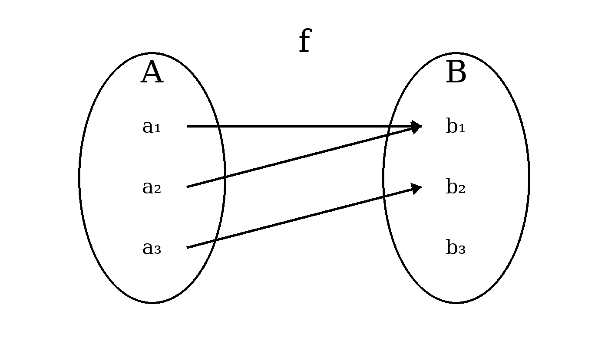
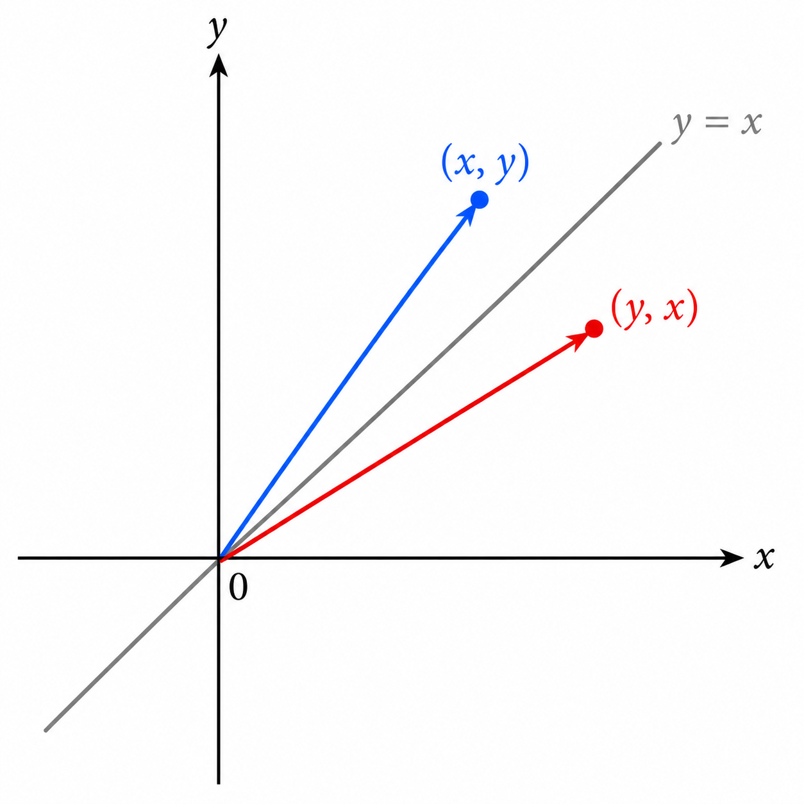
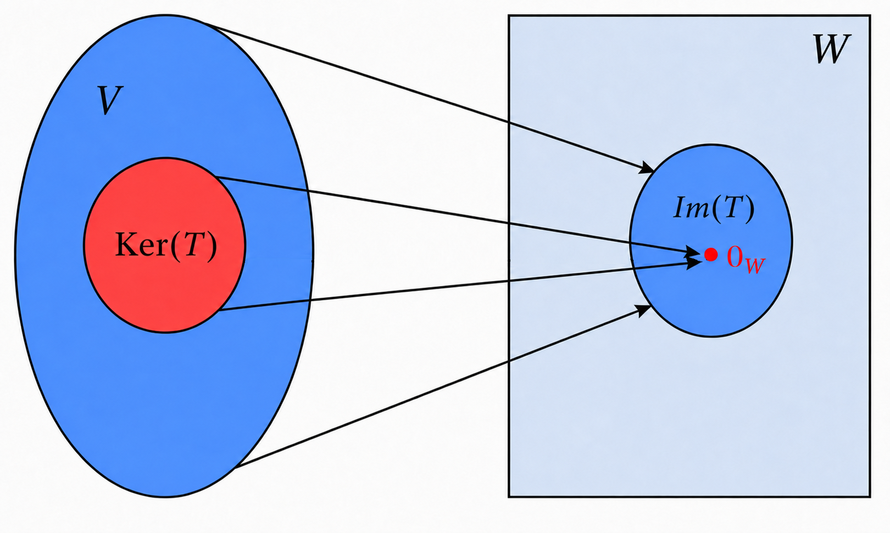
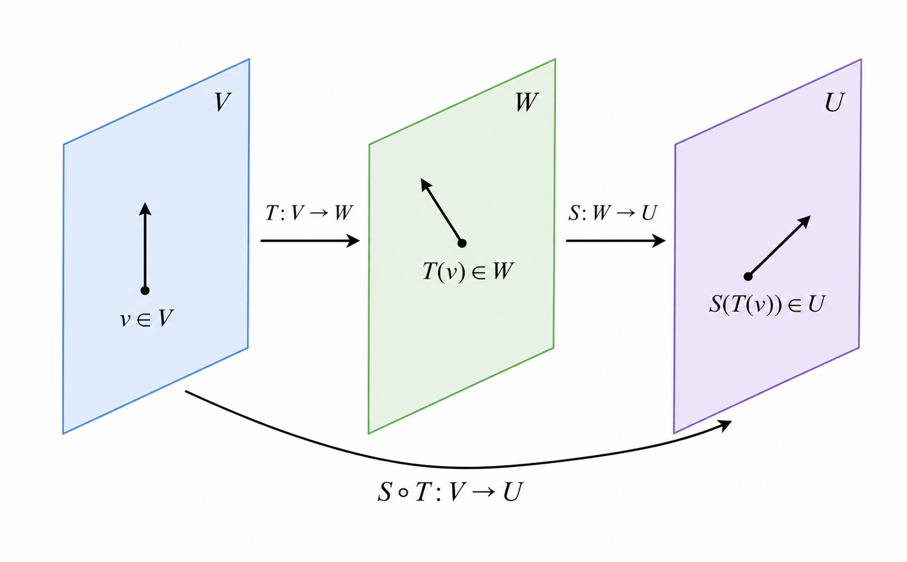
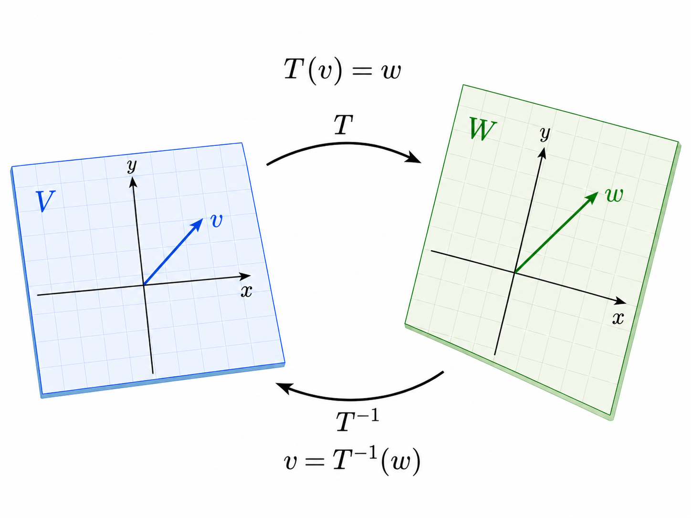

# העתקות לינאריות {#sec-linearmaps}

בקורסי חדו\"א עוסקים בהרחבה בפונקציות של משתנה ממשי (בהמשך עוברים למספר משתנים). באופן יותר כללי במתמטיקה, פונקציה מתארת חוק שמקשר בין קלט לפלט: לכל אובייקט במרחב אחד מותאם אובייקט במרחב אחר (אובייקטים אלה אינם בהכרח מספרים). פונקציות יכולות להיות פשוטות או מורכבות מאוד, ולעיתים קשה להבין את פעולתן על כל הקלטים האפשריים.

באלגברה לינארית מתמקדים במחלקה מיוחדת של פונקציות -- העתקות לינאריות. אלו פונקציות בין מרחבים וקטוריים השומרות על חיבור וכפל בסקלר (בדומה לתכונות של כפל מטריצה בוקטור), ולכן ההתנהגות שלהן נקבעת לחלוטין על ידי פעולתן על וקטורי בסיס כלשהו למרחב המקורי (תחום ההעתקה). תכונה זו מאפשרת תיאור מלא בעזרת מטריצות ונותנת כלים חזקים לניתוח וחישוב. נשים דגש על הקשר בין העתקות לינאריות למטריצות.

בהנדסה, העתקות לינאריות משמשות כמודל בסיסי למערכות רבות, כגון מערכות חשמליות, מערכות מכניות, מערכות בקרה ועיבוד אותות. במערכות כאלה מתקיים בהרבה מקרים עקרון הסופרפוזיציה: השפעתם של כמה קלטים על מערכת היא סכום ההשפעות של כל קלט בנפרד, וכפל קלט בסקלר גורר שכפול זהה של הפלט. לדוגמה, במעגל חשמלי לינארי, אם מקור מתח אחד יוצר זרם מסוים ומקור נוסף יוצר זרם אחר, אז הפעלת שניהם יחד תיצור זרם שהוא סכום הזרמים שכל אחד יוצר לבדו.

המשמעות המתמטית של סופרפוזיציה היא שניתן לתאר את הקשר בין קלט לפלט באמצעות העתקה לינארית. גם כאשר המערכת האמיתית אינה לינארית לחלוטין, מהנדסים משתמשים בהעתקות לינאריות כקירוב מקומי המאפשר ניתוח, חישוב ותכנון יעילים.

## הגדרות ותכונות

נעבור להגדרה המדויקת של פונקציה כהקדמה להגדרה של העתקה לינארית:

::: definition
יהיו קבוצות $A,B\neq\emptyset$. פונקציה $f$ מקבוצה $A$ ל- $B$ מתאימה לכל איבר $a\in A$ בדיוק איבר אחד $b\in B$. מסמנים $f:A\to B$ וגם $b=f(a)$. $A$ נקראת התחום של $f$, ו- $B$ נקראת הטווח שלה.
:::
{#fig-Function width="60%" fig-align="center"}

::: remark
בהקשרים מסוימים יש מילים נרדפות לפונקציה, כמו \"העתקה\", \"טרנספורמציה\" ו\"אופרטור\". בקורס שלנו נדבר על העתקות, ובפרט העתקות לינאריות. העתקה לינארית היא פונקציה בין מרחבים וקטוריים שמקיימת זוג תכונות שיחד נקראות \"לינאריות\".
:::
::: definition
יהיו $V,W$ מרחבים וקטוריים מעל $\mathbb{F}$. פונקציה $T:V\to W$ נקראת העתקה לינארית (ה\"ל) אם לכל $v_1,v_2\in V$ ולכל $\alpha\in\mathbb{F}$ מתקיים: $$\left\{
\begin{aligned}
T(v_1+v_2) &= T(v_1)+T(v_2)\\
T(\alpha v_1) &= \alpha T(v_1)
\end{aligned}
\right.$$
:::
::: remark
כאשר נתייחס לה\"ל $T:V\to W$ ההנחה המובלעת היא ש- $V,W$ הם מרחבים וקטוריים מעל $\mathbb{F}$. אין משמעות ללינאריות בלי מרחבים וקטוריים.

שימו לב שהחיבור $v_1+v_2$ מתבצע במרחב $V$, ואילו החיבור $T(v_1)+T(v_2)$ מתבצע במרחב $W$. כנ\"ל לכפל בסקלר - כל פעולה מתבצעת במרחב הרלוונטי. אז הסימונים קצת מתעתעים, כי זה לא בהכרח אותו סוג חיבור או אותו סוג של כפל בסקלר בשני המרחבים.
:::
::: example
 

1.  $f:\mathbb{R}\to\mathbb{R}$ המוגדרת ע\"י $f(x)=2x$ היא ה\"ל (ניתן לחשוב על $\mathbb{R}$ כעל $\mathbb{R}^1$, שהוא מ\"ו ממימד $1$). לכל $x_1,x_2,\alpha\in\mathbb{R}$ מתקיים: $$\left\{
    \begin{aligned}
    f(x_1+x_2)&=2(x_1+x_2)=2x_1+2x_2=f(x_1)+f(x_2) \\
    f(\alpha x)&=2(\alpha x)=\alpha(2x)=\alpha f(x)
    \end{aligned}
    \right.$$

2.  $T:\mathbb{R}^2\to\mathbb{R}$ המוגדרת ע\"י $T\begin{pmatrix}x \\y\end{pmatrix}=x+y$ היא ה\"ל. לכל $\begin{pmatrix}x_1 \\y_1\end{pmatrix},\begin{pmatrix}x_2 \\y_2\end{pmatrix}\in\mathbb{R}^2$ ולכל $\alpha\in\mathbb{F}$ מתקיים $$\begin{aligned}
    T\left(\begin{pmatrix}x_1 \\y_1\end{pmatrix}+\begin{pmatrix}x_2 \\y_2\end{pmatrix}\right)&=T\begin{pmatrix}x_1+x_2 \\y_1+y_2\end{pmatrix}=(x_1+x_2)+(y_1+y_2)\\
    &=(x_1+y_1)+(x_2+y_2)=T\begin{pmatrix}x_1 \\y_1\end{pmatrix}+T\begin{pmatrix}x_2 \\y_2\end{pmatrix}
    \end{aligned}$$ וגם $$.T\left(\alpha\begin{pmatrix}x_1 \\y_1\end{pmatrix}\right)=T\begin{pmatrix}\alpha x_1 \\\alpha y_1\end{pmatrix}=\alpha x_1+\alpha y_1=\alpha(x_1+y_1)=\alpha T\begin{pmatrix}x_1 \\y_1\end{pmatrix}$$

3.  הפונקציה $f:\mathbb{R}\to\mathbb{R}$ המוגדרת ע\"י $f(x)=x+1$ אינה ה\"ל. בתור דוגמה נגדית, ניקח $x_1=0,x_2=1,\alpha=2$ ונקבל $$.f(x_1+x_2)=f(1)=2\neq 1+2=f(0)+f(1)=f(x_1)+f(x_2)$$ לחילופין, ניתן להפריך לינאריות גם לפי התכונה השנייה: $$f(2x_1)=f(0)=1\neq 2\cdot 1=2f(0)=2f(x_1)$$ כאן הפרכנו את שתי התכונות בהגדרה של ה\"ל, אך מספיק להפריך אחת.

4.  הפונקציה $f:\mathbb{R}\to\mathbb{R}$ המוגדרת ע\"י $f(x)=x^2$ אינה ה\"ל. בתור דוגמה נגדית, ניקח $x_1=1,x_2=-1,\alpha=2$ ונקבל $$.f(x_1+x_2)=f(0)=0\neq 1+1=f(1)+f(-1)=f(x_1)+f(x_2)$$ שוב ניתן להפריך לינאריות גם לפי התכונה השנייה: $$f(2x_1)=f(2)=4\neq 2\cdot 1=2f(1)=2f(x_1)$$

5.  העתקת השחלוף $T:\mathbb{M}_{m\times n}(\mathbb{F})\to\mathbb{M}_{n\times m}(\mathbb{F})$ המוגדרת ע\"י $T(A)=A^t$ היא לינארית. הוכחנו זאת בטענה [??](chapter_3.qmd#prp-transpose), לפיה לכל $A,B\in\mathbb{M}_{m\times n}(\mathbb{F})$ ולכל $\alpha\in\mathbb{F}$ מתקיים: $$\left\{
    \begin{aligned}
    T(A+B)&=(A+B)^t=A^t+B^t=T(A)+T(B) \\
    T(\alpha A)&=(\alpha A)^t=\alpha A^t=\alpha T(A)
    \end{aligned}
    \right.$$

6.  יהי $V$ מ\"ו מעל $\mathbb{F}$ ממימד $n$ עם בסיס סדור $B$. הפונקציה $T:V\to\mathbb{F}^n$ המוגדרת ע\"י $T(v)=[v]_B$ היא לינארית. הוכחנו זאת בטענה [??](chapter_5.qmd#prp-coordinates-linear), לפיה לכל $v_1,v_1\in V$ ולכל $\alpha\in\mathbb{F}$ מתקיים: $$\left\{
    \begin{aligned}
    T(v_1+v_2)&=[v_1+v_2]_B=[v_1]_B+[v_2]_B=T(v_1)+T(v_2) \\
    T(\alpha v_1)&=[\alpha v_1]_B=\alpha[v_1]_B=\alpha T(v_1)
    \end{aligned}
    \right.$$
:::
למעשה, יש הרבה מאוד פונקציות מהצורה $T:\mathbb{F}\to\mathbb{F}$ כפי שרואים בחדו\"א. אבל אם דורשים לינאריות, אז נגלה כי כמות הפונקציות מצטמצמת פלאים וכל פונקציה כזו (ה\"ל) היא בעלת נוסחה פשוטה מאוד. זה נכון בין אם $\mathbb{F}=\mathbb{R}$ או $\mathbb{F}=\mathbb{C}$.

::: proposition
*תהי $T:\mathbb{F}\to\mathbb{F}$ ה\"ל. אז קיים $c\in\mathbb{F}$ כך ש- $T(x)=cx$.*
:::
::: proof
נסמן $c=T(1)$. מלינאריות, לכל $x\in\mathbb{F}$ מתקיים $$.T(x)=T(x\cdot 1)=xT(1)=x\cdot c=cx$$ שימו לב שתחילה התייחסנו אל $x$ כוקטור ואחר כך כסקלר (הוא שניהם במקרה של $\mathbb{F}$). ◻
:::
נרצה להוכיח תכונות נוספות של ה\"ל, שנובעות מהתכונות בהגדרה. אכן, העתקה לינארית מתנהגת יפה ביחס לחיבור וקטורי וכפל בסקלר, ולכן היא גם מתנהגת יפה ביחס לצירופים לינאריים במובן של הטענה הבאה:

::: {.proposition #prp-more-linearity}
*יהיו $V,W$ מרחבים וקטוריים מעל $\mathbb{F}$, ותהי $T:V\to W$ ה\"ל. אז מתקיים:*

1.  *לכל $v_1,...,v_k\in V$ ולכל $\alpha_1,...,\alpha_k\in \mathbb{F}$ מתקיים $$.T(\alpha_1 v_1+...+\alpha_k v_k)=\alpha_1 T(v_1)+...+\alpha_k T(v_k)$$*

2.  *$$.T(0_V)=0_W$$*
:::
::: proof
 

1.  יהיו $v_1,...,v_k\in V$ ו- $\alpha_1,...,\alpha_k\in \mathbb{F}$. נשתמש בתכונת החיבור של לינאריות (לשני מחוברים) מספר חוזר של פעמים כדי להוציא כל מחובר מחוץ לסוגריים אחד אחרי השני (ההוכחה הפורמלית היא באינדוקציה למי שמכיר):

    $$\begin{aligned}
    &T(\alpha_1 v_1+...+\alpha_{k-1}v_{k-1}+\alpha_k v_k)=T(\alpha_1 v_1+...+\alpha_{k-1}v_{k-1})+T(\alpha_k v_k)\\
    &=T(\alpha_1 v_1+...+\alpha_{k-2}v_{k-2})+T(\alpha_{k-1}v_{k-1})+T(\alpha_k v_k)=...\\
    &=T(\alpha_1 v_1)+...+T(\alpha_k v_k)=\alpha_1T(v_1)+...+\alpha_k T(v_k)
    \end{aligned}$$ במעבר האחרון הוצאנו סקלר מכל ערך של $T$ לחוד.

2.  מתקיים $$.T(0_V)=T(0\cdot 0_V)=0\cdot T(0_V)=0_W$$

 ◻
:::
::: {#fig-LinearMap .figure}
{width=800 height=800}
<figcaption>ה"ל פועלת לחוד על וקטורי הבסיס של מרחב התחום, והיא שולחת כל צירוף לינארי שלהם לצירוף הלינארי המתאים של איברי התמונות שלהם</figcaption>
:::

::: exercise
האם $T:\mathbb{R}^3\to M_{2\times 2}(\mathbb{R})$ המוגדרת ע\"י $$T\begin{pmatrix}x\\y\\z\end{pmatrix}=\begin{pmatrix}
x+1 & y \\
z & 0
\end{pmatrix}$$ היא ה\"ל?
:::
::: {.callout-note collapse="true" title="פתרון"}
$T$ אינה לינארית. הדרך הפשוטה ביותר להראות זאת היא לשים לב שמתקיים $$,T\begin{pmatrix}0\\0\\0\end{pmatrix}=\begin{pmatrix}
1 & 0 \\
0 & 0
\end{pmatrix}\neq \begin{pmatrix}
0 & 0 \\
0 & 0
\end{pmatrix}$$ בסתירה לתכונה (ב) מהטענה האחרונה,
:::
::: remark
התנאי $T(0_V)=0_W$ הוא הכרחי ללינאריות, אך הוא אינו מספיק. למשל, ראינו כבר כי הפונקציה $f:\mathbb{R}\to\mathbb{R}$ המוגדרת ע\"י $f(x)=x^2$ אינה ה\"ל, אם כי מתקיים $f(0)=0$.
:::
### העתקה לינארית המוגדרת ע\"י מטריצה

לאור כל מה שלמדנו על מטריצות, נוח לעבוד עם העתקה לינארית המוגדרת ע\"י מטריצה.

::: definition
תהי $A\in\mathbb{M}_{m\times n}(\mathbb{F})$. נגדיר $T_A:\mathbb{F}^n\to\mathbb{F}^m$ ע\"י $$T_A(v)=Av$$ לכל $v\in\mathbb{F}^n$.
:::
::: {.proposition #prp-matrix-map-linear}
*לכל $A\in\mathbb{M}_{m\times n}(\mathbb{F})$ ההעתקה $T_A:\mathbb{F}^n\to\mathbb{F}^m$ היא ה\"ל.*
:::
::: proof
ההוכחה מיידית לפי טענה [??](chapter_3.qmd#prp-matrix-vector). ◻
:::
::: {.example #exm-rotation}
1.  עבור $$A=\begin{pmatrix}
    1 & 1 
    \end{pmatrix}$$ נקבל ה\"ל $T_A:\mathbb{R}^2\to \mathbb{R}$ הנתונה ע\"י $$.T_A\begin{pmatrix}x\\y\end{pmatrix}=\begin{pmatrix}
    1 & 1 
    \end{pmatrix}\begin{pmatrix}x\\y\end{pmatrix}=x+y$$ ראינו אותה בדוגמה קודמת, אבל עכשיו הקשר למטריצה (וקטור שורה) ברור.

2.  עבור $$A=\begin{pmatrix}
    1 & 2 & -3 \\
    2 & 0 & 1
    \end{pmatrix}$$ נקבל ה\"ל $T_A:\mathbb{R}^3\to \mathbb{R}^2$ הנתונה ע\"י $$.T_A\begin{pmatrix}x\\y\\z\end{pmatrix}=\begin{pmatrix}
    1 & 2 & -3 \\
    2 & 0 & 1
    \end{pmatrix}\begin{pmatrix}x\\y\\z\end{pmatrix}=\begin{pmatrix}
    x+2y-3z \\
    2x+z
    \end{pmatrix}$$

3.  תהי $\theta\in\mathbb{R}$. נסמן $$.A=\begin{pmatrix}
    \cos{\theta} & -\sin{\theta} \\
    \sin{\theta} & \cos{\theta} 
    \end{pmatrix}$$ נקבל ה\"ל $T_A:\mathbb{R}^2\to \mathbb{R}^2$ הנתונה ע\"י $$.T_A\begin{pmatrix}x\\y\end{pmatrix}=\begin{pmatrix}
    \cos{\theta} & -\sin{\theta} \\
    \sin{\theta} & \cos{\theta} 
    \end{pmatrix}\begin{pmatrix}x\\y\end{pmatrix}=\begin{pmatrix}
    x\cos{\theta}-y\sin{\theta} \\
    x\sin{\theta}+y\cos{\theta}
    \end{pmatrix}$$

    במקרה זה ל- $T_A$ יש משמעות גיאומטרית של סיבוב וקטור הקלט $\begin{pmatrix}x\\y\end{pmatrix}$ בזווית $\theta$ נגד כיוון השעון, ולכן $A$ נקראת מטריצת סיבוב. זו פעולה אנלוגית להכפלת $z=x+iy$ במספר $e^{i\theta}=\cos{\theta}+i\sin{\theta}$ במישור המרוכב $\mathbb{C}$. אכן: $$(\cos{\theta}+i\sin{\theta})(x+iy)=x\cos{\theta}-y\sin{\theta}+i(x\sin{\theta}+y\cos{\theta})$$

4.  נסמן $$.A=\begin{pmatrix}
    0 & 1 \\
    1 & 0
    \end{pmatrix}$$ נקבל ה\"ל $T_A:\mathbb{R}^2\to \mathbb{R}^2$ הנתונה ע\"י $$.T_A\begin{pmatrix}x\\y\end{pmatrix}=\begin{pmatrix}
    0 & 1 \\
    1 & 0
    \end{pmatrix}\begin{pmatrix}x\\y\end{pmatrix}=\begin{pmatrix}
    y \\
    x
    \end{pmatrix}$$ כאן המשמעות הגיאומטרית של פעולת $T_A$ היא שיקוף ביחס לישר $y=x$.

    {#fig-Reflection width="50%" fig-align="center"}
:::

::: {#fig-Rotation .figure}
{width=800 height=800}
<figcaption>סימולציה - סיבוב וקטור בזווית</figcaption>
:::

::: exercise
הראו כי $T:\mathbb{R}^3\to\mathbb{R}^3$ הנתונה ע\"י $$T\begin{pmatrix}x\\y\\z\end{pmatrix}=\begin{pmatrix}2x+5y+z\\3x-y+2z\\y-5z\end{pmatrix}$$ היא ה\"ל.
:::
::: {.callout-note collapse="true" title="פתרון"}
נמצא $A\in\mathbb{M}_{3\times 3}(\mathbb{R})$ כך ש- $T=T_A$. מכך ינבע כי $T$ היא ה\"ל לפי טענה [10.11](#prp-matrix-map-linear). המעבר מהנוסחה של $T$ למטריצה $A$ אנלוגי לחלוטין למעבר מממ\"ל למטריצת המקדמים המצומצמת. לכן, עבור $$A=\begin{pmatrix}
2 & 5 & 1\\
3 & -1 & 2\\
0 & 1 & -5
\end{pmatrix}$$ נקבל $$.T_A\begin{pmatrix}x\\y\\z\end{pmatrix}=\begin{pmatrix}
2 & 5 & 1\\
3 & -1 & 2\\
0 & 1 & -5
\end{pmatrix}\begin{pmatrix}x\\y\\z\end{pmatrix}=\begin{pmatrix}2x+5y+z\\3x-y+2z\\y-5z\end{pmatrix}=T\begin{pmatrix}x\\y\\z\end{pmatrix}$$ זה בדיוק מראה כי $T=T_A$, ולכן היא ה\"ל.
:::
בינתיים ראינו כי לכל $A\in\mathbb{M}_{m\times n}(\mathbb{F})$ מתאימה ה\"ל $T_A:\mathbb{F}^n\to\mathbb{F}^m$. מה לגבי הכיוון השני? כלומר, האם כל ה\"ל $T:\mathbb{F}^n\to\mathbb{F}^m$ מתאימה למטריצה מסדר מתאים? התשובה חיובית, ומטריצה זו נקבעת ביחידות. זה מראה כי יש קשר הדוק בין מטריצות להעתקות לינאריות.

::: {.proposition #prp-unique-matrix}
*תהי $T:\mathbb{F}^n\to\mathbb{F}^m$ ה\"ל. אז קיימת $A\in\mathbb{M}_{m\times n}(\mathbb{F})$ כך ש- $T=T_A$.*
:::
::: proof
לכל $\begin{pmatrix}x_1\\\vdots\\x_n\end{pmatrix}\in\mathbb{F}^n$ מתקיים: $$\begin{aligned}
T\begin{pmatrix}x_1\\\vdots\\x_n\end{pmatrix}&=T(x_1e_1+...+x_ne_n)=x_1T(e_1)+...+x_nT(e_n)\\
&=\begin{pmatrix}
\mid & \mid &        & \mid \\
T(e_1) & T(e_2) & \cdots & T(e_n) \\
\mid & \mid &        & \mid
\end{pmatrix}\begin{pmatrix}x_1\\\vdots\\x_n\end{pmatrix}
\end{aligned}$$ אם כן, נבחר את $A$ להיות המטריצה שעמודותיה הן $T(e_1),...,T(e_n)$: $$A=\begin{pmatrix}
\mid & \mid &        & \mid \\
T(e_1) & T(e_2) & \cdots & T(e_n) \\
\mid & \mid &        & \mid
\end{pmatrix}$$ החישוב הקודם בדיוק מראה כי $T=T_A$ כנדרש. ◻
:::
::: example
נתונה ה\"ל $T:\mathbb{R}^2\to\mathbb{R}^2$ המקיימת $$.T\begin{pmatrix}1 \\ 0\end{pmatrix}=\begin{pmatrix}1 \\ 2\end{pmatrix},\quad T\begin{pmatrix}0 \\ 1\end{pmatrix}=\begin{pmatrix}-2 \\ 1\end{pmatrix}$$

לפי הנתונים והוכחת טענה [10.14](#prp-unique-matrix) מתקיים $T=T_A$ עבור $$.A=\begin{pmatrix}
1 & -2 \\
2 & 1
\end{pmatrix}$$

כדאי גם להבין זאת ע\"י בדיקה ישירה. לכל $\begin{pmatrix}x\\y\end{pmatrix}\in\mathbb{R}^2$ מתקיים:

$$\begin{aligned}
T\begin{pmatrix}x\\y\end{pmatrix}&=T\left(x\cdot\begin{pmatrix}1\\0\end{pmatrix}+y\cdot\begin{pmatrix}0\\1\end{pmatrix}\right)=x\cdot T\begin{pmatrix}1\\0\end{pmatrix}+y\cdot T\begin{pmatrix}0\\1\end{pmatrix}\\
&=x\cdot\begin{pmatrix}1 \\ 2\end{pmatrix}+y\cdot\begin{pmatrix}-2 \\ 1\end{pmatrix}=\begin{pmatrix}x-2y \\ 2x+y \end{pmatrix}
\end{aligned}$$ ולכן $$.T\begin{pmatrix}x\\y\end{pmatrix}=\begin{pmatrix}
1 & -2 \\
2 & 1
\end{pmatrix}\begin{pmatrix}x\\y\end{pmatrix}$$
:::
## קיום ויחידות העתקה לינארית לפי בסיס {#sec-map-by-basis}

ראינו כי במקרה הפרטי של ה\"ל $T:\mathbb{F}^n\to\mathbb{F}^m$, הערכים $T(e_1),...,T(e_n)$ קובעים את $T$ ביחידות - ואף הצלחנו לבטא את הקשר ע\"י מטריצה בטענה [10.14](#prp-unique-matrix). נרצה להוכיח משפט כללי יותר על ה\"ל בין מרחבים וקטוריים שאינם בהכרח מהצורה $\mathbb{F}^k$, וגם עבור ערכים המתאימים לוקטורי בסיס שאינו בהכרח סטנדרטי. המשפט הבא נקרא \"משפט ההגדרה של ה\"ל\".

::: {.theorem #thm-exist-unique}
*יהיו $V,W$ מרחבים וקטוריים מעל $\mathbb{F}$, $B=\Set{v_1,...,v_n}$ בסיס ל- $V$ ו- $\Set{w_1,...,w_n}\subseteq W$ תת-קבוצה כלשהי. אז קיימת ויחידה ה\"ל $T:V\to W$ המקיימת $$.T(v_1)=w_1,...,T(v_n)=w_n$$*
:::
::: proof
יהי $v\in V$. נסמן $$.[v]_B=\begin{pmatrix}\alpha_1\\ \vdots \\ \alpha_n\end{pmatrix}$$ בתור התחלה, נניח שקיימת ה\"ל $T:V\to W$ השולחת כל $v_k$ ל- $w_k$ המתאים. אז לפי טענה [10.7](#prp-more-linearity) בהכרח מתקיים $$.T(v)=T(\sum_{k=1}^n \alpha_k v_k)=\sum_{k=1}^n \alpha_k T(v_k)=\sum_{k=1}^n \alpha_k w_k$$ אם כך, נפעל בכיוון ההפוך: נגדיר $$,T(v)=\sum_{k=1}^n \alpha_k w_k$$ ונוכיח לינאריות. אם נצליח, הרי ש- $T$ היא הה\"ל היחידה שמקיימת את הדרישות. ובכן, יהי $w\in V$ ונסמן $$.[w]_B=\begin{pmatrix}\beta_1\\ \vdots \\ \beta_n\end{pmatrix}$$ מתקיים $$,[v+w]_B=\begin{pmatrix}\alpha_1+\beta_1\\ \vdots \\ \alpha_n +\beta_n\end{pmatrix}$$ ומכאן נקבל לפי הגדרת $T$: $$\begin{aligned}
T(v+w)&=T(\sum_{k=1}^n(\alpha_k+\beta_k)v_k)=\sum_{k=1}^n(\alpha_k+\beta_k)w_k \\
&=\sum_{k=1}^n\alpha_kw_k+\sum_{k=1}^n\beta_kw_k=T(v)+T(w)
\end{aligned}$$ נבדוק גם כפל בסקלר: לכל $\gamma\in\mathbb{F}$ מתקיים $$.T(\gamma v)=T(\sum_{k=1}^n\gamma\alpha_kv_k)=\sum_{k=1}^n\gamma\alpha_kw_k=\gamma\sum_{k=1}^n\alpha_k w_k =\gamma T(v)$$ ◻
:::
::: remark
נניח כי $V,W$ מרחבים וקטוריים מעל $\mathbb{F}$ כך ש- $\dim(V)=n$. אם מחפשים ה\"ל $T:V\to W$ המקיימת $$,\forall 1\leq i\leq k \quad T(v_i)=w_i$$ יש כמה מקרים:

-   $S=\Set{v_1,...,v_k}$ היא בסיס ל- $V$ (בפרט $k=n$). במקרה זה, קיימת ה\"ל $T$ יחידה לפי משפט ההגדרה.

-   $S$ בת\"ל, אך $k<n$. במקרה זה, $T$ קיימת אך אינה יחידה, כי ניתן להשלים את $S$ לבסיס ל- $V$ ע\"י הוספת וקטורים $v_{k+1},...,v_n$. הערכים $T(v_{k+1}),...,T(v_n)$ שרירותיים כי אין שום דרך לקבוע אותם לפי הנתונים. כל בחירה של הערכים החדשים היא לגיטימית ולכל אחת מתאימה ה\"ל $T$, כך שיש אינסוף אפשרויות ל- $T$ המקיימות את הנתונים.

-   $S$ ת\"ל. במקרה זה יש לחלץ תת-קבוצה בת\"ל בגודל מקסימלי, נניח $S'=\Set{v_1,...,v_j}$ עבור $j<k$. יש לבדוק כי הערכים $T(v_{j+1}),...,T(v_n)$ מקיימים את דרישת הלינאריות. כלומר, לכל $j<i\leq k$ קיימים $a_1,...,a_j\in\mathbb{F}$ כך ש- $$,v_i=a_1v_1+...+a_jv_j$$ ולכן צריך להתקיים $$.T(v_i)=a_1T(v_1)+...+a_jT(v_j)$$ אם זה לא מתקיים אפילו עבור ערך אחד של $j<i\leq k$, אז זו סתירה ללינאריות ולכן לא קיימת ה\"ל $T$ שמקיימת את הנתונים. אחרת, צריך למצוא את $T$ לפי הנתונים הקשורים ל- $S'$. אם $j=n$, אז קיבלנו את המקרה הראשון (שמתאים למשפט). אם $j<n$, אז קיבלנו את המקרה השני (וצריך להשלים לבסיס ולבחור ערכים שרירותיים).
:::
::: example
 

1.  נברר אם קיימת ה\"ל $T:\mathbb{R}^3\to\mathbb{R}^3$ המקיימת $$.T\underbrace{\begin{pmatrix}1\\-1\\1\end{pmatrix}}_{v_1}=\begin{pmatrix}1\\2\\3\end{pmatrix},\quad T\underbrace{\begin{pmatrix}2\\1\\0\end{pmatrix}}_{v_2}=\begin{pmatrix}4\\-1\\0\end{pmatrix},\quad T\underbrace{\begin{pmatrix}4\\-1\\2\end{pmatrix}}_{v_3}=\begin{pmatrix}0\\0\\0\end{pmatrix}$$ נשים לב כי וקטורי הקלט $v_1,v_2,v_3$ הם ת\"ל. יש למצוא את משוואת התלות הלינארית ביניהם ולבדוק שוקטורי הפלט גם מקיימים אותה. דירוג מראה כי $$.v_3=2v_1+v_2$$ נניח בשלילה שקיימת ה\"ל $T$ שמקיימת את הנתונים. אז נובע כי $$,T(v_3)=2T(v_1)+T(v_2)$$ ולאחר הצבת הנתונים נקבל $$.\begin{pmatrix}0\\0\\0\end{pmatrix}=2\begin{pmatrix}1\\2\\3\end{pmatrix}+\begin{pmatrix}4\\-1\\0\end{pmatrix}$$ זו סתירה כי אגף ימין שווה ל- $\begin{pmatrix}6\\3\\6\end{pmatrix}$. המסקנה היא שלא קיימת ה\"ל $T$ המקיימת את הנתונים.

2.  נמצא $T:\mathbb{R}^3\to\mathbb{R}^3$ המקיימת $$.T\begin{pmatrix}1\\-1\\1\end{pmatrix}=\begin{pmatrix}1\\2\\3\end{pmatrix},\quad T\begin{pmatrix}2\\1\\0\end{pmatrix}=\begin{pmatrix}4\\-1\\0\end{pmatrix},\quad T\begin{pmatrix}4\\-1\\2\end{pmatrix}=\begin{pmatrix}6\\3\\6\end{pmatrix}$$

    אלה הנתונים הקודמים עם שינוי אחד: כעת $T(v_3)=\begin{pmatrix}6\\3\\6\end{pmatrix}$ בהתאם לחישוב שנובע מהתלות הלינארית בין וקטורי הקלט. המשמעות היא שנתון זה מיותר, כי הוא נובע משני הנתונים האחרים. אז קיימות אינסוף אפשרויות לה\"ל המקיימת את הנתונים. מדוע אינסוף? כדי למצוא נוסחה ל- $T$ צריך להשלים את $\Set{v_1,v_2}$ לבסיס ל- $\mathbb{R}^3$. דירוג לפי שורות מראה כי ניתן לעשות זאת ע\"י הוספת הוקטור $e_3$ (כי בסוף הדירוג לא יהיה איבר מוביל בעמודה השלישית). הערך $T(e_3)$ נתון לבחירתנו, ומכאן יש אינסוף אפשרויות. נמצא אחת באופן מפורש ע\"י הבחירה השרירותית $T(e_3)=\begin{pmatrix}0\\0\\0\end{pmatrix}$. נסמן $$.B=\Set{v_1,v_2,e_3}$$

    יהי $\begin{pmatrix}x\\y\\z\end{pmatrix}\in\mathbb{R}^3$. נחשב את $\left[\begin{pmatrix}x\\y\\z\end{pmatrix}\right]_B$, ואז נשתמש בקוארדינטות כדי לחשב את $T\begin{pmatrix}x\\y\\z\end{pmatrix}$. נדרג את המטריצה הבאה: $$\left(\begin{array}{ccc|c}
    1 & 2 & 0 & x \\
    -1 & 1 & 0 & y \\
    1 & 0 & 1 & z
    \end{array}\right)$$ צורתה המדורגת קנונית היא (בדקו זאת): $$\left(\begin{array}{ccc|c}
    1 & 0 & 0 & \frac{x-2y}{3} \\
    0 & 1 & 0 & \frac{x+y}{3} \\
    0 & 0 & 1 & \frac{-x+2y+3z}{3}
    \end{array}\right)$$

    לכן, מתקיים $$.\begin{pmatrix}x\\y\\z\end{pmatrix}=\frac{x-2y}{3}\cdot\begin{pmatrix}1\\-1\\0\end{pmatrix}+\frac{x+y}{3}\cdot\begin{pmatrix}2\\1\\0\end{pmatrix}+\frac{-x+2y+3z}{3}\cdot\begin{pmatrix}0\\0\\1\end{pmatrix}$$ נפעיל את $T$ על שני האגפים ונקבל: $$\begin{aligned}
    T\begin{pmatrix}x\\y\\z\end{pmatrix}&=\frac{x-2y}{3}\cdot T\begin{pmatrix}1\\-1\\1\end{pmatrix}+\frac{x+y}{3}\cdot T\begin{pmatrix}2\\1\\0\end{pmatrix}+\frac{-x+2y+3z}{3}\cdot T\begin{pmatrix}0\\0\\1\end{pmatrix} \\
    &=\frac{x-2y}{3}\cdot \begin{pmatrix}1\\2\\3\end{pmatrix}+\frac{x+y}{3}\cdot \begin{pmatrix}4\\-1\\0\end{pmatrix}+\frac{-x+2y+3z}{3}\cdot\begin{pmatrix}0\\0\\0\end{pmatrix}\\
    &=\begin{pmatrix}\frac{5x+2y}{3}\\\frac{x-5y}{3}\\x-2y\end{pmatrix}
    \end{aligned}$$ לסיכום, מצאנו דוגמה (אחת מתוך אינסוף) לה\"ל שמקיימת את הנתונים: $$T\begin{pmatrix}x\\y\\z\end{pmatrix}=\begin{pmatrix}\frac{5x+2y}{3}\\\frac{x-5y}{3}\\x-2y\end{pmatrix}$$
:::
::: exercise
נסמן $$,v_1=\begin{pmatrix}1\\1\\0\end{pmatrix},\quad v_2=\begin{pmatrix}0\\1\\0\end{pmatrix},\quad v_3=\begin{pmatrix}0\\1\\1\end{pmatrix},\quad v_4=\begin{pmatrix}1\\1\\1\end{pmatrix}$$ ובנוסף $$.w_1=\begin{pmatrix}2\\1\end{pmatrix},\quad w_2=\begin{pmatrix}2\\2\end{pmatrix},\quad w_3=\begin{pmatrix}1\\2\end{pmatrix},\quad w_4=\begin{pmatrix}1\\1\end{pmatrix}$$ מצאו נוסחה לה\"ל $T:\mathbb{R}^3\to\mathbb{R}^2$ המקיימת $T(v_k)=w_k$ לכל $1\leq k\leq 4$.
:::
::: {.callout-note collapse="true" title="פתרון"}
הקבוצה $\Set{v_1,v_2,v_3,v_4}$ בהכרח ת\"ל כי יש בה ארבעה וקטורים - יותר מהמימד של $\mathbb{R}^3$. דירוג מראה כי מתקיים $$.\begin{pmatrix}1\\1\\0\end{pmatrix}-\begin{pmatrix}0\\1\\0\end{pmatrix}+\begin{pmatrix}0\\1\\1\end{pmatrix}- \begin{pmatrix}1\\1\\1\end{pmatrix}=\begin{pmatrix}0\\0\\0\end{pmatrix}$$ נבדוק שאין סתירה בנתונים. נפעיל את $T$ על שני האגפים, נציב את הנתונים ונקבל $$.\begin{pmatrix}2\\1\end{pmatrix}-\begin{pmatrix}2\\2\end{pmatrix}+\begin{pmatrix}1\\2\end{pmatrix}-\begin{pmatrix}1\\1\end{pmatrix}=\begin{pmatrix}0\\0\end{pmatrix}$$

אם כן, אין סתירה וקיימת ויחידה $T$ כנ\"ל לפי משפט ההגדרה. ניתן לדלל כל אחד מהוקטורים $v_1,v_2,v_3,v_4$ ולקבל בסיס ל- $\mathbb{R}^3$. נבחר את $B=\Set{v_1,v_2,v_3}$. כעת, יהי $\begin{pmatrix}x\\y\\z\end{pmatrix}\in\mathbb{R}^3$. נחשב וקטור קוארדינטות ע\"י דירוג המטריצה הבאה: $$\left(\begin{array}{ccc|c}
1 & 0 & 0 & x \\
1 & 1 & 1 & y \\
0 & 0 & 1 & z
\end{array}\right)\xrightarrow[R_2\to R_2-R_3]{R_2\to R_2-R_1}\left(\begin{array}{ccc|c}
1 & 0 & 0 & x \\
0 & 1 & 0 & y-x-z \\
0 & 0 & 1 & z
\end{array}\right)$$ לכן, מתקיים $\left[\begin{pmatrix}x\\y\\z\end{pmatrix}\right]_B=\begin{pmatrix}x\\y-x-z\\z\end{pmatrix}$ ובאופן שקול $$.\begin{pmatrix}x\\y\\z\end{pmatrix}=x\cdot\begin{pmatrix}1\\1\\0\end{pmatrix}+(y-x-z)\cdot\begin{pmatrix}0\\1\\0\end{pmatrix}+z\cdot\begin{pmatrix}0\\1\\1\end{pmatrix}$$ נפעיל את $T$ על שני האגפים, נציב את הנתונים ונקבל $$.T\begin{pmatrix}x\\y\\z\end{pmatrix}=x\cdot\begin{pmatrix}2\\1\end{pmatrix}+(y-x-z)\cdot\begin{pmatrix}2\\2\end{pmatrix}+z\cdot\begin{pmatrix}1\\2\end{pmatrix}=\begin{pmatrix}2y-z\\2y-x\end{pmatrix}$$
:::
## גרעין ותמונה

אנחנו רגילים לפתור ממ\"ליות. עבור $A\in\mathbb{M}_{m\times n}(\mathbb{F})$ הסתכלנו על ממ\"ליות הומוגניות מהצורה $Ax=\underline{0}$, וראינו כי קבוצת הפתרונות היא למעשה תת-מרחב של $\mathbb{F}^n$ שנקרא מרחב הפתרונות $\mathop{\mathrm{N}}(A)$. לעומת זאת, גם ראינו כי קבוצת כל הוקטורים $b\in\mathbb{F}^m$ עבורם יש פתרון לממ\"ל $Ax=b$, היא תת-מרחב של $\mathbb{F}^m$ שנקרא מרחב העמודות $\mathop{\mathrm{Col}}(A)$.

למעשה, מדובר במקרים פרטיים של שתי הגדרות יותר כלליות הקשורות להעתקה לינארית.

::: definition
תהי $T:V\to W$ ה\"ל.

-   הגרעין (kernel) של $T$ מוגדר להיות $$.\mathop{\mathrm{Ker}}(T)=\Set{v\in V|T(v)=0_W}\subseteq V$$

-   התמונה (image) של $T$ מוגדרת להיות $$.\mathop{\mathrm{Im}}(T)=\Set{T(v)|v\in V}\subseteq W$$
:::
{#fig-KernelImage width="60%" fig-align="center"}

תמונה של פונקציה היא מושג כללי שנתקלים בו גם בקורסים מתמטיים אחרים (למשל חדו\"א), ואפשר לחשוב עליה כעל קבוצת כל האיברים בטווח שיש להם מקורות בתחום (לפחות אחד לכל אחד). לעומת זאת, גרעין הוא קבוצת כל האיברים בתחום שנשלחים לוקטור האפס. בקורס שלנו גם לתמונה וגם לגרעין יש \"אופי לינארי\", כלומר שניהם הם תת-מרחבים.

::: proposition
*תהי $T:V\to W$ ה\"ל. אז מתקיים:*

-   *$\mathop{\mathrm{Ker}}(T)$ היא תת-מרחב של $V$.*

-   *$\mathop{\mathrm{Im}}(T)$ היא תת-מרחב של $W$.*
:::
::: proof
ראשית, מתקיים $0_V\in\mathop{\mathrm{Ker}}(T)$ כי $T(0_V)=0_W$ לפי סעיף ב' של טענה [10.7](#prp-more-linearity). זה גם מראה כי $0_W\in\mathop{\mathrm{Im}}(T)$.

לכל קבוצה נבדוק סגירות לחיבור וכפל בסקלר.

1.  יהיו $v_1,v_2\in \mathop{\mathrm{Ker}}(T), \alpha\in\mathbb{F}$. מתקיים $$,T(v_1+v_2)=T(v_1)+T(v_2)=0_W+0_W=0_W$$ ולכן $v_1+v_2\in\mathop{\mathrm{Ker}}(T)$. באופן דומה: $$,T(\alpha v_1)=\alpha T(v_1)=\alpha\cdot 0_W=0_W$$ ולכן $\alpha v_1\in\mathop{\mathrm{Ker}}(T)$.

2.  יהיו $w_1,w_2\in \mathop{\mathrm{Im}}(T), \alpha\in\mathbb{F}$. קיימים $u_1,u_2\in V$ כך ש- $$.w_1=T(u_1),\quad w_2=T(u_2)$$ נשים לב כי $$,T(u_1+u_2)=T(u_1)+T(u_2)=w_1+w_2$$ ובפרט מתקיים $w_1+w_2\in\mathop{\mathrm{Im}}(T)$. באופן דומה: $$,T(\alpha u_1)=\alpha T(u_1)=\alpha w_1$$ ולכן $\alpha w_1\in\mathop{\mathrm{Im}}(T)$.

 ◻
:::
::: example
תהי $T:\mathbb{M}_{2\times 2}(\mathbb{R})\to \mathbb{R}^2$ הנתונה ע\"י $$.T\begin{pmatrix}
a & b \\
c & d
\end{pmatrix}=\begin{pmatrix}
a+b \\
c+d
\end{pmatrix}$$ לפי הגדרת הגרעין, מתקיים: $$\begin{aligned}
\mathop{\mathrm{Ker}}(T)&=\Set{\begin{pmatrix}
a & b \\
c & d
\end{pmatrix}|\begin{pmatrix}
a+b \\
c+d
\end{pmatrix}=\begin{pmatrix}
0 \\
0
\end{pmatrix}}=\Set{\begin{pmatrix}
-s & s \\
-t & t
\end{pmatrix}|s,t\in \mathbb{R}} \\
&=\mathop{\mathrm{Span}}\left(\begin{pmatrix}
-1 & 1 \\
0 & 0
\end{pmatrix},\begin{pmatrix}
0 & 0 \\
-1 & 1
\end{pmatrix}\right)
\end{aligned}$$ לפי הגדרת התמונה, מתקיים: $$\begin{aligned}
\mathop{\mathrm{Im}}(T)&=\Set{T\begin{pmatrix}
a & b \\
c & d
\end{pmatrix}|\begin{pmatrix}
a & b \\
c & d
\end{pmatrix}\in\mathbb{M}_{2\times 2}(\mathbb{R})} \\
&=\Set{\begin{pmatrix}
a+b \\
c+d
\end{pmatrix}|a,b,c,d\in\mathbb{R}}=\mathop{\mathrm{Span}}\left(\begin{pmatrix}1\\0\end{pmatrix},\begin{pmatrix}0\\1\end{pmatrix}\right)=\mathbb{R}^2
\end{aligned}$$
:::
אחד היתרונות של ה\"ל הוא שמספיק לדעת את ערכיה על קבוצה פורשת (בפרט בסיס) כדי לדעת את כל התמונה. זה לא בהכרח נכון לתמונה של פונקציה שאינה ה\"ל (במקרה כזה יש לחקור את הפונקציה, לרוב ע\"י כלים של חדו\"א). הטענה הבאה מראה שהדרך לחישוב התמונה של ה\"ל היא די פשוטה.

::: {.proposition #prp-image-span}
*תהי $T:V\to W$ ה\"ל. אם $V=\mathop{\mathrm{Span}}(v_1,...,v_k)$, אז מתקיים $$.\mathop{\mathrm{Im}}(T)=\mathop{\mathrm{Span}}(T(v_1),...,T(v_k))$$*
:::
::: proof
לפי הנתון $V=\mathop{\mathrm{Span}}(v_1,...,v_k)$, לכל $v\in V$ קיימים סקלרים $\alpha_1,...,\alpha_k\in \mathbb{F}$ כך ש- $$.v=\alpha_1v_1+...+\alpha_kv_k$$ לכן, לפי טענה [10.7](#prp-more-linearity) נובע כי:

$$\begin{aligned}
\mathop{\mathrm{Im}}(T)&=\Set{T(v)|v\in V}=\Set{T(\alpha_1v_1+...+\alpha_kv_k)|\alpha_1,...,\alpha_k\in \mathbb{F}}\\
&=\Set{\alpha_1T(v_1)+...+\alpha_kT(v_k)|\alpha_1,...,\alpha_k\in \mathbb{F}}=\mathop{\mathrm{Span}}(T(v_1),...,T(v_k))
\end{aligned}$$ ◻
:::
כמובטח, יש קשר בין גרעין ותמונה למרחב הפתרונות ומרחב העמודות של מטריצה.

::: {.proposition #prp-matrix-map}
*תהי $A\in\mathbb{M}_{m\times n}(\mathbb{F})$. אז מתקיים:*

1.  *$$\mathop{\mathrm{Ker}}(T_A)=\mathop{\mathrm{N}}(A)\subseteq \mathbb{F}^n$$*

2.  *$$\mathop{\mathrm{Im}}(T_A)=\mathop{\mathrm{Col}}(A)\subseteq \mathbb{F}^m$$*
:::
::: proof
נזכור כי $T_A$ היא ה\"ל מ- $\mathbb{F}^n$ ל- $\mathbb{F}^m$.

1.  לפי הגדרת $T_A$, לכל $v\in V$ מתקיים $T_A(v)=Av$. לכן: $$v\in\mathop{\mathrm{Ker}}(T_A)\iff T_A(v)=0 \iff Av=0 \iff v\in \mathop{\mathrm{N}}(A)$$ מכאן נובע כי $\mathop{\mathrm{Ker}}(T_A)=\mathop{\mathrm{N}}(A)$.

2.  לפי טענה [10.23](#prp-image-span), מהעובדה $\mathbb{F}^n=\mathop{\mathrm{Span}}(e_1,...,e_n)$ נובע כי $$.\mathop{\mathrm{Im}}(T_A)=\mathop{\mathrm{Span}}(Ae_1,...,Ae_n)=\mathop{\mathrm{Col}}(A)$$

    השוויון האחרון נובע מכך שלכל $1\leq j\leq n$, הוקטור $Ae_j$ הוא בדיוק העמודה ה- $j$ של $A$.

 ◻
:::
::: {#fig-KerIm .figure}
{width=800 height=800}
<figcaption>עבור ה"ל המתאימה למטריצה ריבועית, ניתן להציג את הגרעין (אדום) והתמונה (כחול) באותה מערכת צירים</figcaption>
:::

::: exercise
תהי $T:\mathbb{R}^4\to\mathbb{R}^3$ המוגדרת ע\"י $$.T\begin{pmatrix}x\\y\\z\\w\end{pmatrix}=\begin{pmatrix}x+y+z\\2y+z+w\\x+y+3z\end{pmatrix}$$ מצאו את $\mathop{\mathrm{Ker}}(T),\mathop{\mathrm{Im}}(T)$.
:::
::: {.callout-note collapse="true" title="פתרון"}
מתקיים $T=T_A$ כאשר $$.A=\begin{pmatrix}
1 & 1 & 1 & 0 \\
0 & 2 & 2 & 1 \\
1 & 1 & 3 & 0
\end{pmatrix}$$ לפי טענה [10.24](#prp-matrix-map) מתקיים: $$\begin{aligned}
\mathop{\mathrm{Ker}}(T)&=\mathop{\mathrm{Ker}}(T_A)=\mathop{\mathrm{N}}(A)\\
\mathop{\mathrm{Im}}(T)&=\mathop{\mathrm{Im}}(T_A)=\mathop{\mathrm{Col}}(A)
\end{aligned}$$ נדרג קנונית את $A$ ונקבל: $$\begin{pmatrix}
1 & 0 & 0 & -\tfrac12 \\
0 & 1 & 0 & \tfrac12 \\
0 & 0 & 1 & 0
\end{pmatrix}$$ לכן, ע\"י הצבת $w=t$ נקבל $$.\mathop{\mathrm{Ker}}(T)=\mathop{\mathrm{N}}(A)=\Set{\left(\frac{t}{2},-\frac{t}{2},0,t\right)|t\in\mathbb{R}}=\mathop{\mathrm{Span}}((1,-1,0,2))$$ בנוסף, הדירוג מראה כי ניתן לקבל בסיס ל- $\mathop{\mathrm{Col}}(A)$ ע\"י דילול העמודה הרביעית של $A$. כך נקבל קבוצה של שלושה וקטורים בת\"ל ב- $\mathbb{R}^3$, ולכן לפי משפט \"שלישי חינם\" $$.\mathop{\mathrm{Im}}(T)=\mathop{\mathrm{Col}}(A)=\mathbb{R}^3$$
:::
כעת נראה שלכל מ\"ו יש העתקה פשוטה שניתן להגדיר באופן טבעי.

::: definition
יהי $V$ מ\"ו מעל $\mathbb{F}$. נגדיר את העתקת הזהות $\mathop{\mathrm{Id}}_V:V\to V$ ע\"י $$,\mathop{\mathrm{Id}}_V(v)=v$$ כלומר ההעתקה ששולחת כל וקטור לעצמו.
:::
לכל שני מרחבים וקטוריים קיימת העתקה פשוטה ביניהם, שהגדרתה גם טבעית.

::: definition
נגדיר את העתקת האפס $\mathbf{0}_{V,W}:V\to W$ ע\"י $$,\mathbf{0}_{V,W}(v)=0_W$$ כלומר ההעתקה הקבועה ששולחת כל וקטור ב- $V$ לוקטור האפס ב- $W$.
:::
::: remark
עבור $V=\mathbb{F}^n, W=\mathbb{F}^m$ מתקיים $$\mathop{\mathrm{Id}}_V=T_{I},\quad \mathbf{0}_{V,W}=T_{\mathbf{0}}$$ כאשר $I=I_n,\,\mathbf{0}=\mathbf{0}_{m\times n}$. כלומר, העתקת הזהות מתאימה למטריצת הזהות בגודל המתאים, והעתקת האפס מתאימה למטריצת האפס בגודל המתאים.
:::
::: exercise
יהיו $V,W$ מרחבים וקטוריים מעל $\mathbb{F}$.

1.  הראו כי ההעתקות $\mathbf{0}_{V,W},\mathop{\mathrm{Id}}_V$ הן לינאריות.

2.  הראו כי מתקיים: $$\begin{aligned}
    \mathop{\mathrm{Ker}}(\mathop{\mathrm{Id}}_V)      &= \Set{0_V},      & \quad \mathop{\mathrm{Im}}(\mathop{\mathrm{Id}}_V)      &= V \\
    \mathop{\mathrm{Ker}}(\mathbf{0}_{V,W})   &= V,            & \quad \mathop{\mathrm{Im}}(\mathbf{0}_{V,W})   &= \Set{0_W}
    \end{aligned}$$
:::
::: {.callout-note collapse="true" title="פתרון"}
1.  יהיו $v_1,v_2\in V,\alpha\in\mathbb{F}$ מתקיים: $$\begin{aligned}
    \mathop{\mathrm{Id}}_V(v_1+v_2)&=v_1+v_2=\mathop{\mathrm{Id}}(v_1)+\mathop{\mathrm{Id}}(v_2) \\
    \mathbf{0}_{V,W}(v_1+v_2)&=0_W=0_W+0_W=\mathbf{0}_{V,W}(v_1)+\mathbf{0}_{V,W}(v_2)
    \end{aligned}$$

    בנוסף: $$\begin{aligned}
    \mathop{\mathrm{Id}}_V(\alpha v_1)&=\alpha v_1=\alpha\mathop{\mathrm{Id}}(v_1) \\
    \mathbf{0}_{V,W}(\alpha v_1)&=0_W=\alpha\cdot 0_W=\alpha\mathbf{0}_{V,W}(v_1)
    \end{aligned}$$

2.  עבור העתקת הזהות: $$\begin{aligned}
    \mathop{\mathrm{Ker}}(\mathop{\mathrm{Id}}_V)&=\Set{v\in V|\mathop{\mathrm{Id}}_V(v)=0_V}=\Set{v\in V|v=0_V}=\Set{0_V} \\
    \mathop{\mathrm{Im}}(\mathop{\mathrm{Id}}_V)&=\Set{\mathop{\mathrm{Id}}_V(v)|v\in V}=\Set{v|v\in V}=V
    \end{aligned}$$

    עבור העתקת האפס: $$\begin{aligned}
    \mathop{\mathrm{Ker}}(\mathbf{0}_{V,W})&=\Set{v\in V|\mathbf{0}_{V,W}(v)=0_W}=\Set{v\in V|0_W=0_W}=V \\
    \mathop{\mathrm{Im}}(\mathbf{0}_{V,W})&=\Set{\mathbf{0}_{V,W}(v)|v\in V}=\Set{0_W|v\in V}=\Set{0_W}
    \end{aligned}$$
:::
המושגים הכלליים של \"פונקציה על\" ו\"פונקציה חד-חד-ערכית\" תקפים גם לגבי העתקות לינאריות ויהיו רלוונטיים עבורנו. נגדיר אותם במדויק.

::: definition
תהי $T:V\to W$ ה\"ל.

-   נאמר כי $T$ על אם $\mathop{\mathrm{Im}}(T)=W$.

-   נאמר כי $T$ חד-חד-ערכית (חח״ע) אם לכל $v_1,v_2\in V$ מתקיים $$.T(v_1)=T(v_2) \iff v_1=v_2$$
:::
יש אפיון יותר פשוט להעתקה לינארית חח״ע:

::: {.proposition #prp-injective}
*תהי $T:V\to W$ ה\"ל. אז מתקיים $$.\mathop{\mathrm{Ker}}(T)=\Set{0_V} \iff \text{$T$ חח״ע}$$*
:::
::: proof
הכיוון $\impliedby$: נניח כי $T$ חח״ע. נזכור כי $T(0_V)=0_W$ לפי טענה [10.7](#prp-more-linearity). לכן: $$,v\in\mathop{\mathrm{Ker}}(T) \iff T(v)=0_W \iff T(v)=T(0_V) \iff v=0_V$$ ומכאן $\mathop{\mathrm{Ker}}(T)=\Set{0_V}$.

הכיוון $\implies$: נניח כי $\mathop{\mathrm{Ker}}(T)=\Set{0_V}$. לכל $v_1,v_2\in V$ מתקיים $$\begin{aligned}
T(v_1)=T(v_2) &\iff T(v_1)-T(v_2)=0_W \iff T(v_1-v_2)=0_W \\
&\iff v_1-v_2\in \mathop{\mathrm{Ker}}(T) \iff v_1-v_2=0_V \iff v_1=v_2
\end{aligned}$$ קיבלנו כי $T$ חח״ע. ◻
:::
::: remark
האפיון הזה לא חל על פונקציות לא לינאריות. למשל, הפונקציה $f:\mathbb{R}\to\mathbb{R}$ המוגדרת ע\"י $f(x)=x^2$ אינה חח״ע כי $f(1)=f(-1)$. למרות זאת, קבוצת כל הפתרונות של המשוואה $f(x)=0$ היא בדיוק $\Set{0}$. אם בקורס כמו חדו\"א נדרשת חקירה (עם נגזרת) כדי להראות שפונקציה היא חח״ע, באלגברה לינארית הכלי הוא לרוב פתרון ממ\"ל הומוגנית או שימוש בשיקולי מימד כדי להראות שיש פתרון טריוויאלי בלבד.
:::
::: {.proposition #prp-matrix-map-2}
*תהי $A\in\mathbb{M}_{m\times n}(\mathbb{F})$. $T_A:\mathbb{F}^n\to\mathbb{F}^m$ מקיימת:*

1.  *$$\begin{aligned}
    \mathop{\mathrm{N}}(A)=\Set{\underline{0}} &\iff \text{$T_A$ חח״ע} \\
    \mathop{\mathrm{Col}}(A)=\mathbb{F}^m &\iff \text{$T_A$ על} 
    \end{aligned}$$*

2.  *אם $n=m$, אז $$.\text{$T_A$ חח״ע} \iff \text{$T_A$ על} \iff \text{$A$ הפיכה}$$*
:::
::: proof
 

1.  לפי טענות [10.24](#prp-matrix-map) ו- [10.31](#prp-injective) מתקיים: $$\begin{aligned}
    \mathop{\mathrm{N}}(A)=\Set{\underline{0}} &\iff \mathop{\mathrm{Ker}}(T_A)=\Set{\underline{0}} \iff \text{$T_A$ חח״ע} \\
    \mathop{\mathrm{Col}}(A)=\mathbb{F}^m &\iff \mathop{\mathrm{Im}}(T_A)=\mathbb{F}^m \iff \text{$T_A$ על} 
    \end{aligned}$$

2.  עבור $n=m$ ידוע כי (לפי משפט [??](chapter_3.qmd#thm-invertible2)) $$,\mathop{\mathrm{N}}(A)=\Set{\underline{0}} \iff \mathop{\mathrm{Col}}(A)=\mathbb{F}^m \iff \text{$A$ הפיכה}$$ ולכן במקרה זה מתקיים $$.\text{$T_A$ חח״ע} \iff \text{$T_A$ על} \iff \text{$A$ הפיכה}$$

 ◻
:::
::: example
\begin{enumerate}[label=\alph*.]נסתכל על
$T:\mathbb{R}^3\to \mathbb{R}^3$
המוגדרת ע"י
$$
.T\begin{pmatrix}x\\y\\z\end{pmatrix}=\begin{pmatrix}x+y\\y+z\\z+x\end{pmatrix}
$$
נשים לב כי
$T=T_A$
כאשר
$$
.A=\begin{pmatrix}
1 & 1 & 0 \\
0 & 1 & 1 \\
1 & 0 & 1
\end{pmatrix}
$$
זו מטריצה ריבועית, וניתן לבדוק כי
היא הפיכה (למשל כי
$\det(A)=2\neq 0$).
לכן, לפי טענה 
[10.33](#prp-matrix-map-2)
נובע כי
$T=T_A$
חח״ע ועל.

\end{enumerate}
:::
המשפט הבא נקרא משפט המימדים להעתקות לינאריות, והוא מבסס קשר בין המימדים של גרעין ותמונה.

::: {.theorem #thm-ker-image}
*תהי $T:V\to W$ ה\"ל. אז מתקיים $$.\dim(\mathop{\mathrm{Ker}}(T))+\dim(\mathop{\mathrm{Im}}(T))=\dim(V)$$*
:::
::: remark
משפט הדרגה (סעיף ב' של משפט [8.99](chapter_5.qmd#thm-rank-nullity)) הוא מקרה פרטי של משפט זה. נשים לב כי לכל $A\in\mathbb{M}_{m\times n}(\mathbb{F})$ מתקיים $$,\mathop{\mathrm{Ker}}(T_A)=\mathop{\mathrm{N}}(A),\quad \mathop{\mathrm{Im}}(T_A)=\mathop{\mathrm{Col}}(A)$$ ולכן $$.\dim(\mathop{\mathrm{Ker}}(T_A))=\dim(\mathop{\mathrm{N}}(A)),\quad \dim(\mathop{\mathrm{Im}}(T_A))=\dim(\mathop{\mathrm{Col}}(A))=\mathop{\mathrm{rank}}(A)$$ בנוסף, התחום של $T_A$ הוא $\mathbb{F}^n$. מכאן, לפי משפט המימדים עבור העתקות לינאריות נקבל $$.\dim(\mathop{\mathrm{N}}(A))+\dim(\mathop{\mathrm{Col}}(A))=\dim(\mathbb{F}^n)=n$$
:::
::: proof
נסמן $n=\dim(V),k=\dim(\mathop{\mathrm{Ker}}(T))$.

ל- $\mathop{\mathrm{Ker}}(T)$ קיים בסיס $B_0=\Set{v_1,...,v_k}$. נשלים אותו לבסיס ל- $V$ ע\"י הוספת $n-k$ וקטורים, ונקבל: $$B_V=\Set{v_1,...,v_k,v_{k+1},...,v_n}$$ נשים לב כי $$,\mathop{\mathrm{Im}}(T)=\mathop{\mathrm{Span}}(T(v_1),...,T(v_n))=\mathop{\mathrm{Span}}(T(v_{k+1}),...,T(v_n))$$ כאשר השוויון האחרון נובע מכך ש- $T(v_j)=0_W$ לכל $1\leq j\leq k$ לפי ההנחה על $B_0$. אם נראה כי $\Set{T(v_{k+1}),...,T(v_n)}$ היא קבוצה בת\"ל, נקבל שהיא בסיס ל- $\mathop{\mathrm{Im}}(T)$ ומכאן: $$\dim(\mathop{\mathrm{Im}}(T))=n-k=\dim(V)-\dim(\mathop{\mathrm{Ker}}(T))$$ ובאופן שקול: $$\dim(\mathop{\mathrm{Ker}}(T))+\dim(\mathop{\mathrm{Im}}(T))=\dim(V)$$

ובכן, נניח שקיימים $\alpha_{k+1},...,\alpha_n\in\mathbb{F}$ כך ש- $$.\alpha_{k+1}T(v_{k+1})+...+\alpha_nT(v_n)=0_W$$ מלינאריות נובע כי $$,T(\alpha_{k+1}v_{k+1}+...+\alpha_nv_n)=0_W$$ ולכן $$.\alpha_{k+1}v_{k+1}+...+\alpha_nv_n\in\mathop{\mathrm{Ker}}(T)$$ נסמן $v=\alpha_{k+1}v_{k+1}+...+\alpha_nv_n$. כעת, $B_0=\Set{v_1,...,v_k}$ פורשת את $\mathop{\mathrm{Ker}}(T)$. בפרט, קיימים $\alpha_1,...,\alpha_k\in\mathbb{F}$ כך ש- $v=\alpha_1v_1+...+\alpha_kv_k$. נציב את הביטוי המקורי ונקבל $$.\alpha_{k+1}v_{k+1}+...+\alpha_nv_n=\alpha_1v_1+...+\alpha_kv_k$$ ובאופן שקול: $$-\alpha_1v_1+...-\alpha_kv_k+\alpha_{k+1}v_{k+1}+...+\alpha_nv_n=0_W$$ $B=\Set{v_1,...,v_n}$ בת\"ל, ולכן בהכרח כל הסקלרים לעיל מתאפסים. בפרט, קיבלנו $$\alpha_{k+1}=...=\alpha_n=0$$ כנדרש. אם כן, $\Set{T(v_{k+1}),...,T(v_n)}$ בת\"ל וסיימנו את הוכחת המשפט. ◻
:::
::: remark
מהמשפט נובע כי $$.\dim(\mathop{\mathrm{Im}}(T))=\dim(V)-\dim(\mathop{\mathrm{Ker}}(T))\leq\dim(V)$$ זהו חסם לא טריוויאלי. כבר היו לנו חסמים טריוויאליים: $\dim(\mathop{\mathrm{Ker}}(T))\leq\dim(V)$ וגם $\dim(\mathop{\mathrm{Im}}(T))\leq\dim(W)$ כי $\mathop{\mathrm{Ker}}(T)\subseteq V,\mathop{\mathrm{Im}}(T)\subseteq W$.

יש גם דרך אינטואיטיבית לחשוב על אי-השוויון $\dim(\mathop{\mathrm{Im}}(T))\leq\dim(V)$: מימד התמונה לא יכול לעלות על מימד התחום כי $T$ שולחת כל וקטור בתחום לוקטור יחיד בתמונה. למשל, ישר לא יכול להפוך למישור באופן כזה.
:::
::: exercise
הוכיחו או הפריכו:

1.  קיימת ה\"ל $T:\mathbb{R}^3\to\mathbb{R}^4$ שהיא על.

2.  קיימת ה\"ל $T:\mathbb{R}^4\to\mathbb{R}^3$ שהיא חח״ע.

3.  $T:\mathbb{M}_{2\times 3}(\mathbb{C})\to\mathbb{C}^6$ היא על אם ורק אם היא חח״ע.
:::
::: {.callout-note collapse="true" title="פתרון"}
1.  נניח בשלילה שקיימת $T:\mathbb{R}^3\to\mathbb{R}^4$ שהיא על. כלומר מתקיים $\mathop{\mathrm{Im}}(T)=\mathbb{R}^4$, ולפי משפט המימדים לה\"ל נובע כי $$.\dim(\mathop{\mathrm{Ker}}(T))+\dim(\mathbb{R}^4)=\dim(\mathbb{R}^3)$$ מכאן $\dim(\mathop{\mathrm{Ker}}(T))=-1$ וזו סתירה. לסיכום, הראינו כי לא קיימת $T$ כזו.

2.  נניח שקיימת $T:\mathbb{R}^4\to\mathbb{R}^3$ שהיא חח״ע. כלומר מתקיים $\mathop{\mathrm{Ker}}(T)=\Set{\underline{0}}$, ולפי משפט המימדים לה\"ל נובע כי $$.0+\dim(\mathop{\mathrm{Im}}(T))=\dim(\mathbb{R}^4)$$ קיבלנו $\dim(\mathop{\mathrm{Im}}(T))=4$, אבל מתקיים $\mathop{\mathrm{Im}}(T)\subseteq\mathbb{R}^3$ ולכן $$.\dim(\mathop{\mathrm{Im}}(T))\leq\dim(\mathbb{R}^3)=3$$ זו סתירה, ומכאן לא קיימת ה\"ל כזו.

3.  הטענה נכונה. נוכיח זאת: תהי $T:\mathbb{M}_{2\times 3}(\mathbb{C})\to\mathbb{C}^6$. נשים לב כי $$.\dim(\mathbb{M}_{2\times 3}(\mathbb{C}))=6=\dim(\mathbb{C}^6)$$ בנוסף, ממשפט המימדים לה\"ל נובע כי $$,\dim(\mathop{\mathrm{Ker}}(T))+\dim(\mathop{\mathrm{Im}}(T))=6$$ ולכן $$.\dim(\mathop{\mathrm{Ker}}(T))=0 \iff \dim(\mathop{\mathrm{Im}}(T))=6$$ ובאופן שקול (לפי מסקנה [??](chapter_5.qmd#cor-subspace-dim)): $$.\mathop{\mathrm{Ker}}(T)=\Set{\underline{0}} \iff \mathop{\mathrm{Im}}(T)=\mathbb{C}^6$$ לבסוף, לפי טענה [10.31](#prp-injective) אפשר להסיק כי $T$ היא על אם ורק אם היא חח״ע.
:::
הטענה הבאה מכלילה את התרגיל האחרון:

::: proposition
*תהי $T:V\to W$ ה\"ל.*

1.  *אם $T$ על, אז $$.\dim(W)\leq\dim(V)$$*

2.  *אם $T$ חח״ע, אז $$.\dim(W)\geq\dim(V)$$*
:::
::: proof
 

1.  לפי הנתון, מתקיים $\mathop{\mathrm{Im}}(T)=W$. לכן, לפי משפט המימדים לה\"ל נובע כי $$.\dim(\mathop{\mathrm{Ker}}(T))+\dim(W)=\dim(V)$$ מתקיים $\dim(\mathop{\mathrm{Ker}}(T))\geq 0$, ולכן $$.\dim(W)\leq\dim(V)$$

2.  הפעם מתקיים $\mathop{\mathrm{Ker}}(T)=\Set{0_V}$. לפי המשפט המימדים נקבל $$.\dim(\mathop{\mathrm{Im}}(T))=\dim(V)$$ מצד שני, $\mathop{\mathrm{Im}}(T)\subseteq W$ ולכן מתקיים $\dim(\mathop{\mathrm{Im}}(T))\leq \dim(W)$. בסך הכל: $$\dim(V)\leq\dim(W)$$

 ◻
:::
::: remark
יש אנלוגיה בין הטענה לעיל לבין טענה יותר אינטואיטיבית לגבי פונקציה $f:A\to B$ כאשר $A,B$ קבוצות סופיות. נסמן ב- $|A|,|B|$ את הגדלים שלהן (מספרי האיברים). אם $f$ חח\"ע, אז בהכרח $|A|\leq|B|$ כי כל איבר $a\in A$ מתאים לאיבר יחיד ב- $B$. לעומת זאת, אם $f$ על, אז בהכרח $|B|\leq|A|$ כי כל איבר $b\in B$ מתאים לאיבר אחד לפחות ב- $A$.
:::
אנחנו מוכנים להוכיח עוד משפט שראוי לשם \"שלישי חינם\". הפעם ההקשר הוא העתקות לינאריות.

::: {.theorem #thm-3-for-2-iso}
*תהי $T:V\to W$ ה\"ל. כל שניים מהתנאים הבאים גורר את התנאי השלישי:*

1.  *$T$ חח״ע.*

2.  *$T$ על.*

3.  *$\dim(V)=\dim(W)$*
:::
::: proof
$(\text{ג})\impliedby(\text{ב})+(\text{א})$: לפי ההנחות מתקיים $$.\dim(\mathop{\mathrm{Ker}}(T))=0,\quad \dim(\mathop{\mathrm{Im}}(T))=\dim(W)$$ לאחר הצבה בנוסחה של משפט המימדים לה\"ל, נקבל $$.\dim(W)=\dim(V)$$

$(\text{ב})\impliedby(\text{ג})+(\text{א})$: לפי ההנחות מתקיים $$.\dim(\mathop{\mathrm{Ker}}(T))=0,\quad \dim(V)=\dim(W)$$ לאחר הצבה בנוסחה של משפט המימדים לה\"ל, נקבל $$.\dim(\mathop{\mathrm{Im}}(T))=\dim(W)$$ לפי מסקנה [??](chapter_5.qmd#cor-subspace-dim), נובע כי $\mathop{\mathrm{Im}}(T)=W$. כלומר $T$ היא על.

$(\text{א})\impliedby(\text{ג})+(\text{ב})$: לפי ההנחות מתקיים $$.\dim(\mathop{\mathrm{Im}}(T))=\dim(W),\quad \dim(V)=\dim(W)$$ לאחר הצבה בנוסחה, נקבל $$.\dim(\mathop{\mathrm{Ker}}(T))+\dim(W)=\dim(W)$$ נובע כי $\dim(\mathop{\mathrm{Ker}}(T))=0$, ולכן $\mathop{\mathrm{Ker}}(T)=\Set{0_V}$. פירוש הדבר ש- $T$ חח״ע לפי טענה [10.31](#prp-injective). ◻
:::
::: remark
מה הקשר של המשפט לעיל לבין משפט \"שלישי חינם\" לקבוצת וקטורים (משפט [??](chapter_5.qmd#thm-3-for-2))? המשפט הישן הוא מקרה פרטי של המשפט החדש. נראה זאת: תהי $A\in\mathbb{M}_{m\times n}(\mathbb{F})$. נסמן את עמודותיה ב- $v_1,...,v_n$, ונשים לב כי $$.\text{$v_1,...,v_n$ בת"ל}\iff \mathop{\mathrm{N}}(A)=\Set{\underline{0}} \iff \mathop{\mathrm{Ker}}(T_A)=\Set{\underline{0}} \iff \text{$T_A$ חח״ע}$$ בנוסף: $$.\text{$v_1,...,v_n$ פורשים את $\mathbb{F}^m$}\iff \mathop{\mathrm{Col}}(A)=\mathbb{F}^m \iff \mathop{\mathrm{Im}}(T_A)=\mathbb{F}^m \iff \text{$T_A$ על}$$

לאור זאת ולפי המשפט החדש, כל שניים מהתנאים הבאים גוררים את התנאי השלישי:

1.  $v_1,...,v_n$ בת\"ל.

2.  $\mathop{\mathrm{Span}}(v_1,...,v_n)=\mathbb{F}^m$

3.  $n=m$

זהו בדיוק משפט \"שלישי חינם\" המקורי לקבוצת וקטורים.
:::
## פעולות על העתקות לינאריות

הפעולות הבסיסיות באלגברה לינארית הן חיבור וכפל בסקלר. נראה שניתן להגדיר פעולות דומות על העתקות לינאריות.

::: definition
יהיו $T,S:V\to W$ ה\"ל ו- $\alpha\in\mathbb{F}$.

-   חיבור ה\"ל: העתקה $T+S:V\to W$ מוגדרת ע\"י $$.(T+S)(v)=T(v)+S(v)$$

-   כפל של ה\"ל בסקלר: ההעתקה $\alpha\cdot T:V\to W$ מוגדרת ע\"י $$.(\alpha\cdot T)(v)=\alpha\cdot T(v)$$
:::
::: example
יהיו $T,S:\mathbb{M}_{2\times 2}(\mathbb{R})\to \mathbb{M}_{2\times 2}(\mathbb{R})$ שמוגדרות ע\"י $$.T(A)=A^t,\quad S\begin{pmatrix}a & b\\c & d\end{pmatrix}=\begin{pmatrix}c & d\\a & b\end{pmatrix}$$ מתקיים: $$\begin{aligned}
(T+S)\begin{pmatrix}a & b\\c & d\end{pmatrix}&=T\begin{pmatrix}a & b\\c & d\end{pmatrix}+S\begin{pmatrix}a & b\\c & d\end{pmatrix}=\begin{pmatrix}a & c\\b & d\end{pmatrix}+\begin{pmatrix}c & d\\a & b\end{pmatrix}\\
&=\begin{pmatrix}a+c & c+d\\a+b & b+d\end{pmatrix}
\end{aligned}$$ לכל $\alpha\in\mathbb{R}$ מתקיים $$.(\alpha\cdot T)(A)=(\alpha A)^t=\alpha A^t$$ ובאופן מפורש יותר: $$(\alpha\cdot T)\begin{pmatrix}a & b\\c & d\end{pmatrix}=\alpha\begin{pmatrix}a &c\\b & d\end{pmatrix}=\begin{pmatrix}\alpha a & \alpha c\\\alpha b & \alpha d\end{pmatrix}$$ באופן דומה: $$(\alpha\cdot S)\begin{pmatrix}a & b\\c & d\end{pmatrix}=\alpha\begin{pmatrix}c & d\\a & b\end{pmatrix}=\begin{pmatrix}\alpha c & \alpha d\\\alpha a & \alpha b\end{pmatrix}$$
:::
::: exercise
יהיו $T,S:V\to W$ ה\"ל ויהי $\alpha\in\mathbb{F}$. הוכיחו כי $T+S,\alpha\cdot T$ הן העתקות לינאריות.
:::
::: {.callout-note collapse="true" title="פתרון"}
יהיו $v_1,v_2\in V, \beta\in \mathbb{F}$. נבדוק תחילה את תכונת החיבור של הלינאריות עבור $T+S$. נשתמש בהגדרה, בלינאריות של $T,S$ ולבסוף בחוק החילוף: $$\begin{aligned}
(T+S)(v_1+v_2)&=T(v_1+v_2)+S(v_1+v_2)=T(v_1)+T(v_2)+S(v_1)+S(v_2) \\
&=T(v_1)+S(v_1)+T(v_2)+S(v_2)=(T+S)(v_1)+(T+S)(v_2)
\end{aligned}$$ נעבור לכפל בסקלר: $$\begin{aligned}
(T+S)(\beta\cdot v_1)&=T(\beta\cdot v_1)+S(\beta\cdot v_1)=\beta\cdot T(v_1)+\beta\cdot S(v_1)\\
&=\beta(T(v_1)+S(v_1))=\beta (T+S)(v_1)
\end{aligned}$$

שתי הבדיקות עבור $\alpha\cdot T$ דומות. עבור חיבור נקבל: $$\begin{aligned}
(\alpha\cdot T)(v_1+v_2)&=\alpha\cdot T(v_1+v_2)=\alpha(T(v_1)+T(v_2)) \\
&=\alpha\cdot T(v_1)+\alpha\cdot T(v_2)=(\alpha\cdot T)(v_1)+(\alpha\cdot T)(v_2)
\end{aligned}$$ ועבור כפל בסקלר: $$\begin{aligned}
(\alpha\cdot T)(\beta v_1)&=\alpha\cdot T(\beta v_1)=\alpha(\beta\cdot T(v_1)) \\
&=(\alpha\beta)T(v_1)=\beta(\alpha\cdot T(v_1))=\beta(\alpha\cdot T)(v_1)
\end{aligned}$$
:::
::: remark
מהו הקשר לפעולות החיבור והכפל בסקלר על מטריצות? נסתכל על המקרה הפרטי של $T_A,T_B:\mathbb{F}^n\to\mathbb{F}^m$ המוגדרות ע\"י מטריצות $A,B\in\mathbb{M}_{m\times n}(\mathbb{F})$. לכל $v\in\mathbb{F}^n$ מתקיים $$.(T_A+T_B)(v)=T_A(v)+T_B(v)=Av+Bv=(A+B)v=T_{A+B}(v)$$ או באופן תמציתי: $$T_A+T_B=T_{A+B}$$ באופן דומה, לכל $v\in\mathbb{F}^n$ ולכל $\alpha\in \mathbb{F}$ מתקיים $$.(\alpha\cdot T_A)(v)=\alpha\cdot T_A(v)=\alpha\cdot Av=(\alpha\cdot A)v=T_{\alpha\cdot A}(v)$$ ובקצרה: $$\alpha\cdot T_A=T_{\alpha\cdot A}$$ לסיכום, הראינו שבמקרה הפרטי לעיל יש התאמה בין הפעולות על העתקות לינאריות לפעולות המתאימות על מטריצות. בקרוב נראה איך ניתן לייצג העתקה לינארית כללית ע\"י מטריצה, ונוכיח את הקשר הכללי בין העתקות לינאריות, מטריצות והפעולות עליהן.
:::
בינתיים, נגדיר עוד פעולה שמוכרת מעולם הפונקציות:

::: definition
יהיו $T:V\to W$ ו- $S:W\to U$ העתקות לינאריות. אז ההרכבה $S\circ T:V\to U$ מוגדרת ע\"י $$.(S\circ T)(v)=S(T(v))$$
:::
{#fig-Composition width="60%" fig-align="center"}

::: {.example #exm-composition}
1.  יהיו $T:\mathbb{R}^2\to\mathbb{R}^2$ ו- $S:\mathbb{R}^2\to \mathbb{R}^3$ המוגדרות ע\"י $$.S\begin{pmatrix}x\\y\end{pmatrix}=\begin{pmatrix}2x\\3y\\4x-y\end{pmatrix},\quad T\begin{pmatrix}x\\y\end{pmatrix}=\begin{pmatrix}x+y\\x-y\end{pmatrix}$$ ההרכבה $S\circ T:\mathbb{R}^2\to \mathbb{R}^3$ מוגדרת ומתקיים $$\begin{aligned}
    (S\circ T)\begin{pmatrix}x\\y\end{pmatrix}&=S\left(T\begin{pmatrix}x\\y\end{pmatrix}\right)=S\begin{pmatrix}x+y\\x-y\end{pmatrix}=\begin{pmatrix}2(x+y)\\3(x-y)\\4(x+y)-(x-y)\end{pmatrix} \\
    &=\begin{pmatrix}2x+2y\\3x-3y\\3x+5y\end{pmatrix}
    \end{aligned}$$ שימו לב שההרכבה $T\circ S$ לא מוגדרת במקרה זה, כי הטווח $\mathbb{R}^3$ של $S$ אינו מוכל בתחום $\mathbb{R}^2$ של $T$.

2.  יהיו $T:\mathbb{R}^3\to\mathbb{M}_{2\times 2}(\mathbb{R})$ ו- $S:\mathbb{M}_{2\times 2}(\mathbb{R})\to \mathbb{R}^4$ המוגדרות ע\"י $$.S\begin{pmatrix}
    a & b \\
    c & d
    \end{pmatrix}=\begin{pmatrix}a\\a+b\\b+c\\c+d\end{pmatrix},\quad T\begin{pmatrix}x\\y\\z\end{pmatrix}=\begin{pmatrix}
    x & x+z \\
    y+z & y
    \end{pmatrix}$$ ההרכבה $S\circ T:\mathbb{R}^3\to\mathbb{R}^4$ מוגדרת ומתקיים $$\begin{aligned}
    (S\circ T)\begin{pmatrix}x\\y\\z\end{pmatrix}&=S\left(T\begin{pmatrix}x\\y\\z\end{pmatrix}\right)=S\begin{pmatrix}
    x & x+z \\
    y+z & y
    \end{pmatrix}=\begin{pmatrix}x\\x+(x+z)\\(x+z)+(y+z)\\(y+z)+y\end{pmatrix} \\
    &=\begin{pmatrix}x\\2x+z\\x+y+2z\\2y+z\end{pmatrix}
    \end{aligned}$$
:::
::: exercise
יהיו $T:V\to W$ ו- $S:W\to U$ ה\"ל. הוכיחו כי $S\circ T$ היא ה\"ל.
:::
::: {.callout-note collapse="true" title="פתרון"}
יהיו $v_1,v_2\in V$ ו- $\alpha\in\mathbb{F}$. נשתמש בלינאריות של $T,S$ ונקבל: $$\begin{aligned}
(S\circ T)(v_1+v_2)&=S(T(v_1+v_2))=S(T(v_1)+T(v_2))=S(T(v_1))+S(T(v_2)) \\
&=(S\circ T)(v_1)+(S\circ T)(v_2)
\end{aligned}$$ באופן דומה: $$(S\circ T)(\alpha v_1)=S(T(\alpha v_1))=S(\alpha T(v_1))=\alpha S(T(v_1))=\alpha (S\circ T)(v_1)$$
:::
כעת נראה שבמקרה הפרטי של העתקות לינאריות המוגדרות ע\"י מטריצות, ההרכבה (אם היא מוגדרת) מתאימה לכפל מטריצות.

::: {.proposition #prp-homeo}
*יהיו $A\in\mathbb{M}_{m\times n}(\mathbb{F}),B\in\mathbb{M}_{n\times k}(\mathbb{F})$. עבור $T_A:\mathbb{F}^n\to\mathbb{F}^m,T_B:\mathbb{F}^k\to\mathbb{F}^n$ ההרכבה $T_B\circ T_A:\mathbb{F}^k\to\mathbb{F}^m$ מוגדרת ומתקיים $$.T_A\circ T_B=T_{AB}$$*
:::
::: proof
לכל $v\in\mathbb{F}^k$ מתקיים $$.(T_A\circ T_B)(v)=T_A(T_B(v))=T_A(Bv)=A(Bv)=(AB)v=T_{AB}(v)$$ ולכן $$.T_A\circ T_B=T_{AB}$$ ◻
:::
::: example
נחזור לסעיף א' בדוגמה [10.48](#exm-composition). שם מתקיים $S=T_A,T=T_B$ כאשר $$.A=\begin{pmatrix}
2 & 0 \\
0 & 3 \\
4 & -1
\end{pmatrix},\quad B=\begin{pmatrix}
1 & 1 \\
1 & -1
\end{pmatrix}$$ מתקיים $$.AB=\begin{pmatrix}
2 & 2 \\
3 & -3 \\
3 & 5
\end{pmatrix}$$ זו דרך נוספת לראות כי מתקיים $$.(S\circ T)\begin{pmatrix}x\\y\end{pmatrix}=(T_A\circ T_B)\begin{pmatrix}x\\y\end{pmatrix}=T_{AB}\begin{pmatrix}x\\y\end{pmatrix}=\begin{pmatrix}
2 & 2 \\
3 & -3 \\
3 & 5
\end{pmatrix}\begin{pmatrix}x\\y\end{pmatrix}=\begin{pmatrix}2x+2y\\3x-3y\\3x+5y\end{pmatrix}$$
:::
::: remark
יש אנלוגיה בין הרכבה של העתקות לינאריות לבין כפל מטריצות. בפרט, אין חוק חילוף להרכבה גם אם לשתי ההרכבות יש אותו תחום וטווח. כלומר, עבור ה\"ל $S,T:V\to V$ לא בהכרח מתקיים $T\circ S=S\circ T$. בתור דוגמה נגדית ניקח $V=\mathbb{R}^2$ עם $$.T\begin{pmatrix}x\\y\end{pmatrix}=\begin{pmatrix}y\\x\end{pmatrix},\quad S\begin{pmatrix}x\\y\end{pmatrix}=\begin{pmatrix}x\\0\end{pmatrix}$$ שימו לב כי $T$ היא שיקוף ביחס לישר $y=x$, ואילו $S$ היא הטלה על ציר $x$. נחשב את ההרכבות ונקבל: $$\begin{aligned}
(T\circ S)\begin{pmatrix}x\\y\end{pmatrix}&=T\begin{pmatrix}x\\0\end{pmatrix}=\begin{pmatrix}0\\x\end{pmatrix} \\
(S\circ T)\begin{pmatrix}x\\y\end{pmatrix}&=S\begin{pmatrix}y\\x\end{pmatrix}=\begin{pmatrix}y\\0\end{pmatrix}
\end{aligned}$$ אם כן, מתקיים $T\circ S\neq S\circ T$.

::: {#fig-ReflectProject .figure}
{width=800 height=800}
<figcaption>בכל צד יש אותו וקטור קלט כחול <em>v</em>, אחריו וקטור ירוק (פלט ראשון) ולבסוף וקטור אדום (הפלט של ההרכבה הרלוונטית)</figcaption>
:::
:::
התרגיל הבא מראה קשר בין הרכבה לגרעין ותמונה.

::: {.exercise #exr-composition}
יהיו $T:V\to W$ ו- $S:W\to U$ ה\"ל. הוכיחו כי:

1.  $$\mathop{\mathrm{Ker}}(T)\subseteq \mathop{\mathrm{Ker}}(S\circ T)$$

2.  $$\mathop{\mathrm{Im}}(S\circ T)\subseteq \mathop{\mathrm{Im}}(S)$$

3.  אם $S\circ T$ חח״ע, אז $T$ חח״ע.

4.  אם $S\circ T$ על, אז $S$ על.
:::
::: {.callout-note collapse="true" title="פתרון"}
1.  יהי $v\in\mathop{\mathrm{Ker}}(T)$. לפי ההגדרות וטענה [10.7](#prp-more-linearity), מתקיים $$.(S\circ T)(v)=S(T(v))=S(0_W)=0_U$$ כלומר $v\in\mathop{\mathrm{Ker}}(S\circ T)$, ולכן $$.\mathop{\mathrm{Ker}}(T)\subseteq \mathop{\mathrm{Ker}}(S\circ T)$$

2.  יהי $w\in\mathop{\mathrm{Im}}(S\circ T)$. לפי ההגדרה, קיים $v\in V$ כך ש- $$.w=(S\circ T)(v)=S(T(v))$$ זה מראה כי $S$ שולחת את $T(v)$ ל- $w$, ולכן $w\in\mathop{\mathrm{Im}}(S)$. מכאן נקבל $$.\mathop{\mathrm{Im}}(S\circ T)\subseteq \mathop{\mathrm{Im}}(S)$$

3.  נניח כי $S\circ T$ חח״ע. לפי טענה [10.31](#prp-injective) מתקיים $\mathop{\mathrm{Ker}}(S\circ T)=\Set{0_V}$, ולפי סעיף א' נובע כי $$.\Set{0_V}\subseteq \mathop{\mathrm{Ker}}(T)\subseteq \mathop{\mathrm{Ker}}(S\circ T)=\Set{0_V}$$ מכאן $\mathop{\mathrm{Ker}}(T)=\Set{0_V}$, ושוב לפי הטענה (בכיוון ההפוך שלה) נובע כי $T$ חח״ע.

4.  נניח כי $S\circ T$ על, כלומר $\mathop{\mathrm{Im}}(S\circ T)=U$. לפי סעיף ב' נובע כי $$.U=\mathop{\mathrm{Im}}(S\circ T)\subseteq \mathop{\mathrm{Im}}(S)=U$$ לכן $\mathop{\mathrm{Im}}(S)=U$, כלומר $S$ על.
:::
## מטריצות מייצגות של העתקות לינאריות

יהי $V$ מ\"ו נוצר סופית (בעל בסיס סופי) מעל $\mathbb{F}$. בפרק [פרק 8](chapter_5.qmd#sec-vectorspaces) דיברנו על וקטורי קוארדינטות, שהם דרך להציג וקטורים ב- $V$ באופן מוכר יותר כוקטורים ב- $\mathbb{F}^n$. זו דרך נוחה לבדוק מושגים כמו פרישה ותלות לינארית (או אי-תלות לינארית) ע\"י דירוג המטריצה המתאימה. בהינתן בסיס סדור $B=\Set{v_1,...,v_n}$ של $V$, לכל וקטור $v\in V$ יש סקלרים יחידים $\alpha_1,...,\alpha_n\in\mathbb{F}$ עבורם מתקיים $$.v=\alpha_1 v_1+...+\alpha_n v_n$$ בהתאם, הגדרנו את וקטור הקוארדינטות של $v$ לפי $B$: $$[v]_B=\begin{pmatrix}\alpha_1\\\vdots\\\alpha_n\end{pmatrix}$$

::: example
כדי להדגים שוב את המשמעות של וקטור קוארדינטות, נסתכל על הבסיס הסדור $$B=\Set{\begin{pmatrix}1\\1\\1\end{pmatrix},\begin{pmatrix}1\\-1\\1\end{pmatrix},\begin{pmatrix}1\\1\\-1\end{pmatrix}}$$ ל- $\mathbb{R}^3$. ניתן לבדוק (או לפתור את הממ\"ל שמובילה לסקלרים) שמתקיים $$,2\begin{pmatrix}1\\1\\1\end{pmatrix}+1\begin{pmatrix}1\\-1\\1\end{pmatrix}+3\begin{pmatrix}1\\1\\-1\end{pmatrix}=\begin{pmatrix}6\\4\\0\end{pmatrix}$$ ולכן $$.\left[\begin{pmatrix}6\\4\\0\end{pmatrix}\right]_B=\begin{pmatrix}2\\1\\3\end{pmatrix}$$
:::
כעת נרצה להשתמש ברעיון של וקטורי קוארדינטות כדי לייצג העתקות לינאריות ע\"י מטריצות, מה שיאפשר לנו לעשות חישובים יותר בקלות (למשל, עבור גרעין ותמונה).

::: definition
יהיו $T:V\to W$ ה\"ל, $B=\Set{v_1,...,v_n}$ בסיס סדור ל- $V$, ו- $C$ בסיס סדור ל- $W$. נגדיר את המטריצה המייצגת של $T$ לפי $B,C$ ע\"י $$.[T]_C^B=\begin{pmatrix}
\begin{array}{c}
|\\[-0.4ex]
[T(v_1)]_C\\[-0.4ex]
|
\end{array}
&
\begin{array}{c}
|\\[-0.4ex]
[T(v_2)]_C\\[-0.4ex]
|
\end{array}
&
\cdots
&
\begin{array}{c}
|\\[-0.4ex]
[T(v_n)]_C\\[-0.4ex]
|
\end{array}
\end{pmatrix}$$ לכל $1\leq j\leq n$ העמודה ה- $j$ של מטריצה זו היא וקטור הקוארדינטות של $T(v_j)$ ביחס לבסיס הסדור $C$.
:::
::: example
 

1.  תהי $T:\mathbb{R}^2\to \mathbb{R}^3$ המוגדרת ע\"י $$.T\begin{pmatrix}x\\y\end{pmatrix}=\begin{pmatrix}x+2y\\2x+y\\x-y\end{pmatrix}$$ ניקח את הבסיסים הסטנדרטיים $$E_2=\Set{\begin{pmatrix}1\\0\end{pmatrix},\begin{pmatrix}0\\1\end{pmatrix}},E_3=\Set{\begin{pmatrix}1\\0\\0\end{pmatrix},\begin{pmatrix}0\\1\\0\end{pmatrix},\begin{pmatrix}0\\0\\1\end{pmatrix}}$$ ונקבל את המטריצה המייצגת לפי $E_2,E_3$: $$[T]_{E_3}^{E_2}=\begin{pmatrix}\begin{array}{c}
    |\\[-0.4ex]
    \left[T\begin{pmatrix}1\\0\end{pmatrix}\right]_{E_3}\\[-0.4ex]
    |
    \end{array}
    &
    \begin{array}{c}
    |\\[-0.4ex]
    \left[T\begin{pmatrix}0\\1\end{pmatrix}\right]_{E_3}\\[-0.4ex]
    |
    \end{array}
    \end{pmatrix}=\begin{pmatrix}
    1 & 2 \\
    2 & 1 \\
    1 & -1
    \end{pmatrix}$$ כאן וקטורי הקוארדינטות הם הוקטורים עצמם כי $E_3$ הוא בסיס סטנדרטי.

2.  הכללה של הסעיף הקודם: תהי $T_A:\mathbb{F}^n\to\mathbb{F}^m$ כאשר $A\in\mathbb{M}_{m\times n}(\mathbb{F})$. ניקח את הבסיסים הסטנדרטיים $E_n,E_m$ ל- $\mathbb{F}^n,\mathbb{F}^m$ בהתאמה, ונקבל:

    $$\begin{aligned}
    [T_A]_{E_m}^{E_n}&=\begin{pmatrix}
    \begin{array}{c}
    |\\[-0.4ex]
    [Ae_1]_{E_m}\\[-0.4ex]
    |
    \end{array}
    &
    \begin{array}{c}
    |\\[-0.4ex]
    [Ae_2]_{E_m}\\[-0.4ex]
    |
    \end{array}
    &
    \cdots
    &
    \begin{array}{c}
    |\\[-0.4ex]
    [Ae_n]_{E_m}\\[-0.4ex]
    |
    \end{array}
    \end{pmatrix}\\
    &=\begin{pmatrix}
    \begin{array}{c}
    |\\[-0.4ex]
    Ae_1\\[-0.4ex]
    |
    \end{array}
    &
    \begin{array}{c}
    |\\[-0.4ex]
    Ae_2\\[-0.4ex]
    |
    \end{array}
    &
    \cdots
    &
    \begin{array}{c}
    |\\[-0.4ex]
    Ae_n\\[-0.4ex]
    |
    \end{array}
    \end{pmatrix}=A
    \end{aligned}$$

    אם כן, ההצגה הטבעית של $T_A$ היא לפי הבסיסים הסטנדרטיים. המטריצה המייצגת במקרה זה היא $A$ עצמה.

3.  תהי $T:\mathbb{M}_{2\times 2}(\mathbb{F})\to\mathbb{M}_{2\times 2}(\mathbb{F})$ העתקת השחלוף המוגדרת ע\"י $$.T(A)=A^t$$ ניקח את הבסיס הסטנדרטי $$E=\Set{\begin{pmatrix}
    1 & 0 \\
    0 & 0
    \end{pmatrix},\begin{pmatrix}
    0 & 1 \\
    0 & 0
    \end{pmatrix},\begin{pmatrix}
    0 & 0 \\
    1 & 0
    \end{pmatrix},\begin{pmatrix}
    0 & 0 \\
    0 & 1
    \end{pmatrix}}$$ ונקבל $$\begin{aligned}
    [T]_E^E&=\begin{pmatrix}
    \begin{array}{c}
    |\\[-0.4ex]
    \left[\begin{pmatrix}
    1 & 0 \\
    0 & 0
    \end{pmatrix}^t\right]_E\\[-0.4ex]
    |
    \end{array}
    &
    \begin{array}{c}
    |\\[-0.4ex]
    \left[\begin{pmatrix}
    0 & 1 \\
    0 & 0
    \end{pmatrix}^t\right]_E\\[-0.4ex]
    |
    \end{array}
    &
    \begin{array}{c}
    |\\[-0.4ex]
    \left[\begin{pmatrix}
    0 & 0 \\
    1 & 0
    \end{pmatrix}^t\right]_E\\[-0.4ex]
    |
    \end{array}
    &
    \begin{array}{c}
    |\\[-0.4ex]
    \left[\begin{pmatrix}
    0 & 0 \\
    0 & 1
    \end{pmatrix}^t\right]_E\\[-0.4ex]
    |
    \end{array}
    \end{pmatrix} \\
    &=\begin{pmatrix}
    \begin{array}{c}
    |\\[-0.4ex]
    \left[\begin{pmatrix}
    1 & 0 \\
    0 & 0
    \end{pmatrix}\right]_E\\[-0.4ex]
    |
    \end{array}
    &
    \begin{array}{c}
    |\\[-0.4ex]
    \left[\begin{pmatrix}
    0 & 0 \\
    1 & 0
    \end{pmatrix}\right]_E\\[-0.4ex]
    |
    \end{array}
    &
    \begin{array}{c}
    |\\[-0.4ex]
    \left[\begin{pmatrix}
    0 & 1 \\
    0 & 0
    \end{pmatrix}\right]_E\\[-0.4ex]
    |
    \end{array}
    &
    \begin{array}{c}
    |\\[-0.4ex]
    \left[\begin{pmatrix}
    0 & 0 \\
    0 & 1
    \end{pmatrix}\right]_E\\[-0.4ex]
    |
    \end{array}
    \end{pmatrix} \\
    &=\begin{pmatrix}
    1 & 0 & 0 & 0 \\
    0 & 0 & 1 & 0 \\
    0 & 1 & 0 & 0 \\
    0 & 0 & 0 & 1
    \end{pmatrix}
    \end{aligned}$$

4.  נסתכל על העתקת האפס $0_{V,W}:V\to W$ וניקח בסיסים סדורים $$B=\Set{v_1,...,v_n},\quad C=\Set{w_1,...,w_m}$$ ל- $V,W$. מתקיים $$.[0_{V,W}]_C^B=\begin{pmatrix}
    \begin{array}{c}
    |\\[-0.4ex]
    [0_W]_C\\[-0.4ex]
    |
    \end{array}
    &
    \begin{array}{c}
    |\\[-0.4ex]
    [0_W]_C\\[-0.4ex]
    |
    \end{array}
    &
    \cdots
    &
    \begin{array}{c}
    |\\[-0.4ex]
    [0_W]_C\\[-0.4ex]
    |
    \end{array}
    \end{pmatrix}=\mathbf{0}_{m\times n}$$
:::
נשאלת השאלה: מהו השימוש של מטריצה מייצגת? במובן הבסיסי ביותר, זוהי דרך לחשוב על העתקה לינארית כעל כפל במטריצה, שזו פעולה שכבר התרגלנו אליה. הטענה הבאה תבהיר את הכוונה המדויקת.

::: {.proposition #prp-rep-matrix}
*יהיו $T:V\to W$, $S:W\to U$ ה\"ל, ויהיו $B,C,D$ בסיסים סדורים ל- $V,W,U$ בהתאמה. אז:*

1.  *לכל $v\in V$ מתקיים $$.[T(v)]_C=[T]_C^B[v]_B$$*

2.  *$$[S\circ T]_D^B=[S]_D^C[T]_C^B$$*
:::
::: proof
 

1.  נסמן $B=\Set{v_1,...,v_n}$. לכל $v\in V$ קיימים סקלרים יחידים $\alpha_1,...,\alpha_n\in\mathbb{F}$ כך ש- $$,v=\alpha_1 v_1+...+\alpha_n v_n$$ ובהתאם מתקיים $$.[v]_B=\begin{pmatrix}\alpha_1\\\vdots\\\alpha_n\end{pmatrix}$$ לכן, מהלינאריות של $T$ וגם של קוארדינטות נובע כי $$\begin{aligned}
    [T(v)]_C&=[\alpha_1T(v_1)+...+\alpha_nT(v_n)]_C=\alpha_1[T(v_1)]_C+...+\alpha_n[T(v_n)]_C \\
    &=\begin{pmatrix}
    \begin{array}{c}
    |\\[-0.4ex]
    [T(v_1)]_C\\[-0.4ex]
    |
    \end{array}
    &
    \begin{array}{c}
    |\\[-0.4ex]
    [T(v_2)]_C\\[-0.4ex]
    |
    \end{array}
    &
    \cdots
    &
    \begin{array}{c}
    |\\[-0.4ex]
    [T(v_n)]_C\\[-0.4ex]
    |
    \end{array}
    \end{pmatrix}
    \begin{pmatrix}\alpha_1\\\vdots\\\alpha_n\end{pmatrix}=[T]_C^B[v]_B
    \end{aligned}$$

2.  תחילה נבצע את כפל המטריצות בהתאם לעמודות של המטריצה הימנית במכפלה, ואחר כך נשתמש בסעיף הקודם: $$\begin{aligned}
    [S]_D^C[T]_C^B&=[S]_D^C\begin{pmatrix}
    \begin{array}{c}
    |\\[-0.4ex]
    [T(v_1)]_C\\[-0.4ex]
    |
    \end{array}
    &
    \begin{array}{c}
    |\\[-0.4ex]
    [T(v_2)]_C\\[-0.4ex]
    |
    \end{array}
    &
    \cdots
    &
    \begin{array}{c}
    |\\[-0.4ex]
    [T(v_n)]_C\\[-0.4ex]
    |
    \end{array}
    \end{pmatrix}\\
    &=\begin{pmatrix}
    \begin{array}{c}
    |\\[-0.4ex]
    [S]_D^C[T(v_1)]_C\\[-0.4ex]
    |
    \end{array}
    &
    \begin{array}{c}
    |\\[-0.4ex]
    [S]_D^C[T(v_2)]_C\\[-0.4ex]
    |
    \end{array}
    &
    \cdots
    &
    \begin{array}{c}
    |\\[-0.4ex]
    [S]_D^C[T(v_n)]_C\\[-0.4ex]
    |
    \end{array}
    \end{pmatrix} \\
    &=\begin{pmatrix}
    \begin{array}{c}
    |\\[-0.4ex]
    [(S\circ T)(v_1)]_D\\[-0.4ex]
    |
    \end{array}
    &
    \begin{array}{c}
    |\\[-0.4ex]
    [(S\circ T)(v_2)]_D\\[-0.4ex]
    |
    \end{array}
    &
    \cdots
    &
    \begin{array}{c}
    |\\[-0.4ex]
    [(S\circ T)(v_n)]_D\\[-0.4ex]
    |
    \end{array}
    \end{pmatrix}\\
    &=[(S\circ T)]_D^B
    \end{aligned}$$

 ◻
:::
::: example
יהיו $T,S:\mathbb{R}^2\to\mathbb{R}^2$ ה\"ל המקיימות את הנתונים הבאים: $$\begin{alignedat}{2}
T\begin{pmatrix}1\\1\end{pmatrix}  &= \begin{pmatrix}2\\3\end{pmatrix},\quad &
T\begin{pmatrix}1\\-1\end{pmatrix} &= \begin{pmatrix}3\\-1\end{pmatrix} \\
S\begin{pmatrix}3\\1\end{pmatrix}  &= \begin{pmatrix}2\\2\end{pmatrix},\quad &
S\begin{pmatrix}1\\3\end{pmatrix} &= \begin{pmatrix}0\\4\end{pmatrix}
\end{alignedat}$$ ניתן למצוא נוסחאות ל- $S,T$ ולחשב את $S\circ T$, אך הפעם נסתפק במטריצה מייצגת לפי בסיסים סדורים שמסתתרים בתוך הנתונים. נסמן: $$B=\Set{\begin{pmatrix}1\\1\end{pmatrix},\begin{pmatrix}1\\-1\end{pmatrix}},\quad C=\Set{\begin{pmatrix}3\\1\end{pmatrix},\begin{pmatrix}1\\3\end{pmatrix}}, \quad D=\Set{\begin{pmatrix}2\\-1\end{pmatrix},\begin{pmatrix}1\\2\end{pmatrix}}$$ בחרנו את $B,C$ בהתאם לוקטורי הקלט של הנתונים, ואילו $D$ הוא בחירה שרירותית לצורך הדוגמה (בדרך כלל, אם לא נדרש לעבוד עם בסיס מסוים, עדיף לבחור בסיס סטנדרטי). כעת נחשב את המטריצות המייצגות $[S]_D^C,[T]_C^B$. תחילה: $$[T]_C^B=\begin{pmatrix}
\begin{array}{c}
|\\[-0.4ex]
\left[T\begin{pmatrix}1\\1\end{pmatrix}\right]_C\\[-0.4ex]
|
\end{array}
&
\begin{array}{c}
|\\[-0.4ex]
\left[T\begin{pmatrix}1\\-1\end{pmatrix}\right]_C\\[-0.4ex]
|
\end{array}
\end{pmatrix}=\begin{pmatrix}
\begin{array}{c}
|\\[-0.4ex]
\left[\begin{pmatrix}2\\3\end{pmatrix}\right]_C\\[-0.4ex]
|
\end{array}
&
\begin{array}{c}
|\\[-0.4ex]
\left[\begin{pmatrix}3\\-1\end{pmatrix}\right]_C\\[-0.4ex]
|
\end{array}
\end{pmatrix}$$ נחשב את וקטורי הקוארדינטות ע\"י דירוג המטריצה המורחבת: $$\begin{pmatrix}
3 & 1 & \vline & 2 & \vline & 3 \\
1 & 3 & \vline & 3 & \vline & -1
\end{pmatrix}$$

לאחר דירוג קנוני נקבל את המטריצה הבאה: $$\begin{pmatrix}
1 & 0 & \vline & \frac{3}{8} & \vline & \frac{5}{4} \\
0 & 1 & \vline & \frac{7}{8} & \vline & -\frac{3}{4}
\end{pmatrix}$$

ולכן: $$[T]_C^B=\begin{pmatrix}
\frac{3}{8} & \frac{5}{4} \\
\frac{7}{8} & -\frac{3}{4}
\end{pmatrix}$$

נעבור למטריצה המייצגת הבאה ונקבל $$.[S]_D^C=\begin{pmatrix}
\begin{array}{c}
|\\[-0.4ex]
\left[S\begin{pmatrix}3\\1\end{pmatrix}\right]_C\\[-0.4ex]
|
\end{array}
&
\begin{array}{c}
|\\[-0.4ex]
\left[S\begin{pmatrix}1\\3\end{pmatrix}\right]_D\\[-0.4ex]
|
\end{array}
\end{pmatrix}=\begin{pmatrix}
\begin{array}{c}
|\\[-0.4ex]
\left[\begin{pmatrix}2\\2\end{pmatrix}\right]_D\\[-0.4ex]
|
\end{array}
&
\begin{array}{c}
|\\[-0.4ex]
\left[\begin{pmatrix}0\\4\end{pmatrix}\right]_D\\[-0.4ex]
|
\end{array}
\end{pmatrix}$$ שוב נחשב את וקטורי הקוארדינטות ע\"י דירוג מטריצה מורחבת: $$\begin{pmatrix}
2 & 1 & \vline & 2 & \vline & 0 \\
-1 & 2 & \vline & 2 & \vline & 4
\end{pmatrix}$$
:::
צורתה המדורגת קנונית היא: $$\begin{pmatrix}
1 & 0 & \vline & \frac{2}{5} & \vline & -\frac{4}{5} \\
0 & 1 & \vline & \frac{6}{5} & \vline & \frac{8}{5}
\end{pmatrix}$$ מכאן: $$[S]_D^C=\begin{pmatrix}
\frac{2}{5} & -\frac{4}{5} \\
\frac{6}{5} & \frac{8}{5}
\end{pmatrix}$$ לבסוף, לפי טענה [10.57](#prp-rep-matrix) נובע כי $$.[S\circ T]_D^B=[S]_D^C[T]_C^B=\begin{pmatrix}
\frac{2}{5} & -\frac{4}{5} \\
\frac{6}{5} & \frac{8}{5}
\end{pmatrix}\begin{pmatrix}
\frac{3}{8} & \frac{5}{4} \\
\frac{7}{8} & -\frac{3}{4}
\end{pmatrix}=\begin{pmatrix}
-\frac{11}{20} & \frac{11}{10} \\
\frac{37}{20} & \frac{3}{10}
\end{pmatrix}$$

::: exercise
יהיו $T,S:V\to W$ ה\"ל, ויהיו $B,C$ בסיסים סדורים ל- $V,W$ בהתאמה. אז:

1.  $$[T+S]_C^B=[T]_C^B+[S]_C^B$$

2.  לכל $\alpha\in\mathbb{F}$ מתקיים $$.[\alpha T]_C^B=\alpha[T]_C^B$$
:::
::: {.callout-note collapse="true" title="פתרון"}
1.  מתקיים $$\begin{aligned}
    [T+S]_C^B&=\begin{pmatrix}
    \begin{array}{c}
    |\\[-0.4ex]
    [T(v_1)+S(v_1)]_C\\[-0.4ex]
    |
    \end{array}
    &
    \begin{array}{c}
    |\\[-0.4ex]
    [T(v_2)+S(v_2)]_C\\[-0.4ex]
    |
    \end{array}
    &
    \cdots
    &
    \begin{array}{c}
    |\\[-0.4ex]
    [T(v_n)+S(v_n)]_C\\[-0.4ex]
    |
    \end{array}
    \end{pmatrix}\\
    &=\begin{pmatrix}
    \begin{array}{c}
    |\\[-0.4ex]
    [T(v_1)]_C\\[-0.4ex]
    |
    \end{array}
    &
    \begin{array}{c}
    |\\[-0.4ex]
    [T(v_2)]_C\\[-0.4ex]
    |
    \end{array}
    &
    \cdots
    &
    \begin{array}{c}
    |\\[-0.4ex]
    [T(v_n)]_C\\[-0.4ex]
    |
    \end{array}
    \end{pmatrix} \\
    &+\begin{pmatrix}
    \begin{array}{c}
    |\\[-0.4ex]
    [S(v_1)]_C\\[-0.4ex]
    |
    \end{array}
    &
    \begin{array}{c}
    |\\[-0.4ex]
    [S(v_2)]_C\\[-0.4ex]
    |
    \end{array}
    &
    \cdots
    &
    \begin{array}{c}
    |\\[-0.4ex]
    [S(v_n)]_C\\[-0.4ex]
    |
    \end{array}
    \end{pmatrix}=[T]_C^B+[S]_C^B
    \end{aligned}$$

2.  יהי $\alpha\in\mathbb{F}$. מתקיים: $$\begin{aligned}
    [\alpha T]_C^B&=\begin{pmatrix}
    \begin{array}{c}
    |\\[-0.4ex]
    [(\alpha T(v_1)]_B\\[-0.4ex]
    |
    \end{array}
    &
    \begin{array}{c}
    |\\[-0.4ex]
    [\alpha T(v_2)]_B\\[-0.4ex]
    |
    \end{array}
    &
    \cdots
    &
    \begin{array}{c}
    |\\[-0.4ex]
    [\alpha T(v_n)]_B\\[-0.4ex]
    |
    \end{array}
    \end{pmatrix} \\
    &=\alpha\begin{pmatrix}
    \begin{array}{c}
    |\\[-0.4ex]
    [T(v_1)]_B\\[-0.4ex]
    |
    \end{array}
    &
    \begin{array}{c}
    |\\[-0.4ex]
    [T(v_2)]_B\\[-0.4ex]
    |
    \end{array}
    &
    \cdots
    &
    \begin{array}{c}
    |\\[-0.4ex]
    [T(v_n)]_B\\[-0.4ex]
    |
    \end{array}
    \end{pmatrix}=\alpha [T]_C^B
    \end{aligned}$$
:::
### מטריצת מעבר בין בסיסים

החישוב של מטריצה מייצגת עלול להיות ארוך אם לפחות אחד מהבסיסים אינו סטנדרטי. הכלי הבא עשוי לקצר את החישובים, ונראה בהמשך שיש לו חשיבות גם מעבר לכך.

::: definition
יהי $V$ מ\"ו נוצר סופית מעל $\mathbb{F}$ עם בסיסים סדורים $B=\Set{v_1,...,v_n},C$. מטריצת המעבר בין הבסיסים $B$ ו- $C$ מוגדרת ע\"י $$.[I]_C^B=[\mathop{\mathrm{Id}}_V]_C^B=\begin{pmatrix}
\begin{array}{c}
|\\[-0.4ex]
[v_1]_C\\[-0.4ex]
|
\end{array}
&
\begin{array}{c}
|\\[-0.4ex]
[v_2]_C\\[-0.4ex]
|
\end{array}
&
\cdots
&
\begin{array}{c}
|\\[-0.4ex]
[v_n]_C\\[-0.4ex]
|
\end{array}
\end{pmatrix}$$
:::
מטריצת מעבר כשמה כן היא: כלי לעבור מבסיס סדור אחד לאחר.

::: example
 

1.  עבור $C=B=\Set{v_1,...,v_n}$ מתקיים: $$\begin{aligned}
    [I]_B^B&=\begin{pmatrix}
    \begin{array}{c}
    |\\[-0.4ex]
    [\mathop{\mathrm{Id}}_V(v_1)]_B\\[-0.4ex]
    |
    \end{array}
    &
    \begin{array}{c}
    |\\[-0.4ex]
    [\mathop{\mathrm{Id}}_V(v_2)]_B\\[-0.4ex]
    |
    \end{array}
    &
    \cdots
    &
    \begin{array}{c}
    |\\[-0.4ex]
    [\mathop{\mathrm{Id}}_V(v_n)]_B\\[-0.4ex]
    |
    \end{array}
    \end{pmatrix}\\
    &=\begin{pmatrix}
    \begin{array}{c}
    |\\[-0.4ex]
    [v_1]_B\\[-0.4ex]
    |
    \end{array}
    &
    \begin{array}{c}
    |\\[-0.4ex]
    [v_2]_B\\[-0.4ex]
    |
    \end{array}
    &
    \cdots
    &
    \begin{array}{c}
    |\\[-0.4ex]
    [v_n]_B\\[-0.4ex]
    |
    \end{array}
    \end{pmatrix}=I_n
    \end{aligned}$$ כלומר מטריצת המעבר מבסיס (בגודל $n$) לעצמו היא מטריצת היחידה $I_n$.

2.  יהי $E$ הבסיס הסטנדרטי ל- $\mathbb{R}^3$ וניקח בנוסף את הבסיס הסדור $$.B=\Set{\begin{pmatrix}1\\2\\3\end{pmatrix},\begin{pmatrix}1\\3\\7\end{pmatrix},\begin{pmatrix}0\\2\\1\end{pmatrix}}$$ ייצוג וקטורים לפי $E$ הוא מיידי, ולכן נקבל $$\begin{aligned}
    [I]_E^B&=\begin{pmatrix}
    \begin{array}{c}
    |\\[-0.4ex]
    \left[\begin{pmatrix}1\\2\\3\end{pmatrix}\right]_E\\[-0.4ex]
    |
    \end{array}
    &
    \begin{array}{c}
    |\\[-0.4ex]
    \left[\begin{pmatrix}1\\3\\7\end{pmatrix}\right]_E\\[-0.4ex]
    |
    \end{array}
    &
    \begin{array}{c}
    |\\[-0.4ex]
    \left[\begin{pmatrix}0\\2\\1\end{pmatrix}\right]_E\\[-0.4ex]
    |
    \end{array}
    \end{pmatrix} \\
    &=\begin{pmatrix}
    1 & 1 & 0 \\
    2 & 3 & 2 \\
    3 & 7 & 1 
    \end{pmatrix}
    \end{aligned}$$

    מה לגבי $[I]_B^E$? זהו חישוב יותר ארוך שדורש דירוג.

    $$[I]_B^E=\begin{pmatrix}
    \begin{array}{c}
    |\\[-0.4ex]
    \left[\begin{pmatrix}1\\0\\0\end{pmatrix}\right]_B\\[-0.4ex]
    |
    \end{array}
    &
    \begin{array}{c}
    |\\[-0.4ex]
    \left[\begin{pmatrix}0\\1\\0\end{pmatrix}\right]_B\\[-0.4ex]
    |
    \end{array}
    &
    \begin{array}{c}
    |\\[-0.4ex]
    \left[\begin{pmatrix}0\\0\\1\end{pmatrix}\right]_B\\[-0.4ex]
    |
    \end{array}
    \end{pmatrix}$$ לצורך חישוב וקטורי הקוארדינטות, נדרג את המטריצה הבאה: $$\begin{pmatrix}
    1 & 1 & 0 & \vline & 1 & \vline & 0 & \vline & 0 \\
    2 & 3 & 2 & \vline & 0 & \vline & 1 & \vline & 0 \\
    3 & 7 & 1 & \vline & 0 & \vline & 0 & \vline & 1
    \end{pmatrix}$$ נשים לב שזו בדיוק הדרך לחשב את המטריצה ההופכית של המטריצה שעמודותיה הן וקטורי $B$ (זה לא מקרי). לאחר דירוג קנוני נקבל: $$\begin{pmatrix}
    1 & 0 & 0 & \vline & \frac{11}{7} & \vline & \frac{1}{7} & \vline & -\frac{2}{7} \\
    0 & 1 & 0 & \vline & -\frac{4}{7} & \vline & -\frac{1}{7} & \vline & \frac{2}{7} \\
    0 & 0 & 1 & \vline & -\frac{5}{7} & \vline & \frac{4}{7} & \vline & -\frac{1}{7}
    \end{pmatrix}$$ ולכן: $$[I]_B^E=\begin{pmatrix}
    \frac{11}{7} & \frac{1}{7} & -\frac{2}{7} \\
    -\frac{4}{7} & -\frac{1}{7} & \frac{2}{7} \\
    -\frac{5}{7} & \frac{4}{7} & -\frac{1}{7}
    \end{pmatrix}$$
:::
הדוגמה האחרונה היא הקדמה לטענה הבאה:

::: {.proposition #prp-rep-inverse}
*יהי $V$ מ\"ו מעל $\mathbb{F}$, ויהיו $B,C$ בסיסים סדורים ל- $V$. אז $[I]_C^B,[I]_B^C$ הפיכות ומתקיים $$.([I]_C^B)^{-1}=[I]_B^C$$*
:::
::: proof
נניח כי $\dim(V)=n$. לפי טענה [10.57](#prp-rep-matrix) מתקיים $$.[I]_B^C[I]_C^B=[\mathop{\mathrm{Id}}_V]_B^C[\mathop{\mathrm{Id}}_V]_C^B=[\mathop{\mathrm{Id}}_V\circ\mathop{\mathrm{Id}}_V]_B^B=[\mathop{\mathrm{Id}}_V]_B^B=I_n$$ לכן, שתי המטריצות הפיכות ומתקיים $$.([I]_C^B)^{-1}=[I]_B^C$$ ◻
:::
::: remark
בפרט, כאשר אחד הבסיסים הוא סטנדרטי (למשל $C=E$) קל לקבל את $[I]_E^B$ בלי דירוג, ואז נחשב את המטריצה ההופכית ונקבל $$.[I]_B^E=([I]_E^B)^{-1}$$
:::
מה הקשר בין מטריצות מייצגות של אותה העתקה לינארית? לשם כך נועדו מטריצות המעבר.

::: {.proposition #prp-rep-transition}
*תהי $T:V\to W$ ה\"ל. יהיו $B_1,B_2$ בסיסים סדורים ל- $V$, ויהיו $C_1,C_2$ בסיסים סדורים ל- $W$. אז מתקיים $$.[T]_{C_2}^{B_2}=[I]_{C_2}^{C_1}[T]_{C_1}^{B_1}[I]_{B_1}^{B_2}$$*
:::
::: proof
לפי טענה [10.57](#prp-rep-matrix) מתקיים: $$\begin{aligned}
[T]_{C_2}^{B_2}&=[(\mathop{\mathrm{Id}}_W\circ T)\circ \mathop{\mathrm{Id}}_V]_{C_2}^{B_2}=[\mathop{\mathrm{Id}}_W\circ T]_{C_2}^{B_1}[\mathop{\mathrm{Id}}_V]_{B_1}^{B_2} \\
&=[\mathop{\mathrm{Id}}_W]_{C_2}^{C_1}[T]_{C_1}^{B_1}[\mathop{\mathrm{Id}}_V]_{B_1}^{B_2}=[I]_{C_2}^{C_1}[T]_{C_1}^{B_1}[I]_{B_1}^{B_2}
\end{aligned}$$ ◻
:::
כמסקנה, נקבל מקרה פרטי שיהיה רלוונטי במיוחד בפרק הבא:

::: {.corollary #cor-rep-similar}
*תהי $T:V\to V$ ויהיו $B_1,B_2$ בסיסים סדורים ל- $V$. אז מתקיים $$.[T]_{B_2}^{B_2}=[I]_{B_2}^{B_1}[T]_{B_1}^{B_1}([I]_{B_2}^{B_1})^{-1}$$*
:::
::: proof
נשתמש בטענה [10.64](#prp-rep-transition) עם $C_1=B_1,C_2=B_2$ ונקבל $$.[T]_{B_2}^{B_2}=[I]_{B_2}^{B_1}[T]_{B_1}^{B_1}[I]_{B_1}^{B_2}=[I]_{B_2}^{B_1}[T]_{B_1}^{B_1}([I]_{B_2}^{B_1})^{-1}$$ השוויון האחרון נובע מטענה [10.62](#prp-rep-inverse). ◻
:::
::: remark
בתרגיל [??](chapter_4.qmd#exr-similar-det) כבר עמדנו על אחד הקשרים בין מטריצה ריבועית $A\in\mathbb{M}_{n\times n}(\mathbb{F})$ למטריצה $PAP^{-1}$ כאשר $P\in\mathbb{M}_{n\times n}(\mathbb{F})$ הפיכה. ראינו כי $$.\det(PAP^{-1})=\det(A)$$ בפרק הבא נגדיר באופן מסודר את המושג של דמיון מטריצות. $PAP^{-1}$ נקראת דומה ל- $A$ לפי הגדרה זו. במסקנה [10.65](#cor-rep-similar) מדובר על $$.A=[T]_{B_1}^{B_1},\quad P=[I]_{B_2}^{B_1},\quad PAP^{-1}=[T]_{B_2}^{B_2}$$ פירוש הדבר שהמטריצות המייצגות $[T]_{B_1}^{B_1},[T]_{B_2}^{B_2}$ (כל אחת היא מבסיס אחד לעצמו) של ה\"ל $T:V\to V$, הן מה שייקרא \"דומות זו לזו\". בפרק הבא נבין מה המשמעות המלאה של דמיון מטריצות חוץ משוויון בין הדטרמיננטות.
:::
### שחזור העתקה לינארית מתוך מטריצה מייצגת

יהיו $$B=\Set{v_1,...,v_n},\quad C=\Set{w_1,...,w_m}$$ בסיסים סדורים ל- $V,W$ בהתאמה. נניח שעבור $T:V\to W$ ידועה המטריצה המייצגת $[T]_C^B$. איך נמצא נוסחה מפורשת ל- $T$? העמודות של מטריצה זו הן בדיוק הוקטורים $$.[T(v_1)]_C,...,[T(v_n)]_C$$ לכל $1\leq j\leq n$, אם $$,[T(v_j)]_C=\begin{pmatrix}a_{1j}\\ \vdots \\ a_{mj}\end{pmatrix}$$ אז לפי ההגדרה של וקטור קוארדינטות בהכרח מתקיים $$.T(v_j)=a_{1j}w_1+...+a_{mj}w_m$$ בעזרת הנתונים האלה אפשר למצוא נוסחה מפורשת ל- $T$ לפי האלגוריתם של מציאת העתקה לינארית לפי בסיס (תת-פרק [10.??](#sec-map-by-basis)). אבל יש דרך אחרת שקשורה למטריצות מעבר. היא דומה אך עשויה להיות יותר נוחה ומסודרת, ויותר הגיוני להשתמש בה כאשר מלכתחילה הנתון קשור למטריצה מייצגת.

הרעיון: לחשב את את $[T]_{E'}^E$ כאשר $E$ הבסיס הסטנדרטי ל- $V$, ו- $E'$ הבסיס הסטנדרטי ל- $W$. ניתן לעשות זאת לפי טענה [10.64](#prp-rep-transition) באופן הבא: $$[T]_{E'}^E=[I]_{E'}^C[T]_C^B[I]_B^E=[I]_{E'}^C[T]_C^B([I]_E^B)^{-1}$$ נזכיר כי $[T]_C^B$ נתונה, ואילו המטריצות $$[I]_{E'}^C, [I]_E^B$$ מתקבלות באופן מיידי. לכן עיקר העבודה הוא החישוב של $,([I]_E^B)^{-1}$ ולבסוף חישוב המכפלה של שלוש מטריצות. ברגע שנקבל את $[T]_{E'}^E$, המעבר לנוסחה מפורשת יהיה מיידי כי הבסיסים סטנדרטיים. למעשה, אם נסמן $A=[T]_{E'}^E$ הרי שמתקיים $T=T_A$ כי $$.T(v)=[T(v)]_{E'}=[T]_{E'}^E[v]_E=Av$$

::: exercise
יהיו $$B=\Set{\begin{pmatrix}1\\2\end{pmatrix},\begin{pmatrix}3\\1\end{pmatrix}},\quad C=\Set{\begin{pmatrix}1\\-2\end{pmatrix},\begin{pmatrix}1\\3\end{pmatrix}}$$ בסיסים סדורים ל- $\mathbb{R}^2$. מצאו ה\"ל $T:\mathbb{R}^2\to\mathbb{R}^2$ המקיימת $$.[T]_C^B=\begin{pmatrix}
2 & 5 \\
3 & 1
\end{pmatrix}$$
:::
::: {.callout-note collapse="true" title="פתרון"}
נמצא מטריצות מעבר באופן מיידי: $$[I]_E^C=\begin{pmatrix}
1 & 1 \\
-2 & 3
\end{pmatrix},\quad [I]_E^B=\begin{pmatrix}
1 & 3 \\
2 & 1
\end{pmatrix}$$

נחשב את $[I]_B^E$ ע\"י חישוב מטריצה הופכית. נעשה זאת לפי הנוסחה מטענה [??](chapter_4.qmd#prp-det-order-2): $$[I]_B^E=([I]_E^B)^{-1}=\begin{pmatrix}
1 & 3 \\
2 & 1
\end{pmatrix}^{-1}=\frac{1}{1-6}\begin{pmatrix}
1 & -3 \\
-2 & 1
\end{pmatrix}=\begin{pmatrix}
-\frac{1}{5} & \frac{3}{5} \\
\frac{2}{5} & -\frac{1}{5}
\end{pmatrix}$$

לפי טענה [10.64](#prp-rep-transition) נובע כי $$[T]_E^E=[I]_{E}^C[T]_C^B([I]_E^B)^{-1}=\begin{pmatrix}
1 & 1 \\
-2 & 3
\end{pmatrix}\begin{pmatrix}
2 & 5 \\
3 & 1
\end{pmatrix}\begin{pmatrix}
-\frac{1}{5} & \frac{3}{5} \\
\frac{2}{5} & -\frac{1}{5}
\end{pmatrix}=\begin{pmatrix}
\frac{7}{5} & \frac{9}{5} \\
-\frac{19}{5} & \frac{22}{5}
\end{pmatrix}$$

לסיכום, נקבל את הנוסחה המפורשת של $T$: $$T\begin{pmatrix}x\\y\end{pmatrix}=\left[T\begin{pmatrix}x\\y\end{pmatrix}\right]_E=[T]_E^E\left[\begin{pmatrix}x\\y\end{pmatrix}\right]_E=\begin{pmatrix}
\frac{7}{5} & \frac{9}{5} \\
-\frac{19}{5} & \frac{22}{5}
\end{pmatrix}\begin{pmatrix}x\\y\end{pmatrix}=\begin{pmatrix}\frac{7x+9y}{5} \\ \frac{22y-19x}{5}\end{pmatrix}$$ ניתן לבדוק (ליתר ביטחון) כי עבור הנוסחה לעיל אכן מתקיים $$.[T]_C^B=\begin{pmatrix}
2 & 5 \\
3 & 1
\end{pmatrix}$$
:::
### גרעין ותמונה בהקשר של מטריצה מייצגת

תהי $A\in\mathbb{M}_{m\times n}(\mathbb{F})$. ראינו בטענה [10.24](#prp-matrix-map) שמתקיים $$.\mathop{\mathrm{Ker}}(T_A)=\mathop{\mathrm{N}}(A),\quad \mathop{\mathrm{Im}}(T_A)=\mathop{\mathrm{Col}}(A)$$

זהו מקרה מיוחד של העתקה לינארית המוגדרת ע\"י מטריצה באופן ישיר (הבסיסים המתאימים למטריצה המייצגת הם סטנדרטיים). מה ניתן לומר לגבי העתקה לינארית כללית בעזרת מטריצה מייצגת כלשהי שלה? ההכללה מופיעה בטענה הבאה:

::: {.proposition #prp-ker-image-rep}
*תהי $T:V\to W$ ה\"ל, ויהיו $B,C$ בסיסים סדורים ל- $V,W$ בהתאמה. אז מתקיים:*

1.  *לכל $v\in V$ $$.v\in\mathop{\mathrm{Ker}}(T) \iff [v]_B\in\mathop{\mathrm{N}}([T]_C^B)$$*

2.  *לכל $w\in W$ $$.w\in\mathop{\mathrm{Im}}(T) \iff [w]_C\in\mathop{\mathrm{Col}}([T]_C^B)$$*
:::
::: proof
נשתמש בטענה [10.57](#prp-rep-matrix).

1.  יהי $v\in V$. מתקיים: $$\begin{aligned}
    v\in\mathop{\mathrm{Ker}}(T) &\iff T(v)=0_W \iff [T(v)]_C=\underline{0} \iff [T]_C^B[v]_B=\underline{0} \\
    &\iff [v]_B\in\mathop{\mathrm{N}}([T]_C^B)
    \end{aligned}$$

2.  יהי $w\in W$. נסמן $B=\Set{v_1,...,v_n}$ ונקבל לפי טענה [10.23](#prp-image-span): $$\begin{aligned}
    w\in\mathop{\mathrm{Im}}(T) &\iff w\in\mathop{\mathrm{Span}}(T(v_1),...,T(v_n)) \\
    &\iff [w]_C\in \mathop{\mathrm{Span}}([T(v_1)]_C,...,[T(v_n)]_C)  \iff [w]_C\in \mathop{\mathrm{Col}}([T]_C^B))
    \end{aligned}$$

 ◻
:::
::: exercise
בסימונים של הטענה לעיל, הוכיחו כי:

1.  $T$ חח״ע אם ורק אם $\mathop{\mathrm{N}}([T]_C^B)=\Set{\underline{0}}$.

2.  $T$ על אם ורק אם $\mathop{\mathrm{rank}}([T]_C^B)=m$.
:::
::: {.callout-note collapse="true" title="פתרון"}
1.  לפי טענה [10.31](#prp-injective), $T$ חח״ע אם ורק אם $\mathop{\mathrm{Ker}}(T)=\Set{\underline{0}}$. לפי טענה [10.68](#prp-ker-image-rep), התנאי האחרון שקול לתנאי $\mathop{\mathrm{N}}([T]_C^B)=\underline{0}$, כי מתקיים $$.v=0_W \iff [v]_B=\underline{0}$$

2.  לפי טענה [10.23](#prp-image-span), $T$ על אם ורק אם $\mathop{\mathrm{Span}}(T(v_1),...,T(v_n))=W$. לפי טענה [10.68](#prp-ker-image-rep), התנאי האחרון שקול לתנאי $\mathop{\mathrm{Col}}([T]_C^B)=\mathbb{F}^m$. לבסוף, לפי משפט [8.99](chapter_5.qmd#thm-rank-nullity), מתקיים $$.\dim(\mathop{\mathrm{Col}}([T]_C^B))=\mathop{\mathrm{rank}}([T]_C^B)$$ לאור זאת ולפי לפי מסקנה [??](chapter_5.qmd#cor-subspace-dim), הדרגה שווה ל- $m$ אם ורק אם $\mathop{\mathrm{Col}}([T]_C^B)=\mathbb{F}^m$. לסיכום, $T$ על אם ורק אם $\mathop{\mathrm{rank}}([T]_C^B)=m$.
:::
## איזומורפיזמים

יש חשיבות לשילוב בין התכונה \"חד-חד-ערכית\" לתכונה \"על\". כאשר קיימת ה\"ל $T:V\to W$ שהיא חח\"ע ועל, המשמעות היא ש- $V,W$ הם זהים מבחינת המבנה הלינארי שלהם -- יש ביניהם התאמה שמשמרת חיבור וכפל בסקלר. אפשר לומר שהמרחבים \"נראים אותו הדבר\" מבפנים, גם אם הם \"לבושים אחרת\" (ייצוגים שונים, למשל ההבדל בין וקטור עמודה לוקטור שורה בגודל שווה).

מכאן ההגדרה הבאה של איזומורפיזם ,(isomorphism) שפירושה המילולי הוא \"צורה זהה\":

::: definition
ה״ל $T:V\to W$ נקראת איזומורפיזם אם היא גם חח״ע וגם על.
:::
כבר הוכחנו את משפט [10.41](#thm-3-for-2-iso), שהוא בעצם משפט \"שלישי חינם\" לאיזומורפיזמים. בפרט, המשפט קובע כי עבור איזומורפיזם $T:V\to W$ בהכרח מתקיים $\dim(V)=\dim(W)$. לחילופין, אם ידוע שיש שוויון מימדים, אז די להוכיח כי $T$ היא חח״ע או על כדי להסיק שגם התכונה השנייה מתקיימת, ולכן $T$ היא איזומורפיזם. באופן אינטואיטיבי, אפשר לחשוב על המימד כמדד לצורה הלינארית של כל מרחב. שוויון מימדים פירושו שקיים איזומורפיזם, ולהיפך.

::: example
תהי $T:M_{n\times n}(\mathbb{F})\to M_{n\times n}(\mathbb{F})$ העתקת השחלוף המוגדרת ע\"י $$.T(A)=A^t$$ נראה כי $T$ היא איזומורפיזם. לפי משפט \"שלישי חינם\", די להראות כי היא חח״ע שהרי מימד התחום שווה למימד הטווח (המרחבים עצמם שווים). אם כן: $$A\in\mathop{\mathrm{Ker}}(T) \iff A^t=0_{n\times n} \iff (A^t)^t=(0_{n\times n})^t \iff A=0_{n\times n}$$ לכן $\mathop{\mathrm{Ker}}(T)=\Set{0_{n\times n}}$ ו- $T$ היא חח״ע. מכאן שהיא איזורמורפיזם.

לחילופין, אפשר להראות כי היא על בעזרת תכונה בסיסית של שחלוף, ולא הרבה מעבר לזה. תהי $B\in\mathbb{M}_{n\times n}(\mathbb{F})$. נפתור את המשוואה (כאשר הנעלם הוא המטריצה $A$) הבאה: $$A^t=B$$ נפעיל את העתקת השחלוף ונקבל $$,A=B^t$$ ואכן מתקיים $$(B^t)^t=B$$ כנדרש. לכן, $T$ היא על כי בחרנו $B$ שרירותית והראינו כי $T(B^t)=B$. אז שוב הראינו כי $T$ היא איזומורפיזם.
:::
בדוגמה לעיל ראינו איזומורפיזם שהוא למעשה פעולה (במקרה זה על מטריצות) שיש לה פעולה הפוכה. באופן כללי עבור איזומורפיזם $T:V\to W$, בהינתן $T(v)$ ניתן לשחזר את $v$. נרצה להוכיח זאת. ראשית, טענת עזר:

::: {.proposition #prp-iso-by-basis}
*תהי $T:V\to W$ ה\"ל, ויהי $B=\Set{v_1,...,v_n}$ בסיס ל- $V$. אז $\Set{T(v_1),...,T(v_n)}$ היא בסיס ל- $W$ אם ורק אם $T$ היא איזומורפיזם.*
:::
::: proof
בכיוון אחד, נניח כי $\Set{T(v_1),...,T(v_n)}$ היא בסיס ל- $W$. בפרט, מתקיים $$.\dim(W)=\dim(V)=n$$ בנוסף, $T$ על כי מתקיים $$.\mathop{\mathrm{Im}}(T)=\mathop{\mathrm{Span}}(T(v_1),...,T(v_n))=W$$ לכן, לפי משפט \"שלישי חינם\" לאיזומורפיזמים, נובע כי $T$ היא איזומורפיזם.

בכיוון השני, נניח כי $T$ היא איזומורפיזם. בפרט, מתקיים $$.\dim(W)=\dim(V)=n$$ כדי להראות כי $\Set{T(v_1),...,T(v_n)}$ היא בסיס ל- $W$, די להראות כי היא קבוצה פורשת. ובכן: $$\mathop{\mathrm{Span}}(T(v_1),...,T(v_n))=\mathop{\mathrm{Im}}(T)=W$$ כלומר היא אכן קבוצה פורשת, ולכן היא בסיס לפי משפט \"שלישי חינם\" לבסיסים. ◻
:::
::: definition
ה״ל $T:V\to W$ נקראת הפיכה אם קיימת ה״ל $T^{-1}:W\to V$ כך ש- $$.T\circ T^{-1}=\mathop{\mathrm{Id}}_W,\quad T^{-1}\circ T=\mathop{\mathrm{Id}}_V$$
:::
$T^{-1}$ נקראת העתקה הופכית. המשמעות המעשית של ההגדרה היא הקשר הבא: $$T(v)=w \iff v=T^{-1}(w)$$ או במילים: $v=T^{-1}(w)$ הוא הפתרון היחיד למשוואה $T(v)=w$ עבור $w$ נתון.

{#fig-Inverse width="60%" fig-align="center"}

ההגדרה של ה\"ל הפיכה אנלוגית לזו של מטריצה הפיכה. גם במקרה זה ניתן לוותר על אחת מהדרישות של ההגדרה, לפחות כאשר נתון שוויון מימדים בין התחום לטווח.

::: {.proposition #prp-inverse-simplified}
*יהיו $T:V\to W$ ו- $S:W\to V$ ה\"ל כך ש- $\dim(W)=\dim(V)$. אז מתקיים $$.S\circ T=\mathop{\mathrm{Id}}_V \iff T\circ S=\mathop{\mathrm{Id}}_W$$*
:::
::: proof
נניח כי $S\circ T=\mathop{\mathrm{Id}}_V$ ונוכיח כי $T\circ S=\mathop{\mathrm{Id}}_W$ (הכיוון השני דומה מטעמי סימטריה). לפי תרגיל [10.53](#exr-composition), $T$ חח״ע כי $S\circ T$ חח״ע בתור העתקת הזהות. לכן, $T$ גם על לפי משפט \"שלישי חינם\" לאיזומורפיזמים. לבסוף, יהי $w\in W$. קיים $v\in V$ כך ש- $w=T(v)$, ובהתאם נקבל $$.(T\circ S)(w)=(T\circ S)(T(v))=T((S\circ T)(v))=T(\mathop{\mathrm{Id}}_V(v))=T(v)=w$$ כלומר $T\circ S=\mathop{\mathrm{Id}}_W$, כנדרש. ◻
:::
::: {.proposition #prp-iso-invertible}
*ה\"ל $T:V\to W$ היא איזומורפיזם אם ורק אם היא הפיכה.*
:::
::: proof
בכיוון אחד, נניח כי $T$ היא איזומורפיזם. בפרט, מתקיים $\dim(V)=\dim(W)$. יהי $B=\Set{v_1,...,v_n}$ בסיס ל- $V$. לפי טענה [10.72](#prp-iso-by-basis), נובע כי $\Set{T(v_1),...,T(v_n)}$ היא בסיס ל- $W$. לכן, לפי משפט ההגדרה (משפט [10.16](#thm-exist-unique)) קיימת ויחידה ה\"ל $S:W\to V$ המקיימת לכל $1\leq j\leq n$ את הדרישה $$.S(T(v_j))=v_j$$ באופן שקול, לכל $1\leq j\leq n$ מתקיים $$,(S\circ T)(v_j)=\mathop{\mathrm{Id}}_V(v_j)$$ ולכן $$S\circ T=\mathop{\mathrm{Id}}_V$$ שוב לפי משפט ההגדרה. מטענה [10.74](#prp-inverse-simplified) נובע כי גם מתקיים $$.T\circ S=\mathop{\mathrm{Id}}_W$$ לסיכום, קיבלנו כי $T$ הפיכה ומתקיים $S=T^{-1}$.

בכיוון השני, נניח כי $T$ הפיכה. אז קיימת $T^{-1}:W\to V$ כך ש- $$.T^{-1}\circ T=\mathop{\mathrm{Id}}_V,\quad T\circ T^{-1}=\mathop{\mathrm{Id}}_W$$ לפי תרגיל [10.53](#exr-composition), נובע מהשוויון $T^{-1}\circ T=\mathop{\mathrm{Id}}_V$ כי $T$ חח״ע. מהשוויון השני נובע כי היא על (וגם ממשפט \"שלישי חינם\"). לסיכום, $T$ היא איזומורפיזם. ◻
:::
בהינתן איזומורפיזם $T:V\to W$, איך מוצאים את $T^{-1}:W\to V$? הוכחת המשפט לעיל מסבירה את הרעיון הכללי: לוקחים בסיס $B=\Set{v_1,...,v_n}$ ל- $V$ ומקבלים את הבסיס המתאים ל- $W$: $$C=\Set{T(v_1),...,T(v_n)}$$ ההעתקה ההופכית $T^{-1}$ היא ההעתקה הלינארית היחידה השולחת כל וקטור ב- $C$ למקור שלו ב- $B$.

שוב נרצה לראות גישה קצת שונה כדי שנוכל לעשות חישובים עם מטריצות, שיש לנו איתן יותר ניסיון מפרקים קודמים. התרגיל הבא הוא הכנה טובה:

::: exercise
תהי $T:\mathbb{R}^2\to\mathbb{R}^2$ המוגדרת ע\"י $$.T\begin{pmatrix}x\\y\end{pmatrix}=\begin{pmatrix}
3x+2y \\
x+y
\end{pmatrix}$$ הראו כי $T$ היא איזומורפיזם ומצאו את $T^{-1}$.
:::
::: {.callout-note collapse="true" title="פתרון"}
כאן $$,T=T_A$$ כאשר $$.A=\begin{pmatrix}
3 & 2 \\
1 & 1
\end{pmatrix}$$

לפי טענה [10.50](#prp-homeo), לכל $B\in\mathbb{M}_{2\times 2}(\mathbb{R})$ מתקיים $$.T_A T_B=T_{AB}$$ נראה בהמשך כי $A$ הפיכה. בהנחה שזה נכון, נוכל להציב $B=A^{-1}$ ולקבל $$.T_A T_{A^{-1}}=T_{I_2}=\mathop{\mathrm{Id}}_{\mathbb{R}^2}$$ מכאן נסיק כי $T_A$ הפיכה, ולכן היא איזומורפיזם לפי טענה [10.75](#prp-iso-invertible). בנוסף, מתקיים $$.(T_{A})^{-1}=T_{A^{-1}}$$

נסיים את הפתרון ע\"י חישוב $\det(A)$ ושימוש בנוסחה למטריצה הופכית מסדר $2\times 2$: $$\det(A)=\begin{pmatrix}
3 & 2 \\
1 & 1
\end{pmatrix}=1\neq 0$$ לכן זו מטריצה הפיכה, והמטריצה ההופכית נתונה ע\"י $$.A^{-1}=\frac{1}{1}\begin{pmatrix}
1 & -2 \\
-1 & 3
\end{pmatrix}=\begin{pmatrix}
1 & -2 \\
-1 & 3
\end{pmatrix}$$

לבסוף, נובע כי $$.T^{-1}\begin{pmatrix}x\\y\end{pmatrix}=T_A^{-1}\begin{pmatrix}x\\y\end{pmatrix}=\begin{pmatrix}
1 & -2 \\
-1 & 3
\end{pmatrix}\begin{pmatrix}x\\y\end{pmatrix}=\begin{pmatrix}x-2y\\-x+3y\end{pmatrix}$$

ניתן לבדוק באופן ישיר (בלי מטריצות) כי אכן $$.T\circ T^{-1}=T^{-1}\circ T=\mathop{\mathrm{Id}}_{\mathbb{R}^2}$$
:::
::: {.proposition #prp-iso-by-matrix}
*תהי $T:V\to W$ ה\"ל, ויהיו $B,C$ בסיסים סדורים ל- $V,W$ בהתאמה. אז $T$ היא איזומורפיזם אם ורק אם $[T]_C^B$ הפיכה, ובמקרה זה מתקיים $$.[T^{-1}]_B^C=([T]_C^B)^{-1}$$*
:::
::: proof
בכיוון אחד, נניח כי $T$ היא איזומורפיזם. לכן, היא הפיכה לפי טענה [10.75](#prp-iso-invertible). פירוש הדבר שקיימת $T^{-1}$ כך ש- $$.T\circ T^{-1}=\mathop{\mathrm{Id}}_W$$ נסמן $n=\dim(V)=\dim(W)$. לפי טענה [10.64](#prp-rep-transition) נובע כי $$.[T]_C^B[T^{-1}]_B^C=[T\circ T^{-1}]_C^C=[\mathop{\mathrm{Id}}_W]_C^C=I_{n}$$ המטריצה המייצגת $[T]_C^B$ היא מטריצה ריבועית מסדר $n\times n$, ולכן היא הפיכה לפי החישוב לעיל וטענה [??](chapter_3.qmd#prp-invertible). בנוסף, קיבלנו כי $$.([T]_C^B)^{-1}=[T^{-1}]_B^C$$

בכיוון השני, נניח כי $T$ אינה איזומורפיזם ונראה כי $[T]_C^B$ אינה הפיכה. ניתן להניח כי $\dim(V)=\dim(W)$, שכן אחרת המטריצה המייצגת אינה ריבועית ובפרט אינה הפיכה. אם כן, ההנחה ש- $T$ אינה איזומורפיזם פירושה שהיא אינה חח״ע (לפי משפט \"שלישי חינם\"). אז קיים $0_V\neq v\in \mathop{\mathrm{Ker}}(T)$, ולכן נובע מטענה [10.68](#prp-ker-image-rep) כי $$.\underline{0}\neq[v]_B\in \mathop{\mathrm{N}}([T]_C^B)$$ זה מראה כי $[T]_C^B$ אינה הפיכה לפי משפט [??](chapter_3.qmd#thm-invertible). ◻
:::
::: exercise
תהי $A\in\mathbb{M}_{n\times n}(\mathbb{F})$. הוכיחו כי $T_A:\mathbb{F}^n\to\mathbb{F}^n$ היא איזומורפיזם אם ורק אם $A$ הפיכה. מצאו נוסחה ל- $T_A^{-1}$.
:::
::: {.callout-note collapse="true" title="פתרון"}
זהו מקרה פרטי של טענה [10.77](#prp-iso-by-matrix) כאשר $B,C$ הם הבסיס הסטנדרטי $E$ ל- $\mathbb{F}^n$. לפי הטענה, $T_A$ היא איזומורפיזם אם ורק אם $A=[T_A]_E^E$ הפיכה. נמצא נוסחה ל- $T_A^{-1}$ באופן ישיר ע\"י פתרון המשוואה הבאה עבור $w\in\mathbb{F}^n$ שרירותי: $$Av=w$$ הפתרון היחיד הוא $v=A^{-1}w$ ומתקיים $$.T_A(A^{-1}w)=w$$ כלומר $T_A$ הפיכה (כידוע) ומתקיים $$.T_A^{-1}(w)=A^{-1}w$$ או באופן תמציתי, קיבלנו $$.(T_A)^{-1}=T_{A^{-1}}$$
:::
::: exercise
 

1.  תהי $A\in M_{n\times n}(\mathbb{F})$ הפיכה. נגדיר ה\"ל $S_A:\mathbb{M}_{n\times n}(\mathbb{F})\to\mathbb{M}_{n\times n}(\mathbb{F})$ ע\"י $$.S_A(B)=AB$$ הוכיחו כי היא איזומורפיזם. מצאו נוסחה ל- $S_A^{-1}$.

2.  כעת נניח כי $A$ אינה הפיכה. הוכיחו כי $S_A$ אינה איזומורפיזם.

    רמז: בשני הסעיפים אין צורך במטריצה מייצגת.
:::
::: {.callout-note collapse="true" title="פתרון"}
1.  יש לציין שהמטריצה המייצגת אינה $A$, אלא מטריצה אחרת (הקשורה אליה) מסדר $n^2\times n^2$. במקום לחשב אותה הרבה יותר קל להוכיח כי $S_A$ הפיכה (ולכן איזומורפיזם) ע\"י פתרון המשוואה $$,AB=C$$ כאשר הנעלם הוא המטריצה $B$. נתון כי $A$ הפיכה ולכן ניתן להכפיל את שני האגפים ב- $A^{-1}$ משמאל: $$B=A^{-1}C$$ קיבלנו $$,S_A(A^{-1}C)=C$$ ולכן $S_A$ הפיכה כי לכל $C$ מצאנו $B=A^{-1}C$ יחידה המקיימת $S_A(B)=C$. מתקיים $$.(S_A)^{-1}(C)=A^{-1}C$$ או באופן תמציתי, קיבלנו $$.(S_A)^{-1}=S_{A^{-1}}$$

2.  די להראות ש- $S_A$ אינה על, או לחילופין שהיא אינה חח״ע. אין צורך בשתי הבדיקות, אך נעבור על שתיהן.

    $S_A$ אינה על: $A$ אינה הפיכה, ולכן אין פתרון למשוואה $$.AB=I_n$$ זה מראה כי $I_n\notin \mathop{\mathrm{Im}}(S_A)$, כלומר $S_A$ אינה על. למעשה, לא קיימת אף מטריצה הפיכה ב- $\mathop{\mathrm{Im}}(S_A)$.

    $S_A$ אינה חח״ע: נתון כי $A$ אינה הפיכה, ולכן קיים $\underline{0}\neq v\in\mathbb{F}^n$ כך ש- $Av=\underline{0}$. נסמן $$,B_v=\begin{pmatrix}
    \begin{array}{c}
    |\\[-0.4ex]
    v\\[-0.4ex]
    |
    \end{array}
    &
    \begin{array}{c}
    |\\[-0.4ex]
    v\\[-0.4ex]
    |
    \end{array}
    &
    \cdots
    &
    \begin{array}{c}
    |\\[-0.4ex]
    v\\[-0.4ex]
    |
    \end{array}
    \end{pmatrix}$$ ונשים לב כי $$.S_A(B_v)=A\begin{pmatrix}
    \begin{array}{c}
    |\\[-0.4ex]
    v\\[-0.4ex]
    |
    \end{array}
    &
    \begin{array}{c}
    |\\[-0.4ex]
    v\\[-0.4ex]
    |
    \end{array}
    &
    \cdots
    &
    \begin{array}{c}
    |\\[-0.4ex]
    v\\[-0.4ex]
    |
    \end{array}
    \end{pmatrix}=\begin{pmatrix}
    \begin{array}{c}
    |\\[-0.4ex]
    Av\\[-0.4ex]
    |
    \end{array}
    &
    \begin{array}{c}
    |\\[-0.4ex]
    Av\\[-0.4ex]
    |
    \end{array}
    &
    \cdots
    &
    \begin{array}{c}
    |\\[-0.4ex]
    Av\\[-0.4ex]
    |
    \end{array}
    \end{pmatrix}=\mathbf{0}_{n\times n}$$ קיבלנו כי $0_{n\times n}\neq B_v\in\mathop{\mathrm{Ker}}(S_A)$, ולכן $\mathop{\mathrm{Ker}}(S_A)\neq \Set{0_{n\times n}}$. זה מראה כי $S_A$ אינה חח״ע.
:::
