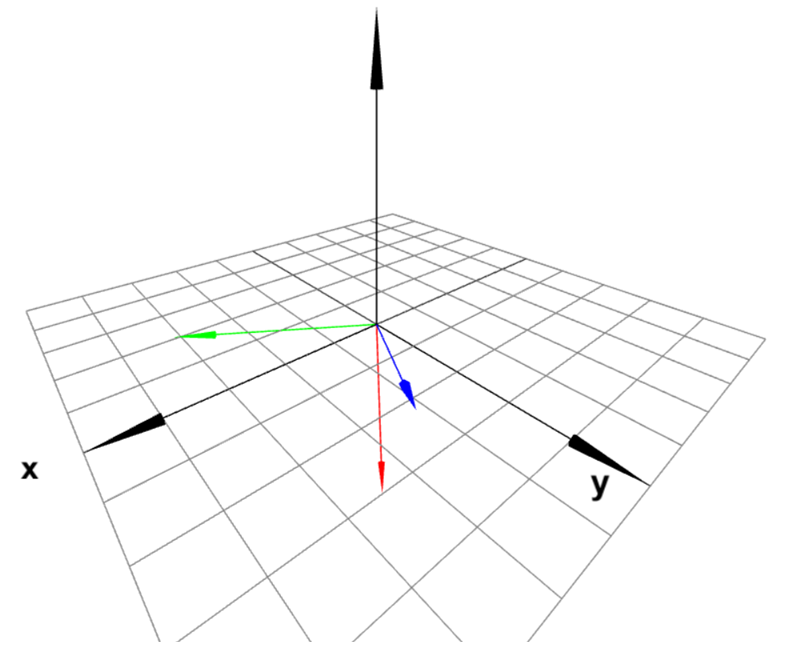
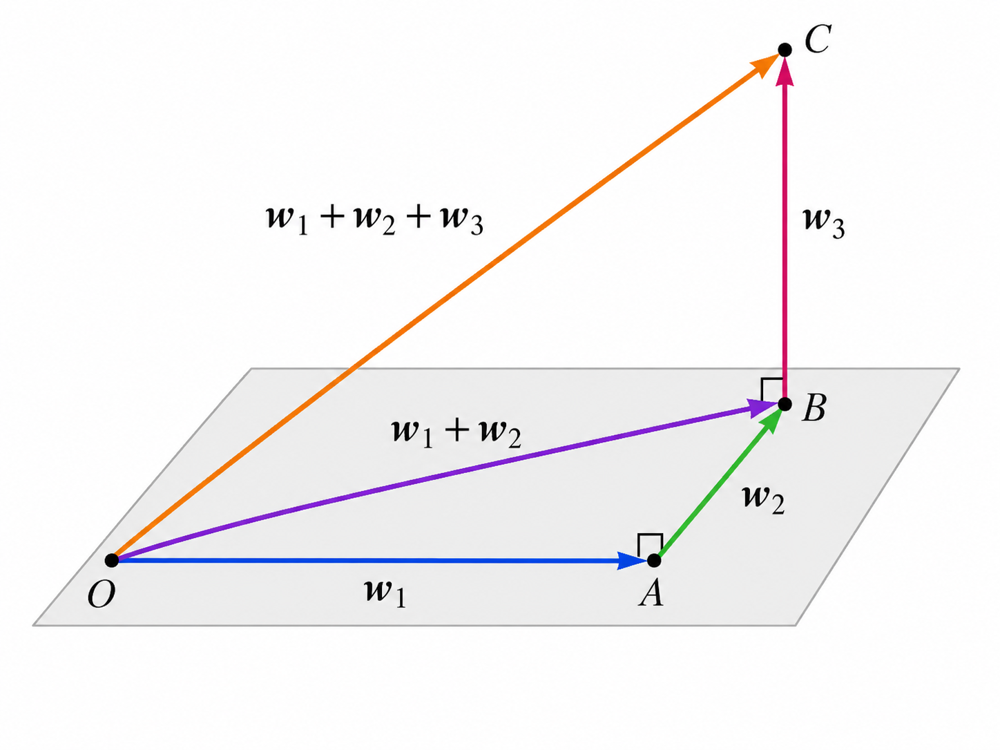
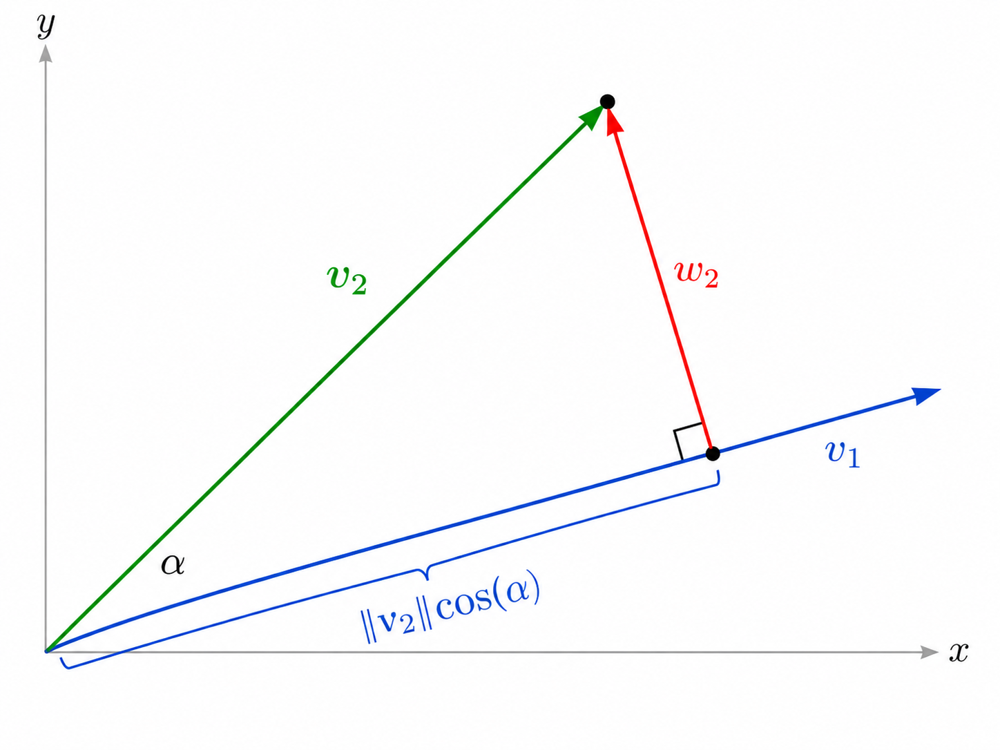
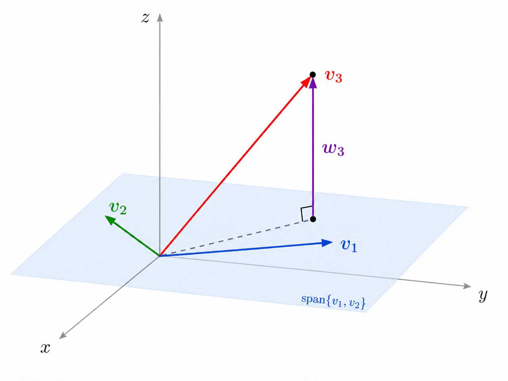
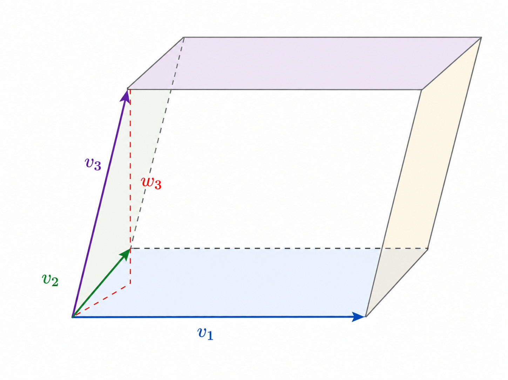
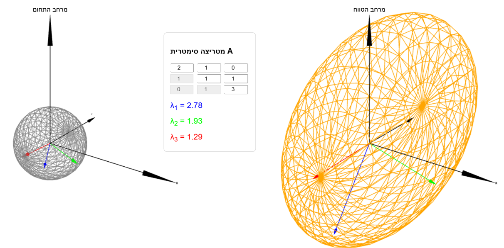

# מכפלה סקלרית ולכסון אורתוגונלי {#ch:scalar}

בפרק [??](#sec-geometry) הגדרנו את המכפלה הסקלרית ב- $\mathbb{R}^2$ ו- $\mathbb{R}^3$, וראינו את הקשר שלה לגדלים של וקטורים והזוויות ביניהם. בפרק זה נכליל את ההגדרה של מכפלה סקלרית ל- $\mathbb{R}^n$ לכל $n\in\mathbb{N}$, וע\"י כך נקבל הבנה בסיסית לגבי גיאומטריה במימדים גבוהים (בשביל האינטואיציה מספיק להבין את $\mathbb{R}^3$). בנוסף, נראה את הקשר לנושאים אחרים שנלמדו בקורס - עם דגש על לכסון. נוכיח משפט לפיו כל מטריצה סימטרית היא לכסינה באופן מיוחד, שנקרא לכסון אורתוגונלי (הוקטורים העצמיים המעורבים בלכסון מאונכים זה לזה).

### מכפלה סקלרית

::: definition

יהיו $v,w\in\mathbb{R}^n$ הנתונים ע\"י $$.v=\begin{pmatrix}
a_1 \\
\vdots \\
a_n
\end{pmatrix},\quad w=\begin{pmatrix}
b_1 \\
\vdots \\
b_n
\end{pmatrix}$$ נגדיר את המכפלה הסקלרית שלהם ע\"י $$.v\cdot w=\sum_{i=1}^n a_ib_i$$
:::

::: remark
המכפלה הסקלרית נקראת גם \"מכפלה פנימית סטנדרטית\", ולפי השם הזה ניתן להבין שיש מכפלות פנימיות נוספות (ב- $\mathbb{R}^n$ ומרחבים וקטוריים אחרים) בעלות תכונות דומות. לא נעסוק בהן בקורס, אך נציין שיש אנלוגיה מוחלטת בין המכפלות הפנימיות השונות וההבדל הוא בעיקר חישובי.
:::

::: example
 

1.  ב- $\mathbb{R}^2$ מתקיים $$.\begin{pmatrix}
    1 \\
    2
    \end{pmatrix}\cdot\begin{pmatrix}
    3 \\
    4
    \end{pmatrix}=1\cdot 3+2\cdot 4=11$$

2.  ב- $\mathbb{R}^3$ מתקיים $$.\begin{pmatrix}
    1 \\
    2 \\
    3
    \end{pmatrix}\cdot\begin{pmatrix}
    1 \\
    -1 \\
    2
    \end{pmatrix}=1\cdot 1+2\cdot(-1)+3\cdot 2=5$$

3.  ב- $\mathbb{R}^4$ מתקיים $$.\begin{pmatrix}
    1 \\
    2 \\
    3 \\
    4
    \end{pmatrix}\cdot\begin{pmatrix}
    1 \\
    -2 \\
    3 \\
    -4
    \end{pmatrix}=1\cdot 1+2\cdot(-2)+3\cdot 3+4\cdot(-4)=-10$$

4.  המכפלה הסקלרית $$\begin{pmatrix}
    1 \\
    2 \\
    3 \\
    4
    \end{pmatrix}\cdot \begin{pmatrix}
    0 \\
    2 \\
    4
    \end{pmatrix}$$ אינה מוגדרת כי הוקטורים אינם שווי אורך (הם לא שייכים לאותו המרחב).
:::

::: remark
כאשר מזהים את שני הוקטורים כוקטורי עמודה, כלומר מטריצות מסדר $n\times 1$, מתקיים הקשר הבא בין מכפלה סקלרית לכפל מטריצות: $$.v\cdot w=v^tw=(a_1,\cdots,a_n)\begin{pmatrix}
b_1 \\
\vdots \\
b_n
\end{pmatrix}$$
:::

בעזרת מכפלה סקלרית אפשר להגדיר גודל של וקטור ב- $\mathbb{R}^n$, בהתאם לנוסחה של משפט פיתגורס שמתקיימת במישור ובמרחב.

::: definition

יהי $v=\begin{pmatrix}
    a_1 \\
    \vdots \\
    a_n
    \end{pmatrix}\in\mathbb{R}^n$. נגדיר את גודלו ע\"י $$.\|v\|=\sqrt{v\cdot v}=\sqrt{\sum_{i=1}^n a_i^2}$$
:::

::: example
 

1.  ב- $\mathbb{R}^2$ מתקיים $$.\left\|\begin{pmatrix}
    1 \\
    2
    \end{pmatrix}\right\|=\sqrt{1^2+2^2}=\sqrt{5}$$

2.  ב- $\mathbb{R}^3$ מתקיים $$.\left\|\begin{pmatrix}
    1 \\
    2 \\
    3
    \end{pmatrix}\right\|=\sqrt{1^2+2^2+3^2}=\sqrt{14}$$

3.  ב- $\mathbb{R}^4$ מתקיים $$.\left\|\begin{pmatrix}
    1 \\
    2 \\
    3 \\
    4
    \end{pmatrix}\right\|=\sqrt{1^2+2^2+3^2+4^2}=\sqrt{30}$$
:::

::: exercise
חשבו את הגדלים של הוקטורים $$v=\begin{pmatrix}
1 \\
3 \\
5 \\
7
\end{pmatrix},\quad w=\begin{pmatrix}
2 \\
4 \\
6 \\
8
\end{pmatrix}$$ ואת המכפלה הסקלרית $v\cdot w$.
:::

::: {.callout-note collapse="true" title="פתרון"}
נחשב: $$\begin{aligned}
\|v\|&=\sqrt{1^2+3^2+5^2+7^2}=\sqrt{84} \\
\|w\|&=\sqrt{2^2+4^2+6^2+8^2}=2\sqrt{1^2+2^2+3^2+4^2}=2\sqrt{30} \\
v\cdot w&=1\cdot 2+3\cdot 4+5\cdot 6+7\cdot 8=100
\end{aligned}$$
:::

נוכיח הכללה ל- $\mathbb{R}^n$ של התכונות של המכפלה הסקלרית שהופיעו בטענה [??](#prp-dot-product-properties).

::: {.proposition #prp-dot-properties-general}
*יהיו $v_1,v_2,v_3\in\mathbb{R}^n$ ו- $\alpha\in\mathbb{R}$. אז מתקיים:*

1.  *$$v_1\cdot v_2=v_2\cdot v_1$$*

2.  *$$(v_1+v_3)\cdot v_2=v_1\cdot v_2+v_3\cdot v_2$$*

3.  *$$v_1\cdot v_1=\|v_1\|^2$$*

4.  *$$(\alpha v_1)\cdot v_2=\alpha(v_1\cdot v_2)$$*

5.  *$$\|\alpha v_1\|=|\alpha|\|v_1\|$$*

6.  *$$\|v_1\|=0\iff v_1=\underline{0}$$*

7.  *אם $v_1\neq\underline{0}$, אז $$.\left\|\frac{v_1}{\|v_1\|}\right\|=1$$*
:::

::: proof
נסמן $$.v_1=\begin{pmatrix}
    a_1 \\
    \vdots \\
    a_n
    \end{pmatrix},v_2=\begin{pmatrix}
    b_1 \\
    \vdots \\
    b_n
    \end{pmatrix}, v_3=\begin{pmatrix}
    c_1 \\
    \vdots \\
    c_n
    \end{pmatrix}$$

1.  לפי חוק החילוף לכפל ב- $\mathbb{R}$, מתקיים $$.v_1\cdot v_2=\sum_{i=1}^n a_i b_i=\sum_{i=1}^n b_i a_i=v_2\cdot v_1$$

2.  לפי חוק הפילוג וחוק החילוף (לחיבור) מתקיים $$.(v_1+v_3)\cdot v_2=\sum_{i=1}^n (a_i+c_i)b_i=\sum_{i=1}^n a_ib_i+\sum_{i=1}^n c_ib_i=v_1\cdot v_2+v_3\cdot v_2$$

3.  ישירות מההגדרה של גודל.

4.  לפי חוק הפילוג, לכל $\alpha\in\mathbb{R}$ מתקיים $$.(\alpha v_1)\cdot v_2=\sum_{i=1}^n (\alpha a_i)\cdot b_i=\alpha\sum_{i=1}^n a_ib_i=\alpha (v_1\cdot v_2)$$

5.  $$\begin{aligned}
    \|\alpha v_1\|&=\sqrt{(\alpha v_1)\cdot(\alpha v_1)}=\sqrt{\alpha^2(v_1\cdot v_1)}=\sqrt{\alpha^2\|v_1\|^2}\\
    &=|\alpha|\|v_1\|
    \end{aligned}$$

6.  מתקיים $$.\|v_1\|=0 \iff \sum_{i=1}^n a_i^2=0 \iff \forall 1\leq i\leq n\thinspace:\thinspace a_i=0 \iff v_1=\underline{0}$$ הסיבה לשקילות האמצעית היא שהביטוי $\sum_{i=1}^n a_i^2=0$ הוא סכום של מחוברים אי-שליליים, ולכן הוא מתאפס רק באשר כל מחובר מתאפס.

7.  נניח כי $\|v_1\|\neq 0$. מסעיף ה' עבור $\alpha=\frac{1}{\|v_1\|}$ נובע כי $$.\left\|\frac{v_1}{\|v_1\|}\right\|=\|\alpha v_1\|=|\alpha|\|v_1\|=\frac{1}{\|v_1\|}\cdot \|v_1\|=1$$

 ◻
:::

::: remark
סעיף ז' מתאר תהליך שנקרא \"נרמול\" שבו משנים את גודל הוקטור $v$ ל- $1$ בלי לשנות את כיוונו. עושים זאת ע\"י כפל בסקלר $\frac{1}{\|v\|}$.
:::

::: {.corollary #cor-bilinear}
*לכל $v_1,...,v_m,w_1,...,w_k\in\mathbb{R}^n$ ולכל $\alpha_1,...,\alpha_m,\beta_1,...,\beta_k\in\mathbb{R}$ מתקיים $$.(\alpha_1v_1+...+\alpha_mv_m)\cdot(\beta_1w_1+...+\beta_kw_k)=\sum_{i=1}^m\sum_{j=1}^k\alpha_i\beta_j(v_i\cdot w_j)$$*
:::

::: remark
תכונה זו נקראת בי-לינאריות. ראינו בסעיפים ב' ו-ד' של טענה [12.8](#prp-dot-properties-general) את מה שנקרא לינאריות לפי הארגומנט הראשון (השמאלי) של המכפלה הסקלרית. בי-לינאריות פירושה שמתקיימת גם לינאריות לפי הארגומנט השני (הימני), והמסקנה מראה את השילוב של שני סוגי הלינאריות. מכאן אפשר לחשוב על תכונה זו כלינאריות כפולה (\"בי\"), והיא מתאימה לתכונות המוכרות של חיבור וכפל.
:::

::: proof
נסמן $$.v=\alpha_1v_1+...+\alpha_mv_m, \quad w=\beta_1w_1+...+\beta_kw_k$$ נשתמש בסעיפים ב' ו-ד' של טענה [12.8](#prp-dot-properties-general) מספר חוזר של פעמים (בהתאם למספר המחוברים), תחילה ביחס לארגומנט הראשון ואחר כך נעבור לשני בעזרת סעיף א'. כך נקבל

$$\begin{aligned}
v\cdot w&=(\alpha_1v_1+...+\alpha_mv_m)\cdot w=\alpha_1(v_1\cdot w)+...+\alpha_m(v_m\cdot w) \\
&=\alpha_1(w\cdot v_1)+...+\alpha_m(w\cdot v_m)=\sum_{i=1}^m\alpha_i (w\cdot v_i)=\sum_{i=1}^m\alpha_i\left(\sum_{j=1}^k\beta_jw_j\right)\cdot v_i \\
&=\sum_{i=1}^m\alpha_i\left(\sum_{j=1}^k\beta_jw_j\cdot v_i\right)=\sum_{i=1}^m\sum_{j=1}^k \alpha_i\beta_j(w_j\cdot v_i)=\sum_{i=1}^m\sum_{j=1}^k \alpha_i\beta_j(v_i\cdot w_j)
\end{aligned}$$ ◻
:::

::: example
ב- $\mathbb{R}^3$ מתקיים $$\begin{aligned}
&\left(2\begin{pmatrix}
1 \\
2 \\
3
\end{pmatrix}+3\begin{pmatrix}
2 \\
0 \\
-1
\end{pmatrix}\right)\cdot\left(4\begin{pmatrix}
1 \\
0 \\
1
\end{pmatrix}-3\begin{pmatrix}
3 \\
5 \\
0
\end{pmatrix}\right) \\
&=(2\cdot 4)\begin{pmatrix}
1 \\
2 \\
3
\end{pmatrix}\cdot\begin{pmatrix}
1 \\
0 \\
1
\end{pmatrix}+(2\cdot(-3))\begin{pmatrix}
1 \\
2 \\
3
\end{pmatrix}\cdot\begin{pmatrix}
3 \\
5 \\
0
\end{pmatrix}+(3\cdot 4)\begin{pmatrix}
2 \\
0 \\
-1
\end{pmatrix}\cdot\begin{pmatrix}
1 \\
0 \\
1
\end{pmatrix} \\
&+(3\cdot(-3))\begin{pmatrix}
2 \\
0 \\
-1
\end{pmatrix}\cdot\begin{pmatrix}
3 \\
5 \\
0
\end{pmatrix}=8(1+3)-6(3+10)+12(2-1)-9\cdot 6=-88
\end{aligned}$$ ניתן להגיע לתוצאה זו גם באופן ישיר (ע\"י חישוב כל וקטור לפני פתיחת הסוגריים). נראה בהמשך את השימוש של בי-לינאריות.
:::

### וקטורים אורתוגונליים

ראינו ב- $\mathbb{R}^2$ וגם ב- $\mathbb{R}^3$ ששני וקטורים $v,w\neq\underline{0}$ מאונכים זה לזה אם ורק אם $v\cdot w=0$. נשתמש בעובדה כזו לצורך ההגדרה של וקטורים אורתוגונליים (מילה נרדפת ל\"מאונכים\" בהקשר אלגברי) ב- $\mathbb{R}^n$, שהיא פחות אינטואיטיבית עבור $n\geq 4$. יתר על כן, נכליל את ההגדרה לקבוצה סופית של וקטורים - לא בהכרח זוג.

::: definition
 

1.  נאמר ש- $\underline{0}\neq v,w\in\mathbb{R}^n$ הם אורתוגונליים אם $v\cdot w=0$. נסמן זאת ע\"י $v\perp w$.

2.  קבוצה $\underline{0}\notin \Set{v_1,...,v_k}\subseteq\mathbb{R}^n$ נקראת אורתוגונלית אם לכל $i\neq j$ מתקיים $$.v_i\cdot v_j=0$$

3.  קבוצה $\Set{v_1,...,v_k}\subseteq\mathbb{R}^n$ נקראת אורתונורמלית אם היא אורתוגונלית ובנוסף לכל $1\leq i\leq k$ מתקיים $$.\|v_i\|=1$$
:::

::: remark
 

1.  לכל $v,w\in\mathbb{R}^n$ מתקיים $v\cdot w=w\cdot v$, ולכן $$.v\perp w\iff w\perp v$$

2.  כל קבוצה אורתונורמלית היא אורתוגונלית, אך לא להיפך. אם $\|v_i\|=1$, אז בהכרח $v_i\neq 0$ (שזה תנאי הנדרש לאורתוגונליות) לפי טענה [12.8](#prp-dot-properties-general).
:::

{#fig-Orthogonal width="60%" fig-align="center"}

::: example
 

1.  הקבוצה $$A=\Set{\begin{pmatrix}
        2 \\
        1 \\
        0
        \end{pmatrix},\begin{pmatrix}
        -1 \\
        2 \\
        0
        \end{pmatrix},\begin{pmatrix}
        0 \\
        0 \\
        1
        \end{pmatrix}}\subseteq\mathbb{R}^3$$ היא אורתוגונלית, אך לא אורתונורמלית. נראה זאת ע\"י חישוב מכפלה סקלרית לכל זוג וקטורים: $$\begin{aligned}
    \begin{pmatrix}
        2 \\
        1 \\
        0
        \end{pmatrix}\cdot\begin{pmatrix}
        -1 \\
        2 \\
        0
        \end{pmatrix}&=-2+2+0=0 \\
        \begin{pmatrix}
        2 \\
        1 \\
        0
        \end{pmatrix}\cdot\begin{pmatrix}
        0 \\
        0 \\
        1
        \end{pmatrix}&=0+0+0=0 \\
        \begin{pmatrix}
        -1 \\
        2 \\
        0
        \end{pmatrix}\cdot\begin{pmatrix}
        0 \\
        0 \\
        1
        \end{pmatrix}&=0+0+0=0
    \end{aligned}$$ כל הוקטורים שונים מוקטור האפס, אך הוקטורים $\begin{pmatrix}
        2 \\
        1 \\
        0
        \end{pmatrix},\begin{pmatrix}
        -1 \\
        2 \\
        0
        \end{pmatrix}$ אינם בגודל $1$.

2.  ניקח את הקבוצה מהסעיף הקודם ו\"ננרמל\" כל וקטור בה. הכוונה היא שנחליף כל וקטור $v\in A$ בגרסה ה\"מנורמלת\" $\frac{v}{\|v\|}$ בגודל $1$. שני הוקטורים הראשונים הם בגודל $\sqrt{5}$ והשלישי הוא כבר בגודל $1$. לאחר נרמול נקבל $$.B=\Set{\begin{pmatrix}
        \frac{2}{\sqrt{5}} \\
        \frac{1}{\sqrt{5}} \\
        0
        \end{pmatrix},\begin{pmatrix}
        -\frac{1}{\sqrt{5}} \\
        \frac{2}{\sqrt{5}} \\
        0
        \end{pmatrix},\begin{pmatrix}
        0 \\
        0 \\
        1
        \end{pmatrix}}\subseteq\mathbb{R}^3$$

    זו קבוצה אורתונורמלית. לפי סעיף ז' של טענה [12.8](#prp-dot-properties-general), הגודל של כל וקטור הוא $1$ כתוצאה מהנרמול. ניתן לבדוק שכל המכפלות הסקלריות הן עדיין $0$, ונעשה זאת באופן כללי בטענה הבאה.
:::

::: proposition
*תהי $\Set{v_1,...,v_k}\subseteq\mathbb{R}^n$ קבוצה אורתוגונלית. אז הקבוצה המנורמלת $$\left\{\frac{v_1}{\|v_1\|},...,\frac{v_k}{\|v_k\|}\right\}$$ היא אורתונורמלית.*
:::

::: proof
לפי סעיף ז' של טענה [12.8](#prp-dot-properties-general), לכל $1\leq i\leq k$ מתקיים $$\left\|\frac{v_i}{\|v_i\|}\right\|=1$$ כנדרש. נראה כי המכפלה הסקלרית של כל זוג וקטורים מנורמלים מתאפסת: לכל $i\neq j$ מתקיים $v_i\cdot v_j=0$ לפי הנתון, ולכן $$.\frac{v_i}{\|v_i\|}\cdot\frac{v_j}{\|v_j\|}=\frac{1}{\|v_i\|\|v_j\|}(v_i\cdot v_j)=0$$ ◻
:::

מה היתרון של קבוצה אורתונורמלית? המכפלה הסקלרית של צירופים לינאריים של איברי הקבוצה היא נוחה לחישוב. הטענה הבאה מראה את החישוב לקבוצה אורתוגונלית באופן כללי, ולקבוצה אורתונורמלית כמקרה פרטי (פשוט יותר).

::: {.proposition #prp-ortho-dot}
* *

1.  *תהי $\Set{v_1,...,v_k}$ קבוצה אורתוגונלית. לכל $\alpha_1,...,\alpha_k,\beta_1,...,\beta_k\in\mathbb{R}$ מתקיים $$.(\alpha_1v_1+...+\alpha_kv_k)\cdot(\beta_1v_1+...+\beta_kv_k)=\sum_{i=1}^k\alpha_i\beta_i\|v_i\|^2$$*

2.  *אם $\Set{v_1,...,v_k}$ קבוצה אורתונורמלית, אז לכל $\alpha_1,...,\alpha_k,\beta_1,...,\beta_k\in\mathbb{R}$ מתקיים $$.(\alpha_1v_1+...+\alpha_kv_k)\cdot(\beta_1v_1+...+\beta_kv_k)=\sum_{i=1}^k\alpha_i\beta_i$$*
:::

::: proof
יהיו $\alpha_1,...,\alpha_k,\beta_1,...,\beta_k\in\mathbb{R}$.

1.  נשתמש בבי-לינאריות (מסקנה [12.10](#cor-bilinear)) ונקבל $$.(\alpha_1v_1+...+\alpha_kv_k)\cdot(\beta_1v_1+...+\beta_kv_k)=\sum_{i=1}^k\sum_{j=1}^k\alpha_i\beta_j(v_i\cdot v_j)$$

    לכל $1\leq i\leq k$ מתקיים $$,\sum_{j=1}^k\alpha_i\beta_j(v_i\cdot v_j)=0+...+0+\alpha_i\beta_i(v_i\cdot v_i)+0+...+0=\alpha_i\beta_i\|v_i\|^2$$ כי רק מחובר אחד (עבור $j=i$) בסכום לא מתאפס. נציב זאת במשוואה הקודמת ונקבל $$(\alpha_1v_1+...+\alpha_kv_k)\cdot(\beta_1v_1+...+\beta_kv_k)=\sum_{i=1}^k\alpha_i\beta_i\|v_i\|^2$$ כנדרש.

2.  זהו מקרה פרטי של הסעיף הקודם. כאן $\|v_i\|=1$ לכל $1\leq i\leq n$, ולאחר הצבה נקבל $$.(\alpha_1v_1+...+\alpha_kv_k)\cdot(\beta_1v_1+...+\beta_kv_k)=\sum_{i=1}^k\alpha_i\beta_i$$

 ◻
:::

::: remark
למעשה, מדובר פה בהכללה של משפט פיתגורס. ב- $\mathbb{R}^2$ עבור קבוצה אורתוגונלית $\Set{v_1,v_2}$ נקבל $$,\|v_1+v_2\|^2=\|v_1\|^2+\|v_2\|^2$$ כאשר אגף שמאל מתאר את הריבוע של אורך היתר במשולש ישר-זווית שניצביו מתאימים לוקטורים $v_1,v_2$. באופן דומה, ב- $\mathbb{R}^n$ עבור קבוצה אורתוגונלית $\Set{w_1,...,w_n}$ נקבל $$.\|w_1+...+w_n\|^2=\|w_1\|^2+...+\|w_n\|^2$$ אפשר לצייר את זה ב- $\mathbb{R}^3$ ולנסות לדמיין את ההכללה עבור $n\geq 4$.

{#fig-GeneralPythagoras width="60%" fig-align="center"}
:::

הטענה הבאה מראה את הקשר בין אורתוגונליות (מושג גיאומטרי) לבין אי-תלות לינארית (מושג אלגברי):

::: {.proposition #prp-ortho-independent}
*כל קבוצה אורתוגונלית $\Set{v_1,...,v_k}\subseteq \mathbb{R}^n$ היא בת\"ל.*
:::

::: proof
נניח שקיימים $\alpha_1,...,\alpha_k\in\mathbb{R}$ כך ש- $$.\alpha_1v_1+...+\alpha_kv_k=\underline{0}$$ לכל $1\leq i\leq k$ נכפיל (באופן סקלרי) את שני אגפי המשוואה ב- $v_i$ ונקבל $$.(\alpha_1v_1+...+\alpha_kv_k)\cdot v_i=0$$ לפי טענה [12.17](#prp-ortho-dot) נובע כי $$,\alpha_i\|v_i\|^2=0$$ ומכאן לכל $1\leq i\leq k$ מתקיים

$$\alpha_i=0$$ שהרי $\|v_i\|\neq 0$ כי $v_i\neq 0$ לפי הנתון. לכן, הקבוצה $\Set{v_1,...,v_k}$ היא בת\"ל. ◻
:::

::: exercise
תהי $A=\Set{v_1,v_2,v_3}\subseteq\mathbb{R}^n$ קבוצה אורתונורמלית.

1.  מצאו $r,s,t\in\mathbb{R}$ כך ש- $$B=\Set{rv_1+v_2+v_3,v_1+sv_2+v_3,v_1+v_2+tv_3}\subseteq\mathbb{R}^n$$ תהיה קבוצה אורתוגונלית.

2.  עבור $r,s,t$ מהסעיף הקודם, נרמלו את וקטורי הקבוצה $B$ כדי לקבל קבוצה אורתונורמלית.

:::

::: {.callout-note collapse="true" title="פתרון"}
1.  נדרוש שהמכפלה הסקלרית תתאפס לכל זוג וקטורים ב- $B$. לפי טענה [12.17](#prp-ortho-dot) מתקיים: $$\begin{cases}
    (rv_1+v_2+v_3)\cdot(v_1+sv_2+v_3)&=r\|v_1\|^2+s\|v_1\|^2+\|v_3\|^2=r+s+1 \\
    (v_1+sv_2+v_3)\cdot(v_1+v_2+tv_3)&=1+s+t \\
    (rv_1+v_2+v_3)\cdot(v_1+v_2+tv_3)&=r+1+t\\
    \end{cases}$$ לכן, יש לפתור את הממ\"ל הבאה: $$\begin{cases}
    r+s=-1 \\
    s+t=-1 \\
    r+t=-1
    \end{cases}$$

    יש לה פתרון יחיד: $$r=s=t=-\frac{1}{2}$$

    יש לבדוק שוקטור האפס לא מופיע בקבוצה $B$ המתאימה לסקלרים שמצאנו. נראה זאת ע\"י חישוב הגדלים בסעיף הבא.

2.  נציב $r=s=t=-\frac{1}{2}$ ונשתמש בסעיף ב' של טענה [12.17](#prp-ortho-dot):

    $$\begin{aligned}
    \left\|-\frac{1}{2}v_1+v_2+v_3\right\|^2&=\frac{1}{4}+1+1=\frac{9}{4} \\
    \left\|v_1-\frac{1}{2}v_2+v_3\right\|^2&=1+\frac{1}{4}+1=\frac{9}{4} \\
    \left\|v_1+v_2-\frac{1}{2}v_3\right\|^2&=1+1+\frac{1}{4}=\frac{9}{4}
    \end{aligned}$$

    לכן, הגודל המשותף של כל וקטורי $B$ הוא $\sqrt{\frac{9}{4}}=\frac{3}{2}$. נכפיל כל וקטור בסקלר ההופכי $\frac{2}{3}$ ונקבל את הקבוצה האורתונורמלית הבאה: $$C=\Set{-\frac{1}{3}v_1+\frac{2}{3}v_2+\frac{2}{3}v_3,\frac{2}{3}v_1-\frac{1}{3}v_2+\frac{2}{3}v_3,\frac{2}{3}v_1+\frac{2}{3}v_2-\frac{1}{3}v_3}$$
:::

::: {.corollary #cor-orthogonal-basis}
*תהי $\Set{v_1,...,v_n}\subseteq\mathbb{R}^n$ אורתוגונלית. אז היא בסיס ל- $\mathbb{R}^n$.*
:::

::: proof
לפי טענה [12.19](#prp-ortho-independent) הקבוצה $\Set{v_1,...,v_n}$ היא בת\"ל. לפי משפט \"שלישי חינם\" נובע כי היא בסיס ל- $\mathbb{R}^n$. ◻
:::

::: definition

קבוצה אורתוגונלית $\Set{v_1,...,v_n}\subseteq\mathbb{R}^n$ נקראת בסיס אורתוגונלי ל- $\mathbb{R}^n$. אם היא אורתונורמלית, היא נקראת בסיס אורתונורמלי ל- $\mathbb{R}^n$.
:::

::: {.example #exm-rotation-matrix}

1.  הבסיס הסטנדרטי $\Set{e_1,...,e_n}\subseteq \mathbb{R}^n$ הוא בסיס אורתוגונלי כי לכל $i\neq j$ מתקיים $$,e_i\cdot e_j=0+...+0=0$$ שהרי בכל מחובר לפחות אחד משני גורמי המכפלה הוא $0$. יתר על כן, בסיס זה הוא אורתונורמלי כי לכל $1\leq i\leq n$ מתקיים $$.\|e_i\|=\sqrt{e_i\cdot e_i}=\sqrt{0+...+0+1+0+...+0}=1$$

2.  לכל $\theta\in\mathbb{R}$ הקבוצה $$\Set{\begin{pmatrix}
    \cos{\theta} \\
    \sin{\theta}
    \end{pmatrix},\begin{pmatrix}
    -\sin{\theta} \\
    \cos{\theta}
    \end{pmatrix}}$$ היא בסיס אורתונורמלי ל- $\mathbb{R}^2$. אכן, לכל $\theta\in\mathbb{R}$ מתקיים: $$\begin{aligned}
    \left\|\begin{pmatrix}
    \cos{\theta} \\
    \sin{\theta}
    \end{pmatrix}\right\|&=\sqrt{\cos^2\theta+\sin^2\theta}=1 \\
    \left\|\begin{pmatrix}
    -\sin{\theta} \\
    \cos{\theta}
    \end{pmatrix}\right\|&=\sqrt{\sin^2\theta+\cos^2\theta}=1 \\
    \begin{pmatrix}
    \cos{\theta} \\
    \sin{\theta}
    \end{pmatrix}\cdot\begin{pmatrix}
    -\sin{\theta} \\
    \cos{\theta}
    \end{pmatrix}&=-\cos\theta\sin\theta+\sin\theta\cos\theta=0
    \end{aligned}$$

    למשל, עבור $\theta=\frac{\pi}{4}$ נקבל את הבסיס האורתונורמלי הבא $$.\Set{\begin{pmatrix}
    \frac{1}{\sqrt{2}} \\
    \frac{1}{\sqrt{2}}
    \end{pmatrix},\begin{pmatrix}
    -\frac{1}{\sqrt{2}} \\
    \frac{1}{\sqrt{2}}
    \end{pmatrix}}$$
:::

::: exercise
מהו הגודל המקסימלי של קבוצה אורתוגונלית ב- $\mathbb{R}^n$?
:::

::: {.callout-note collapse="true" title="פתרון"}
באופן כללי, תהי $\Set{v_1,...,v_k}\subseteq\mathbb{R}^n$ קבוצה אורתוגונלית בגודל $k$. לפי טענה [12.19](#prp-ortho-independent) זו קבוצה בת\"ל, ולכן בכרח $k\leq n$ לפי מסקנה [??](#cor-size-dim). מכאן נובע שהגודל המקסימלי הוא לכל היותר $n$, ולמעשה יש שוויון כי הבסיס הסטנדרטי הוא קבוצה אורתונורמלית (בפרט אורתוגונלית) בגודל $n$,
:::

לבסיס אורתוגונלי יש יתרון חישובי כאשר רוצים לבטא וקטור כללי כצירוף לינארי של איברי הבסיס. במקרה זה, אין צורך לפתור ממ\"ל כי יש נוסחה לצירוף הלינארי במונחים של מכפלה סקלרית.

::: {.proposition #prp-ortho-basis}
*יהי $B=\Set{v_1,...,v_n}$ בסיס אורתוגונלי ל- $\mathbb{R}^n$. אז לכל $v\in\mathbb{R}^n$ מתקיים $$.v=\sum_{i=1}^n\frac{v\cdot v_i}{v_i\cdot v_i}v_i$$*
:::

::: proof
יהי $v\in\mathbb{R}^n$. $B$ היא בסיס, ולכן קיימים $\alpha_1,...,\alpha_n\in\mathbb{R}$ כך ש- $$.v=\alpha_1 v_1+...+\alpha_n v_n$$ לכל $1\leq i\leq n$ נכפיל את שני אגפי המשוואה (באופן סקלרי) ב- $v_i$, ונקבל $$.v\cdot v_i=0+...+0+\alpha_iv_i\cdot v_i+0+...+0=\alpha_i(v_i\cdot v_i)$$ מכאן נובע כי לכל $1\leq i\leq n$ מתקיים $$,\alpha_i=\frac{v\cdot v_i}{v_i\cdot v_i}$$ ולאחר הצבה במשוואה המקורית נקבל $$v=\sum_{i=1}^n\frac{v\cdot v_i}{v_i\cdot v_i}v_i$$ כנדרש. ◻
:::

::: {.corollary #cor-orthonormal}
*יהי $B=\Set{v_1,...,v_n}$ בסיס אורתונורמלי ל- $\mathbb{R}^n$. אז לכל $v\in\mathbb{R}^n$ מתקיים $$.v=\sum_{i=1}^n(v\cdot v_i)v_i$$*
:::

::: proof
זו מסקנה מיידית מטענה [12.25](#prp-ortho-basis) ע\"י הצבת $v_i\cdot v_i=\|v_i\|^2=1$ במכנה. ◻
:::

::: {.exercise #exr-orthogonal-by-basis}

יהי $W\subseteq\mathbb{R}^n$ תת-מרחב בעל בסיס $\Set{w_1,...,w_m}$. אז לכל $v\in\mathbb{R}^n$ מתקיים: $$\forall w\in W\thinspace :\thinspace v\perp w \iff \forall 1\leq i\leq m \thinspace :\thinspace v\perp w_m$$

או במילים: $v$ מאונך לכל וקטור ב- $W$ אם ורק אם הוא מאונך לכל וקטורי הבסיס.
:::

::: {.callout-note collapse="true" title="פתרון"}
הכיוון $\implies$ מובן מאליו.

בכיוון השני, נניח כי $v$ מאונך לכל וקטורי הבסיס. לכל $w\in W$ קיימים $\alpha_1,...,\alpha_m\in\mathbb{R}$ כך ש- $$.w=\sum_{i=1}^m\alpha_i w_i$$ לכן: $$,v\cdot w=\sum_{i=1}^m\alpha_i (v\cdot w_i)=\sum_{i=1}^m \alpha_i\cdot 0=0$$ כנדרש.
:::

### תהליך גרם-שמידט

ראינו כי ל- $\mathbb{R}^n$ יש בסיס אורתונורמלי מיוחד, שהוא הבסיס הסטנדרטי. לא קשה להשתכנע שיש אינסוף בסיסים אורתונורמליים אחרים. אבל מה לגבי תת-מרחב של $W\subseteq\mathbb{R}^n$? יש אלגוריתם (שנקרא תהליך גרם-שמידט) שיאפשר לנו להמיר כל בסיס ל- $W$ לבסיס אורתוגונלי שלו. ע\"י נרמול אפשר גם לקבל בסיס אורתונורמלי.

::: proposition
*יהי $B=\Set{v_1,...,v_m}$ בסיס לתת-מרחב $W\subseteq \mathbb{R}^n$. נגדיר: $$\begin{aligned} w_1&=v_1 \\
w_2&=v_2-\frac{v_2\cdot w_1}{w_1\cdot w_1}w_1 \\
w_3&=v_3-\frac{v_3\cdot v_1}{w_1\cdot w_1}w_1-\frac{v_3\cdot w_2}{w_2\cdot w_2}w_2\\
&\thinspace \vdots \\
w_m&=v_m-\sum_{i=1}^{m-1}\frac{v_m\cdot w_i}{w_i\cdot w_i}w_i
\end{aligned}$$ אז הקבוצה $\Set{w_1,...,w_m}$ היא בסיס אורתוגונלי ל- $W$, והקבוצה המנורמלת $\{\frac{w_1}{\|w_1\|},...,\frac{w_m}{\|w_m\|}\}$ היא בסיס אורתונורמלי ל- $W$. יתר על כן, מתקיים: $$\begin{aligned}
\mathop{\mathrm{Span}}(v_1)&=\mathop{\mathrm{Span}}(w_1)=\mathop{\mathrm{Span}}(\frac{w_1}{\|w_1\|}) \\ \mathop{\mathrm{Span}}(v_1,v_2)&=\mathop{\mathrm{Span}}(w_1,w_2)=\mathop{\mathrm{Span}}(\frac{w_1}{\|w_1\|},\frac{w_2}{\|w_2\|}) \\ &\thinspace\vdots \\ \mathop{\mathrm{Span}}(v_1,...,v_m)&=\mathop{\mathrm{Span}}(w_1,...,w_m)=\mathop{\mathrm{Span}}(\frac{w_1}{\|w_1\|},...,\frac{w_m}{\|w_m\|}) \end{aligned}$$*
:::

::: example
לפני ההוכחה נתאר את הגיאומטריה של שני מקרים חשובים.

1.  עבור $m=2$ נבחר $w_1=v_1$ ונראה כי הוקטור $w_2$ המאונך ל- $v_1$, מתאים לנוסחה של תהליך גרם-שמידט.

    {#fig-2Gram width="60%" fig-align="center"}

    הניצב בכיוון של $v_1=w_1$ הוא בגודל $\|v_2\|\cos(\alpha)$, כאשר $\cos(\alpha)=\frac{v_2\cdot w_1}{\|v_2\|\|w_1\|}$ ולצורך פשטות נניח כי $\alpha$ היא זווית חדה. כדי לקבל את הוקטור המתאים יש להכפיל את $w_1$ בסקלר $\frac{\|v_2\|\cos(\alpha)}{\|w_1\|}$ (בדקו זאת). לפי חיבור וקטורי נובע כי $$,\frac{\|v_2\|\cos(\alpha)}{\|w_1\|}w_1+w_2=v_2$$ ומכאן $$w_2=v_2-\frac{\|v_2\|\cos(\alpha)}{\|w_1\|}w_1=v_2-\frac{\|v_2\|\|w_1\|\cos(\alpha)}{\|w_1\|^2}w_1=v_2-\frac{v_2\cdot w_1}{w_1\cdot w_1}w_1$$ בהתאם לתהליך גרם-שמידט.

2.  המקרה של $m=3$ דומה. לצורך הדוגמה נניח כי מדובר בוקטורים $$v_1=\begin{pmatrix}a\\0\\0\end{pmatrix},v_2=\begin{pmatrix}0\\b\\0\end{pmatrix},v_3=\begin{pmatrix}c\\d\\e\end{pmatrix}\in\mathbb{R}^3$$ כאשר $abe\neq 0$ (כלומר $a,b,e\neq 0$). שני הוקטורים הראשונים כבר מאונכים, ולכן נקבל: $$\begin{aligned}
    w_1=\begin{pmatrix}a\\0\\0\end{pmatrix},\quad w_2&=\begin{pmatrix}0\\b\\0\end{pmatrix}
    \end{aligned}$$

    נפעל לפי תהליך גרם-שמידט ונבדוק שהתוצאה נכונה: $$w_3=v_3-\frac{v_3\cdot w_1}{w_1\cdot w_1}w_1-\frac{v_3\cdot w_2}{w_2\cdot w_2}w_2=\begin{pmatrix}c\\d\\e\end{pmatrix}-\frac{ac}{a^2}\begin{pmatrix}a\\0\\0\end{pmatrix}-\frac{bd}{b^2}\begin{pmatrix}0\\b\\0\end{pmatrix}=\begin{pmatrix}0\\0\\e\end{pmatrix}$$ אכן מתקיים $w_1\cdot w_3=0=w_2\cdot w_3$.
:::

מדוגמה זו נעבור להסתכלות גיאומטרית על תהליך גרם-שמידט עבור שלושה וקטורים כלליים: כדי לקבל את $w_3$ צריך להחסיר מ- $v_3$ את היטלו על המישור $\mathop{\mathrm{Span}}(w_1,w_2)=\mathop{\mathrm{Span}}(v_1,v_2)$, כך שהתוצאה תהיה וקטור המאונך למישור זה (וקטור נורמל במונחים של פרק [??](#sec-geometry)).

{#fig-3Gram width="60%" fig-align="center"}

אנחנו מוכנים להוכיח את הטענה הכללית:

::: proof
תחילה נראה כי $\Set{w_1,...,w_m}$ היא קבוצה אורתוגונלית. כל הוקטורים בקבוצה זו שונים מ- $\underline{0}$ לפי הנוסחאות שמגדירות אותם והעובדה שהקבוצה המקורית $\Set{v_1,...,v_m}$ היא בת\"ל. נחשב את $w_j\cdot w_k$ לכל $1\leq j<k\leq m$, ונעשה זאת לפי הסדר כאשר נגדיל את $k$ בהדרגה (מ- $2$ עד $m$) ונעבור על כל האפשרויות עבור $j<k$. עבור $k=2$ יש רק בדיקה אחת למקרה $j=1$: $$\begin{aligned}
w_1\cdot w_2&=w_1\cdot(v_2-\frac{v_2\cdot w_1}{w_1\cdot w_1}w_1)=w_1\cdot v_2-\frac{v_2\cdot w_1}{w_1\cdot w_1}(w_1\cdot w_1) \\
&=w_1\cdot v_2-v_2\cdot w_1=0
\end{aligned}$$

עבור $k=3$ יש שתי בדיקות שנובעות מהחישוב הקודם: $$\begin{aligned}
w_1\cdot w_3&=w_1\cdot(v_3-\frac{v_3\cdot w_1}{w_1\cdot w_1}w_1-\frac{v_3\cdot w_2}{w_2\cdot w_2}w_2)=w_1\cdot v_3-\frac{v_3\cdot w_1}{w_1\cdot w_1}(w_1\cdot w_1) \\
&-\frac{v_3\cdot w_2}{w_2\cdot w_2}(w_1\cdot w_2)=w_1\cdot v_3-v_3\cdot w_1-0=0 \\
w_2\cdot w_3&=w_2\cdot(v_3-\frac{v_3\cdot w_1}{w_1\cdot w_1}w_1-\frac{v_3\cdot w_2}{w_2\cdot w_2}w_2)=w_2\cdot v_3-\frac{v_3\cdot w_1}{w_1\cdot w_1}(w_2\cdot w_1) \\
&-\frac{v_3\cdot w_2}{w_2\cdot w_2}(w_2\cdot w_2)=w_2\cdot v_3-0-v_3\cdot w_2=0
\end{aligned}$$

נמשיך כך כאשר בכל פעם שמגדילים את $k$, הבדיקות החדשות נשענות על החישובים הקודמים. כאשר נגיע ל- $k=m$ החישובים עד לשלב זה יראו כי $w_j\cdot w_i=0$ לכל $1\leq i,j\leq m-1$ כך ש- $i\neq j$, ולכן לכל $j<m$ נקבל: $$\begin{aligned}
w_j\cdot w_m&=w_j\cdot(v_m-\sum_{i=1}^{m-1}\frac{v_m\cdot w_i}{w_i\cdot w_i}w_i)=w_j\cdot v_m-\sum_{i=1}^{m-1}\frac{v_m\cdot w_i}{w_i\cdot w_i}(w_j\cdot w_i) \\
&=w_j\cdot v_m-0-...-0-\frac{v_m\cdot w_j}{w_j\cdot w_j}(w_j\cdot w_j)-0-...-0 \\
&=w_j\cdot v_m-v_m\cdot w_j=0
\end{aligned}$$

סיימנו את הוכחת האורתוגונליות ומכאן נובע כי $\Set{w_1,...,w_m}$ בת\"ל. כדי להראות כי היא בסיס (אורתוגונלי) ל- $W$, נראה כי $\mathop{\mathrm{Span}}(w_1,...,w_k)=W$. נעשה זאת בהדרגה.

לפי ההגדרה מתקיים $w_1=v_1$, ולכן ברור כי $$.\mathop{\mathrm{Span}}(v_1)=\mathop{\mathrm{Span}}(w_1)=\mathop{\mathrm{Span}}(\frac{w_1}{\|w_1\|})$$ מתקיים $$,w_2=v_2-\frac{v_2\cdot w_1}{w_1\cdot w_1}w_1\in\mathop{\mathrm{Span}}(v_2,w_1)=\mathop{\mathrm{Span}}(v_1,v_2)$$ ולכן $$.\mathop{\mathrm{Span}}(w_1,w_2)\subseteq\mathop{\mathrm{Span}}(v_1,v_2)$$ הקבוצות $\Set{w_1,w_2},\Set{v_1,v_2}$ הן בת\"ל, ולכן ההכלה לעיל היא שוויון לפי משפט \"שלישי חינם\". הנרמול (כפל בסקלר) לא משפיע על ה- $\mathop{\mathrm{Span}}$, ולכן $$.\mathop{\mathrm{Span}}(v_1,v_2)=\mathop{\mathrm{Span}}(w_1,w_2)=\mathop{\mathrm{Span}}(\frac{w_1}{\|w_1\|},\frac{w_2}{\|w_2\|})$$ נמשיך כך באופן דומה, ונקבל: $$\begin{aligned}
\mathop{\mathrm{Span}}(v_1,v_2,v_3)&=\mathop{\mathrm{Span}}(w_1,w_2,w_3)=\mathop{\mathrm{Span}}(\frac{w_1}{\|w_1\|},\frac{w_2}{\|w_2\|},\frac{w_3}{\|w_3\|}) \\
&\thinspace\vdots\ \\
\mathop{\mathrm{Span}}(v_1,...,v_{m-1})&=\mathop{\mathrm{Span}}(w_1,...,w_{m-1})=\mathop{\mathrm{Span}}(\frac{w_1}{\|w_1\|},...,\frac{w_{m-1}}{\|w_{m-1}\|})
\end{aligned}$$ מהשוויון האחרון נובע כי $$,w_m=v_m-\sum_{i=1}^{m-1}\frac{v_m\cdot w_i}{w_i\cdot w_i}w_i\in\mathop{\mathrm{Span}}(v_m,w_1,...,w_{m-1})=\mathop{\mathrm{Span}}(v_1,...,v_m)$$ ולכן $$.\mathop{\mathrm{Span}}(w_1,...,w_m)\subseteq\mathop{\mathrm{Span}}(v_1,...,v_m)$$ הקבוצות $\Set{w_1,...,w_m},\Set{v_1,...,v_m}$ הן בת\"ל, ולכן ההכלה לעיל היא שוב שוויון. כאמור, לנרמול אין השפעה על ה- $\mathop{\mathrm{Span}}$ ומכאן נקבל $$.W=\mathop{\mathrm{Span}}(v_1,...,v_m)=\mathop{\mathrm{Span}}(w_1,...,w_m)=\mathop{\mathrm{Span}}(\frac{w_1}{\|w_1\|},...,\frac{w_m}{\|w_m\|})$$ ◻
:::

::: exercise
יהיו $$.v_1=\begin{pmatrix}1\\1\\1\end{pmatrix},v_2=\begin{pmatrix}2\\0\\4\end{pmatrix},v_3=\begin{pmatrix}0\\3\\5\end{pmatrix}\in\mathbb{R}^3$$

1.  מצאו בסיס אורתונורמלי ל- $\mathop{\mathrm{Span}}(v_1,v_2)$.

2.  השתמשו בתהליך גרם-שמידט על $\Set{v_1,v_2,v_3}$ כדי לקבל בסיס אורתונורמלי ל- $\mathbb{R}^3$.

:::

::: {.callout-note collapse="true" title="פתרון"}
בכל סעיף נשתמש בתהליך גרם-שמידט על הקבוצה הרלוונטית כדי לקבל בסיס אורתוגונלי. לבסוף ננרמל אותו.

1.  ראשית נגדיר $w_1=v_1$. לפי תהליך גרם-שמידט נקבל $$.w_2=v_2-\frac{v_2\cdot w_1}{w_1\cdot w_1}w_1=\begin{pmatrix}2\\0\\4\end{pmatrix}-\frac{6}{3}\begin{pmatrix}1\\1\\1\end{pmatrix}=\begin{pmatrix}0\\-2\\2\end{pmatrix}$$

    ננרמל: $$\begin{aligned}
    \frac{w_1}{\|w_1\|}&=\begin{pmatrix}\frac{1}{\sqrt{3}} \\ \frac{1}{\sqrt{3}} \\ \frac{1}{\sqrt{3}}\end{pmatrix}\\
    \frac{w_2}{\|w_2\|}&=\begin{pmatrix}0\\-\frac{2}{\sqrt{8}}\\\frac{2}{\sqrt{8}}\end{pmatrix}=\begin{pmatrix}0\\-\frac{1}{\sqrt{2}}\\\frac{1}{\sqrt{2}}\end{pmatrix}
    \end{aligned}$$

    הקבוצה $\Set{\begin{pmatrix}\frac{1}{\sqrt{3}} \\ \frac{1}{\sqrt{3}} \\ \frac{1}{\sqrt{3}}\end{pmatrix},\begin{pmatrix}0\\-\frac{1}{\sqrt{2}}\\\frac{1}{\sqrt{2}}\end{pmatrix}}$ היא בסיס אורתונורמלי ל- $\mathop{\mathrm{Span}}(v_1,v_2)$.

2.  מדובר בהמשך של הסעיף הקודם. מצאנו את $w_1,w_2$ ונותר למצוא את $w_3$. הפעם נקבל

    $$w_3=v_3-\frac{v_3\cdot w_1}{w_1\cdot w_1}w_1-\frac{v_3\cdot w_2}{w_2\cdot w_2}w_2=\begin{pmatrix}0\\3\\5\end{pmatrix}-\frac{8}{3}\begin{pmatrix}1\\1\\1\end{pmatrix}-\frac{4}{8}\begin{pmatrix}0\\-2\\2\end{pmatrix}=\begin{pmatrix}-\frac{8}{3}\\ \frac{4}{3}\\ \frac{4}{3}\end{pmatrix}$$

    ננרמל: $$\frac{w_3}{\|w_3\|}=\frac{3}{\sqrt{96}}\begin{pmatrix}-\frac{8}{3}\\ \frac{4}{3}\\ \frac{4}{3}\end{pmatrix}=\frac{3}{4\sqrt{6}}\begin{pmatrix}-\frac{8}{3}\\ \frac{4}{3}\\ \frac{4}{3}\end{pmatrix}=\begin{pmatrix}-\frac{2}{\sqrt{6}}\\\frac{1}{\sqrt{6}}\\\frac{1}{\sqrt{6}}\end{pmatrix}$$

    לפי מסקנה [12.21](#cor-orthogonal-basis), הקבוצה $\Set{\begin{pmatrix}\frac{1}{\sqrt{3}} \\ \frac{1}{\sqrt{3}} \\ \frac{1}{\sqrt{3}}\end{pmatrix},\begin{pmatrix}0\\-\frac{1}{\sqrt{2}}\\\frac{1}{\sqrt{2}}\end{pmatrix},\begin{pmatrix}-\frac{2}{\sqrt{6}}\\\frac{1}{\sqrt{6}}\\\frac{1}{\sqrt{6}}\end{pmatrix}}$ היא בסיס אורתונורמלי ל- $\mathbb{R}^3$.
:::

### מטריצות אורתוגונליות

ישנן מטריצות הפיכות מיוחדות שיופיעו בלכסון האורתוגונלי, ובזכותן הוא יהיה יותר נוח לחישובים מאשר לכסון רגיל. קוראים להן מטריצות אורתוגונליות.

::: definition

תהי $P\in\mathbb{M}_{n\times n}(\mathbb{R})$ הפיכה. אם $P^{-1}=P^t$, נאמר ש- $P$ היא מטריצה אורתוגונלית.
:::

::: example
 

1.  בדוגמה [??](#exm-rotation) (סעיף ג') הזכרנו מטריצות סיבוב והבנו את המשמעות הגיאומטרית שלהן. כעת ניתן לומר יותר מכך: לכל $\theta\in\mathbb{R}$ מטריצת הסיבוב $$P=\begin{pmatrix}
    \cos\theta & -\sin\theta \\
    \sin\theta & \cos\theta
    \end{pmatrix}$$ היא אורתוגונלית. אכן, מתקיים $$P^t=\begin{pmatrix}
    \cos\theta & \sin\theta \\
    -\sin\theta & \cos\theta
    \end{pmatrix}$$ וניתן לבדוק כי $P^t=P^{-1}$ או ע\"י חישוב $P^{-1}$ או ע\"י חישוב המכפלה הבאה: $$P^tP=\begin{pmatrix}
    \cos\theta & \sin\theta \\
    -\sin\theta & \cos\theta
    \end{pmatrix}\begin{pmatrix}
    \cos\theta & -\sin\theta \\
    \sin\theta & \cos\theta
    \end{pmatrix}=\begin{pmatrix}
    1 & 0 \\
    0 & 1
    \end{pmatrix}=I_2$$ החישוב האחרון גם מגלה לנו שוב את מה שראינו בדוגמה [12.23](#exm-rotation-matrix): הקבוצה $$\Set{\begin{pmatrix}
    \cos{\theta} \\
    \sin{\theta}
    \end{pmatrix},\begin{pmatrix}
    -\sin{\theta} \\
    \cos{\theta}
    \end{pmatrix}}$$ היא בסיס אורתונורמלי ל- $\mathbb{R}^2$. כל איבר במטריצה $P^tP$ מתאים למכפלה סקלרית של וקטורי עמודות של $P$. כאשר מדובר במכפלה של וקטור עמודה בעצמו, מקבלים $1$ בהתאם לגודלו. אחרת מקבלים $0$ כי הוקטורים אורתוגונליים.

    באופן דומה, החישוב $$PP^t=\begin{pmatrix}
    \cos\theta & -\sin\theta \\
    \sin\theta & \cos\theta
    \end{pmatrix}\begin{pmatrix}
    \cos\theta & \sin\theta \\
    -\sin\theta & \cos\theta
    \end{pmatrix}=\begin{pmatrix}
    1 & 0 \\
    0 & 1
    \end{pmatrix}=I_2$$ מראה כי וקטורי השורות של $P$ מהווים בסיס אורתונורמלי ל- $\mathbb{R}^2$.

2.  המטריצה $$P=\begin{pmatrix}
    \frac{1}{\sqrt{3}} & 0 & -\frac{2}{\sqrt{6}} \\
    \frac{1}{\sqrt{3}} & -\frac{1}{\sqrt{2}} & \frac{1}{\sqrt{6}} \\
    \frac{1}{\sqrt{3}} & \frac{1}{\sqrt{2}} & \frac{1}{\sqrt{6}}\
    \end{pmatrix}$$ היא אורתוגונלית. אכן, מתקיים $$.P^t=\begin{pmatrix}
    \frac{1}{\sqrt{3}} & \frac{1}{\sqrt{3}} & \frac{1}{\sqrt{3}} \\
    0 & -\frac{1}{\sqrt{2}} & \frac{1}{\sqrt{2}} \\
    -\frac{2}{\sqrt{6}} & \frac{1}{\sqrt{6}} & \frac{1}{\sqrt{6}}\
    \end{pmatrix}$$ וניתן לבדוק כי $$.P^tP=I_3$$ זה שקול לכך שעמודות $P$ מהוות בסיס אורתונורמלי ל- $\mathbb{R}^3$. באופן דומה, השוויון $PP^t=I_3$ מבטא את העובדה ששורות $P$ מהוות בסיס אורתונורמלי ל- $\mathbb{R}^3$.
:::

מכאן נעבור לטענה הכללית שתראה שניתן להגדיר מטריצה אורתוגונלית במספר דרכים שקולות:

::: {.proposition #prp-ortho-matrix}
*תהי $P\in\mathbb{M}_{n\times n}(\mathbb{R})$. התנאים הבאים שקולים:*

1.  *$P^t=P^{-1}$*

2.  *$P^tP=I_n$*

3.  *$PP^t=I_n$*

4.  *עמודות $P$ מהוות בסיס אורתונורמלי ל- $\mathbb{R}^n$.*

5.  *שורות $P$ מהוות בסיס אורתונורמלי ל- $\mathbb{R}^n$.*
:::

::: proof
שלושת התנאים הראשונים שקולים לפי משפט [??](#thm-invertible).

נראה כי $\text{(ד)}$ שקול ל- $\text{(ב)}$. נסמן $$.P=\begin{pmatrix}
\begin{array}{c}
|\\[-0.4ex]
v_1\\[-0.4ex]
|
\end{array}
&
\begin{array}{c}
|\\[-0.4ex]
v_2\\[-0.4ex]
|
\end{array}
&
\cdots
&
\begin{array}{c}
|\\[-0.4ex]
v_n\\[-0.4ex]
|
\end{array}
\end{pmatrix}$$ מתקיים $$,P^t =
\begin{pmatrix}
\begin{array}{ccc}
- & v_1^t & -
\end{array} \\[0.6ex]
\begin{array}{ccc}
- & v_2^t & -
\end{array} \\
\vdots \\
\begin{array}{ccc}
- & v_n^t & -
\end{array}
\end{pmatrix}$$ ולכן $$.P^tP=\begin{pmatrix}
\begin{array}{ccc}
- & v_1^t & -
\end{array} \\[0.6ex]
\begin{array}{ccc}
- & v_2^t & -
\end{array} \\
\vdots \\
\begin{array}{ccc}
- & v_n^t & -
\end{array}
\end{pmatrix}\begin{pmatrix}
\begin{array}{c}
|\\[-0.4ex]
v_1\\[-0.4ex]
|
\end{array}
&
\begin{array}{c}
|\\[-0.4ex]
v_2\\[-0.4ex]
|
\end{array}
&
\cdots
&
\begin{array}{c}
|\\[-0.4ex]
v_n\\[-0.4ex]
|
\end{array}
\end{pmatrix}$$ נשים לב כי לכל $1\leq i,j\leq n$ מתקיים $$.(P^tP)_{ij}=v_i^tv_j=v_i\cdot v_j$$ לכן: $$\begin{aligned}
\text{היא קבוצה אורתונורמלית} \Set{v_1,...,v_n} &\iff \forall 1\leq i,j\leq n \thinspace :\thinspace v_i\cdot v_j=\begin{cases}
1, & i=j \\
0, & i\neq j
\end{cases} \\
&\iff P^tP=I_n
\end{aligned}$$ מכאן מקבלים כי $\text{(ב)}$ שקול ל- $\text{(ד)}$ לפי מסקנה [12.21](#cor-orthogonal-basis).

כדי להוכיח את השקילות בין $\text{(ג)}$ ל- $\text{(ה)}$ נסתכל על המטריצה $P^t$ שעמודותיה הן שורות $P$ עד כדי שחלוף. לפי השקילות בין $\text{(ב)}$ ל- $\text{(ד)}$, נובע כי $\text{(ה)}$ שקול ל- $$,(P^t)^tP^t=I_n$$ שהוא שכתוב קל של $\text{(ג)}$. ◻
:::

::: {.exercise #exr-orthogonal-det}

1.  תהי $P\in\mathbb{M}_{n\times n}(\mathbb{R})$ מטריצה אורתוגונלית. הוכיחו כי $\det(P)=\pm 1$.

2.  מצאו דוגמה למטריצה אורתוגונלית $P\in\mathbb{M}_{2\times 2}(\mathbb{R})$ כך ש- $\det(P)=-1$.

:::

::: {.callout-note collapse="true" title="פתרון"}
1.  נתון כי $P^t=P^{-1}$. לפי תכונות הדטרמיננטה נקבל $$.\det(P)=\det(P^t)=\det(P^{-1})=\frac{1}{\det(P)}$$ לכן $(\det(P))^2=1$, ובהכרח $\det(P)=\pm 1$.

2.  דרך פשוטה לקבל מטריצה כנ\"ל היא להחליף בין השורות של $I_2$, מה שישנה את סימן הדטרמיננטה אך לא את העובדה שהעמודות/שורות מהוות בסיס אורתונורמלי ל- $\mathbb{R}^2$. כך נקבל את המטריצה $$.P=\begin{pmatrix}
    0 & 1 \\
    1 & 0
    \end{pmatrix}$$ אכן מתקיים $\det(P)=-1$ וגם $$.P^t=P=P^{-1}$$
:::

למטריצה אורתוגונלית יש תכונה גיאומטרית: היא שומרת על המכפלה הסקלרית של כל זוג וקטורים (ולכן על הזווית ביניהם), ועל הגודל של כל וקטור. על כך בטענה הבאה:

::: proposition
*תהי $P\in\mathbb{M}_{n\times n}(\mathbb{R})$ מטריצה אורתוגונלית, ויהיו $v,w\in\mathbb{R}^n$. אז מתקיים:*

1.  *$$(Pv)\cdot (Pw)=v\cdot w$$*

2.  *$$\|Pv\|=\|v|\|$$*
:::

::: proof
לפי טענה [12.33](#prp-ortho-matrix) מתקיים $P^tP=I_n$.

1.  מתקיים $$\begin{aligned}
    .(Pv)\cdot (Pw)=(Pv)^t(Pw)=(v^tP^t)(Pw)=v^t(P^tP)w=v^tw=v\cdot w
    \end{aligned}$$

2.  נשתמש בסעיף הקודם עבור $w=v$ ונקבל $$\begin{aligned}
    .\|Pv\|^2=(Pv)\cdot (Pv)=v\cdot v=\|v\|^2
    \end{aligned}$$ נוציא שורש ונקבל $\|Pv\|=\|v|\|$ כנדרש.

 ◻
:::

::: remark
לצורך העשרה גיאומטרית, נזכיר שבפרק [??](#sec-determinant) ציינו את העובדה שלכל מטריצה $$,A=\begin{pmatrix}
\begin{array}{ccc}
\rule{0.8cm}{0.4pt} & v_1 & \rule{0.8cm}{0.4pt}
\end{array} \\
\begin{array}{ccc}
\rule{0.8cm}{0.4pt} & v_2 & \rule{0.8cm}{0.4pt}
\end{array} \\
\begin{array}{ccc}
\rule{0.8cm}{0.4pt} & v_3 & \rule{0.8cm}{0.4pt}
\end{array}
\end{pmatrix}\in\mathbb{M}_{3\times 3}(\mathbb{R})$$ $|\det(A)|$ שווה לנפח המקבילון שנוצר ע\"י $v_1,v_2,v_3$. הוכחנו זאת עבור מקרה פרטי, וכעת יש לנו כלים להוכיח זאת באופן כללי. נשתמש בתהליך גרם-שמידט כדי לעבור מהקבוצה $\Set{v_1,v_2,v_3}$ לקבוצה $\Set{w_1,w_2,w_3}$, כאשר $w_1=v_1$ מתאים לצלע אחת של המקבילית שהיא בסיס המקבילון, $w_2$ הוא הוקטור המתאים לגובה המקבילית ו- $w_3$ הוא הוקטור המתאים לגובה המקבילון.

{#fig-Height width="60%" fig-align="center"}

נסמן $$.\alpha=\frac{v_2\cdot w_1}{w_1\cdot w_1},\quad \beta=\frac{v_3\cdot w_1}{w_1\cdot w_1},\quad \gamma=\frac{v_3\cdot w_2}{w_2\cdot w_2}$$ לפי הנוסחאות של תהליך גרם-שמידט מתקיים: $$\begin{aligned}
w_1&=v_1 \\
w_2&=v_2-\alpha w_1 \\
w_3&=v_3-\beta w_1-\gamma w_2
\end{aligned}$$

לפי תכונות הדטרמיננטה ביחס לפעולות שורה (שמופיעות בהגדרתה) נובע כי $$\begin{aligned}
\det(A)
&= \det\begin{pmatrix}
\begin{array}{ccc}
\rule{0.8cm}{0.4pt} & v_1 & \rule{0.8cm}{0.4pt}
\end{array} \\
\begin{array}{ccc}
\rule{0.8cm}{0.4pt} & v_2 & \rule{0.8cm}{0.4pt}
\end{array} \\
\begin{array}{ccc}
\rule{0.8cm}{0.4pt} & v_3 & \rule{0.8cm}{0.4pt}
\end{array}
\end{pmatrix}
\quad \text{\scriptsize $R_2\to R_2-\alpha R_1$} \\
&= \det\begin{pmatrix}
\begin{array}{ccc}
\rule{0.8cm}{0.4pt} & w_1 & \rule{0.8cm}{0.4pt}
\end{array} \\
\begin{array}{ccc}
\rule{0.8cm}{0.4pt} & w_2 & \rule{0.8cm}{0.4pt}
\end{array} \\
\begin{array}{ccc}
\rule{0.8cm}{0.4pt} & v_3 & \rule{0.8cm}{0.4pt}
\end{array}
\end{pmatrix}
\quad \text{\scriptsize $R_3\to R_3-\beta R_1-\gamma R_2$} \\
&= \det\begin{pmatrix}
\begin{array}{ccc}
\rule{0.8cm}{0.4pt} & w_1 & \rule{0.8cm}{0.4pt}
\end{array} \\
\begin{array}{ccc}
\rule{0.8cm}{0.4pt} & w_2 & \rule{0.8cm}{0.4pt}
\end{array} \\
\begin{array}{ccc}
\rule{0.8cm}{0.4pt} & w_3 & \rule{0.8cm}{0.4pt}
\end{array}
\end{pmatrix} \quad
\text{\scriptsize
$\begin{aligned}
R_1 &\to \frac{1}{\|w_1\|} R_1 \\
R_2 &\to \frac{1}{\|w_2\|} R_2 \\
R_3 &\to \frac{1}{\|w_3\|} R_3
\end{aligned}$} \\
&= \|w_1\|\|w_2\|\|w_3\|
\det\begin{pmatrix}
\begin{array}{ccc}
\rule{0.8cm}{0.4pt} & \frac{w_1}{\|w_1\|} & \rule{0.8cm}{0.4pt}
\end{array} \\
\begin{array}{ccc}
\rule{0.8cm}{0.4pt} & \frac{w_2}{\|w_2\|} & \rule{0.8cm}{0.4pt}
\end{array} \\
\begin{array}{ccc}
\rule{0.8cm}{0.4pt} & \frac{w_3}{\|w_3\|} & \rule{0.8cm}{0.4pt}
\end{array}
\end{pmatrix}
= \pm \|w_1\|\|w_2\|\|w_3\|
\end{aligned}$$ השתמשנו בעובדה שהמטריצה בשורה האחרונה היא אורתוגונלית כי שורותיה מהוות בסיס אורתונורמלי ל- $\mathbb{R}^3$, ולכן הדטרמיננטה שלה היא $\pm 1$ לפי תרגיל [12.34](#exr-orthogonal-det). מכאן נובע כי $$,|\det(A)|=\|w_1\|\|w_2\|\|w_3\|$$ והמכפלה באגף ימין מתארת את נפח המקבילון כידוע מגיאומטריה של המרחב.
:::

### לכסון אורתוגונלי

לאחר שהבנו את ההגדרה והתכונות של מטריצה אורתוגונלית, אנחנו מוכנים להגדיר לכסון אורתוגונלי.

::: definition

$A\in\mathbb{M}_{n\times n}(\mathbb{R})$ נקראת לכסינה אורתוגונלית אם קיימות $P,D\in\mathbb{M}_{n\times n}(\mathbb{R})$ כך ש- $P$ אורתוגונלית, $D$ אלכסונית ומתקיים $$.A=PDP^t$$
:::

הטענה הבאה מראה שהדיון על לכסון אורתוגונלי רלוונטי רק למטריצות סימטריות:

::: proposition
*כל מטריצה לכסינה אורתוגונלית היא בהכרח סימטרית.*
:::

::: proof
תהי $A\in\mathbb{M}_{n\times n}(\mathbb{R})$ לכסינה אורתוגונלית. אז קיימות $P,D\in\mathbb{M}_{n\times n}(\mathbb{R})$ כך ש- $P$ אורתוגונלית, $D$ אלכסונית ומתקיים $A=PDP^t$. נשים לב כי $D$ סימטרית ולכן $$.A^t=(PDP^t)^t=(P^t)^tD^tP^t=PDP^t=A$$ כלומר $A$ סימטרית. ◻
:::

::: {.proposition #prp-orthog-diag}
*$A\in\mathbb{M}_{n\times n}(\mathbb{R})$ היא לכסינה אורתוגונלית אם ורק אם קיים ל- $\mathbb{R}^n$ בסיס אורתונורמלי המורכב מוקטורים עצמיים של $A$.*
:::

::: proof
ההוכחה כמעט זהה לזו של משפט [??](#thm-diag). החידוש הוא שהמטריצה $P$ היא אורתוגונלית אם ורק אם עמודותיה, שהן וקטורים עצמיים של $A$, מהוות בסיס אורתונורמלי ל- $\mathbb{R}^n$. ◻
:::

{#fig-OrthoEigen width="60%" fig-align="center"}

לפני שנתאר את תהליך הלכסון האורתוגונלי, חשוב לדעת את העובדות שמופיעות בטענה הבאה:

::: {.proposition #prp-symmetric-eigen}
*תהי $A\in\mathbb{M}_{n\times n}(\mathbb{R})$ סימטרית. אז מתקיים:*

1.  *לכל $v,w\in\mathbb{R}^n$ מתקיים $$.(Av)\cdot w=v\cdot (Aw)$$*

2.  *כל ע\"ע של $A$ הוא ממשי.*

3.  *כל שני ו\"ע של $A$ המתאימים לע\"ע שונים, הם אורתוגונליים.*
:::

::: proof
1.  יהיו $v,w\in\mathbb{R}^n$. מתקיים $$.(Av)\cdot w=(Av)^t w=(v^t A^t)w=v^t(Aw)=v\cdot (Aw)$$

2.  יהי $\lambda\in\mathbb{C}$ ע\"ע של $A$. אז קיים ו\"ע $$v=\begin{pmatrix}a_1\\\vdots\\a_n\end{pmatrix}\in\mathbb{C}^n$$ כך ש- $Av=\lambda v$. לאחר שחלוף נקבל $$.v^tA=\lambda v^t$$ נכפיל מימין בוקטור $$\overline{v}=\begin{pmatrix}\overline{a_1}\\\vdots\\\overline{a_n}\end{pmatrix}\in\mathbb{C}^n$$ ונקבל $$.v^tA\overline{v}=\lambda v^t\overline{v}$$ מצד שני, אם נחזור למשוואה $Av=\lambda v$ וניקח צמוד של כל אגף, נקבל $$.A\overline{v}=\overline{\lambda}\overline{v}$$ ע\"י הצבה במשוואה הקודמת נקבל $$,\overline{\lambda}v^t\overline{v}=\lambda v^t\overline{v}$$ ומכאן נובע כי $\overline{\lambda}=\lambda$ שהרי $$v^t\overline{v}=|a_1|^2+...+|a_n|^2>0$$ כי $v\neq\underline{0}$. לכן, מתקיים $\lambda\in\mathbb{R}$ כנדרש.

3.  יהיו $v_1,v_2\in\mathbb{R}^n$ ו\"ע המתאימים לע\"ע $\lambda_1\neq\lambda_2$. אז לפי סעיף א' מתקיים $$,(\lambda_1 v_1)\cdot v_2=(Av_1)\cdot v_2=v_1\cdot (Av_2)=v_1\cdot(\lambda_2 v_2)$$ ולכן $$.(\lambda_1-\lambda_2)(v_1\cdot v_2)=0$$ מכאן $v_1\cdot v_2=0$ כי $\lambda_1-\lambda_2\neq 0$. כלומר $v_1,v_2$ אורתוגונליים.

 ◻
:::

::: remark
למטריצה $A\in\mathbb{M}_{n\times n}(\mathbb{R})$ כללית מובטח לפחות ו\"ע אחד ב- $\mathbb{C}^n$, אך לא בהכרח ב- $\mathbb{R}^n$. אם $A$ סימטרית, הרי שלפי הטענה האחרונה בהכרח יש לה ו\"ע השייך ל- $\mathbb{R}^n$. למעשה, בהכרח יש בסיס (אורתונורמלי) ל- $\mathbb{R}^n$ המורכב מו\"ע של $A$ - לפי משפט שנוכיח בסוף הפרק.
:::

#### אלגוריתם הלכסון האורתוגונלי

בהינתן מטריצה סימטרית $A\in\mathbb{M}_{n\times n}(\mathbb{R})$, איך נלכסן אותה באופן אורתוגונלי? נחזור לאלגוריתם הלכסון הכללי ונעדכן אותו למקרה הפרטי:

[שלב 1:]{.underline} מחשבים את הפולינום האופייני $p_A(x)$. לפי טענה [12.40](#prp-symmetric-eigen), כל שורשיו בהכרח ממשיים ולכן הוא מתפצל מעל $\mathbb{R}$. אין צורך לעסוק ב- $\mathbb{C}$ (עבור מטריצה סימטרית).

[שלב 2:]{.underline} בודקים אם לכל ע\"ע $\lambda_i$ מתקיים $g_i=a_i$. זה בהכרח נכון לפי המשפט שנוכיח בהמשך, אבל בכל מקרה יש למצוא בסיס אורתונורמלי ל- $V_{\lambda_i}$. עושים זאת ע\"י מציאת בסיס רגיל ושימוש בתהליך גרם-שמידט כדי להמיר אותו לבסיס אותונורמלי (אם $g_i>1$).

נקבל בסיס ל- $V_{\lambda_i}$ שמורכב מ- $g_i$ וקטורים עצמיים אורתונורמליים: $$B_i=\Set{v_{i1},...,v_{ig_i}}$$ ניקח איחוד שלהם ונקבל בסיס אורתונורמלי לכל $\mathbb{R}^n$: $$B=B_1\cup \cdots \cup B_k=\Set{v_{11},...,v_{1g_1},...,v_{k1},...,v_{kg_k}}$$ יש אורתוגונליות בין כל זוג וקטורים לפי הבנייה (עבור ו\"ע המתאימים לאותו ע\"ע) והסעיף השני של טענה [12.40](#prp-symmetric-eigen) (עבור ו\"ע המתאימים לע\"ע שונים).

[שלב 3:]{.underline} הלכסון האורתוגונלי $A=PDP^t$ מתקבל עבור המטריצות הבאות: $$\begin{aligned}
P&=\begin{pmatrix}
\big| & \big|        & \big| \\
v_{11} & \cdots & v_{kg_k} \\
\big| & \big|         & \big|
\end{pmatrix}\\
D&=\begin{pmatrix}
\lambda_1 & \cdots & 0 \\
\vdots & \ddots & \vdots \\
0  & \cdots & \lambda_k
\end{pmatrix}
\end{aligned}$$

::: exercise

1.  מצאו לכסון אורתוגונלי עבור $$.A=\begin{pmatrix}
    2 & 1 & 1 \\
    1 & 2 & 1 \\
    1 & 1 & 2
    \end{pmatrix}$$

2.  חשבו את $A^{2026}$.

:::

::: {.callout-note collapse="true" title="פתרון"}
1.  נחשב פולינום אופייני: $$\begin{aligned}
    p_A(x)&=\det(xI_3-A)=\det\begin{pmatrix}
    x-2 & -1 & -1 \\
    -1 & x-2 & -1 \\
    -1 & -1 & x-2
    \end{pmatrix} \\
    &\overset{R_3\to R_3-R_2}=\det\begin{pmatrix}
    x-2 & -1 & -1 \\
    -1 & x-2 & -1 \\
    0 & 1-x & x-1
    \end{pmatrix} \\
    &\overset{\text{פיתוח לפי $R_3$}}=-(1-x)(2-x-1)+(x-1)\left((x-2)^2-1\right)^2 \\
    &=(x-1)(1-x+x^2-4x+3)=(x-1)(x^2-5x+4)\\
    &=(x-1)^2(x-4)
    \end{aligned}$$

    הריבוי האלגברי של $\lambda_1=1$ הוא $2$. תחילה נמצא בסיס רגיל ל- $V_1$:

    $$\begin{aligned}
    V_1&=\mathop{\mathrm{N}}(I_3-A)=\mathop{\mathrm{N}}\begin{pmatrix}
    -1 & -1 & -1 \\
    -1 & -1 & -1 \\
    -1 & -1 & -1
    \end{pmatrix}=\mathop{\mathrm{N}}\begin{pmatrix}
    1 & 1 & 1 \\
    0 & 0 & 0 \\
    0 & 0 & 0
    \end{pmatrix} \\
    &=\mathop{\mathrm{Span}}\left(\begin{pmatrix}-1\\1\\0\end{pmatrix},\begin{pmatrix}-1\\0\\1\end{pmatrix}\right)
    \end{aligned}$$

    נסמן $$.v_1=\begin{pmatrix}-1\\1\\0\end{pmatrix},\quad v_2=\begin{pmatrix}-1\\0\\1\end{pmatrix}$$

    כדי לקבל בסיס אורתוגונלי ל- $V_1$, נפעיל את תהליך גרם-שמידט ונקבל: $$\begin{aligned}
    w_1&=v_1=\begin{pmatrix}-1\\1\\0\end{pmatrix} \\
    w_2&=v_2-\frac{v_2\cdot w_1}{w_1\cdot w_1}w_1=\begin{pmatrix}-1\\0\\1\end{pmatrix}-\frac{1}{2}\begin{pmatrix}-1\\1\\0\end{pmatrix}=\begin{pmatrix}-\frac{1}{2}\\-\frac{1}{2}\\1\end{pmatrix}
    \end{aligned}$$

    ננרמל אותם בסוף. עבור $\lambda_2=4$ הריבוי האלגברי הוא $1$, ולכן זהו גם הריבוי הגיאומטרי ואין צורך בתהליך גרם-שמידט. מתקיים:

    $$\begin{aligned}
    V_4&=\mathop{\mathrm{N}}(4I_3-A)=\mathop{\mathrm{N}}\begin{pmatrix}
    2 & -1 & -1 \\
    -1 & 2 & -1 \\
    -1 & -1 & 2
    \end{pmatrix}=\mathop{\mathrm{N}}\begin{pmatrix}
    1 & -\frac{1}{2} & -\frac{1}{2} \\
    0 & 1 & -1 \\
    0 & 0 & 0
    \end{pmatrix} \\
    &=\mathop{\mathrm{Span}}\left(\begin{pmatrix}1\\1\\1\end{pmatrix}\right)
    \end{aligned}$$

    ננרמל את $w_1,w_2$ ו- $\begin{pmatrix}1\\1\\1\end{pmatrix}$ ונקבל את הבסיס האורתונורמלי הבא:

    $$B=\Set{\begin{pmatrix}-\frac{1}{\sqrt{2}}\\\frac{1}{\sqrt{2}}\\0\end{pmatrix},\begin{pmatrix}-\frac{1}{\sqrt{6}}\\-\frac{1}{\sqrt{6}}\\\sqrt{\frac{2}{3}}\end{pmatrix},\begin{pmatrix}\frac{1}{\sqrt{3}}\\\frac{1}{\sqrt{3}}\\\frac{1}{\sqrt{3}}\end{pmatrix}}$$

    לסיכום: $A$ אכן לכסינה אורתוגונלית ומתקיים $A=PDP^t$ כאשר $$.P=\begin{pmatrix}
    -\frac{1}{\sqrt{2}} & -\frac{1}{\sqrt{6}} &  \frac{1}{\sqrt{3}}\\
    \frac{1}{\sqrt{2}} & -\frac{1}{\sqrt{6}} & \frac{1}{\sqrt{3}} \\
    0 & \sqrt{\frac{2}{3}} & \frac{1}{\sqrt{3}}\\
    \end{pmatrix}, \quad D=\begin{pmatrix}
    1 & 0 & 0 \\
    0 & 1 & 0 \\
    0 & 0 & 4
    \end{pmatrix}$$

2.  נזכור כי $P^{-1}=P^t$ ואין צורך בדירוג כדי לחשב מטריצה הופכית. לפי הסעיף הקודם וטענה [??](#prp-matrix-power) (שתקפה גם לגבי לכסון אורתוגונלי) ניתן לחשב את החזקה באופן הבא:

    $$\begin{aligned}
    A^{2026}&=PD^{2026}P^t=\begin{pmatrix}
    -\frac{1}{\sqrt{2}} & -\frac{1}{\sqrt{6}} &  \frac{1}{\sqrt{3}}\\
    \frac{1}{\sqrt{2}} & -\frac{1}{\sqrt{6}} & \frac{1}{\sqrt{3}} \\
    0 & \sqrt{\frac{2}{3}} & \frac{1}{\sqrt{3}}\\
    \end{pmatrix}\begin{pmatrix}
    1 & 0 & 0 \\
    0 & 1 & 0 \\
    0 & 0 & 4^{2026}
    \end{pmatrix}\begin{pmatrix}
    -\frac{1}{\sqrt{2}} & \frac{1}{\sqrt{2}} & 0\\
    -\frac{1}{\sqrt{6}} & -\frac{1}{\sqrt{6}} & \sqrt{\frac{2}{3}} \\
    \frac{1}{\sqrt{3}} & \frac{1}{\sqrt{3}} & \frac{1}{\sqrt{3}}\\
    \end{pmatrix} \\
    &=\begin{pmatrix}
    \frac{4^{2026}+2}{3} & \frac{4^{2026}-1}{3} & \frac{4^{2026}-1}{3}\\
    \frac{4^{2026}-1}{3} & \frac{4^{2026}+2}{3} & \frac{4^{2026}-1}{3}\\
    \frac{4^{2026}-1}{3} & \frac{4^{2026}-1}{3} & \frac{4^{2026}+2}{3}
    \end{pmatrix}
    \end{aligned}$$
:::

#### משפט הלכסון האורתוגונלי

לסיום הפרק, נוכיח את משפט הלכסון האורתוגונלי למטריצות סימטריות תוך שילוב מספר נושאים מהקורס. המשפט חשוב להבנת הפרק, אבל ההוכחה היא לסקרנים [לצורך העשרה]{.underline}.

::: {.theorem #thm-symmetric-diag}
*כל $A\in\mathbb{M}_{n\times n}(\mathbb{R})$ סימטרית היא לכסינה אורתוגונלית.*
:::

::: proof
נניח בשלילה שקיימת $A\in\mathbb{M}_{n\times n}(\mathbb{R})$ סימטרית שאינה לכסינה אורתוגונלית בעלת ע\"ע $\lambda_1,...,\lambda_m$. המשמעות של אי-לכסינות (אורתוגונלית ולמעשה בכלל) היא שסכום הריבויים הגיאומטריים של הע\"ע קטן מ- $n$. נמצא בסיס אורתונורמלי לכל מרחב עצמי וניקח איחוד של הבסיסים, ונקבל את הקבוצה האורתונורמלית הבאה: $$B_0=\Set{w_1,...,w_m}$$ כאן כל $w_i$ מתאים לע\"ע $\lambda_i$, ותיתכן חזרה על אותו ע\"ע. $m$ הוא סכום הריבויים הגיאומטריים, ולפי ההנחה בשלילה מתקיים $m<n$. נשלים את $B_0$ לבסיס אורתונורמלי $B$ לכל $\mathbb{R}^n$ (תחילה נוסיף וקטורי יחידה מתאימים כדי לקבל בסיס רגיל, ואחר כך נבצע תהליך גרם-שמידט):

$$B=\Set{w_1,...,w_m,u_1,...,u_{n-m}}$$

נרצה לקבל סתירה ע\"י מציאת ו\"ע $u_0\in\mathop{\mathrm{Span}}(u_1,...,u_{n-m})$ של $A$. זו סתירה כי לפי הבנייה כל ו\"ע של $A$ שייך לאחד מהמרחבים העצמיים שנפרש ע\"י אחד או יותר מהוקטורים $w_1,...,w_m$, אבל מתקיים $\mathop{\mathrm{Span}}(w_1,...,w_m)\cap\mathop{\mathrm{Span}}(u_1,...,u_{n-m})=\Set{\underline{0}}$ כי $B$ בת\"ל. נסמן $U=\mathop{\mathrm{Span}}(u_1,...,u_{n-m})$. כדי למצוא ו\"ע כנ\"ל נגדיר ה\"ל $S_A:U\to U$ ע\"י $$.S_A(u)=Au$$ נציין שההבדל בין $S_A$ ל- $T_A:\mathbb{R}^n\to \mathbb{R}^n$ הוא תחום ההגדרה בלבד - צמצמנו אותו ל- $U$. צריך לבדוק שהטווח הוא אכן $U$, כלומר $\mathop{\mathrm{Im}}(S_A)\subseteq U$. יהי $u\in U$. לכל $1\leq i\leq m$ ולכל $1\leq j\leq n-m$ מתקיים $w_i\perp u_j$. לכן, לפי טענה [12.40](#prp-symmetric-eigen) מתקיים $w_i\perp u$ לכל $1\leq i\leq m$. לפי תרגיל [12.27](#exr-orthogonal-by-basis), נובע כי $$.(Au)\cdot w_i=u\cdot (Aw_i)=u\cdot (\lambda_iw_i)=\lambda_i(u\cdot w_i)=0$$ לפי מסקנה [12.26](#cor-orthonormal), נובע כי $$.Au=\sum_{i=1}^m\left((Au)\cdot w_i\right)w_i+\sum_{j=1}^{n-m}\left((Au)\cdot u_j\right)u_j=\sum_{j=1}^{n-m}\left((Au)\cdot u_j\right)u_j\in U$$ קיבלנו שאכן ניתן לקבוע את הטווח של $S_A$ להיות $U$. נסמן $B_U=\Set{u_1,...,u_{n-m}}$ ונראה כי המטריצה המייצגת $[S_A]_{B_U}$ היא סימטרית. לכל $1\leq j\leq n-m$ מתקיים $$,S_A(u_j)=Au_j=\sum_{i=1}^{n-m}\left((Au_j)\cdot u_i\right)u_i$$ ולכן (לפי הגדרת מטריצה מייצגת) לכל $1\leq i,j\leq n-m$ נקבל $$.([S_A]_{B_V})_{ij}=(Au_j)\cdot u_i=u_j\cdot (Au_i)=(Au_i)\cdot u_j=([S_A]_{B_V})_{ji}$$ אם כן, $[S_A]_{B_U}$ סימטרית וככזו יש לה ו\"ע $\begin{pmatrix}a_1\\\vdots\\a_{n-m}\end{pmatrix}\in\mathbb{R}^{n-m}$ המתאים לע\"ע $\lambda_0\in\mathbb{R}$. מהקוארדינטות של וקטור זה נקבל ו\"ע $$u_0=\sum_{i=1}^{n-m}a_iu_i\in U$$ עבור $S_A$, כי מתקיים $$.[S_A(u_0)]_{B_U}=[S_A]_{B_U}[u_0]_B=[S_A]_{B_U}\begin{pmatrix}a_1\\\vdots\\a_{n-m}\end{pmatrix}=\lambda_0[u_0]_{B_U}=[\lambda_0u_0]_{B_U}$$ זה אומר ש- $u_0$ הוא ו\"ע של $A$ עצמה, כי מתקיים $$.Au_0=S_A(u_0)=\lambda_0 u_0$$ זו בדיוק הסתירה ששאפנו לקבל. ◻
:::

::: exercise
תהי $A\in\mathbb{M}_{2\times 2}(\mathbb{R})$ מטריצה סימטרית ואורתוגונלית.

1.  מהם הע\"ע האפשריים של $A$? הראו כי אם יש ע\"ע יחיד, אז בהכרח $A=\pm I_2$.

2.  הוכיחו כי אם $A\neq\pm I_2$, אז בהכרח קיים $\theta\in\mathbb{R}$ כך ש- $$.A=\begin{pmatrix}
    \cos\theta & \sin\theta \\
    \sin\theta & -\cos\theta
    \end{pmatrix}$$ רמז: השתמשו בלכסון אורתוגונלי לסעיף א', אך בחישוב ישיר לסעיף ב'.

:::

::: {.callout-note collapse="true" title="פתרון"}
1.  נשים לב כי $A^t=A=A^{-1}$, ולכן $A^2=I_2$. מכאן (לפי טענה [??](#prp-matrix-poly)) שלכל ע\"ע $\lambda\in\mathbb{R}$ מתקיים $\lambda^2=1$, כלומר הע\"ע האפשריים הם $\pm 1$.

    כעת נניח של- $A$ יש ע\"ע יחיד $\pm 1$ (לא שניהם), ולכן המטריצה האלכסונית המתאימה היא $\pm I_2$. לפי משפט [12.43](#thm-symmetric-diag), קיימת $P\in\mathbb{M}_{2\times 2}(\mathbb{F})$ אורתוגונלית כך ש- $$,A=P(\pm I_2)P^t=\pm PP^t=\pm I_2$$ כנדרש.

2.  נניח כי $A\neq\pm I_2$ ונסמן $$.A=\begin{pmatrix}
    a & b \\
    b & c
    \end{pmatrix}$$ מאורתוגונליות נובע כי $AA^t=I_2$, ובאופן שקול: $$\begin{cases}
    a^2+b^2&=1 \\
    b^2+c^2&=1 \\
    b(a+c)&=0
    \end{cases}$$

    לפי המשוואה האחרונה, יש שני מקרים:

    -   $b=0$ ולכן $a=\pm 1$ וגם $c=\pm 1$ לפי שאר המשוואות (הסימנים בלתי תלויים). הנחנו כי $A\neq\pm I_2$, ולכן $$.A=\pm\begin{pmatrix}
        1 & 0 \\
        0 & -1
        \end{pmatrix}$$ אפשרות זו מתאימה לנוסחה הכללית עבור הזוויות $\theta_1=0,\thinspace\theta_2=\pi$.

    -   $c=-a$ ו- $a^2+b^2=1$. נשתמש בקוארדינטות פולריות עבור $(a,b)$ ונקבל $\theta\in\mathbb{R}$ כך ש- $$.a=\cos\theta,\thinspace b=\sin\theta$$ מכאן $$,A=\begin{pmatrix}
        \cos\theta & \sin\theta \\
        \sin\theta & -\cos\theta
        \end{pmatrix}$$ כנדרש.
:::

