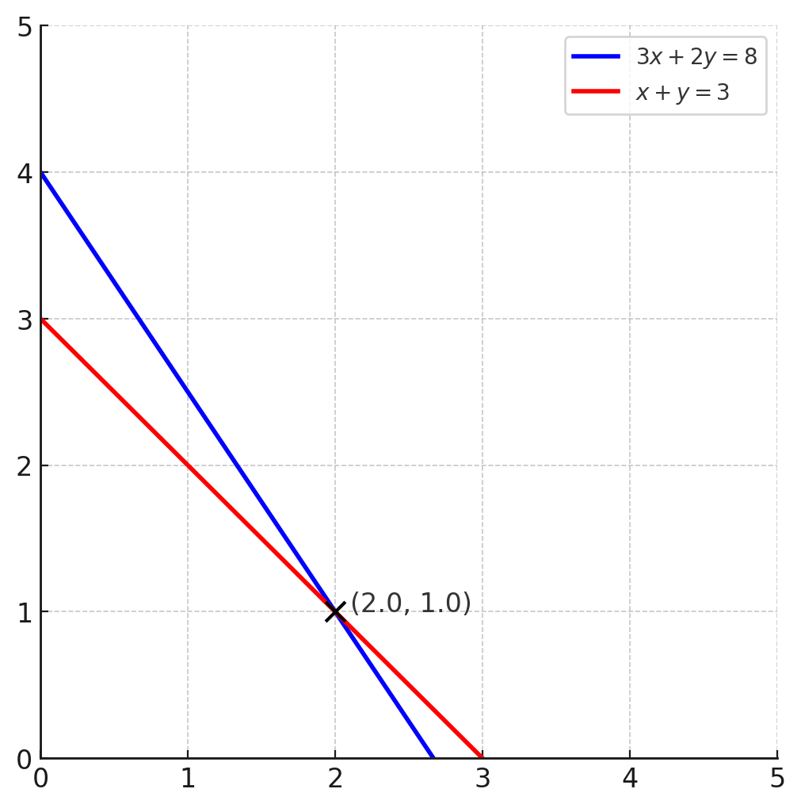
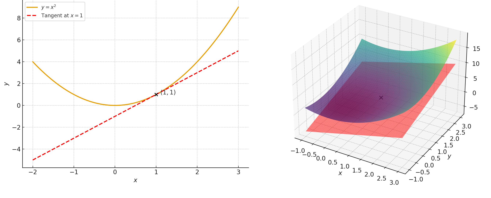

# הקדמה {.unnumbered}

אלגברה לינארית היא אחת מאבני היסוד של המתמטיקה המודרנית. בתור התחלה, היא קשורה באופן הדוק לגיאומטריה של המישור וגם לגיאומטריה של המרחב. בחטיבת הביניים לומדים על משוואה בנעלם אחד, וגם על מערכת של שתי משוואות בשני נעלמים. למשל:

$$
\begin{cases}
3x+2y=8\\
x+y=3
\end{cases}
$$

יש יותר מדרך אחת לפתור מערכת כזו, כמו להכפיל את המשוואה השנייה ב-$2$ ואז להחסיר אותה מהמשוואה הראשונה. כך מקבלים $x=2$ ולבסוף $y=1$ ע"י הצבה באחת המשוואות. מבחינה גיאומטרית, כל משוואה מייצגת קו ישר במישור, ופתרון המערכת מוביל לנקודת החיתוך של שני הישרים.

{#fig-Intersection-Point width=40% fig-align="center"}

בבסיסה אלגברה לינארית עוסקת בפתרון מערכת של משוואות לינאריות, כלומר משוואות ממעלה ראשונה במספר נעלמים. בתחומים רבים במדע ובכלל יכולים להופיע הרבה נעלמים והרבה אילוצים (משוואות), בהתאם למה שידוע לנו על הבעיה הרלוונטית.

::: {.example}
תומר נוסע מאילת צפונה, ואלה נוסעת מתל אביב דרומה. המרחק ההתחלתי ביניהם הוא $350$ ק"מ. תומר נוסע במהירות $60$ קמ"ש במשך $t_{1}$ שעות, וממשיך במהירות $90$ קמ"ש במשך $t_{2}$ שעות עד שהוא חולף על פני המכונית של אלה ומזהה אותה. עד לרגע זה אלה נסעה במהירות $90$ ק"מ במשך $t_{3}$ שעות ואחר כך במהירות $110$ ק"מ במשך $t_{4}$ שעות. אם נשווה בין סכומי זמני התנועה של שתי המכוניות וגם נדרוש שסכום הדרכים יהיה המרחק ההתחלתי, נקבל שתי משוואות בארבעה נעלמים:

$$
\begin{cases}
t_{1} + t_{2} = t_{3} + t_{4} \\
60t_{1} + 90t_{2} + 90t_{3} + 110t_{4} = 350
\end{cases}
$$

למערכת משוואות לינארית (ממ"ל בראשי תיבות) זו יש אינסוף פתרונות בתחום ההגדרה הרלוונטי של מספרים חיוביים. אם למשל נציב $t_{3}=t_{4}=1$ בשתי המשוואות, נקבל ממ"ל חדשה של שתי משוואות בשני נעלמים:

$$
\begin{cases}
t_{1} + t_{2} = 2 \\
60t_{1} + 90t_{2} = 150
\end{cases}
$$

אפשר לפתור את הממ"ל הזו כרגיל, אבל קל לבדוק שהפתרון הוא $t_{1}=t_{2}=1$. לכן, אחד הפתרונות של הממ"ל המקורית (בארבעה נעלמים) הוא $t_{1}=t_{2}=t_{3}=t_{4}=1$. אבל זה לא הפתרון היחיד כי בחרנו את הערכים של $t_{3},t_{4}$ באופן שרירותי (נוח לחישובים, אך לא יותר מזה). באותה מידה אפשר להציב $t_{3}=\frac{2}{3},\,t_{4}=\frac{4}{3}$ ולקבל ממ"ל קצת שונה מהקודמת:

$$
\begin{cases}
t_{1} + t_{2} = 2 \\
60t_{1} + 90t_{2} = \frac{430}{3}
\end{cases}
$$

הפעם אפשר לבדוק שהפתרון הוא $t_{1}=\frac{11}{9},\,t_{2}=\frac{7}{9}$.
כלומר יש פתרון נוסף לממ"ל המקורית, שנתון ע"י
$t_{1}=\frac{11}{9},\,t_{2}=\frac{7}{9}\text{,}\,t_{3}=\frac{2}{3},\,t_{4}=\frac{4}{3}$.
:::

באופן כללי, נשאל את השאלות הבאות:

- כיצד פותרים ממ"ל שבה הרבה נעלמים?
- כיצד פותרים ממ"ל שבה הרבה משוואות?
- האם בכלל קיימים פתרונות לממ"ל? אם כן, אז כמה?

כדי לענות על שאלות כאלו באופן מלא ומסודר, ישמשו אותנו שני מושגים יסודיים: וקטורים ומטריצות. נדחה את ההגדרות שלהם לפרקים הרלוונטיים, אבל לעת עתה מספיק לחשוב עליהם כאובייקטים מתמטיים שבהם מופיעים כמה מספרים. למשל, הזוג הסדור $(x,y)$ של שני מספרים $x$ ו-$y$ הוא וקטור עם שני רכיבים (קוארדינטות). בחטיבת הביניים ובתיכון ראינו שאפשר לחשוב על זוג כזה כעל נקודה סטטית במישור, אבל בלימודי הפיזיקה יש הסתכלות דינמית על וקטור כאובייקט בעל גודל וכיוון, לדוגמא כוח שפועל על גוף. נראה שאפשר לאמץ את שתי הגישות (סטטית ודינמית) במקביל, כאשר האינטואיציה הפיזיקלית מועילה מאוד אך ממש לא הכרחית להבנת הקורס.

לאחר שנתרגל לוקטורים ומטריצות, נראה שאפשר להסתכל עליהם באופן מופשט (תיאורטי) ולשאול עליהם כל מיני שאלות שלא בהכרח קשורות לממ"ל כזו או אחרת. במתמטיקה, דבר אחד מוביל למשנהו וזה טוב לשמור על ראש פתוח כשלומדים מושגים חדשים. הגישה המופשטת של אלגברה לינארית מאפשרת יישומים מגוונים, גם מחוץ לגיאומטריה ופיזיקה. לטובת הסקרנים, נעסוק קצת בפיזיקה דרך הנדסה בחלק מהיישומים בסוף הספר שחורגים מהקורס עצמו. אבל גם נעסוק ביישומים שקשורים למאגר גדול של נתונים כמו למידת מכונה. 

רבים מכם לומדים חשבון דיפרנציאלי ואינטגרלי במקביל. אפשר לומר שאלגברה לינארית מופיעה בחשבון דיפרנציאלי ואינטגרלי הרבה יותר מאשר להיפך. מושג הנגזרת מוביל לקירוב לינארי של פונקציה נתונה ע"י פונקציה לינארית שמתארת את הישר המשיק לגרף הפונקציה בנקודה נתונה. בנוסף, הקשר לאלגברה לינארית מתבטא בחישוב שטחים (במישור) ונפחים (במרחב) בעזרת כלי שנקרא דטרמיננטה. נפתח אותו בהמשך הדרך.

{#fig-Tangents width=60% fig-align="center"}

בספר מופיעות דוגמאות רבות, תרגילים פתורים וגם קישורים לסרטונים. תוכלו לחזור אליו בהמשך התואר ככל שתצטרכו להשתמש באלגברה לינארית.